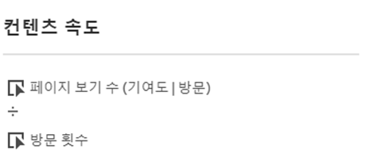
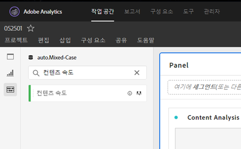
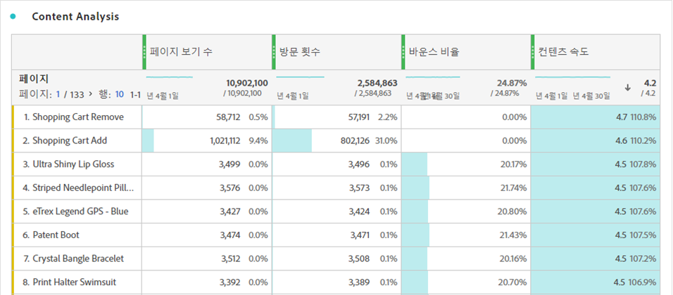

# [!UICONTROL 컨텐츠 속도]

[!UICONTROL 콘텐츠 속도] (Content Velocity)는 표준 Adobe Analytics 지표 템플릿입니다. [!UICONTROL 콘텐츠 속도] 는 [[!UICONTROL 페이지 보기 횟수]로 정의됩니다.] | [!UICONTROL 방문 기여도]] / [[!UICONTROL 방문]횟수]를 측정하고 특정 콘텐츠 부분(페이지, 사이트 섹션 등)에 미치는 영향을 측정하는 데 도움이 됩니다. 다운스트림 컨텐츠에 있습니다. 웹 사이트 또는 모바일 앱의 사용자를 유지하지 않고 어떤 콘텐츠가 포함되어 있는지 파악하는 데 도움이 됩니다.

[!UICONTROL 컨텐츠 속도] 는 검색 또는 태그(#Adobe Template)를 사용하여 왼쪽 레일을 필터링하여 분석 작업 공간에 찾을 수 있습니다.

[!UICONTROL 콘텐츠 속도] 는 [!UICONTROL 페이지 보기 횟수, 방문 횟수,]이탈률 [!UICONTROL 등 다른 주요 지표와 함께 컨텐츠 분석에 일반적으로]사용됩니다 .

