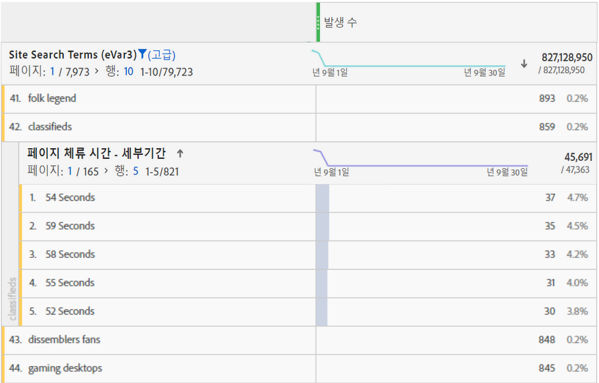
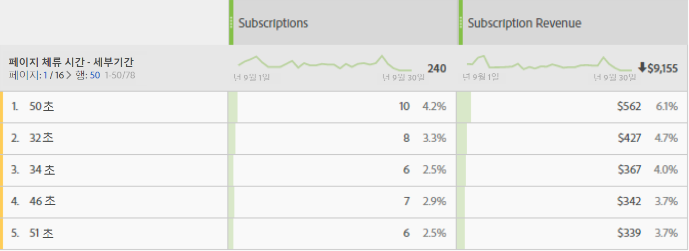

# 체류 시간 개요

Adobe Analytics 제품 전체에서 다양한 [!UICONTROL &#39;체류 시간&#39;] 지표 및 차원이 제공됩니다.

## &#39;체류 시간&#39; 지표

| 지표 | 정의 | 사용할 수 있는 곳 |
|---|---|---|
| [!UICONTROL 총 체류 시간(초)] | 방문자가 특정 차원 항목과 상호 작용하는 총 시간을 나타냅니다. 모든 후속 히트에서의 값 및 지속성 인스턴스를 포함합니다. Prop의 경우, 체류 시간은 후속 링크 이벤트에서도 계산됩니다. | Analysis Workspace, Reports &amp; Analytics, Report Builder(&#39;총 체류 시간&#39;이라고 함), Data Warehouse, Ad Hoc Analysis |
| [!UICONTROL 방문당 체류 시간] (초) | *총 체류 시간(초) / (방문-바운스)* 방문자가 각 방문 중 특정 차원 항목과 상호 작용하는 평균 시간을 나타냅니다. | Analysis Workspace, Reports &amp; Analytics, Ad Hoc Analysis |
| [!UICONTROL 방문자당 체류 시간] (초) | *총 체류 시간(초) / 고유 방문자&#x200B;* 방문자가 방문자의 라이프타임(해당 쿠키 길이) 동안 특정 차원 항목과 상호 작용하는 평균 시간을 나타냅니다. | Analysis Workspace, Reports &amp; Analytics, Ad Hoc Analysis |
| [!UICONTROL 사이트에서 보낸 평균 시간] (초) | 방문자가 특정 차원 항목과 상호 작용하는 총 시간(차원 항목 시퀀스당)을 나타냅니다. 이름으로 예상되듯이 &quot;사이트&quot; 평균으로 제한되지 않습니다. 시퀀스에 대한 자세한 내용은 &quot;체류 시간 계산 방법 섹션&quot;을 참조하십시오. **참고&#x200B;**: 이 지표는 계산에 사용된 분모의 차이로 인해 차원 항목 수준에서 &#39;방문당 체류 시간&#39;과 다를 수 있습니다. | Analysis Workspace, Reports &amp; Analytics(분 단위로 표시됨), Report Builder(분 단위로 표시됨), Ad Hoc Analysis |
| [!UICONTROL 페이지에서 보낸 평균 시간] | 더 이상 사용되지 않는 지표.  대신, 차원 항목에 대한 평균 시간이 필요한 경우 &#39;사이트에서 보낸 평균 시간&#39;을 사용하는 것이 좋습니다. | Report Builder(요청에 차원이 있을 때) |
| [!UICONTROL 총 세션 길이], [!UICONTROL 이전 세션 길이]라고도 함 | Mobile 앱 SDK만 해당.  다음번에 앱을 시작할 때 이전 세션에 대해 결정됩니다. 초 단위로 계산되는 이 지표는 앱이 배경에 있을 때에는 계산되지 않고, 사용 중인 경우에만 계산됩니다. 세션 수준 지표입니다. 예: 앱 ABC를 설치하고 2분 동안 사용한 다음 앱을 닫습니다. 이 세션 시간에 전송된 데이터는 없습니다. 다음에 앱을 실행할 때 [!UICONTROL 이전 세션 길이]는 120이라는 값으로 전송됩니다. | Analysis Workspace, Reports &amp; Analytics, Report Builder, Mobile Services UI |
| [!UICONTROL 평균 세션 길이] (모바일) | *총 세션 길이 / (시작 - 첫 번째 시작)* Mobile 앱 SDK만 해당. 세션 수준 지표입니다. | Report Builder, Mobile Services UI, Ad Hoc Analysis |

## &#39;체류 시간&#39; 차원

| 차원 | 정의 | 사용할 수 있는 곳 |
|---|---|---|
| [!UICONTROL 방문당 체류 시간 - 세부기간] | 방문하는 동안 소요된 총 시간을 가장 가까운 두 번째 방문으로 자르며, 방문에 포함되는 모든 조회에 적용합니다. 방문 수준 차원입니다. | Analysis Workspace, Ad Hoc Analysis |
| [!UICONTROL 방문당 체류 시간 - 그룹화됨] | 세분화된 차원이 9개의 서로 다른 범위로 그룹화됩니다. 방문 수준 차원입니다. 범위는 다음과 같습니다.<ul><li>1분 미만</li><li>1-5분</li><li>5-10분</li><li>10-30분</li><li>30-60분</li><li>1-2시간</li><li>2-5시간</li><li>5-10시간</li><li>10-15시간</li></ul>**참고**: 활동 상태로 12시간이 지나면 방문이 만료되므로 이보다 높은 버킷은 존재할 수 없습니다. | Analysis Workspace, Reports &amp; Analytics, Report Builder, Ad Hoc Analysis |
| [!UICONTROL 페이지 체류 시간 - 세부기간] | 각 조회에서 소요된 총 시간을 가장 가까운 두 번째 방문으로 자릅니다. 페이지 보기 수와 링크 이벤트를 모두 포함하는 히트 수준 차원입니다. 해당 이름에도 불구하고 이 차원은 &quot;페이지&quot; 차원으로 제한되지 않습니다. | Analysis Workspace, Ad Hoc Analysis |
| [!UICONTROL 페이지 체류 시간 - 그룹화됨] | 10개의 서로 다른 범위로 그룹화된 세분화된 차원입니다. 하지만, 그룹화된 차원은 페이지 보기 횟수만 계산합니다(링크 이벤트는 제외). 조회 수준 차원입니다. 범위는 다음과 같습니다.<ul><li>15초 미만</li><li>15-29초</li><li>30-59초</li><li>1-3분</li><li>3-5분</li><li>5-10분</li><li>10-15분</li><li>15-20분</li><li>20-30분</li><li>30분 이상</li></ul> | Analysis Workspace, Reports &amp; Analytics, Ad Hoc Analysis |

## 체류 시간 계산 방법

Adobe Analytics는 명시적 값(링크 이벤트 및 비디오 보기 횟수 포함)을 사용하여 [!UICONTROL 체류 시간]을 계산합니다.

>[!NOTE][!UICONTROL  비디오 보기 횟수] 또는 [!UICONTROL 종료 링크]와 같은 링크 이벤트가 없을 경우 방문의 마지막 히트 시 체류 시간을 알 수 없습니다. 비슷한 이유로 [!UICONTROL 바운스 방문 횟수](즉, 히트가 한 개인 방문 횟수)에는 &#39;체류 시간&#39;도 연결되어 있지 않습니다.

모든 체류 시간 계산에 사용된 **분자**&#x200B;는 총 체류 시간(초)입니다.

**분모**&#x200B;는 Adobe Analytics에서 별도의 지표로 사용할 수 없습니다. 히트 수준 &#39;체류 시간&#39; 지표의 경우 분모는 시퀀스 수입니다. 시퀀스는 주어진 변수가 같은 값(설정되었는지, 확산되었는지 또는 지속되었는지에 상관없이)을 포함하는 연속된 조회 세트입니다. &#39;확산&#39;은 페이지 보기 횟수(즉, 후속 링크 이벤트에서) 사이에 체류 시간 계산을 목적으로 하는 Prop의 지속성을 의미합니다.

* 예를 들어, [!UICONTROL 페이지 이름]이나 히트 수준의 다른 차원일 경우 분모는 기본적으로 [!UICONTROL &#39;인스턴스&#39;] 또는 [!UICONTROL 페이지 보기 수]지만, 다시 로드하고 설정이 해제된 값(예: 링크 이벤트)이 있으면 단일 상호 작용(시퀀스)으로서 계산합니다.

* 체류 시간을 알 수 없으므로 바운스 및 종료도 분모에서 제거됩니다.

## FAQ

**Q1: 모든 &#39;체류 시간&#39; 지표를 어떤 차원에나 적용할 수 있습니까?**

A: 모든 차원에 적용할 수 있는 &#39;체류 시간&#39; 지표는 다음과 같습니다.

* [!UICONTROL 총 체류 시간(초)]

* [!UICONTROL 방문당 체류 시간] (초)

* [!UICONTROL 방문자당 체류 시간] (초)

* [!UICONTROL 사이트에서 보낸 평균 시간] (초)

**Q2: 어느 체류 시간 차원이 다른 차원을 사용한 분류에 가장 잘 사용됩니까?**

A: [!UICONTROL 페이지 체류 시간 - 세부기간] 차원은 히트 수준 차원입니다. 이것을 다른 차원으로 분류하면 분류 차원도 있었던 조회가 유지되는 시간(초)을 알 수 있습니다.
아래 예에서 검색어 &quot;분류됨&quot;은 방문자가 해당 용어에 대해 반환된 컨텐츠를 읽는 데 소비하는 시간일 수 있는 54초, 59초 등의 히트 시간과 연관됩니다.

**Q3:[!UICONTROL 페이지 체류 시간 - 세부기간]의 차원에 적합한 지표는 무엇입니까?**

A: 모든 지표. 이 차원은 이벤트가 발생한 바로 그 히트에서 소비한 시간을 보여줍니다. 높은 체류 시간은 이벤트가 발생한 페이지(적중)에서 방문자가 오래 머물렀음을 의미합니다.

**Q4:[!UICONTROL 사이트에서 보낸 평균 시간]은[!UICONTROL 방문당 체류 시간]과 어떻게 다릅니까?**

A: 차이점은 지표에 사용된 분모입니다.

* [!UICONTROL 사이트에서 보낸 평균 시간]에서는 차원 항목을 포함하는 시퀀스를 사용합니다.

* [!UICONTROL 방문당 체류 시간]에서는 방문 수를 사용합니다.

그 결과, 이러한 지표들은 방문 수준에서는 비슷한 결과를 산출할 수 있지만 조회 수준에서는 다릅니다.

**5분기: 사이트에서 보낸[!UICONTROL 평균 시간과의 분류 합계가 상위 라인 항목과]일치하지 않는 이유는 무엇입니까?**

A: 사이트에서 [!UICONTROL 평균 체류 시간은] 차원의 끊기지 않은 시퀀스에 따라 다르며 내부 보고서는 이러한 실행을 계산할 때 외부 보고서에 의존하지 않습니다.

예를 들어 다음 방문을 고려해 보십시오.

| 히트# | 1 | 2 | 3 |
|---|---|---|---|
| **체류 시간(초)** | 30 | 100 | 10 |
| **페이지 이름** | 홈 | 제품 | 홈 |
| **date** | 1월 1일 | 1월 1일 | 1월 1일 |

홈 페이지의 시간 간격을 계산할 때 (30+10)/2=20이지만 일별로 분류하면 1월 1일에 대한 단일 중단 없는 실행이 있기 때문에 (30+10)/1=40이 됩니다.

그 결과, 이러한 지표들은 방문 수준에서는 비슷한 결과를 산출할 수 있지만 조회 수준에서는 다릅니다.

## [!UICONTROL 체류 시간] 계산의 예

다음의 서버 호출 세트가 단일 방문 내의 단일 방문자에 대한 것이라고 가정하십시오.

| 방문 조회 번호 | 1 | 2 | 3 | 4 | 5 | 6 | 7 |
|---|---|---|---|---|---|---|---|
| **방문 경과 시간(초)** | 0 | 30 | 80 | 180 | 190 | 230 | 290 |
| **체류 시간(초)** | 30 | 50 | 100 | 10 | 40 | 60 | - |
| **히트 유형** | 페이지 | 링크 | 페이지 | 페이지 | 페이지 | 페이지 | 페이지 |
| **페이지 이름** | 홈 | - | 제품 | 홈 | 홈(다시 로드) | 장바구니 | 주문 확인 |
|  |  |  |  |  |  |  |  |
| **prop1** | A(세트) | A(확산) | 설정되지 않음 | B(설정됨) | B(설정됨) | A(set) | C(세트) |
| **prop1 체류 시간(초)** | 30 | 50 | - | 10 | 40 | 60 | - |
|  |  |  |  |  |  |  |  |
| **eVar1** | 빨강(설정됨) | 빨강(지속됨) | (만료됨) | 파랑(설정됨) | 파랑(설정됨) | 파랑(지속됨) | 빨강(설정됨) |
| **eVar1 체류 시간(초)** | 30 | 50 | - | 10 | 40 | 60 | - |

위의 표를 기반으로 체류 시간 지표는 다음과 같이 계산됩니다.

| prop1 | 총 체류 시간(초) | 방문당 체류 시간 | 방문자당 체류 시간 | 시퀀스 수 | 사이트에서 보낸 평균 시간 |
|---|---|---|---|---|---|
| A | 30+50+60=140 | 140/1=140 | 140/1=140 | 2 | 140/2=70 |
| B | 10+40=50 | 50/1=50 | 50/1=50 | 1 | 50/1=50 |
| C | 0 | 0 | 0 | 0 | 0 |
| 연결되지 않은 시간 | 100 | - | - | - | - |

| eVar1 | 총 체류 시간(초) | 방문당 체류 시간 | 방문자당 체류 시간 | 시퀀스 수 | 사이트에서 보낸 평균 시간 |
|---|---|---|---|---|---|
| 빨간색 | 30+50=80 | 80/1=80 | 80/1=80 | 1 | 80/1=80 |
| 파란색 | 10+40+60=110 | 110/1=110 | 110/1=110 | 1 | 110/1=110 |
| 연결되지 않은 시간 | 100 | - | - | - | - |

방문당 체류 시간(세부기간): 290
페이지 체류 시간(세부기간): 10, 30, 40, 50, 60, 100

예를 지원하는 몇 가지 추가 참고 사항:

* 모든 체류 시간 계산은 방문의 첫 번째 히트에서 0부터 시작하는 방문 경과 시간을 기반으로 합니다.

* 체류 시간(초)는 현재 히트의 타임스탬프와 다음 히트의 타임스탬프 간의 차이입니다. 결과적으로 방문(및 바운스)의 마지막 조회에는 체류 시간이 없습니다.

* &quot;시퀀스&quot;는 주어진 변수가 같은 값(설정되었는지, 확산되었는지 또는 지속되었는지에 상관없이)을 포함하는 연속된 조회 세트입니다. 예를 들어, prop1 &quot;A&quot;에는 조회 1 및 2와 조회 6, 이렇게 두 개의 시퀀스가 있습니다. 마지막 조회에 체류 시간이 없으므로 방문의 마지막 조회 시간에 대한 값은 새 시퀀스를 시작하지 않습니다. 사이트에서 보낸 평균 시간(초)은 분모에서 시퀀스를 사용합니다.

   * 체류 시간 전용인 경우 Prop은 히트 2의 prop1에 대해 위에 표시된 대로 페이지 조회수에서 후속 링크 히트로 &quot;확산&quot;됩니다. 따라서 조회 1(&quot;A&quot;)의 prop1에 대해 설정된 값은 조회2의 체류 시간을 누적할 수 있습니다.

   * eVar는 eVar가 설정되어 있거나 지속되는 모든 히트에서 체류 시간을 누적합니다. eVar 지속성은 Analytics > 관리자의 eVar 설정에 의해 정의됩니다.
