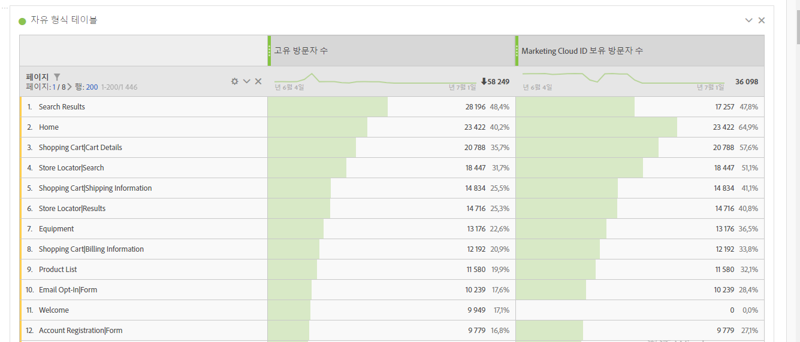
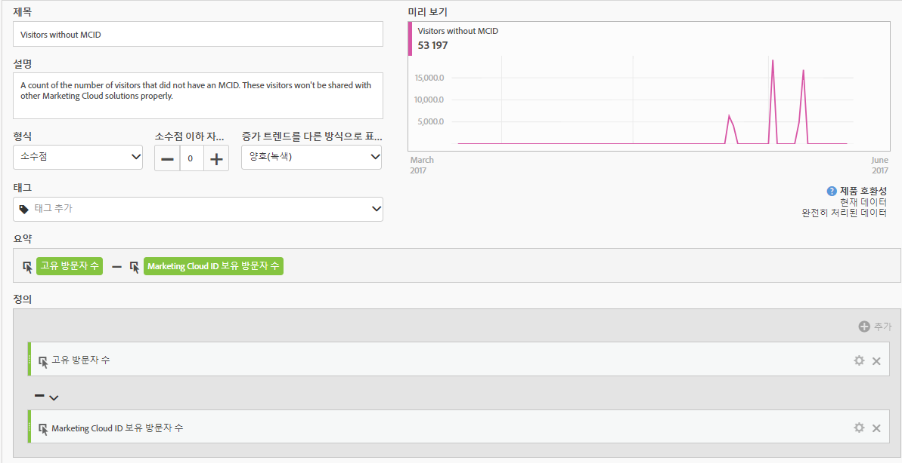
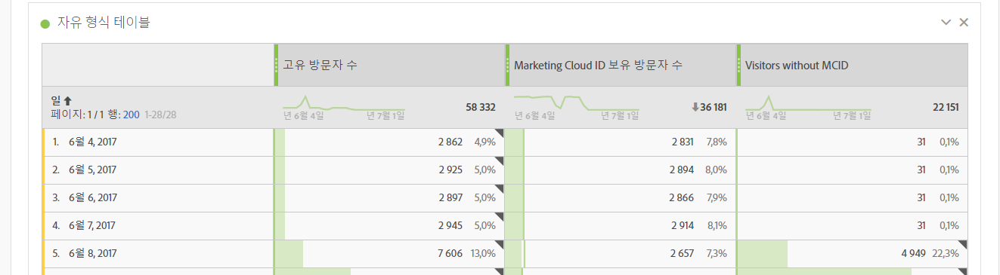

# Experience Cloud ID를 가진 방문자 수

&#39;Experience Cloud ID가 있는 방문자 수&#39; 지표는 [Experience Cloud ID 서비스를 사용하여 Adobe가 식별한 고유 방문자 수를 보여줍니다](https://docs.adobe.com/content/help/ko-KR/id-service/using/home.html). 이 차원은 사이트 방문자의 대다수가 ID 서비스를 사용하도록 하기 위해 [고유 방문자](unique-visitors.md) 지표와 비교하는 데 유용합니다. 방문자의 상당수가 ID 서비스 쿠키를 사용하지 않는 경우 구현 내의 문제를 나타낼 수 있습니다.

>[!NOTE]
>
>이 지표는 Adobe Target 또는 Adobe Audience Manager과 같은 여러 Experience Cloud 서비스를 사용하는 경우 디버깅에 특히 중요합니다. Experience Cloud 제품 간에 공유된 세그먼트에는 Experience Cloud ID가 없는 방문자가 포함되지 않습니다.

## 이 지표의 계산 방법

이 지표는 [고유 방문자](unique-visitors.md) 지표를 기반으로 합니다. 단, `mid` 쿠키 기반 [`s_ecid`](https://docs.adobe.com/content/help/ko-KR/core-services/interface/ec-cookies/cookies-analytics.html) 쿼리 문자열을 사용하여 식별된 개인만 포함합니다.

## Experience Cloud ID 설정 디버그

&#39;Experience Cloud ID가 있는 방문자&#39; 지표는 Experience Cloud 통합 문제 해결 또는 ID 서비스가 배포되지 않은 사이트의 영역을 식별하는 데 유용합니다.

&#39;Experience Cloud ID가 있는 방문자&#39;를 고유 방문자와 나란히 드래그하여 비교할 수 있습니다.

이 예에서는 각 페이지의 &#39;고유 방문자 수&#39;와 Experience Cloud ID가 있는 &#39;방문자 수&#39;가 같음을 알 수 있습니다. 고유 방문자 수의 총계는 Experience Cloud ID가 있는 방문자 수의 총계보다 큽니다. ID 서비스를 설정하지 않는 페이지를 찾기 위해 [계산된 지표를](../c-calcmetrics/cm-overview.md) 만들 수 있습니다. 다음 정의를 사용할 수 있습니다.

보고서에 계산된 지표를 추가하면 MCID가 없는 방문자 수가 가장 많은 페이지를 표시하도록 페이지 보고서를 정렬할 수 있습니다.

&quot;제품 빠른 보기&quot; 차원 값은 ID 서비스와 함께 제대로 구현되지 않습니다. 조직 내의 적절한 팀과 함께 이러한 페이지를 가능한 한 빨리 업데이트할 수 있습니다. 브라우저 유형, [사이트 섹션](../dimensions/browser-type.md)또는 [eVar와 같은 차원](../dimensions/site-section.md)유형을 갖는 유사한 보고서를 만들 수 [있습니다](../dimensions/evar.md).
