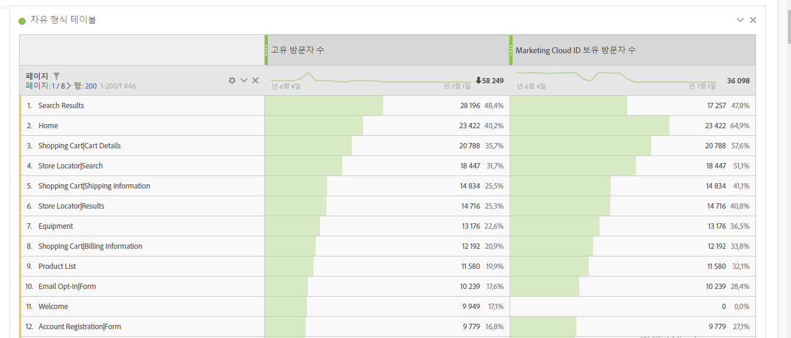
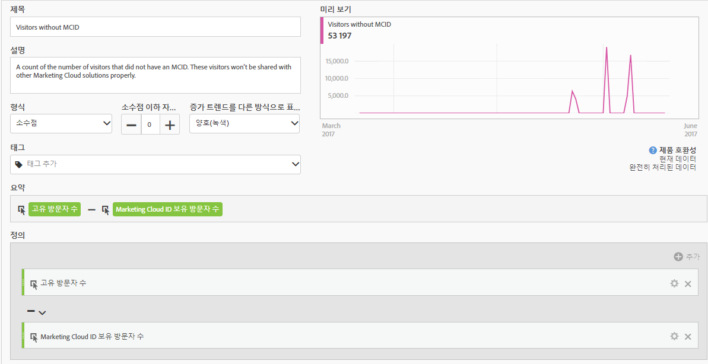
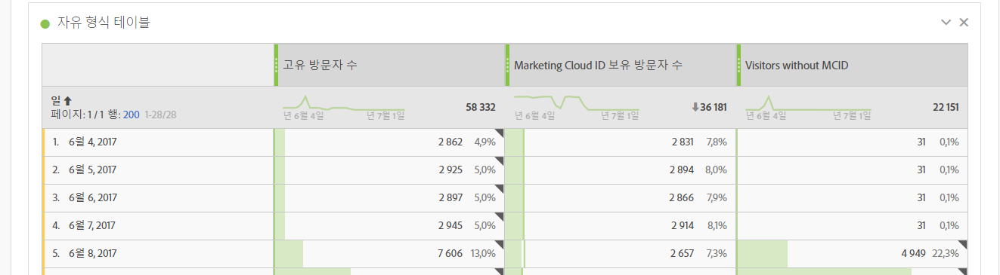

# Experience Cloud ID를 가진 방문자

&#39;[!UICONTROL Experience Cloud ID를 가진 방문자]&#39; [지표](overview.md)은(는) ECID를 가진 Adobe에서 식별한 고유 방문자 수([방문자 ID 서비스](https://experienceleague.adobe.com/kr/docs/id-service/using/home) 또는 [Experience Platform ID 서비스](https://experienceleague.adobe.com/ko/docs/experience-platform/identity/home) 사용)를 표시합니다. 이 지표는 사이트 방문자의 대다수가 ECID를 사용하도록 하기 위해 [고유 방문자 수](unique-visitors.md) 지표와 비교하는 데 유용합니다. 방문자의 대부분에서 이 식별자를 사용하지 않는 경우 구현 내의 문제를 나타낼 수 있습니다.

>[!NOTE]
>
>이 지표는 Adobe Target 또는 Adobe Audience Manager과 같은 여러 CX 엔터프라이즈 서비스를 사용하는 경우 디버깅에 특히 중요합니다. CX 엔터프라이즈 제품 간에 공유된 세그먼트에는 ECID가 없는 방문자가 포함되지 않습니다.

## 이 지표의 계산 방법

이 지표는 [고유 방문자 수](unique-visitors.md) 지표를 기반으로 합니다. 단, [`s_ecid`](https://experienceleague.adobe.com/en/docs/core-services/interface/data-collection/cookies/analytics) 쿠키 기반 `mid` 쿼리 문자열을 사용하여 식별된 개인만 포함합니다.

## ECID 설정 디버깅

Experience Cloud ID를 가진 &#39;[!UICONTROL 방문자 수]&#39; 지표는 CX 엔터프라이즈 통합 문제 해결이나 방문자 ID 서비스 또는 Experience Platform ID 서비스가 배포되지 않은 사이트 영역 식별에 유용합니다.

Experience Cloud ID가 인 &#39;방문자&#39;를 고유 방문자와 나란히 드래그하여 비교하십시오.

이 예제에서는 각 페이지의 &#39;[!UICONTROL 고유 방문자 수]&#39;이(가) &#39;[!UICONTROL Experience Cloud ID를 가진 방문자 수]&#39;와(과) 동일합니다. 그러나 총 &#39;[!UICONTROL 고유 방문자 수]&#39;은(는) Experience Cloud ID가 인 총 &#39;방문자 수 보다 큽니다. 다음 정의를 사용하여 ECID를 사용하지 않는 페이지를 찾기 위해 [계산된 지표](../calculated-metrics/cm-overview.md)을(를) 만들 수 있습니다.

보고서에 계산된 지표를 추가하면 ECID가 없는 방문자 수가 가장 많은 페이지를 표시하도록 페이지 보고서를 정렬할 수 있습니다.

제품 빠른 보기 차원 항목은 ECID를 사용하여 제대로 구현되지 않습니다. 조직 내의 적절한 팀과 함께 이러한 페이지를 가능한 한 빨리 업데이트할 수 있습니다. [브라우저 유형](../dimensions/browser-type.md), [사이트 섹션](../dimensions/site-section.md) 또는 [eVar](../dimensions/evar.md)와 같은 차원 유형으로 유사한 보고서를 만들 수 있습니다.
