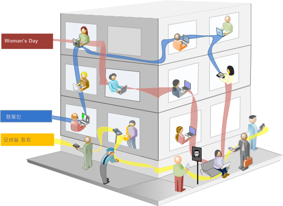

# 세그먼트 정보

세그먼트를 사용하여 특성 또는 웹 사이트 상호 작용에 따라 방문자 하위 집합을 식별할 수 있습니다. 세그먼트는 특정 요구에 대해 작성한 다음 확인, 편집 및 다른 팀원들과 공유하거나 다른 Adobe 제품 및 Analytics 기능에서 사용할 수 있는 대상자 인사이트로 디자인됩니다.

세그먼트는 중첩 컨테이너 모델을 사용하여 [!UICONTROL 방문자], [!UICONTROL 방문] 및 [!UICONTROL 히트] 수준 계층을 기준으로 합니다. 중첩된 컨테이너를 사용하여 컨테이너 간 규칙 및 컨테이너 내부 규칙에 따라 방문자 속성 및 작업을 정의할 수 있습니다. Analytics 세그먼트는 [!DNL Adobe Experience Cloud]의 여러 제품 및 기능에서 작성, 승인, 공유, 저장 및 실행할 수 있습니다. 보고서에서 세그먼트를 생성하거나, 대시보드 보고서로 작성하거나, 빠른 액세스를 위해 책갈피를 지정할 수 있습니다.

세그먼트 빌더에서 세그먼트를 작성하고 저장하거나 폴아웃 보고서([!UICONTROL Analysis Workspace] 내)에서 세그먼트를 생성할 수 있습니다. 중첩된 컨테이너 간 특정 규칙에 따라 미리 작성한 세그먼트를 사용 및 확장하고 결과를 필터링하여 보고서에 적용할 수 있습니다. 또한 세그먼트를 [스택 세그먼트](/help/components/segmentation/segmentation-workflow/seg-workflow.md)로 함께 사용할 수 있습니다.

세그먼트는

- 방문자가 누구인지(국가, 성별, 커피숍),
- 어떤 디바이스 및 서비스를 사용하는지(브라우저, 검색 엔진, 모바일 디바이스),
- 탐색을 시작한 위치(검색 엔진, 이전 종료 페이지, 자연어 검색)
- 등을 식별합니다.

<!---->

세그먼트는 다음 값을 기반으로 할 수 있습니다.

- 속성 기반 방문자: 브라우저 유형, 디바이스, 방문 수, 국가, 성별
- 상호 작용 기준 방문자: 캠페인, 키워드 검색, 검색 엔진
- 종료 및 시작 기준 방문자: Facebook, 정의된 랜딩 페이지, 참조 도메인의 방문자
- 사용자 정의 변수 기준 방문자: 양식 필드, 정의된 카테고리, 고객 ID

세그먼트 빌더에서 대상자 세그먼트를 작성할 경우 컨테이너 사이에 [!UICONTROL AND] 및 [!UICONTROL OR] 연산자를 사용하여 조건을 정의합니다.

<table style="table-layout:fixed; border: none;">

<tr>

<td style="background-color: #E5E4E2;" colspan="3" width="200" height="100"> 방문자 수</td>
</tr>

<tr>
<td style="background-color: #E5E4E2;" width="200"></td>
<td style="background-color: #D3D3D3;" colspan="2" width="200" height="100"> 방문 횟수</td>
</tr>

<tr>
<td style="background-color: #E5E4E2;" width="200" height="100"></td>
<td style="background-color: #D3D3D3;" width="200" height="100"></td>
<td style="background-color: #C0C0C0;" width="200" height="100" colspan="1"> 히트 수</td>
</tr>

<tr>
<td style="background-color: #E5E4E2;"></td><td colspan="2">및</td></td>
</tr>

<tr>
<td style="background-color: #E5E4E2;" width="200"></td>
<td style="background-color: #D3D3D3;" colspan="2" width="200" height="100"> 방문 횟수</td>
</tr>

<tr>
<td style="background-color: #E5E4E2;" width="200" height="100"></td>
<td style="background-color: #D3D3D3;" width="200" height="100"></td>
<td style="background-color: #C0C0C0;" width="200" height="100" colspan="1"> 히트 수</td>
</tr>
</table>

<table style="table-layout:fixed; border: none;">

<tr>

<td style="background-color: #E5E4E2;" colspan="3" width="200" height="100"> 방문자 수</td>
</tr>

<tr>
<td style="background-color: #E5E4E2;" width="200"></td>
<td style="background-color: #D3D3D3;" colspan="2" width="200" height="100"> 방문 횟수</td>
</tr>

<tr>
<td style="background-color: #E5E4E2;" width="200" height="100"></td>
<td style="background-color: #D3D3D3;" width="200" height="100"></td>
<td style="background-color: #C0C0C0;" width="200" height="100" colspan="1"> 히트 수</td>
</tr>

<tr>
<td style="background-color: #E5E4E2;"></td><td colspan="2">또는</td></td>
</tr>

<tr>
<td style="background-color: #E5E4E2;" width="200"></td>
<td style="background-color: #D3D3D3;" colspan="2" width="200" height="100"> 방문 횟수</td>
</tr>

<tr>
<td style="background-color: #E5E4E2;" width="200" height="100"></td>
<td style="background-color: #D3D3D3;" width="200" height="100"></td>
<td style="background-color: #C0C0C0;" width="200" height="100" colspan="1"> 히트 수</td>
</tr>
</table>

<!---->

이러한 유형의 세그먼트는 [!UICONTROL AND] 및 [!UICONTROL OR] 연산자를 사용하여 연결된 특성에 따라 데이터 세트를 필터링합니다.

- [여러 세그먼트를 보고서 또는 프로젝트에 적용](/help/components/segmentation/segmentation-workflow/t-seg-apply.md)할 수 있습니다.
- 세그먼트는 모든 보고서 세트에 범용입니다.
- [세그먼트 빌더](/help/components/segmentation/segmentation-workflow/seg-build.md)는 세그먼트 생성을 단순화합니다.
- [세그먼트 관리자](/help/components/segmentation/segmentation-workflow/seg-manage.md)를 사용하면 세그먼트 공유, 태그 지정, 확인 및 승인 기능을 포함하는 [워크플로](/help/components/segmentation/segmentation-workflow/seg-workflow.md)를 설정할 수 있습니다.
- [세그먼트를 태그 지정](/help/components/segmentation/segmentation-workflow/seg-tag.md)하여 나중에 폴더를 사용하지 않고도 구성 및 검색이 가능합니다.
- [순차적인 세그먼트](/help/components/segmentation/segmentation-workflow/seg-sequential-build.md)를 만들 수 있습니다.
- [!UICONTROL 페이지 조회수] 컨테이너가 단지 페이지 조회수가 아닌 모든 유형의 데이터를 포함한다는 사실을 나타내기 위해 [!UICONTROL 히트] 컨테이너로 변경되었습니다. 예를 들어 모바일 SDK에서 발생한 링크 추적 호출 및 작업 호출 추적은 히트 컨테이너에 의해 모두 포함 및 제외됩니다.

## Analysis Workspace의 세그먼테이션

Analysis Workspace에는 다음과 같은 추가 기능이 포함되어 있습니다.

- [세그먼트를 비교](../../analyze/analysis-workspace/c-panels/c-segment-comparison/segment-comparison.md)할 수 있습니다.
- 자유 형식 테이블 시각화에서 세그먼트를 차원으로 사용합니다.
- [폴아웃 분석](../../analyze/analysis-workspace/visualizations/fallout/compare-segments-fallout.md)에서 세그먼트를 사용합니다.

## Adobe 제공 세그먼트

구성 요소 왼쪽의 레일에는 귀하 및 귀사에서 만든 세그먼트 및 기본적으로 제공되는 Adobe 세그먼트가 표시됩니다. **[!UICONTROL 모두 표시]**&#x200B;를 클릭하면 이러한 세그먼트는 일반적으로 목록 하단에 표시되며 오른쪽의 로 식별됩니다.

## 순차적 세그먼트 {#sequential}

순차적 세그먼트는 사이트 내의 탐색 및 페이지 조회수에 따라 방문자를 식별할 수 있도록 하며 정의된 작업 및 상호 작용 세그먼트를 제공합니다. 순차적 세그먼트는 방문자가 좋아하는 항목 및 방문자가 피하는 항목을 식별하는 데 도움이 됩니다. 순차적 세그먼트를 작성할 때는 방문자 탐색을 정의하고 순서를 지정하는 데 [!UICONTROL THEN] 연산자가 사용됩니다.

| 방문 1 | 방문 2 | 방문 3 |
|---|---|---|
| 첫 번째 방문에서 방문자는 기본 랜딩 페이지 A로 이동하고, 캠페인 페이지 B를 제외한 다음 제품 페이지 C를 열람했습니다. | 두 번째 방문에서 방문자는 다시 기본 랜딩 페이지 A로 이동하고, 캠페인 페이지 B를 제외하고, 제품 페이지 C로 다시 이동했다가 새 페이지 D로 이동했습니다. | 세 번째 방문에서 방문자는 첫 번째 및 두 번째 방문과 같은 경로로 이동한 다음 페이지 F를 제외하고 타기팅된 제품 페이지 G로 바로 이동했습니다. |

순차적 세그먼트는 다음 히트 값에 기반을 둘 수 있습니다.

- 페이지 조회수 시퀀스(단일 방문 내 페이지 조회수, 별도 방문 간 페이지 조회수, 페이지 조회수를 제외한 방문)를 기반으로 하는 방문자
- 페이지 조회 사이 및 페이지 조회 후 시간(시간 제한 후, 히트 사이, 이벤트 후)을 기준으로 하는 방문자

<table style="table-layout:fixed; border: none;">

<tr>

<td style="background-color: #E5E4E2;" colspan="3" width="200" height="100"> 방문자 수</td>
</tr>

<tr>
<td style="background-color: #E5E4E2;" width="200"></td>
<td style="background-color: #D3D3D3;" colspan="2" width="200" height="100"> 방문 횟수</td>
</tr>

<tr>
<td style="background-color: #E5E4E2;" width="200" height="100"></td>
<td style="background-color: #D3D3D3;" width="200" height="100"></td>
<td style="background-color: #C0C0C0;" width="200" height="100" colspan="1"> 히트 수</td>
</tr>

<tr>
<td style="background-color: #E5E4E2;"></td><td colspan="2">THEN</td></td>
</tr>

<tr>
<td style="background-color: #E5E4E2;" width="200"></td>
<td style="background-color: #D3D3D3;" colspan="2" width="200" height="100"> 방문 횟수</td>
</tr>

<tr>
<td style="background-color: #E5E4E2;" width="200" height="100"></td>
<td style="background-color: #D3D3D3;" width="200" height="100"></td>
<td style="background-color: #C0C0C0;" width="200" height="100" colspan="1"> 히트 수</td>
</tr>
</table>

<table style="table-layout:fixed; border: none;">

<tr>

<td style="background-color: #E5E4E2;" colspan="3" width="200" height="100"> 방문자 수</td>
</tr>

<tr>
<td style="background-color: #E5E4E2;" width="200"></td>
<td style="background-color: #D3D3D3;" colspan="2" width="200" height="100"> 방문 횟수</td>
</tr>

<tr>
<td style="background-color: #E5E4E2;" width="200" height="100"></td>
<td style="background-color: #D3D3D3;" width="200" height="100"></td>
<td style="background-color: #C0C0C0;" width="200" height="100" colspan="1"> 히트 수</td>
</tr>

<tr>
<td style="background-color: #E5E4E2;"></td><td style="background-color: #D3D3D3;"></td><td>및</td></td>
</tr>

<tr>
<td style="background-color: #E5E4E2;" width="200" height="100"></td>
<td style="background-color: #D3D3D3;" width="200" height="100"></td>
<td style="background-color: #C0C0C0;" width="200" height="100" colspan="1"> 히트 수</td>
</tr>

<tr>
<td style="background-color: #E5E4E2;"></td><td colspan="2">THEN</td></td>
</tr>

<tr>
<td style="background-color: #E5E4E2;" width="200"></td>
<td style="background-color: #D3D3D3;" colspan="2" width="200" height="100"> 방문 횟수</td>
</tr>

<tr>
<td style="background-color: #E5E4E2;" width="200" height="100"></td>
<td style="background-color: #D3D3D3;" width="200" height="100"></td>
<td style="background-color: #C0C0C0;" width="200" height="100" colspan="1"> 히트 수</td>

<tr>
<td style="background-color: #E5E4E2;"></td><td style="background-color: #D3D3D3;"></td><td>또는</td></td>
</tr>

<tr>
<td style="background-color: #E5E4E2;" width="200" height="100"></td>
<td style="background-color: #D3D3D3;" width="200" height="100"></td>
<td style="background-color: #C0C0C0;" width="200" height="100" colspan="1"> 히트 수</td>
</tr>
</tr>
</table>

<!---->

순차적 세그먼트는 [!UICONTROL THEN] 연산자를 사용하여 사용자 작업을 기준으로 데이터 세트를 필터링합니다.

## 세분화 방법 비디오 {#segment-video}

이 비디오에서는 세그먼트 컨테이너의 의미와 세그먼트 컨테이너를 사용하는 방법에 대한 간단한 개요를 제공합니다.

>[!BEGINSHADEBOX]

데모 비디오를 보려면  [세그먼트 컨테이너](https://video.tv.adobe.com/v/25401?quality=12&learn=on){target="_blank"}를 확인하십시오.

>[!ENDSHADEBOX]

## 권한 {#permissions}

+++ **세그먼트를 사용하고 만들고 관리하는 데 필요한 권한**

기본적으로 모든 사용자는 개인용 세그먼트를 만들고 편집할 수 있습니다. 하지만 관리자는 [세그먼트를 만들 수 있는 권한](https://experienceleague.adobe.com/docs/analytics/admin/admin-console/home.html?lang=ko)을 가져야 하는 사용자를 결정하고, 이러한 사용자를 특정 그룹에 지정할 수 있습니다. 이러한 세그먼트는 다른 Analytics 사용자와 직접 공유할 수 있습니다.

관리자는 세그먼트를 편집하고, 그룹 및 조직의 모든 사람과 세그먼트를 공유할 수 있습니다. [역할별 세그먼트 권한](/help/components/segmentation/seg-reference/seg-rights.md)

+++

+++ **회사의 세그먼트를 볼 수 있습니까?**

예. 관리자는 [!DNL Analysis Workspace] 사용자 인터페이스 내에서 모든 세그먼트를 볼 수 있습니다.

Report Builder는 사용자가 소유한 세그먼트와 사용자와 공유된 세그먼트를 표시합니다.

+++

+++ **세그먼트 관리자에서 모든 Analytics 세그먼트를 관리할 수 있습니까?**

예. 모든 세그먼트는 세그먼트 관리자에서 관리할 수 있습니다. 세그먼트 관리자는 소유자(세그먼트를 만든 사용자), 공유 사용자 및 관리 사용자가 볼 수 있는 세그먼트를 표시합니다. 세그먼트 선택기는 사용자가 소유하고 사용자와 공유된 세그먼트를 표시합니다.

관리자는 Analysis Workspace 사용자 인터페이스 내에서 모든 세그먼트를 볼 수 있습니다.

Report Builder는 사용자가 작성한 세그먼트나 특별히 사용자와 공유한 세그먼트만 표시합니다.

+++

+++ **세그먼트를 삭제할 수 없는 이유는 무엇입니까?**

세그먼트가 [Experience Cloud로 게시된 경우](/help/components/segmentation/segmentation-workflow/seg-workflow.md) 해당 세그먼트를 삭제하거나 편집할 수 없습니다. 그렇지만 세그먼트를 복사한 후 복사한 버전을 편집할 수 있습니다.

+++
