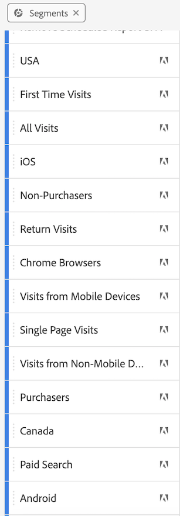
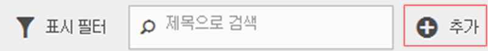

# 세그먼트 정보

세그먼트를 사용하여 특성 또는 웹 사이트 상호 작용에 따라 방문자 하위 집합을 식별할 수 있습니다. 세그먼트는 특정 요구에 대해 작성한 다음 확인, 편집 및 다른 팀 구성원과 공유하거나 다른 Adobe 제품 및 Analytics 기능에서 사용할 수 있는 대상 인사이트로 디자인됩니다.

세그먼트는 중첩 컨테이너 모델을 사용하여 [!UICONTROL 방문자], [!UICONTROL 방문] 및 [!UICONTROL 히트] 수준 계층을 기준으로 합니다. 중첩된 컨테이너를 사용하여 컨테이너 간 규칙 및 컨테이너 내부 규칙에 따라 방문자 속성 및 작업을 정의할 수 있습니다. Analytics 세그먼트는 [!DNL Adobe Experience Cloud]의 여러 제품 및 기능에서 작성, 승인, 공유, 저장 및 실행할 수 있습니다. 보고서에서 세그먼트를 생성하거나, 대시보드 보고서로 작성하거나, 빠른 액세스를 위해 책갈피를 지정할 수 있습니다.

세그먼트 빌더에서 세그먼트를 작성하고 저장하거나 폴아웃 보고서 ( Analysis Workspace)에서 세그먼트를 생성할 수 있습니다. 중첩된 컨테이너 간 특정 규칙에 따라 미리 작성한 세그먼트를 사용 및 확장하고 결과를 필터링하여 보고서에 적용할 수 있습니다. 또한 세그먼트를 [스택 세그먼트](/help/components/segmentation/segmentation-workflow/seg-workflow.md)로 함께 사용할 수도 있습니다.

세그먼트는 방문자가 누구인지 (국가, 성별, 커피숍), 어떤 디바이스 및 서비스를 사용하는지 (브라우저, 검색 엔진, 모바일 디바이스), 탐색을 시작한 위치 (검색 엔진, 이전 종료 페이지, 자연어 검색) 등을 식별합니다.

세그먼트는 다음 값을 기반으로 할 수 있습니다.

* 특성 기준 방문자: 브라우저 유형, 디바이스, 방문 수, 국가, 성별
* 상호 작용 기준 방문자: 캠페인, 키워드 검색, 검색 엔진
* 종료 및 시작 기준 방문자: Facebook, 정의된 랜딩 페이지, 참조 도메인의 방문자
* 사용자 지정 변수 기준 방문자: 양식 필드, 정의된 범주, 고객 ID

세그먼트 빌더에서 대상 세그먼트를 작성할 경우 컨테이너 사이에 [!UICONTROL AND] 및 [!UICONTROL OR] 연산자를 사용하여 조건을 정의합니다.

이러한 유형의 세그먼트는 [!UICONTROL AND] 및 [!UICONTROL OR] 연산자를 사용하여 연결된 특성에 따라 데이터 세트를 필터링합니다.

* [여러 세그먼트를 보고서 또는 프로젝트에 적용](/help/components/segmentation/segmentation-workflow/seg-workflow.md)할 수 있습니다.
* 세그먼트는 모든 보고서 세트에 범용입니다.
* [세그먼트 빌더](/help/components/segmentation/segmentation-workflow/seg-workflow.md)는 세그먼트 생성을 단순화합니다.
* [세그먼트 관리자](/help/components/segmentation/segmentation-workflow/seg-workflow.md)를 사용하면 세그먼트 공유, 태그 지정, 확인 및 승인 기능을 포함하는 [워크플로](/help/components/segmentation/segmentation-workflow/seg-workflow.md)를 설정할 수 있습니다.
* [세그먼트를 태그 지정](/help/components/segmentation/segmentation-workflow/seg-workflow.md)하여 나중에 폴더를 사용하지 않고도 구성 및 검색이 가능합니다.
* [순차적인 세그먼트](/help/components/segmentation/segmentation-workflow/seg-sequential-build.md)를 만들 수 있습니다.
* 다음 [!UICONTROL 페이지 보기] 이제 컨테이너 [!UICONTROL 히트] 컨테이너 를 사용하여 이 컨테이너가 페이지 보기 수가 아닌 모든 유형의 데이터를 세그먼트화함을 나타냅니다. 예를 들어 모바일 SDK에서 발생한 링크 추적 호출 및 trackAction 호출은 히트 컨테이너에 의해 모두 포함 및 제외됩니다.

## Analysis Workspace의 세그먼테이션

Analysis Workspace에는 다음과 같은 추가 기능이 포함되어 있습니다.

* [세그먼트를 비교](https://experienceleague.adobe.com/docs/analytics/analyze/analysis-workspace/panels/segment-comparison/segment-comparison.html?lang=ko-KR)할 수 있습니다.
* 비교에서 [세그먼트를 차원으로](https://experienceleague.adobe.com/docs/core-services/interface/audiences/audience-library.html?lang=ko-KR) 사용합니다.
* [폴아웃 분석](https://experienceleague.adobe.com/docs/analytics/analyze/analysis-workspace/visualizations/fallout/compare-segments-fallout.html?lang=ko-KR)에서 세그먼트를 사용합니다.

## Adobe 제공 세그먼트

화면 왼쪽에 있는 구성 요소 레일은 사용자와 회사가 만든 세그먼트와 즉시 제공된 Adobe 세그먼트를 표시합니다. 를 클릭하면 **[!UICONTROL 모두 표시]**&#x200B;이러한 세그먼트는 일반적으로 목록 하단에 표시되며 오른쪽의 Adobe 로고로 식별됩니다. Adobe 제공 세그먼트의 일부 목록입니다.

## 순차적 세그먼트 {#sequential}

순차적 세그먼트는 사이트 내의 탐색 및 페이지 보기에 따라 방문자를 식별할 수 있도록 하며 정의된 작업 및 상호 작용 세그먼트를 제공합니다. 순차적 세그먼트는 방문자가 좋아하는 항목 및 방문자가 피하는 항목을 식별하는 데 도움이 됩니다. 순차적 세그먼트를 작성할 때는 방문자 탐색을 정의하고 순서를 지정하는 데 [!UICONTROL THEN] 연산자가 사용됩니다.

| 방문 1 | 방문 2 | 방문 3 |
|---|---|---|
| 첫 번째 방문에서 방문자는 기본 랜딩 페이지 (A)로 이동하고, 캠페인 페이지 (B)를 제외한 다음 제품 페이지 (C)를 열람했습니다. | 두 번째 방문에서 방문자는 다시 기본 랜딩 페이지 (A)로 이동하고, 캠페인 페이지 (B)를 제외하고, 제품 페이지 (C)로 다시 이동했다가 새 페이지 (D)로 이동했습니다. | 세 번째 방문에서 방문자는 첫 번째 및 두 번째 방문과 같은 경로로 이동한 다음 페이지 F를 제외하고 타기팅된 제품 페이지 (G)로 바로 이동했습니다. |

순차적 세그먼트는 다음 히트 값에 기반을 둘 수 있습니다.

* 페이지 히트 시퀀스(단일 방문 내 페이지 보기, 별도 방문 간 페이지 보기, 페이지 보기를 제외한 방문)를 기반으로 하는 방문자
* 페이지 보기 간 및 페이지 보기 후 시간(시간 제한 후, 히트 사이, 이벤트 후)을 기준으로 하는 방문자

순차적 세그먼트는 [!UICONTROL THEN] 연산자를 사용하여 사용자 작업을 기준으로 데이터 세트를 필터링합니다.

## 세그멘테이션 방법 비디오 {#segment-video}

이 비디오는 세그먼트 컨테이너가 정의와 사용 방법에 대한 간략한 개요를 제공합니다. [Adobe Analytics의 세그먼트 컨테이너](https://experienceleague.adobe.com/docs/analytics-learn/tutorials/components/segmentation/segment-containers.html?lang=ko-KR)

## 세그먼테이션 도구 액세스 {#access}

+++ **세그먼트 빌더로 이동하는 방법**

다음 작업을 수행하여 세그먼트 빌더에 액세스할 수 있습니다.

* 기존 보고서를 표시하고 왼쪽 탐색에서 을 클릭합니다. 표시되는 세그먼트 레일에서 **[!UICONTROL 추가]**&#x200B;를 클릭하거나,

* 세그먼트 관리자 위쪽에 있는 **[!UICONTROL + 추가]**&#x200B;를 클릭합니다.  

   또는

* 세그먼트 관리자에서 기존 세그먼트 제목을 클릭하여 세그먼트 빌더에서 세그먼트를 편집합니다.

+++

+++ **세그먼트 관리자로 이동하는 방법**

세그먼트 빌더 액세스 방법:

* 맨 위의 탐색 영역에서 **[!UICONTROL Analytics]** > **[!UICONTROL 구성 요소]**&#x200B;로 이동합니다. 그런 다음 **[!UICONTROL 세그먼트]**&#x200B;를 클릭하거나,

* 기존 보고서를 표시하고 왼쪽 탐색에서 을 클릭합니다. 그런 다음 **[!UICONTROL 관리]**&#x200B;를 클릭하거나,

* 인터페이스의 어디에서든지 슬래시 키 &#39;/&#39;를 누르고 세그먼트 관리자를 검색합니다.

+++

## 권한 {#section_648DFA3A882146C485A84ED014EEC707}

+++ **세그먼트를 사용하고 만들고 관리하는 데 필요한 권한**

기본적으로 모든 사용자는 개인용 세그먼트를 만들고 편집할 수 있습니다. 하지만 관리자는 [세그먼트를 만들 수 있는 권한](https://experienceleague.adobe.com/docs/analytics/admin/user-product-management/user-groups/groups.html?lang=ko-KR)을 가져야 하는 사용자를 결정하고, 이러한 사용자를 특정 그룹에 지정할 수 있습니다. 이러한 세그먼트는 다른 Analytics 사용자와 직접 공유할 수 있습니다.

관리자는 세그먼트를 편집하고, 그룹 및 조직의 모든 사람과 세그먼트를 공유할 수 있습니다. [자세히...](/help/components/segmentation/seg-reference/seg-rights.md)

+++

+++ **회사의 세그먼트를 볼 수 있습니까?**

예. 관리자는 [!DNL Analysis Workspace] 및 [!DNL Reports & Analytics] 사용자 인터페이스 내에서 모든 세그먼트를 볼 수 있습니다.

Report Builder은 사용자가 소유한 세그먼트와 사용자와 공유된 세그먼트를 표시합니다.

+++

+++ **세그먼트 관리자에서 모든 Analytics 세그먼트를 관리할 수 있습니까?**

예. 모든 세그먼트는 세그먼트 관리자에서 관리할 수 있습니다. 세그먼트 관리자는 소유자 (세그먼트를 만든 사용자), 공유 사용자 및 관리 사용자가 볼 수 있는 세그먼트를 표시합니다. 세그먼트 선택기는 사용자가 소유하고 사용자와 공유된 세그먼트를 표시합니다.

관리자는 Analysis Workspace 및[!DNL Reports & Analytics] 사용자 인터페이스 내에서 모든 세그먼트를 볼 수 있습니다.

Report Builder는 사용자가 작성한 세그먼트나 특별히 사용자와 공유한 세그먼트만 표시합니다.

+++

+++ **이 세그먼트를 삭제할 수 없는 이유**

세그먼트가 [Experience Cloud로 게시된 경우](/help/components/segmentation/segmentation-workflow/seg-workflow.md) 삭제하거나 편집할 수 없습니다. 그렇지만 복사한 후 복사한 버전을 편집할 수 있습니다.

+++
