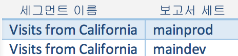
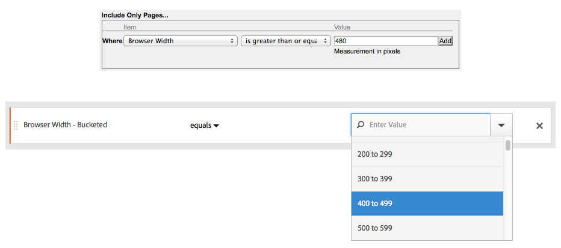

# 이전 세그먼트

이 문서에서는 기존 세그먼트 관리 모범 사례에 대해 자주 묻는 질문에 대한 답변을 제공합니다. 레거시 세그먼트는 2014년 이전에 생성된 세그먼트입니다.

## 기존 세그먼트 관리 {#legacy}

+++ **기존 세그먼트에 발생한 결과**

기존 세그먼트는 이전과 마찬가지로 계속 작동합니다. 이러한 세그먼트가 적용된 모든 보고서는 계속 제대로 작동합니다.

이전에 미리 정의된 대부분의 세트 세그먼트는 세그먼트 템플릿으로 사용되어 세그먼트 빌더로 마이그레이션됩니다. 세그먼트 템플릿은 공통 대상을 갖는 신속하게 사용자 정의 세그먼트를 작성하는 데 사용됩니다. 세그먼트 템플릿을 보고서에 직접 적용할 수는 없지만 사용자 정의 세그먼트로 쉽게 저장할 수 있습니다.

세그먼트 템플릿은 세그먼트 빌더에서 특수 아이콘 (으)로 표시됩니다.

+++

+++ **세그먼트가 적용된 예약된 보고서가 어떻게 되었습니까?**

정의한 세그먼트를 사용하여 예약된 보고서가 계속 제대로 실행됩니다.

세그먼트를 삭제할 때 이 세그먼트가 적용된 예약된 보고서 및 대시보드는 정상적으로 계속 작동합니다(예: 세그먼트 또는 대시보드는 삭제된 세그먼트를 계속 사용함).

예약된 보고서는 같은 이름의 세그먼트를 편집할 때 업데이트되지 않습니다. 예를 들어, 서로 다른 보고서 세트에 이름이 동일한 2개의 세그먼트가 있다고 가정해 보겠습니다.

**[!UICONTROL mainprod]** 보고서 세트에 대한 세그먼트를 참조하는 시각화가 있습니다. 그런 후 해당 세그먼트가 중복되어 있으므로 삭제합니다. 시각화는 삭제된 세그먼트의 정의를 참조하여 계속 실행됩니다. Catalina Island와 멕시코 Tijuana를 포함하도록 기본 개발 세그먼트에 대한 세그먼트 정의를 변경하는 경우 시각화에 적용된 세그먼트는 변경되지 않고 이전 정의를 사용합니다. 새 정의를 사용하려면 시각화를 업데이트하여 새 정의를 참조합니다. 시각화, 프로젝트 또는 예약된 보고서가 삭제된 세그먼트를 사용하는지 확실하지 않은 경우 나머지 세그먼트의 이름을 변경하여 시각화가 나머지 세그먼트를 사용하는지 여부를 표시합니다.

+++

+++ **Data Warehouse 세그먼트에 나타난 결과**

모든 기존 Data Warehouse 세그먼트는 여전히 Data Warehouse에서 작동합니다. 대부분의 Data Warehouse 세그먼트는 Analysis Workspace과 같은 다른 구성 요소에서도 작동합니다.

세그먼트 빌더/관리자에서 새 Data Warehouse 세그먼트를 만들거나 편집할 수 있습니다. 세그먼트 빌더의 제품 호환성 메커니즘은 세그먼트가 Data Warehouse과 호환되는지 여부를 자동으로 결정합니다.

+++

+++ **사전 구성된 세그먼트에 나타난 결과**

* **단일 페이지 방문 횟수**
* **모바일 기기로부터 찾아온 방문**
* **자연어 검색으로 찾아온 방문**
* **유료 검색을 통한 방문 수**
* **방문자 ID를 갖는 방문**

이러한 세그먼트는 세그먼트 템플릿으로 사용되어 세그먼트 빌더로 마이그레이션됩니다. 이러한 세그먼트가 적용된 기존의 보고서는 계속 제대로 작동합니다.

+++

+++ **CX 엔터프라이즈(Suite) 세그먼트에 발생한 결과:**

* 비구매자
* 구매자
* 최초 방문
* 소셜 사이트에서 찾아온 방문
* 10분 이상 방문*
* 이전 방문이 5개 이상인 방문 횟수*
* Facebook에서 시작된 방문*

이러한 세그먼트 (별표 *로 표시된 세그먼트 제외)는 대부분 세그먼트 템플릿으로 사용되어 세그먼트 빌더로 마이그레이션되었습니다. 또한 몇 개의 새 세그먼트 템플릿이 추가되었습니다.

이러한 세그먼트가 적용된 기존의 보고서는 계속 제대로 작동합니다.

+++

+++ **관리자 세그먼트 (“전역” 세그먼트라고도 함)에 나타난 결과**

**관리자** 세그먼트가 새 세그먼트 인터페이스로 마이그레이션되고 모든 사람과 공유되는 세그먼트로 표시됩니다.

이러한 세그먼트의 소유자는 관리자 사용자의 계정이 가장 오래된 관리자로 설정됩니다. 그러나 모든 관리자는 이러한 세그먼트를 삭제, 편집 및 공유할 수 있습니다.

관리자가 이러한 전역 세그먼트를 만들고 관리하는 Admin Console의 세그먼트 관리 인터페이스는 더 이상 사용 가능하지 않습니다. 이제 관리자는 새 세그먼트 빌더를 사용하여 세그먼트를 만들고 적절한 그룹, 개인 또는 모든 사람과 공유해야 합니다.

세그먼트를 다시 저장하려면 먼저 업데이트해야 하지만 이 문서에 설명된 대로 변경된 논리를 사용하는 기존 세그먼트는 계속 올바르게 작동합니다. 예를 들어, **[!UICONTROL 미국 주]** **[!UICONTROL 포함]** `New York`인 기존 세그먼트가 있는 경우 해당 세그먼트는 계속 올바르게 작동합니다. 다음 번에 세그먼트를 편집할 때는 **[!UICONTROL equals]** 조건으로 열거된 유형을 사용하도록 세그먼트를 업데이트해야 합니다.

+++

+++ **이름은 같지만 정의는 다른 중복 세그먼트가 있는 경우 어떻게 해야 합니까?** 
세그먼트가 여러 보고서 세트에서 작동되므로 이름이 같은 여러 세그먼트를 찾을 수 있습니다. 다음을 수행해야 합니다.

* 이름은 같지만 정의는 다른 세그먼트 이름 바꾸기 또는
* 더 이상 필요하지 않은 세그먼트를 삭제합니다.

+++

+++ **세그먼트 정리와 관련하여 Adobe에서 권장하는 사항은 무엇입니까?**

* 기존 태그로 모든 세그먼트에 태깅합니다.
* 보유하고 있는 세그먼트를 검토합니다.
* 해당되는 경우 세그먼트 라이브러리에 추가합니다.
* 정식 세그먼트를 승인합니다.
* [모범 사례](/help/components/segmentation/segmentation-workflow/seg-workflow.md)에 따라 세그먼트에 태깅합니다.

+++

### 마이그레이션 팁

다음 팁은 일반 차원을 마이그레이션하는 데 도움이 됩니다.

* 지역-도시/지역/국가 – 부분 일치를 사용하지 않고 특정 도시, 지역 또는 국가를 검색하고 선택합니다.
* 브라우저 - 브라우저 유형 차원을 사용하여 특정 유형의 모든 브라우저(예: Google Chrome)를 가져옵니다.
* 운영 체제 - OS 유형 차원을 사용하여 Microsoft Windows와 같은 유형의 모든 운영 체제를 가져옵니다.
* “새 차원 및 이름이 변경된 차원” 참조(아래 참조).

## 새 차원 및 이름이 변경된 차원 {#renamed}

다음 표에는 세그먼트 빌더에서 이름이 변경된 차원 목록이 포함되어 있습니다.

| 새 Dimension 이름 | 이전 이름 | 참고 |
|--- |--- |--- |
| 운영 체제 유형 | 신규 | 2015년 봄에 추가되었습니다. |
| 브라우저 너비 - 전체기간 | 브라우저 너비 | 이 차원은 모든 인터페이스와 호환되며, 특정 정수 값 대신 열거형 범위 목록으로 분할됩니다. 특정 값을 세그먼트화해야 하는 경우 Data Warehouse 세그먼트에서 이 차원의 세분화된 버전을 사용하십시오. |
| 브라우저 높이 - 전체기간 | 브라우저 높이 | 이 차원은 모든 인터페이스와 호환되며, 특정 정수 값 대신 열거형 범위 목록으로 분할됩니다. 특정 값을 세그먼트화해야 하는 경우 Data Warehouse 세그먼트에서 이 차원의 세분화된 버전을 사용하십시오. |
| 브라우저 너비 - Granular | 브라우저 너비 | 이 차원의 이름이 변경되었으며 이제 Data Warehouse과만 호환됩니다. 모든 인터페이스와 호환되는 세그먼트를 정의할 때는 열거형 유형인 브라우저 너비 - 버킷을 사용합니다. |
| 브라우저 높이 - Granular | 브라우저 높이 | 이 차원의 이름이 변경되었으며 이제 Data Warehouse과만 호환됩니다. 모든 인터페이스와 호환되는 세그먼트를 정의할 때는 열거형 유형인 브라우저 높이 - 버킷을 사용합니다. |
| 쿠키 지원 | 쿠키 | - |
| 색상 심도 | 모니터 색상 심도 | - |
| - | &quot;앱 - *&quot; | &quot;앱 -&quot; 접두사가 여러 차원 유형에서 제거되었습니다. 모바일 앱 데이터는 일반적으로 웹 데이터를 포함하지 않는 보고서 세트에서 캡처되므로, 이러한 접두사는 필요하지 않았습니다. |
| 원래 시작 페이지 | 원래 시작 페이지 | - |
| Java 활성화 | Java | - |
| 모바일 최대 브라우저 URL 길이 | 모바일 브라우저 URL 길이 | - |
| 모바일 메일 데코레이션 | 모바일 데코레이션 메일 지원 | - |
| 모바일 디바이스 | 모바일 디바이스 이름 | - |
| 모바일 최대 책갈피 길이 | 모바일 최대 북마크 URL 길이 | - |
| 모바일 최대 이메일 길이 | 모바일 최대 메일 URL 길이 | - |
| 모바일 운영 체제 (더 이상 사용되지 않음) | 모바일 OS | 대신 운영 체제 차원을 사용하고 모바일 디바이스 세그먼트의 방문을 적용합니다. |
| 모바일 Push To Talk | 모바일 PTT | - |
| 설문 조사 보기 | 총 설문 조사 보기 수 | - |
| 설문 조사 응답 | 총 설문 조사 응답 수 | - |
| 방문 깊이 | 경로 길이 | - |
| 우편번호 | ZIP/우편번호 | - |

{style="table-layout:auto"}

## 알려진 값이 있는 문자열 기반 차원에 대한 변경 사항 {#string-based-dims}

알려진 값 세트가 있는 문자열 기반 차원은 열거 유형으로 변경되었습니다. 이러한 차원을 사용하여 세그먼트를 만들 때 목록은 알려진 모든 값으로 미리 채워지며 지원되는 연산자는 **[!UICONTROL equals]**&#x200B;뿐입니다. 이 값 모집단을 사용하면 덜 제한적인 일치를 사용할 때 의도하지 않은 값을 선택하지 않고 찾고 있었던 정확한 값을 빠르게 세그먼트화할 수 있습니다.

다음 차원이 열거 목록으로 변경되었습니다.

| 차원 이름 | 차원 이름 | 차원 이름 |
| --- | --- | --- |
| 모바일 제조업체 | 모바일 이메일 길이 | 색상 심도 |
| 모바일 화면 크기 | 모바일 디바이스 번호 | 모니터 해상도 |
| 모바일 화면 높이 | 모바일 대화 푸시 | 플러그인 |
| 모바일 쿠키 지원 | 모바일 메일 장식 | 운영 체제 |
| 모바일 이미지 지원 | 모바일 정보 서비스 | 레퍼러 유형 |
| 모바일 색상 심도 | 모바일 디바이스 유형 | 검색 엔진 |
| 모바일 오디오 지원 | 브라우저 유형 | state |
| 모바일 비디오 지원 | 브라우저 | 지역 국가 |
| 모바일 drm | 연결 유형 | 지역 |
| 모바일 네트 프로토콜 | 이동통신사 | 지역 도시 |
| 모바일 os | cookie | 지역 dma |
| 모바일 java vm | 고객 충성도 | 영구적 쿠키 |
| 모바일 책갈피 길이 | java 활성화 | 유료 검색 |
| 모바일 url 길이 | 언어 |  |

## 알려진 값이 있는 정수 기반 차원 변경 {#integer-based-dims}

알려진 값 세트를 갖는 정수 기반 차원(예: 브라우저 너비)은 열거형 범위로 분할되므로 특정 범위에 대한 세그먼트를 빠르게 정의할 수 있습니다. 이러한 열거된 목록은 차원 이름 뒤에 &quot; - 그룹&quot;이 추가됩니다. 다음 화면에는 이러한 차원이 이전 및 새 세그먼트 빌더 인터페이스를 사용하여 세그먼트화되는 방식이 표시됩니다.

보다 작음, 보다 큼 및 유사한 연산자는 이제 Data Warehouse 세그먼트와만 호환됩니다. 모든 보고 인터페이스와 호환되도록 하려는 세그먼트는 **[!UICONTROL equals]** 연산자와 함께 지표의 &quot;버킷&quot; 버전을 사용해야 합니다.
