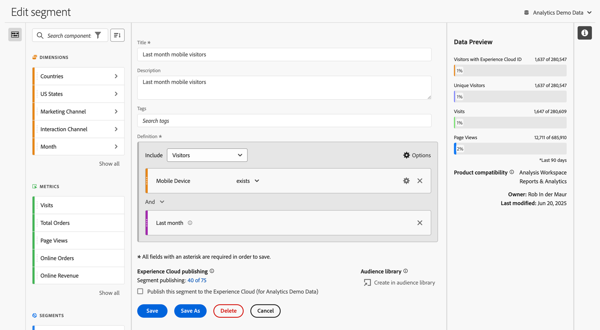
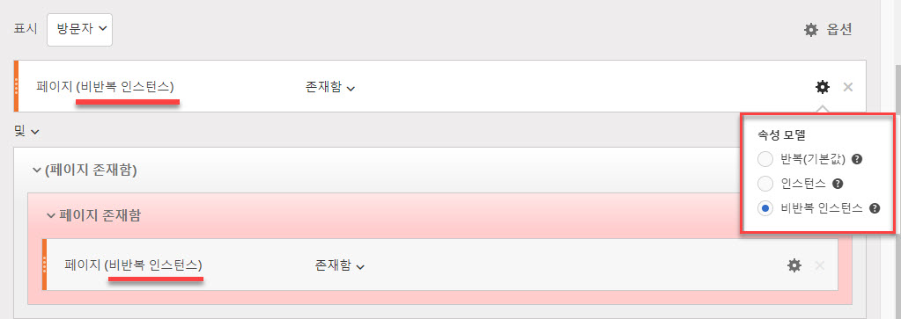
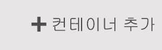
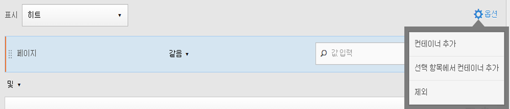
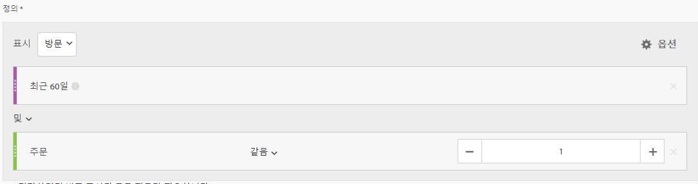
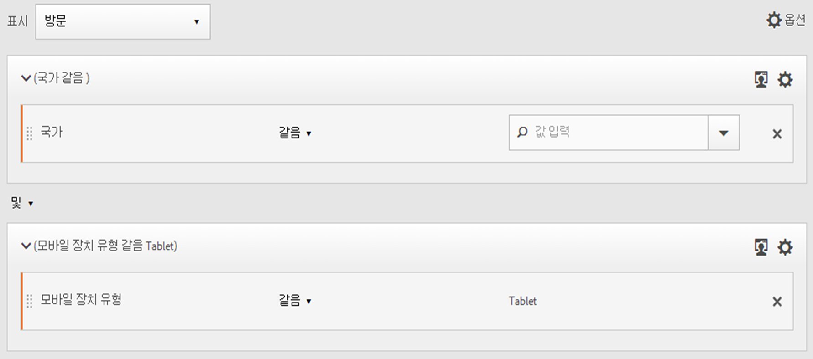
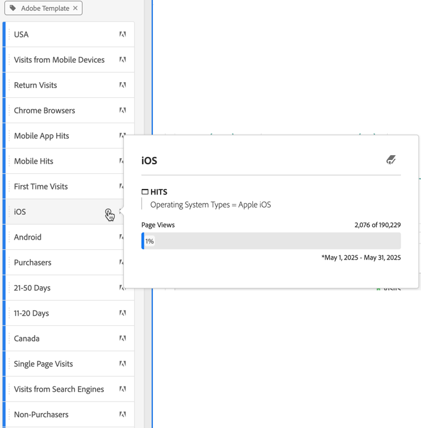

# 세그먼트 빌드 {#build-segments}

>[!CONTEXTUALHELP]
>id="components_segments_productcompatibility"
>title="제품 호환성"
>abstract="사용 가능한 세그먼트 기준 중 일부는 모든 Adobe Analytics 도구와 호환되지 않습니다. 해당 세그먼트와 호환되는 도구는 이 목록에 표시되어 있습니다. 세그먼트를 모든 Adobe Analytics 도구와 호환되게 하려면 현재 설정되어 있는 기준을 편집하십시오."

>[!CONTEXTUALHELP]
>id="components_filters_createaudience"
>title="대상자 만들기"
>abstract="세그먼트에서 대상자를 만들고 Adobe Experience Platform과 공유하여 활성화할 수 있습니다."

>[!CONTEXTUALHELP]
>id="components_filters_datapreview"
>title="데이터 미리보기"
>abstract="이 세그먼트의 데이터를 보고서 세트의 데이터와 비교합니다. 미리보기 비율은 **지난 90일** 동안의 연결 총 수를 기준으로 합니다.  미리보기가 로드되지 않는다면 연결이 아직 다시 채우는 중일 수 있습니다."

**[!UICONTROL 세그먼트 빌더]** 대화 상자를 사용하여 세그먼트를 새로 만들거나 기존 필터를 편집합니다. 대화 상자 제목은 [[!UICONTROL 세그먼트] 관리자](/help/components/segmentation/segmentation-workflow/seg-manage.md)에서 만들거나 관리하는 세그먼트에 대한 **[!UICONTROL 새로운 세그먼트]** 또는 **[!UICONTROL 필터 세그먼트]**&#x200B;으로 지정됩니다.

>[!BEGINTABS]

>[!TAB 세그먼트 빌더]

>[!TAB 세그먼트 만들기 또는 편집]

>[!ENDTABS]

1. 다음 세부 정보를 지정합니다(는 필수 입력 항목).

   | 요소 | 설명 |
   | --- | --- |
   | **[!UICONTROL 보고서 세트]** | 세그먼트에 대한 보고서 세트를 선택할 수 있습니다. |
   | **[!UICONTROL 프로젝트 전용 세그먼트]** | 세그먼트가 생성된 프로젝트에서만 볼 수 있다는 것을 설명하는 정보 상자입니다. 또한 해당 세그먼트는 구성 요소 목록에 추가되지 않습니다. **[!UICONTROL 이 세그먼트가 모든 프로젝트에 사용할 수 있도록 설정하기 및 구성 요소 목록 추가하기]**&#x200B;를 활성화하여 해당 설정을 변경합니다. 이 정보 상자는 [빠른 세그먼트](seg-quick.md)를 만들고 **[!UICONTROL 빠른 세그먼트]** 인터페이스의 [!UICONTROL 빌더 열기]를 사용하여 빠른 세그먼트 정보를 일반 세그먼트로 전환할 때만 표시됩니다. |
   | **[!UICONTROL 제목]**  | 세그먼트의 이름을 지정합니다(예: `Last month mobile visitors`). |
   | **[!UICONTROL 설명]** | 세그먼트에 대한 설명을 입력합니다(예: `Segment to define the mobile customers for the last month`). |
   | **[!UICONTROL 태그]** | 하나 이상의 태그를 만들거나 적용하여 세그먼트를 구성합니다. 이름을 입력하여 선택할 수 있는 기존 태그를 찾습니다. 또는 **[!UICONTROL ENTER]** 키를 눌러 새 태그를 추가합니다. 를 선택하여 태그를 제거합니다. |
   | **[!UICONTROL 정의]**  | [정의 빌더](#definition-builder)를 사용하여 세그먼트를 정의합니다. |

   {style="table-layout:auto"}

1. 세그먼트 정의가 올바른지 확인하려면 오른쪽 상단에서 지속적으로 업데이트되는 세그먼트 결과의 미리보기를 사용합니다.
1. 세그먼트를 Experience Cloud에 게시하려면 **[!UICONTROL 이 세그먼트를 Experience Cloud에 게시(*보고서 세트*용)를 선택합니다]**. 자세한 내용은 도움말의 [Experience Cloud에 세그먼트 게시](/help/components/segmentation/segmentation-workflow/seg-publish.md)를 참조하십시오.
1. 다음을 선택합니다.
   * **[!UICONTROL 저장]**: 세그먼트를 저장합니다.
   * **[!UICONTROL 다른 이름으로 저장]**: 세그먼트 사본을 저장합니다.
   * **[!UICONTROL 삭제]**: 세그먼트를 삭제합니다.
   * **[!UICONTROL 취소]**: 세그먼트에 적용된 변경 사항을 취소하거나 새 세그먼트 만들기를 취소합니다.

## 정의 빌더

정의 빌더를 사용하여 세그먼트 정의를 구성합니다. 해당 구성에서는 구성 요소, 컨테이너, 연산자, 논리를 사용합니다.

정의의 유형과 범위를 구성할 수 있습니다.

1. 정의 유형을 지정하려면 포함 정의를 작성할지, 제외 정의를 작성할지 지정합니다.  **[!UICONTROL 옵션]**&#x200B;을 선택하고 드롭다운 메뉴에서 **[!UICONTROL 포함]** 또는 **[!UICONTROL 제외]**&#x200B;를 선택합니다.
1. 정의 범위를 지정하려면 **[!UICONTROL 포함]** 또는 **[!UICONTROL 제외]** 드롭다운 메뉴에서 정의 범위를 **[!UICONTROL 히트 수]**, **[!UICONTROL 방문 횟수]** 또는 **[!UICONTROL 방문자 수]**&#x200B;로 설정할지 선택합니다.

나중에 언제든지 이러한 설정을 변경할 수 있습니다.

### 구성 요소

세그먼트 정의를 구성하는 데 있어 중요한 부분은 차원, 지표, 기존 세그먼트 및 날짜 범위를 사용하는 것입니다. 이러한 모든 구성 요소는 세그먼트 빌더의 구성 요소 패널에서 사용할 수 있습니다.

{width=100%}

구성 요소를 추가하는 방법은 다음과 같습니다.

1. 구성 요소 패널에서 구성 요소를 **[!UICONTROL 지표, 세그먼트 및/또는 차원을 여기에 드래그 앤 드롭]**&#x200B;으로 끌어다 놓습니다. 특정 구성 요소를 검색하려면 구성 요소 표시줄의 을 사용할 수 있습니다.
1. 구성 요소에 대한 세부 정보를 지정합니다. 예를 들어 **[!UICONTROL 값 선택]**&#x200B;에서 값을 선택합니다. 또는 값을 입력합니다. 하나 이상의 값을 지정하는 방법은 구성 요소와 연산자에 따라 다릅니다.
1. 필요한 경우 기본 연산자를 수정합니다. 예: **[!UICONTROL 다음과 같음]**&#x200B;에서 **[!UICONTROL 다음 중 하나 이상의 항목과 같음]**&#x200B;으로 수정. 사용 가능한 연산자에 대한 자세한 개요는 [연산자](../seg-reference/seg-operators.md)를 참조하십시오.

구성 요소 편집 방법:

* 연산자 드롭다운 메뉴에서 구성 요소에 대한 새 연산자를 선택합니다.
* 적절한 경우 연산자에 대해 다른 값을 선택하거나 지정합니다.
* 구성 요소 유형이 차원인 경우, 속성 모델을 정의할 수 있습니다. 자세한 내용은 [속성 모델](#attribution)을 참조하십시오.

구성 요소 삭제 방법:

* 구성 요소에서 를 선택합니다.

### 컨테이너

여러 구성 요소를 하나 이상의 컨테이너로 그룹화하고 컨테이너 내부 및 컨테이너 간의 논리를 정의할 수 있습니다. 컨테이너를 사용하면 세그먼트에 대한 복잡한 정의를 만들 수 있습니다.

{Width=100%}

* 컨테이너를 추가하려면  **[!UICONTROL 옵션]**&#x200B;에서 **[!UICONTROL 컨테이너 추가]**&#x200B;를 선택합니다.
* 컨테이너에 기존 구성 요소를 추가하려면 구성 요소를 컨테이너로 끌어다 놓습니다.
* 컨테이너에 다른 구성 요소를 추가하려면 구성 요소 패널에서 컨테이너로 구성 요소를 끌어다 놓습니다. 파란색 삽입선을 가이드로 활용합니다.
* 컨테이너 외부에 다른 구성 요소를 추가하려면 구성 요소 패널에서 구성 요소를 컨테이너 외부가 아닌 기본 정의 컨테이너 내부로 끌어다 놓습니다. 파란색 삽입선을 가이드로 활용합니다.
* 컨테이너 내 구성 요소 간, 컨테이너 간 또는 컨테이너와 구성 요소 간의 논리를 수정하려면 적절한 **[!UICONTROL And]**, **[!UICONTROL Or]**, **[!UICONTROL Then]**&#x200B;을 선택합니다. **[!UICONTROL Then]**&#x200B;을 선택하면 세그먼트가 순차적 세그먼트로 전환됩니다. 자세한 내용은 [순차적 세그먼트 만들기](seg-sequential-build.md)를 참조하십시오.
* 컨테이너 수준을 전환하려면  **[!UICONTROL 히트 수]**,  **[!UICONTROL 방문 횟수]** 또는  **[!UICONTROL 방문자 수]**&#x200B;을 선택합니다.

다음 액션을 위해 컨테이너에서 을 사용할 수 있습니다.

| 컨테이너 액션 | 설명 |
|---|---|
| **[!UICONTROL 컨테이너 추가]** | 컨테이너에 중첩된 컨테이너를 추가합니다. |
| **[!UICONTROL 제외]** | 세그먼트 정의의 컨테이너에서 결과를 제외합니다. 가는 빨간색 왼쪽 막대가 제외 컨테이너를 식별합니다. |
| **[!UICONTROL 포함]** | 세그먼트 정의의 컨테이너에서 결과를 포함합니다. 포함이 기본값입니다. 가는 회색 왼쪽 막대는 포함 컨테이너를 식별합니다. |
| **[!UICONTROL 이름 컨테이너]** | 기본 설명에서 컨테이너의 이름을 바꿉니다. 텍스트 필드에 이름을 입력합니다. 아무런 입력도 하지 않으면 기본 설명이 사용됩니다. |
| **[!UICONTROL 컨테이너 삭제]** | 정의에서 컨테이너를 삭제합니다. |

## 날짜 범위

순환 날짜 범위를 포함하는 세그먼트를 만들 수 있습니다. 따라서 진행 중인 캠페인이나 이벤트에 대한 질문에 답변할 수 있습니다. 예를 들면 *지난 60일 동안 온라인으로 구매한 모든 사람*&#x200B;을 포함하는 세그먼트를 작성할 수 있습니다.

>[!BEGINSHADEBOX]

데모 비디오를 보려면  [세그먼트별 롤링 날짜 범위](https://video.tv.adobe.com/v/25403/?quality=12&learn=on){target="_blank"}를 확인하십시오.

>[!ENDSHADEBOX]

## 세그먼트 스택 {#stack}

세그먼트를 사용하여 세그먼트를 작성할 수 있습니다. 세그먼트에서 세그먼트를 사용하면 세그먼트를 최적화하고 복잡성을 줄일 수 있습니다.

상호작용 채널(5)과 미국 주(50)의 조합을 세분화하려고 한다고 가정해 보겠습니다. 각각 디바이스 유형(휴대전화와 태블릿)과 미국 주의 고유한 조합에 따라 250개의 세그먼트를 만들 수 있습니다. 캘리포니아의 태블릿 사용자를 얻으려면 250개 세그먼트 중 하나를 사용하면 됩니다.

또는 55개 세그먼트를 정의할 수 있습니다. 50개의 세그먼트는 미국 주에 대한 것이고, 5개의 세그먼트는 존재 가능한 상호작용 채널에 대한 것입니다. 그런 다음 세그먼트를 누적하여 동일한 결과를 얻을 수 있습니다. 캘리포니아의 모바일 앱 사용자를 얻으려면 두 가지 세그먼트를 적용해야 합니다.

## 속성 {#attribution}

>[!CONTEXTUALHELP]
>id="components_filters_attribution_repeating"
>title="반복"
>abstract="차원에 대한 인스턴스 및 지속된 값 포함"

>[!CONTEXTUALHELP]
>id="components_filters_attribution_instance"
>title="인스턴스"
>abstract="차원에 대한 인스턴스를 포함합니다."

>[!CONTEXTUALHELP]
>id="components_filters_attribution_nonrepeatinginstance"
>title="비반복 인스턴스"
>abstract="차원에 대한 고유(비반복) 인스턴스를 포함합니다."

세그먼트 빌더에서 차원을 사용하면 해당 차원에 대한 속성 모델을 지정하는 옵션이 제공됩니다. 선택한 속성 모델은 차원 구성 요소에 대해 지정한 조건에 데이터가 적합한지 여부를 결정합니다.

차원 구성 요소 내에서 을 선택하고 팝업에서 속성 모델 중 하나를 선택합니다.

| 모델 | 설명 |
|---|---|
| **[!UICONTROL 반복 모델 (기본값)]** | 선별을 결정하기 위해 차원에 대한 인스턴스 값과 지속되는 값을 포함합니다. |
| **[!UICONTROL 인스턴스]** | 선별을 결정하기 위해 차원에 대한 인스턴스 값만 포함합니다. |
| **[!UICONTROL 비반복 인스턴스]** | 선별을 결정하기 위해 차원에 대한 고유한 인스턴스(비반복) 값을 포함합니다. |

### 예

세그먼트 정의의 일부로 다음 조건을 지정했습니다. 페이지 이름이 여성과 같다. 위의 예와 유사합니다. 나머지 두 가지 속성 모델을 사용하여 이 세그먼트 정의를 반복합니다. 따라서 각각 고유한 속성 모델이 있는 세 개의 세그먼트가 있습니다.

* 여성 페이지 - 속성 - 반복 (기본값)
* 여성 페이지 - 속성 - 인스턴스
* 여성 페이지 - 속성 - 비반복 인스턴스

아래 테이블은 각 속성 모델에 대해 해당 조건에 적합한 에 해당하는 수신 이벤트를 설명합니다.

| 여성 페이지 - 속성 -  *속성 모델* | 이벤트 1: 페이지 이름이 여성과 같음  | 이벤트 2: 페이지 이름이 남성과 같음  | 이벤트 3: 페이지 이름이 여성과 같음  | 이벤트 4: 페이지 이름이 여성과 같음 (지속) | 이벤트 5: 페이지 이름이 체크아웃과 같음  | 이벤트 6: 페이지 이름이 여성과 같음  | 이벤트 7: 페이지 이름이 홈과 같음  |
|---|:---:|:---:|:---:|:---:|:---:|:---:|:--:|
| 반복 (기본값) |  |  |  |  |  |  |  |
| 인스턴스 |  |  |  |  |  |  |  |
| 비반복 인스턴스 |  |  |  |  |  |  |  |

세 가지 세그먼트를 사용한 이벤트 보고서의 예는 다음과 같습니다.

<!--

The [!UICONTROL Segment builder] lets you build simple or complex segments that identify visitor attributes and actions across visits and page hits. It provides a canvas to drag and drop metric dimensions, events, or other segments in order to segment visitors based on hierarchy logic, rules, and operators.

There are several ways to access the Segment builder:

* **Analytics top navigation**: Click **[!UICONTROL Analytics]** > **[!UICONTROL Components]** > **[!UICONTROL Segments]**.
* **[!UICONTROL Analysis Workspace]**: Click **[!UICONTROL Analytics]** > **[!UICONTROL Workspace]**, open a project and click **[!UICONTROL + New]** > **[!UICONTROL Create Segment]**.
* **[!UICONTROL Report Builder]**: [Add or edit segments in Report Builder](/help/analyze/report-builder/work-with-segments.md).

## Builder criteria {#section_F61C4268A5974C788629399ADE1E6E7C}

You can add rule definitions and containers to define your segments.

1. **[!UICONTROL Title]**: Name the segment.
1. **[!UICONTROL Description]**: Provide a description for the segment. 
1. **[!UICONTROL Tags]**: [Tag the segment](/help/components/segmentation/segmentation-workflow/seg-workflow.md) you are creating by picking from a list of existing tags or creating a new tag.
1. **[!UICONTROL Definitions]**: This is where you [build and configure segments](/help/components/segmentation/segmentation-workflow/seg-workflow.md), add rules, and nest and sequence containers. 
1. **[!UICONTROL Show]**: (Top Container selector.) Lets you select the top-level [container](/help/components/segmentation/seg-overview.md) ( [!UICONTROL Visitor], [!UICONTROL Visit], [!UICONTROL Hit]). The default top-level container is the Hit container.
1. **[!UICONTROL Options]**: (gear) icon

   * **[!UICONTROL + Add container]**: Lets you add a new container (below the top-level container) to the segment definition.
   * **[!UICONTROL Exclude]**: Lets you define the segment by excluding one or more dimensions, segments, or metrics.

1. **[!UICONTROL Dimensions]**: Components are dragged and dropped from the Dimensions list (orange sidebar).
1. **[!UICONTROL Operator]**: You can compare and constrain values using selected operators.
1. **[!UICONTROL Value]**: The value you entered or selected for the dimension or segment or metric.
1. **[!UICONTROL Attribution Models]**: Available for dimensions only, these models determine what values in a dimension to segment for. Dimension models are particularly useful in sequential segmentation.

   * **[!UICONTROL Repeating]** (default): Includes instances and persisted values for the dimension.
   * **[!UICONTROL Instance]**: Includes instances for the dimension.
   * **[!UICONTROL Non-repeating instance]**: Includes unique instances (non-repeating) for the dimension. This is the model applied in Flow when repeat instances are excluded.

   

   **Example: Hit segment where eVar1 = A** 

   |  Example  | A  | A  |  A (persisted) | B  | A  | C  |
   |---|---|---|---|---|---|---|
   |  Repeating  | X  | X  | X  | -  | X  | -  |
   |  Instance  | X  | X  | - | - | X | - |
   |  Non-repeating instance  | X | - | - | -  | X  | -  |

1. **[!UICONTROL And/Or/Then]**: Assigns the [!UICONTROL AND/OR/THEN] operators between containers or rules. The THEN operator lets you [define sequential segments](/help/components/segmentation/segmentation-workflow/seg-sequential-build.md).
1. **[!UICONTROL Metric]**: (Green sidebar) Metric that was dragged and dropped from the Metrics list.
1. **[!UICONTROL Comparison]** operator: You can compare and constrain values using selected operators.
1. **[!UICONTROL Value]**: The value you entered or selected for the dimension or segment or metric.
1. **[!UICONTROL X]**: (Delete) Lets you delete this part of the segment definition.
1. **[!UICONTROL Experience Cloud publishing]**: Publishing an Adobe Analytics segment to the Experience Cloud lets you use the segment for marketing activity in [!DNL Audience Manager] and in other activation channels. [Learn more...](/help/components/segmentation/segmentation-workflow/seg-publish.md)
1. **[!UICONTROL Audience library]**: Adobe's audience services manage the translation of visitor data into audience segmentation. As such, creating and managing audiences is similar to creating and using segments, with the added ability to share the audience segment to the Experience Cloud. [Learn more...](https://experienceleague.adobe.com/docs/core-services/interface/audiences/audience-library.html)
1. **[!UICONTROL Search]**: Searches the list of dimensions, segments, or metrics.
1. **[!UICONTROL Dimensions]**: (List) Click the header to expand.
1. **[!UICONTROL Metrics]**: Click the header to expand.
1. **[!UICONTROL Segments]**: Click the header to expand.
1. **[!UICONTROL Report suite selector]**: Lets you select the report suite that this segment will be saved under. You can still utilize the segment in all report suites.
1. **[!UICONTROL Segment Preview]**: Lets you preview the key metrics to see whether you have a valid segment and how broad the segment is. Represents the breakdown of the data set you can expect to see if you apply this segment. Shows 3 concentric circles and a list to show the number and percentage of matches for [!UICONTROL Hits], [!UICONTROL Visits], and [!UICONTROL Visitors] for a segment run against a data set. This chart is updated immediately after you create or make changes to your segment definition.
1. **[!UICONTROL Product Compatibility]**: Provides a list of which Adobe Analytics products (Analysis Workspace, Data Warehouse) with which the segment you created is compatible. Most segments are compatible with all products. However, not all operators and dimensions are compatible with all Analytics products, especially [Data Warehouse](/help/components/segmentation/seg-reference/seg-compatibility.md). This chart is updated immediately after you make changes to your segment definition.
1. **[!UICONTROL Save]** or **[!UICONTROL Cancel]**: Saves or cancels the segment. After clicking **[!UICONTROL Save]**, you are taken to the Segment manager where you can manage the segment.

## Build segments {#build-segments}

1. Simply drag a Dimension, Segment, or Metric Event from the left pane to the [!UICONTROL Definitions] field.

   

   The default top-level [!UICONTROL Hit] container is shown after dragging an element to [!UICONTROL Definitions]. You can change the container type to Visit or Visitor from the **[!UICONTROL Show]** drop-down menu.

1. Set the [operator](/help/components/segmentation/seg-reference/seg-operators.md) from the drop-down menu.
1. Enter or select a value for the item selected.
1. Add additional containers if needed, using **[!UICONTROL And]**, **[!UICONTROL Or]**, or **[!UICONTROL Then]** rules.
1. After placing the containers and setting the rules, see the results of the segment in the validation chart at the top right. The validator indicates the percentage and absolute number of page views, visits, and unique visitors that match the segment you created.
1. Under **[!UICONTROL Tags]**, [tag](/help/components/segmentation/segmentation-workflow/seg-tag.md) the container by selecting an existing tag or creating a new one.
1. Click **[!UICONTROL Save]** to save the segment.

You are now taken to the [Segment manager](/help/components/segmentation/segmentation-workflow/seg-manage.md), where you can tag, share, and manage your segment in multiple ways.

## Add containers {#section_1C38F15703B44474B0718CEF06639EFD}

You can [build a framework of containers](/help/components/segmentation/seg-overview.md) and then place logic rules and operators between.

1. Click **[!UICONTROL Options > Add Container]**.

   

   A new [!UICONTROL Hit] container opens without a [!UICONTROL Hit] (Page View) identified.

   

1. Change the container type as needed.
1. Drag a Dimension, Segment, or Event from the left pane to the container.
1. Continue to add new containers from the top-level **[!UICONTROL Options]** > **[!UICONTROL Add container]** button at the top of the definition, or add containers from within a container to nest logic.

   **OR**

   Select one or more rules and then click **[!UICONTROL Options]** > **[!UICONTROL Add container from selection]**. This turns your selection into a separate container.

## Use date ranges {#concept_252A83D43B6F4A4EBAB55F08AB2A1ACE}

You can build segments that contain rolling date ranges in order to answer questions about ongoing campaigns or events.

For example, you can easily build a segment that includes "everyone who has made a purchase over the past 60 days".

You create a Visit container and within it, add the [!UICONTROL Last 60 days] time range and the metric [!UICONTROL Orders is greater than or equal to 1], with an AND operator:

>[!BEGINSHADEBOX]

See  [Rolling date ranges in segments](https://video.tv.adobe.com/v/25403?quality=12&learn=on){target="_blank"} for a demo video.

>[!ENDSHADEBOX]

## Stack segments {#task_58140F17FFD64FF1BC30DC7B0A1B0E6D}

Stacking segments works by combining the criteria in each segment using an 'and' operator, and then applying the combined criteria. This can be done in a Workspace project directly or in segment builder. 

For example, stacking a "mobile phone users" segment and a "US geography" segment would return data only for mobile phone users in the US.

Think of these segments as building blocks or modules that you can include in a segment library, for users to use as they see fit. That way, you can dramatically reduce the number of segments needed. For example, assume you have 40 segments:

* 20 for mobile phone users in different countries (US_mobile, Germany_mobile, France_mobile, Brazil_mobile, etc.) 
* 20 for tablet users in different countries (US_tablet, Germany_tablet, France_tablet, Brazil_tablet, etc.)

By using segment stacking, you can reduce your segment count to 22 and stack them as needed. You would need to create these segments:

* one segment for mobile users 
* one segment for tablet users 
* 20 segments for the different geographies

>[!NOTE]
>
>When stacking two segments, they are by default joined by an AND statement. This cannot be changed to an OR statement.

1. Go to the Segment builder.
1. Provide a title and description for the segment.

   Step Result 1. Click **[!UICONTROL Show Segments]** to bring up the list of segments in the left navigation.

   Step Result 1. Drag and drop the segments you want to stack to the segment definition canvas. Here is an example of a segment that stacks the existing segments "Visits from Tablets" and "US Geo":

   

1. Save the segment.

   Step Result 

-->

## 세그먼트 템플릿 {#concept_5098446CC78D441E93B8E4D1D1EA6558}

세그먼트 템플릿은 **[!UICONTROL 처음 방문]** 또는 **[!UICONTROL 모바일 디바이스에서 방문]**&#x200B;과 같은 일반적인 세그먼테이션 사용을 위해 제공됩니다. Workspace 프로젝트와 세그먼트 빌더에서 새 세그먼트에 대한 빌딩 블록으로 사용할 수 있습니다.

Adobe 로고 는 템플릿을 식별합니다. 사용 가능한 템플릿 샘플은 아래에 나와 있습니다.

<table id="table_98B87D807E9344C9BEBF072C65D87B1B"> 
 <thead> 
  <tr> 
   <th colname="col1" class="entry"> 템플릿 이름 </th> 
   <th colname="col2" class="entry"> 정의 </th> 
  </tr> 
 </thead>
 <tbody> 
  <tr> 
   <td colname="col1"> 장바구니 포기 </td> 
   <td colname="col2">장바구니에 품목을 추가했지만 아직 주문하지 않은 방문자의 데이터를 조회합니다. 세그먼트 정의에서 이 컨테이너는 방문입니다. </td> 
  </tr> 
  <tr> 
   <td colname="col1"> 최초 방문 </td> 
   <td colname="col2">최대 [1]회 방문한 방문자에 대한 데이터를 조회합니다. 세그먼트 정의에서 이 컨테이너는 방문입니다. 
 </td> 
  </tr> 
  <tr> 
   <td colname="col1"> 비구매자 </td> 
   <td colname="col2">주문 이벤트에 참가하지 않은 방문자에 대한 데이터를 조회합니다. </td> 
  </tr> 
  <tr> 
   <td colname="col1"> 단일 페이지 방문 횟수 아님 (바운스 아님) </td> 
   <td colname="col2">두 번 이상 방문한 방문자의 데이터를 조회합니다.
 </td> 
  </tr> 
  <tr> 
   <td colname="col1"> 유료 검색 </td> 
   <td colname="col2">유료 검색에서 시작한 방문자의 데이터를 조회합니다.  </td> 
  </tr> 
  <tr> 
   <td colname="col1"> 구매자 </td> 
   <td colname="col2">주문 이벤트에 참가한 방문자에 대한 데이터를 조회합니다.  </td> 
  </tr> 
  <tr> 
   <td colname="col1"> 재방문 </td> 
   <td colname="col2">1번 이상 방문한 방문자의 데이터를 조회합니다.  </td> 
  </tr> 
  <tr> 
   <td colname="col1"> 단일 페이지 방문 횟수 </td> 
   <td colname="col2"> 해당 방문 중에 여러 페이지 보기를 제출할 수 있더라도 단일 페이지 값을 열람한 방문의 데이터를 표시합니다. 종료 링크 이벤트가 있는 단일 페이지 방문이 세그먼트에 포함됩니다.  </td> 
  </tr> 
  <tr> 
   <td colname="col1"> 열람되었지만 장바구니에 추가되지 않은 제품 </td> 
   <td colname="col2">제품을 열람했지만 장바구니에 추가하지 않은 방문자의 데이터를 조회합니다.  </td> 
  </tr> 
  <tr> 
   <td colname="col1"> 캠페인에서 방문 </td> 
   <td colname="col2">캠페인에서 참조한 방문자에 대한 데이터를 표시합니다. </td> 
  </tr> 
  <tr> 
   <td colname="col1"> 모바일 디바이스를 통한 방문 </td> 
   <td colname="col2">모바일 디바이스를 사용한 방문자의 데이터를 조회합니다. </td> 
  </tr> 
  <tr> 
   <td colname="col1"> 자연어 검색으로 찾아온 방문 </td> 
   <td colname="col2">유료 검색에서 시작하지 않은 방문자의 데이터를 조회합니다.  </td> 
  </tr> 
  <tr> 
   <td colname="col1"> 비모바일 디바이스에서 시작된 방문 </td> 
   <td colname="col2">모바일 디바이스를 사용하지 않은 방문자의 데이터를 조회합니다. </td> 
  </tr> 
  <tr> 
   <td colname="col1"> 휴대폰에서 시작된 방문 </td> 
   <td colname="col2">휴대폰을 사용한 방문자의 데이터를 조회합니다.  </td> 
  </tr> 
  <tr> 
   <td colname="col1"> 검색 엔진에서 시작된 방문 </td> 
   <td colname="col2">검색 엔진에서 참조한 방문자에 대한 데이터를 표시합니다.</td> 
  </tr> 
  <tr> 
   <td colname="col1"> 소셜 사이트로부터의 방문 </td> 
   <td colname="col2">소셜 사이트에서 참조한 방문자에 대한 데이터를 조회합니다.</td> 
  </tr> 
  <tr> 
   <td colname="col1"> 태블릿에서 시작된 방문 </td> 
   <td colname="col2">태블릿을 사용한 방문자의 데이터를 조회합니다.</td> 
  </tr> 
  <tr> 
   <td colname="col1"> 방문자 ID를 갖는 방문 </td> 
   <td colname="col2">영구적 쿠키가 필요한 사이트의 방문자에 대한 데이터를 표시합니다.</td> 
  </tr> 
 </tbody> 
</table>

각 세그먼트의 정의를 보려면 을 사용하십시오. 예를 들어, **[!UICONTROL iOS]** 템플릿의 경우:

