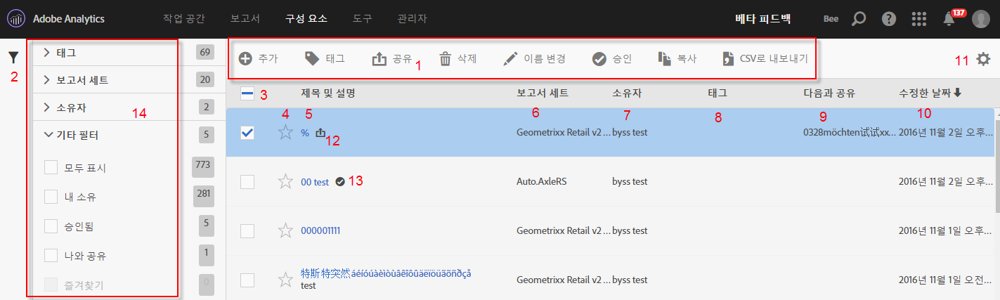

# 세그먼트 관리

세그먼트 관리자는 공유, 필터링, 태깅, 승인, 복사, 삭제 및 즐겨찾기로 표시 등 다양한 세그먼트 처리 작업을 제공합니다.

Analytics 세그먼트 관리자는 사용자가 보유하는 모든 세그먼트 및 사용자와 공유되는 모든 세그먼트를 표시합니다. 관리자 수준의 사용자는 조직의 모든 세그먼트를 볼 수 있습니다. 이 개요에서는 세그먼트 관리자의 사용자 인터페이스와 기능을 설명합니다. 세그먼트 빌더 액세스 방법은 다음과 같습니다.

* 맨 위의 탐색 영역에서 **[!UICONTROL Analytics]** > **[!UICONTROL 구성 요소]** > **[!UICONTROL 세그먼트]**&#x200B;로 이동합니다.
* 기존 보고서를 표시하고 왼쪽 탐색에서 세그먼트 아이콘 을 클릭합니다. 그런 다음 **[!UICONTROL 관리를 클릭합니다]**.

## 방법 비디오 {#section_B3C5DA22DC5248DBA17C56E03DA2D4F2}

이 [Adobe Analytics 비디오](https://docs.adobe.com/content/help/ko-KR/analytics-learn/tutorials/components/segmentation/segment-management-and-sharing.html)에서는 세그먼트 관리자를 사용하는 방법에 대한 간단한 개요를 제공합니다.

## 세그먼트 관리자 사용자 인터페이스 {#section_7FDCD12949BE4741A402DB83AB7B37DF}

| # | UI 기능 | 설명 |
|---|---|---|
| 1 | 세그먼트 관리 도구 모음 | 세그먼트를 선택하면 이 도구 모음이 나타납니다. 대부분의 관리 작업은 이 도구 모음에서 완료할 수 있습니다. |
| 2 | 필터 표시 | 필터 아이콘을 클릭하면 필터 메뉴가 표시됩니다. 태그, 소유자, 모두 표시(관리자만), 내 세그먼트, 즐겨찾기, 승인됨 및 나와 공유 기준으로 필터링할 수 있습니다. |
| 3 | 확인란 | 세그먼트를 관리하려면 선택합니다. |
| 4 | 즐겨찾기 | 세그먼트 옆에 있는 별 모양을 클릭하면 별이 노란색으로 바뀌고 세그먼트가 즐겨찾기로 표시됩니다. |
| 5 | 세그먼트 제목 및 설명 | 세그먼트 빌더에 제공됩니다. 제목 및 설명을 편집하려면 제목 링크를 클릭합니다. 이렇게 하면 세그먼트 빌더로 돌아갑니다. |
| 6 | 보고서 세트 | 이 열은 세그먼트를 마지막으로 저장한 보고서 세트를 표시합니다. |
| 7 | 소유자 | 세그먼트를 소유하는 사람을 나타냅니다. 관리자가 아닌 경우 사용자가 소유하거나 사용자와 공유된 세그먼트만 표시할 수 있습니다. |
| 8 | 태그(열 선택기에서 선택되지 않았으므로 열이 나타나지 않음) | 사용자 또는 사용자와 세그먼트를 공유한 다른 사람이 세그먼트에 적용한 태그입니다. |
| 9 | 다음 사용자와 공유 | 세그먼트를 공유한 개인 또는 그룹(관리자만) 또는 모든 사용자(관리자만)를 표시합니다. |
| 10 | 수정한 날짜 | 세그먼트를 마지막으로 수정한 날짜를 표시합니다. |
| 11 | 열 선택기 | 세그먼트 관리자에서 열을 선택하거나 선택 취소할 수 있습니다. |
| 12 | 공유됨 아이콘 | 이 세그먼트를 사용자가 공유했거나 이 세그먼트가 사용자와 공유되고 있음을 가리킵니다. |
| 13 | 승인됨 아이콘 | 관리자가 이 세그먼트를 승인했음을 가리킵니다. |
| 14 | 필터 | 태그, 보고서 세트, 소유자 및 기타(모두 표시, 내 소유, 나에게 공유됨, 승인됨, 즐겨찾기) 필터를 보고 선택합니다. |
