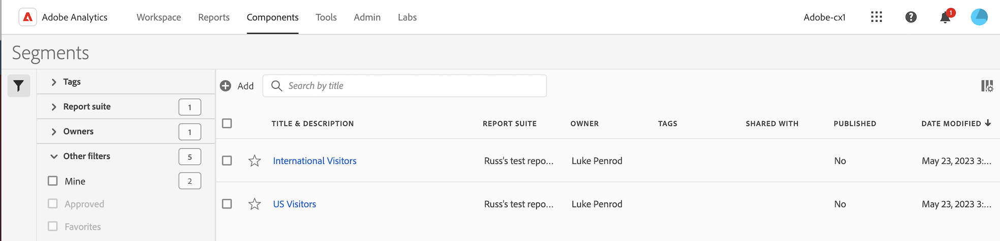

# 세그먼트 관리자

세그먼트 관리자는 공유, 필터링, 태깅, 승인, 복사, 삭제 및 즐겨찾기로 표시 등 다양한 세그먼트 처리 작업을 제공합니다.

Analytics 세그먼트 관리자는 사용자가 보유하는 모든 세그먼트 및 사용자와 공유되는 모든 세그먼트를 표시합니다. 관리자 수준의 사용자는 조직의 모든 세그먼트를 볼 수 있습니다. 이 개요에서는 세그먼트 관리자의 사용자 인터페이스와 기능을 설명합니다.

## 세그먼트 관리자 액세스

1. Adobe Analytics에서 **[!UICONTROL 구성 요소]** 탭을 선택한 다음 를 선택합니다 **[!UICONTROL 세그먼트]**.

   또는

   기존 보고서에서 세그먼트 아이콘 을 선택합니다  왼쪽 탐색에서 을(를) 선택합니다. **[!UICONTROL 관리]**.

## 세그먼트 관리자에서 사용할 수 있는 작업

세그먼트 관리자에서 다음 작업을 수행할 수 있습니다.

* [세그먼트 필터링](/help/components/segmentation/segmentation-workflow/t-seg-filter.md)

* [세그먼트를 즐겨찾기로 표시](/help/components/segmentation/segmentation-workflow/t-seg-favorite.md)

* [세그먼트 승인](/help/components/segmentation/segmentation-workflow/seg-approve.md)

* [세그먼트에 태그 지정](/help/components/segmentation/segmentation-workflow/seg-tag.md)

* [세그먼트 공유](/help/components/segmentation/segmentation-workflow/t-seg-share.md)

* 세그먼트를 CSV 파일로 내보냅니다.

* [세그먼트 복사](/help/components/segmentation/segmentation-workflow/seg-copy.md)

* [세그먼트 삭제](/help/components/segmentation/segmentation-workflow/seg-delete.md)

## 열 구성

표시되는 열을 구성하여 세그먼트 관리자에서 각 세그먼트에 대해 표시되는 정보를 구성할 수 있습니다.

세그먼트 관리자에서 표시되는 열을 구성하려면 다음을 수행합니다.

1. Adobe Analytics에서 **[!UICONTROL 구성 요소]** 탭을 선택한 다음 를 선택합니다 **[!UICONTROL 세그먼트]**.

1. 세그먼트 관리자에서 **열 사용자 지정** 아이콘 을 선택한 다음 세그먼트 관리자에 표시할 열을 선택합니다.

   다음 열을 사용할 수 있습니다.

   | 열 제목 | 설명 |
   |---|---|
   | 제목 및 설명 | 이러한 값은 세그먼트 빌더에 제공됩니다. 제목 및 설명을 편집하려면 제목 링크를 선택하여 세그먼트 빌더를 엽니다. |
   | 즐겨찾기 | 각 세그먼트 옆에 별 아이콘을 표시하여 세그먼트를 즐겨찾기로 표시할 수 있습니다. 자세한 내용은 [세그먼트를 즐겨찾기로 표시](/help/components/segmentation/segmentation-workflow/t-seg-favorite.md). |
   | 보고서 세트 | 이 열은 세그먼트를 마지막으로 저장한 보고서 세트를 표시합니다. |
   | 소유자 | 세그먼트를 소유하는 사람을 나타냅니다. 관리자가 아닌 경우 사용자가 소유하거나 사용자와 공유된 세그먼트만 표시할 수 있습니다. |
   | 태그 (열 선택기에서 선택되지 않았으므로 열이 나타나지 않음) | 사용자 또는 사용자와 세그먼트를 공유한 다른 사람이 세그먼트에 적용한 태그입니다. |
   | 다음 사용자와 공유 | 세그먼트를 공유한 개인 또는 그룹 (관리자만) 또는 모든 사용자 (관리자만)를 표시합니다. 
사용자가 세그먼트를 공유하거나 사용자와 세그먼트를 공유할 때 세그먼트 이름 옆에 공유 아이콘이 표시됩니다.
 |
   | 수정한 날짜 | 세그먼트를 마지막으로 수정한 날짜를 표시합니다. |
   | 다음에서 사용됨 | **참고:** 이 기능은 릴리스의 제한된 테스트 단계에 있으며 사용자 환경에서 아직 사용하지 못할 수 있습니다. 기능이 일반적으로 제공되면 이 메모는 제거됩니다. Customer Journey Analytics 릴리스 프로세스에 대한 자세한 내용은 [Adobe Analytics 기능 릴리스](/help/release-notes/releases.md).
현재 세그먼트가 사용 중인 구성 요소의 수를 표시합니다. 
예를 들어 세그먼트가 40개의 프로젝트 및 2개의 경고에서 사용 중인 경우 이 열의 값은 로 표시됩니다. [!UICONTROL **42개 구성 요소**].
 
이 열의 값을 선택하여 세그먼트가 사용되는 위치 분류를 확인합니다(예: [!UICONTROL **프로젝트 (40)**], [!UICONTROL **경고 (2)**]).

세그먼트는 다음 구성 요소 유형 중 하나에서 사용할 수 있습니다.
 <ul><li>경고</li><li>프로젝트</li><li>예약된 프로젝트</li><li>계산된 지표</li></ul>
이 정보는 구성 요소가 조직의 사용자에게 가치가 있는지, 사용 위치 및 삭제하거나 수정해야 하는지 여부를 확인하는 데 도움이 됩니다.

이 정보에는 API, Report Builder 또는 Data Warehouse의 사용이 포함되지 않습니다.

다음을 사용할 수 있습니다. [데이터 사전](/help/analyze/analysis-workspace/components/data-dictionary/data-dictionary-overview.md) 이 정보와 함께 구성 요소가 조직에서 어떻게 사용되는지 추적하고 더 잘 이해하는 데 도움이 됩니다.

다음 [!UICONTROL **다음에서 사용됨**] 열은 기본적으로 표시되지 않습니다. [열 구성](#configure-columns) 표시합니다.
 |
   | 마지막 사용 | **참고:** 이 기능은 릴리스의 제한된 테스트 단계에 있으며 사용자 환경에서 아직 사용하지 못할 수 있습니다. 기능이 일반적으로 제공되면 이 메모는 제거됩니다. Customer Journey Analytics 릴리스 프로세스에 대한 자세한 내용은 [Adobe Analytics 기능 릴리스](/help/release-notes/releases.md).
다음 구성 요소 유형에서 세그먼트가 마지막으로 사용된 날짜를 표시합니다.
 <ul><li>경고</li><li>계산된 지표</li><li>프로젝트</li><li>예약된 프로젝트</li><li>세그먼트</li></ul> 
이 정보는 구성 요소가 조직의 사용자에게 가치가 있는지, 사용 위치 및 삭제하거나 수정해야 하는지 여부를 확인하는 데 도움이 됩니다.

이 정보에는 API, Report Builder 또는 Data Warehouse의 사용이 포함되지 않습니다.

다음을 사용할 수 있습니다. [데이터 사전](/help/analyze/analysis-workspace/components/data-dictionary/data-dictionary-overview.md) 이 정보와 함께 구성 요소가 조직에서 어떻게 사용되는지 추적하고 더 잘 이해하는 데 도움이 됩니다. |

   {style="table-layout:auto"}

## 방법 비디오 {#section_B3C5DA22DC5248DBA17C56E03DA2D4F2}

이 [Adobe Analytics 비디오](https://experienceleague.adobe.com/docs/analytics-learn/tutorials/components/segmentation/segment-management-and-sharing.html?lang=ko-KR)에서는 세그먼트 관리자를 사용하는 방법에 대한 간단한 개요를 제공합니다.

