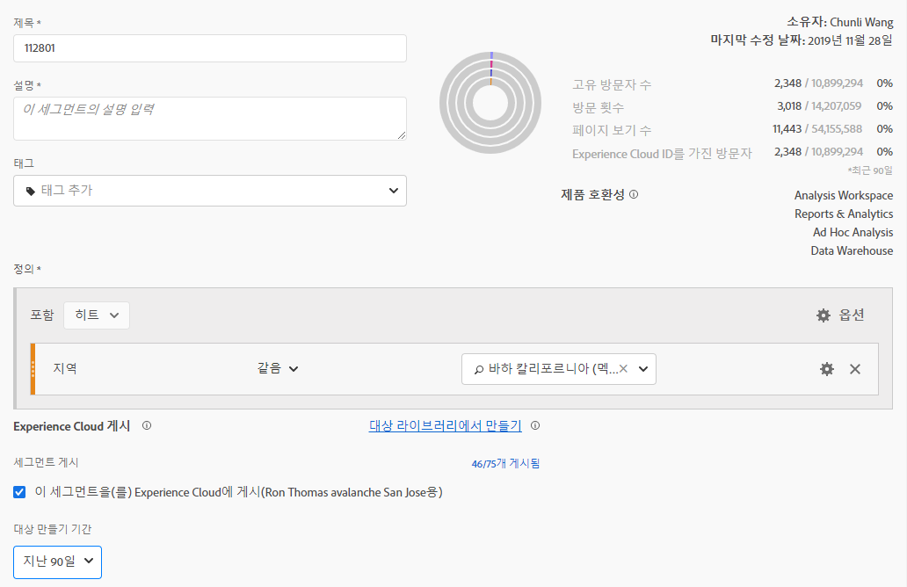
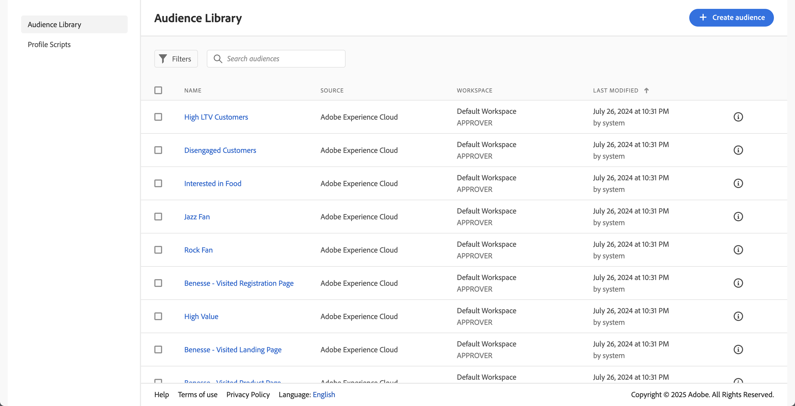

# 세그먼트 게시 {#publish-segments}

>[!CONTEXTUALHELP]
>id="components_segments_publishing"
>title="Experience Cloud 게시"
>abstract="대상자를 대상자 라이브러리에 게시하여 해당 대상자를 Target 및 기타 Experience Cloud 솔루션에서 마케팅 활동에 사용할 수 있습니다."

>[!CONTEXTUALHELP]
>id="components_segments_audiencelibrary"
>title="대상자 라이브러리"
>abstract="대상자 라이브러리에서 만든 세그먼트는 즉시 사용할 수 있으며 Analytics 업데이트에 종속되지 않습니다."

Adobe Analytics 세그먼트를 Experience Cloud에 게시할 수 있습니다. 따라서 세그먼트를 [!DNL Audience Manager]의 마케팅 활동과 [!DNL Advertising Cloud], [!DNL Target] 및 [!DNL Campaign]을(를) 포함한 다른 활성화 채널에서 사용할 수 있습니다.

Analytics 세그먼트를 8시간 이내에 Experience Cloud에 게시할 수 있습니다. 이러한 세그먼트를 사용하여 Audience Manager의 대상자를 모든 다운스트림 대상으로 활성화합니다.

>[!BEGINSHADEBOX]

데모 비디오는  [세그먼트 게시](https://video.tv.adobe.com/v/32842?quality=12&learn=on){target="_blank"}를 참조하십시오.

>[!ENDSHADEBOX]

>[!NOTE]
>
>Adobe Campaign (Classic 및 Standard)은 8시간 지연 외에 24시간 추가적인 지연을 발생시킨다는 점에서 다르게 동작합니다.

## 사전 요구 사항

* 이 세그먼트를 저장할 보고서 세트가 Experience Cloud에 대해 [사용](/help/components/segmentation/segmentation-workflow/seg-publish.md)되어 있는지 확인하십시오. 그렇지 않으면 Experience Cloud에 게시할 수 없습니다.
* 조직이 Experience Cloud ID를 사용하고 있는지 확인합니다.
* 세그먼트를 게시하려면 먼저 관리자가 [Admin Console의](https://experienceleague.adobe.com/ko/docs/core-services/interface/administration/admin-tool-experience-cloud) 제품 프로필에 [!UICONTROL 세그먼트 게시] 권한을 할당하고 사용자를 제품 프로필에 추가해야 합니다.

## 고려 사항

* **보고서 세트 제한**: 보고서 세트당 최대 75개의 세그먼트를 게시할 수 있습니다. 이 제한은 강제 적용됩니다. 이미 75개의 세그먼트를 게시한 경우 75개 임계값 아래가 되도록 세그먼트 게시를 취소해야 추가 세그먼트를 게시할 수 있습니다.
* **멤버십 제한**: Adobe Analytics에서 [!DNL Experience Cloud]로 공유한 대상자는 2천만 명의 고유 구성원을 초과할 수 없습니다.
* **데이터 개인정보**: 대상자는 방문자의 인증 상태에 따라 필터링되지 않습니다. 방문자는 인증되지 않음 및 인증됨 상태의 사이트를 검색할 수 있습니다. 방문자가 인증되지 않은 경우 발생하는 작업으로 인해 여전히 방문자가 대상에 포함될 수 있습니다. 대상자를 공유할 때 파생되는 전반적인 개인정보 문제를 이해하려면 [Adobe Experience Cloud 개인정보 보호](https://www.adobe.com/kr/privacy/experience-cloud.html)를 검토하십시오.
* **과(와) [!DNL Adobe Analytics]의 세그먼트 간[!DNL Audience Manager]**&#x200B;차이점에 대한 논의는 [Analytics 및 Audience Manager의 세그먼트 이해](/help/integrate/c-audience-analytics/aam-analytics-segments.md)를 참조하십시오.

## 세그먼트 게시 타임라인

| 사용 가능한 사항 | 사용 가능한 시기 | 사용 가능한 위치 |
|---|---|---|
| 메타데이터 (세그먼트 제목 및 정의) | 게시 후 즉시 | [!DNL Audience Manager], [!UICONTROL Experience Cloud 대상자 라이브러리], [!DNL Target] |
| 멤버십이 있는 사용 가능한 세그먼트 | 게시 후 8시간까지 | [!DNL Audience Manager]의 방문자 프로필 뷰어 |
| 트레이트 및 멤버십 인구 | 24-48시간 이내 | [!DNL Audience Manager] |

>[!NOTE]
>일주일에 한 번, 모든 데이터는 이전 주에 캡처되지 않은 모든 델타 또는 불일치를 고려하여 완전히 동기화됩니다.

## [!UICONTROL 세그먼트 빌더]에서 세그먼트 게시

1. Adobe Analytics에서 **[!UICONTROL 구성 요소]** > **[!UICONTROL 세그먼트]**(으)로 이동
1. 새 세그먼트를 만들려면 **[!UICONTROL 추가]**&#x200B;를 선택하십시오.
   
1. 세그먼트의 제목과 설명을 입력합니다. 이러한 필드는 세그먼트를 저장하기 전에 필요합니다.
1. **[!UICONTROL Experience Cloud 게시]** 섹션에서 **[!UICONTROL 이 세그먼트를 Experience Cloud에 게시(*보고서 세트*용)]** 옵션을 선택합니다.

   >[!IMPORTANT]
   >
   >Experience Cloud 숫자를 Audience Manager 숫자와 비교할 때 **[!UICONTROL 고유 방문자 수]** 대신 **[!UICONTROL 데이터 미리 보기]**&#x200B;에서 **[!UICONTROL Adobe Analytics ID를 가진 방문자 수]**&#x200B;를 모니터링해야 합니다.
   >

| 요소 | 설명 |
|---|---|
| **[!UICONTROL 이 세그먼트를 Experience Cloud에 게시(*보고서 세트*용)]** | 이 옵션을 활성화하면 세그먼트 제목 및 정의는 즉시 Experience Cloud과 공유되는 반면, 세그먼트 멤버십은 4시간마다 평가되고 공유됩니다.   예를 들어 해당 대상자가 [!DNL Target]의 활동과 연결되면 [!DNL Analytics]에서는 해당 Experience Cloud 및 [!DNL Target] 대상자의 자격을 규정하는 방문자용 ID를 전송하기 시작합니다. 이때 대상 이름 및 해당 데이터가 Experience Cloud의 [!DNL Audience Library] 페이지에 표시되기 시작합니다.   |
| **[!UICONTROL 대상자 만들기 기간]** | 선택하는 기간은 롤링 달력을 기준으로 대상을 만드는 데 사용됩니다. 예를 들어 **[!UICONTROL 최근 30일]**(기본값)에는 오늘 날짜로부터 지난 30일 동안(세그먼트가 생성된 원래 날짜로부터가 아님) 대상의 자격이 되는 방문자가 포함됩니다. |
| **[!UICONTROL 대상자 라이브러리에서 만들기]** | 만들고 게시하는 세그먼트는 Experience Cloud의 [!DNL Audience Library] 페이지에서 지연 없이 사용할 수 있도록 할 수 있습니다. 이러한 세그먼트는 Analytics 업데이트에 종속되지 않으며, 75개의 게시된 세그먼트라는 제한 계산에 포함되지 않습니다. |
| **[!UICONTROL 75개 중 x개가 게시됨]** | Experience Cloud에 게시한 세그먼트 수입니다. 게시된 세그먼트 목록과 관련 보고서 세트 및 소유자를 보려면 링크를 클릭하십시오. |
| **[!UICONTROL 저장]** | 이 세그먼트를 저장합니다. |

## 세그먼트 게시 취소 또는 삭제

>[!CAUTION]
>
>Experience Cloud에 게시된 세그먼트를 삭제하려면 먼저 세그먼트 게시를 취소해야 합니다. 세그먼트 게시를 취소하려면 **[!UICONTROL 이 세그먼트를 Experience Cloud에 게시(*보고서 세트*용)]**&#x200B;의 선택을 취소하십시오.

>[!NOTE]
>
>현재 다음 Adobe 솔루션에서 사용 중인 세그먼트를 게시 취소&#x200B;**할 수 없습니다**. [!DNL Analytics]  ([!DNL Audience Analytics]에서), [!DNL Campaign], [!DNL Advertising Cloud]  ([!DNL Core Service] 및 [!DNL Audience Manager] 고객용) 및 기타 모든 외부 파트너 ([!DNL Audience Manager] 고객용). [!DNL Target]에서 사용 중인 세그먼트의 게시를 취소&#x200B;**할 수 있습니다**.

## 세그먼트의 게시 상태 보기

게시 가능한 최대 Adobe Analytics 세그먼트 수는 75개입니다.

게시된 세그먼트를 보려면 다음 작업을 수행하십시오.

1. Adobe Analytics에서 **[!UICONTROL 구성 요소]** > **[!UICONTROL 세그먼트]**(으)로 이동합니다.

1. **[!UICONTROL 게시됨]** 열을 봅니다. 이 열의 **[!UICONTROL 예]**&#x200B;는 세그먼트가 Experience Cloud에 게시되었음을 나타냅니다. **[!UICONTROL 아니요]**&#x200B;는 세그먼트가 게시되지 않았음을 나타냅니다.

## [!DNL Audience Manager] UUID 검색

현재 브라우저와 연결된 Adobe Audience Manager UUID를 캡처하는 방법에는 두 가지가 있습니다.

* Adobe Experience Cloud Debugger
* 브라우저의 기본 개발자 도구(예: Chrome 개발자 도구)

다음 스크린샷은 브라우저에서 Adobe Audience Manager UUID를 검색하고 이것을 Audience Manager 방문자 프로필 뷰어에서 사용하여 트레이트 및 세그먼트 멤버십을 확인하는 방법을 보여 줍니다.

### 방법 1: Adobe Experience Cloud Debugger 사용

1. Chrome 웹 스토어에서 [Adobe Experience Cloud 디버거](/help/implement/validate/debugger.md)를 다운로드하여 설치합니다.
1. 페이지를 로드할 때 디버거를 실행합니다.
1. Audience Manager 섹션으로 스크롤하여 현재 브라우저 페이지에 설정된 Adobe Audience Manager UUID를 찾습니다
(아래 예제의 `35721780439475290181087231320657663953`)

   

### 방법 2: Chrome 개발자 도구 사용 (또는 기타 브라우저 개발자 도구)

1. 페이지를 로드하기 전에 Chrome 개발자 도구를 실행합니다.
1. 페이지를 로드하고 애플리케이션 > 쿠키를 선택합니다. Adobe Audience Manager UUID는 서드파티에서 설정해야 합니다
Demdex 쿠키(아래 예에서 [adobe.demdex.net](https://experienceleague.adobe.com/en/docs/audience-manager/user-guide/reference/demdex-calls)). 필드 demdex는 Adobe Audience Manager UUID 세트입니다
브라우저(아래 예에서 `35721780439475290181087231320657663953`)에서.

   

## Audience Manager [!UICONTROL 방문자 프로필 뷰어] 사용

[!UICONTROL 방문자 프로필 뷰어]를 로드하면 기본적으로 브라우저의 Adobe Audience Manager UUID가 사용됩니다. 다른 사용자에 대한 트레이트 인식을 확인하는 경우 UUID 필드에 UUID를 입력하고 [!UICONTROL 새로 고침]을 클릭합니다. 자세한 내용은 [방문자 프로필 뷰어](https://experienceleague.adobe.com/en/docs/audience-manager/user-guide/features/visitor-profile-viewer)를 참조하십시오.

## [!DNL Audience Manager]에서 세그먼트 트레이트 보기

Adobe Audience Manager에서는 지정된 세그먼트에 대한 ECID가 있는 방문자 목록이 평가되는 반면 Analytics는 Experience Cloud과 세그먼트를 공유합니다.

1. [!DNL Audience Manager]에서 **[!UICONTROL 대상 데이터]** > **[!UICONTROL 트레이트]** > **[!UICONTROL 분석 트레이트]**(으)로 이동합니다. Experience Cloud 조직에 매핑된 각 Analytics 보고서 세트에 대한 폴더가 표시됩니다. 이러한 폴더 (트레이트, 세그먼트 및 Data Sources용)는 프로필 및 대상자/사용자 핵심 서비스가 시작되거나 이 서비스에 대한 사용 권한이 제공되면 생성됩니다.
1. [!DNL Audience Manager]와 공유하려고 했던 세그먼트를 이전에 만든 보고서 세트의 폴더를 선택합니다. 만든 세그먼트/대상이 표시됩니다. 세그먼트를 공유할 때에는 [!DNL Audience Manager]에 다음의 두 가지 상황이 발생합니다.
   * 우선 데이터가 없는 트레이트가 만들어집니다. 세그먼트가 [!DNL Analytics]에 게시되고 약 8시간 후 ECID 목록이 사용할 수 있도록 준비되고 [!DNL Audience Manager] 및 다른 Experience Cloud 솔루션과 공유됩니다.

     

   * 트레이트가 하나인 세그먼트가 만들어집니다. 이 세그먼트는 세그먼트가 게시된 보고서 세트와 연결된 데이터 소스를 사용합니다.
   * 이제 트레이트 만료가 16일로 설정됩니다(이전에는 2일).

## [!DNL Adobe Target]에서 세그먼트 보기

**[!UICONTROL 이 세그먼트를 Experience Cloud에 게시]**&#x200B;하면 Adobe Target의 사용자 지정 대상 라이브러리 내에서 세그먼트를 사용할 수 있습니다. Analytics나 Audience Manager에서 만들어진 세그먼트는 Target의 활동에 사용할 수 있습니다. 예를 들어 Analytics에서 만들어진 대상자 세그먼트 및 Analytics 전환 지표에 따라 캠페인 활동을 만들 수 있습니다.

Adobe Target:

1. **[!UICONTROL 대상]**&#x200B;을 선택하세요.
1. **[!UICONTROL 대상자]** 페이지에서 [!DNL Experience Cloud]에서 가져온 대상자를 찾습니다. 이들 대상자는 [!DNL Target] 활동에서 사용할 수 있습니다.

   
