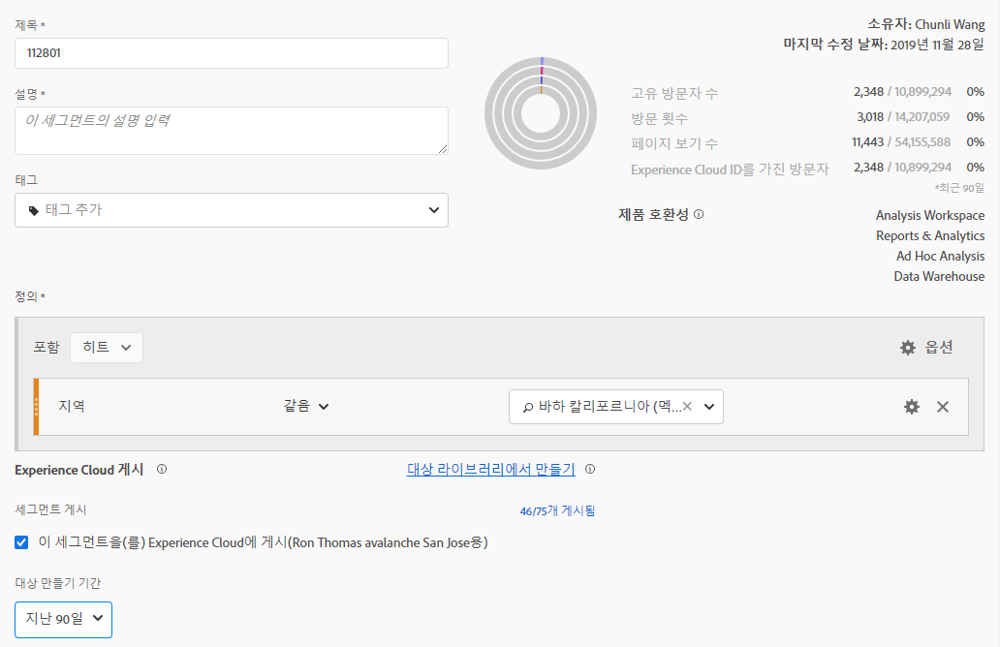

# 세그먼트 게시 {#publish-segments}

>[!CONTEXTUALHELP]
>id="components_segments_publishing"
>title="Experience Cloud 게시"
>abstract="대상자를 대상자 라이브러리에 게시하여 해당 대상자를 Target 및 기타 Experience Cloud 솔루션에서 마케팅 활동에 사용할 수 있습니다."

>[!CONTEXTUALHELP]
>id="components_segments_audiencelibrary"
>title="대상자 라이브러리"
>abstract="대상자 라이브러리에서 만든 세그먼트는 즉시 사용할 수 있으며 Analytics 업데이트에 종속되지 않습니다."

You can publish an Adobe Analytics segment to the Experience Cloud. So, you can use the segment for marketing activity in Audience Manager and in other activation channels, including Advertising, Target, and Campaign.

You can publish Analytics segments to Experience Cloud in under 8 hours. 이러한 세그먼트를 사용하여 Audience Manager의 대상자를 모든 다운스트림 대상으로 활성화합니다.

>[!BEGINSHADEBOX]

데모 비디오는  [세그먼트 게시](https://experienceleague.adobe.com/en/docs/analytics-learn/tutorials/integrations/experience-cloud/improved-experience-cloud-audience-publishing){target="_blank"}를 참조하십시오.

>[!ENDSHADEBOX]

>[!NOTE]
>
>Adobe Campaign (Classic 및 Standard)은 8시간 지연 외에 24시간 추가적인 지연을 발생시킨다는 점에서 다르게 동작합니다.

## 사전 요구 사항

* Ensure that the report suite that you are saving this segment to is [enabled for Experience Cloud](/help/components/segmentation/segmentation-workflow/seg-publish.md). Otherwise, you cannot publish it to Experience Cloud.
* 조직이 Experience Cloud ID를 사용하고 있는지 확인합니다.
* 세그먼트를 게시하려면 먼저 관리자가 [Admin Console의](https://experienceleague.adobe.com/ko/docs/core-services/interface/administration/admin-tool-experience-cloud) 제품 프로필에 [!UICONTROL 세그먼트 게시] 권한을 할당하고 사용자를 제품 프로필에 추가해야 합니다.

## 고려 사항

* **보고서 세트 제한**: 보고서 세트당 최대 75개의 세그먼트를 게시할 수 있습니다. 이 제한은 강제 적용됩니다. 이미 75개의 세그먼트를 게시한 경우 75개 임계값 아래가 되도록 세그먼트 게시를 취소해야 추가 세그먼트를 게시할 수 있습니다.
* **멤버십 제한**: Adobe Analytics에서 [!DNL Experience Cloud]로 공유한 대상자는 2천만 명의 고유 구성원을 초과할 수 없습니다.
* **데이터 개인정보**: 대상자는 방문자의 인증 상태에 따라 필터링되지 않습니다. 방문자는 인증되지 않음 및 인증됨 상태의 사이트를 검색할 수 있습니다. 방문자가 인증되지 않은 경우 발생하는 작업으로 인해 여전히 방문자가 대상에 포함될 수 있습니다. 대상자를 공유할 때 파생되는 전반적인 개인정보 문제를 이해하려면 [Adobe Experience Cloud 개인정보 보호](https://www.adobe.com/kr/privacy/experience-cloud.html)를 검토하십시오.
* **과(와) [!DNL Adobe Analytics]의 세그먼트 간[!DNL Audience Manager]**&#x200B;차이점에 대한 논의는 [Analytics 및 Audience Manager의 세그먼트 이해](/help/integrate/c-audience-analytics/aam-analytics-segments.md)를 참조하십시오.

## 세그먼트 게시 타임라인

| 사용 가능한 사항 | 사용 가능한 시기 | 사용 가능한 위치 |
|---|---|---|
| 메타데이터 (세그먼트 제목 및 정의) | 게시 후 즉시 | [!DNL Audience Manager], [!UICONTROL Experience Cloud 대상자 라이브러리], [!DNL Target] |
| 멤버십이 있는 사용 가능한 세그먼트 | 게시 후 8시간까지 | [!DNL Audience Manager]의 방문자 프로필 뷰어 |
| 트레이트 및 멤버십 인구 | 24-48시간 이내 | [!DNL Audience Manager] |

>[!NOTE]
>Once a week, all data is fully synced to account for any deltas or discrepancies not captured in the previous week.

## Publish segments in [!UICONTROL Segment builder]

1. Adobe Analytics에서 **[!UICONTROL 구성 요소]** > **[!UICONTROL 세그먼트]**(으)로 이동
1. 새 세그먼트를 만들려면 **[!UICONTROL 추가]**&#x200B;를 선택하십시오.
   
1. 세그먼트의 제목과 설명을 입력합니다. 이러한 필드는 세그먼트를 저장하기 전에 필요합니다.
1. In the **[!UICONTROL Experience Cloud publishing]** section, select the option **[!UICONTROL Publish this segment to the Experience Cloud (for *report suite*)]**.

   >[!IMPORTANT]
   >
   >Experience Cloud 숫자를 Audience Manager 숫자와 비교할 때 **[!UICONTROL 고유 방문자 수]** 대신 **[!UICONTROL 데이터 미리 보기]**&#x200B;에서 **[!UICONTROL Adobe Analytics ID를 가진 방문자 수]**&#x200B;를 모니터링해야 합니다.
   >

| 요소 | 설명 |
|---|---|
| **[!UICONTROL Publish this segment to the Experience Cloud (for *report suite*)]** | When this option is enabled, the segment title and definition are shared with Experience Cloud instantaneously, while the segment membership is evaluated and shared every 4 hours.   예를 들어 해당 대상자가 [!DNL Target]의 활동과 연결되면 [!DNL Analytics]에서는 해당 Experience Cloud 및 [!DNL Target] 대상자의 자격을 규정하는 방문자용 ID를 전송하기 시작합니다. At that point, the audience name and corresponding data begin displaying on the [!DNL Audience Library] page in Experience Cloud.   |
| **[!UICONTROL 대상자 만들기 기간]** | The time frame that you select is used to create the audience on a rolling-calendar basis. For example, **[!UICONTROL Last 30 days]** (default) includes visitors that have qualified for the audience over the last 30 days from today&#39;s date (NOT from the original date when the segment was created). |
| **[!UICONTROL 대상자 라이브러리에서 만들기]** | The segments that you create and publish can be made available without latency on the [!DNL Audience Library] page in Experience Cloud. 이러한 세그먼트는 Analytics 업데이트에 종속되지 않으며, 75개의 게시된 세그먼트라는 제한 계산에 포함되지 않습니다. |
| **[!UICONTROL 75개 중 x개가 게시됨]** | Experience Cloud에 게시한 세그먼트 수입니다. 게시된 세그먼트 목록과 관련 보고서 세트 및 소유자를 보려면 링크를 클릭하십시오. |
| **[!UICONTROL 저장]** | 이 세그먼트를 저장합니다. |

## 세그먼트 게시 취소 또는 삭제

>[!CAUTION]
>
>Experience Cloud에 게시된 세그먼트를 삭제하려면 먼저 세그먼트 게시를 취소해야 합니다. 세그먼트 게시를 취소하려면 **[!UICONTROL 이 세그먼트를 Experience Cloud에 게시(*보고서 세트*용)]**&#x200B;의 선택을 취소하십시오.

>[!NOTE]
>
>Analytics(Audience Analytics의), Campaign, Advertising(핵심 서비스 및 Audience Manager 고객용) 및 기타 모든 외부 파트너(Audience Manager 고객용)와 같은 Adobe 솔루션에서 현재 사용 중인 세그먼트의 게시를 **취소할 수 없습니다**. Target에서 사용 중인 세그먼트의 게시를 **취소**&#x200B;할 수 있습니다.

## 세그먼트의 게시 상태 보기

게시 가능한 최대 Adobe Analytics 세그먼트 수는 75개입니다.

To view published segments:

1. In Adobe Analytics, go to **[!UICONTROL Components]** > **[!UICONTROL Segments]**.

1. View the **[!UICONTROL Published]** column. **[!UICONTROL Yes]** in this column indicates that the segment is published to Experience Cloud. **[!UICONTROL No]** indicates that the segment is not published.

## [!DNL Audience Manager] UUID 검색

현재 브라우저와 연결된 Adobe Audience Manager UUID를 캡처하는 방법에는 두 가지가 있습니다.

* Adobe Experience Cloud Debugger
* Native developer tool in browsers (for example, Chrome Developer Tools)

The following screenshots show you how to retrieve the Adobe Audience Manager UUID in your browser and use it in Audience Manager Visitor Profile Viewer to validate trait &amp; segment membership.

### 방법 1: Adobe Experience Cloud Debugger 사용

1. Chrome 웹 스토어에서 [Adobe Experience Cloud 디버거](/help/implement/validate/debugger.md)를 다운로드하여 설치합니다.
1. 페이지를 로드할 때 디버거를 실행합니다.
1. Audience Manager 섹션으로 스크롤하여 현재 브라우저 페이지에 설정된 Adobe Audience Manager UUID를 찾습니다
(아래 예제의 `35721780439475290181087231320657663953`)

   

### 방법 2: Chrome 개발자 도구 사용 (또는 기타 브라우저 개발자 도구)

1. 페이지를 로드하기 전에 Chrome 개발자 도구를 실행합니다.
1. 페이지를 로드하고 애플리케이션 > 쿠키를 선택합니다. Adobe Audience Manager UUID는 서드파티에서 설정해야 합니다
Demdex 쿠키(아래 예에서 [adobe.demdex.net](https://experienceleague.adobe.com/en/docs/audience-manager/user-guide/reference/demdex-calls)). 필드 demdex는 Adobe Audience Manager UUID 세트입니다
브라우저(아래 예에서 `35721780439475290181087231320657663953`)에서.

   

## Audience Manager [!UICONTROL 방문자 프로필 뷰어] 사용

[!UICONTROL 방문자 프로필 뷰어]를 로드하면 기본적으로 브라우저의 Adobe Audience Manager UUID가 사용됩니다. 다른 사용자에 대한 트레이트 인식을 확인하는 경우 UUID 필드에 UUID를 입력하고 [!UICONTROL 새로 고침]을 클릭합니다. 자세한 내용은 [방문자 프로필 뷰어](https://experienceleague.adobe.com/en/docs/audience-manager/user-guide/features/visitor-profile-viewer)를 참조하십시오.

## [!DNL Audience Manager]에서 세그먼트 트레이트 보기

In Adobe Audience Manager, the list of visitors with ECIDs for a given segment is evaluated while Analytics shares segments with Experience Cloud.

1. In [!DNL Audience Manager], go to **[!UICONTROL Audience Data]** > **[!UICONTROL Traits]** > **[!UICONTROL Analytics Traits]**. You see a folder for each Analytics reports suite that is mapped to your Experience Cloud organization. 이러한 폴더 (트레이트, 세그먼트 및 Data Sources용)는 프로필 및 대상자/사용자 핵심 서비스가 시작되거나 이 서비스에 대한 사용 권한이 제공되면 생성됩니다.
1. [!DNL Audience Manager]와 공유하려고 했던 세그먼트를 이전에 만든 보고서 세트의 폴더를 선택합니다. 만든 세그먼트/대상이 표시됩니다. 세그먼트를 공유할 때에는 [!DNL Audience Manager]에 다음의 두 가지 상황이 발생합니다.
   * 우선 데이터가 없는 트레이트가 만들어집니다. 세그먼트가 [!DNL Analytics]에 게시되고 약 8시간 후 ECID 목록이 사용할 수 있도록 준비되고 [!DNL Audience Manager] 및 다른 Experience Cloud 솔루션과 공유됩니다.

     

   * 트레이트가 하나인 세그먼트가 만들어집니다. 이 세그먼트는 세그먼트가 게시된 보고서 세트와 연결된 데이터 소스를 사용합니다.
   * 이제 트레이트 만료가 16일로 설정됩니다(이전에는 2일).

## [!DNL Adobe Target]에서 세그먼트 보기

**[!UICONTROL 이 세그먼트를 Experience Cloud에 게시]**&#x200B;하면 Adobe Target의 사용자 지정 대상 라이브러리 내에서 세그먼트를 사용할 수 있습니다. Analytics나 Audience Manager에서 만들어진 세그먼트는 Target의 활동에 사용할 수 있습니다. 예를 들어 Analytics에서 만들어진 대상자 세그먼트 및 Analytics 전환 지표에 따라 캠페인 활동을 만들 수 있습니다.

Adobe Target:

1. **[!UICONTROL 대상]**&#x200B;을 선택하세요.
1. **[!UICONTROL 대상자]** 페이지에서 [!DNL Experience Cloud]에서 가져온 대상자를 찾습니다. 이들 대상자는 [!DNL Target] 활동에서 사용할 수 있습니다.

   
