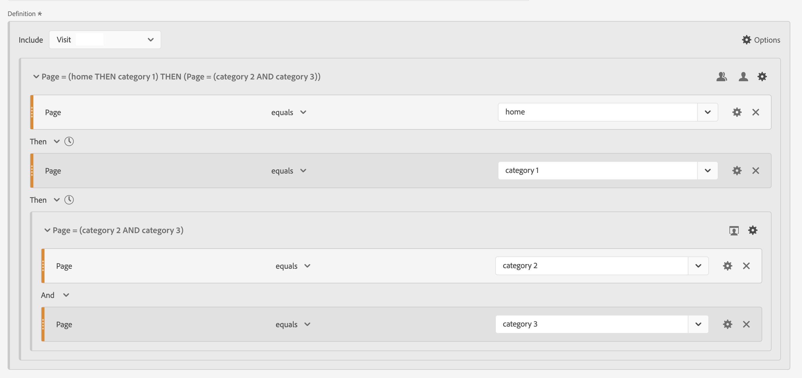
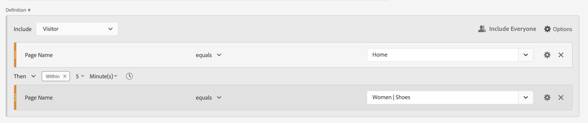
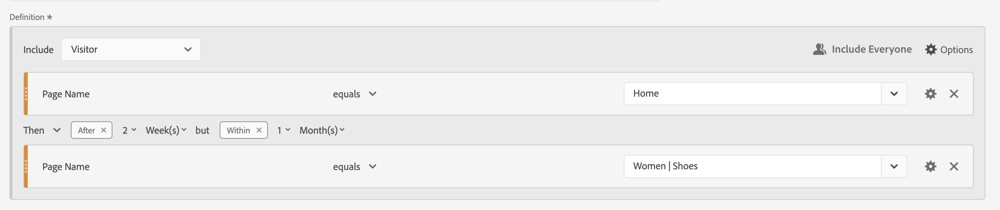
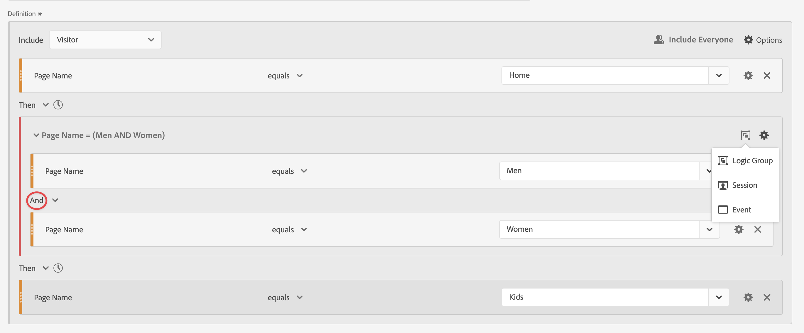

# 순차적 세그먼트

구성 요소, 컨테이너 및 구성 요소 또는 컨테이너 간에 [!UICONTROL Then] 논리 연산자를 사용하여 순차적 세그먼트를 만듭니다. [!UICONTROL Then] 논리 연산자는 한 세그먼트 조건이 발생하고 그 뒤에 다른 세그먼트 조건이 있음을 의미합니다.

또한 **[!UICONTROL After]** 및 **[!UICONTROL Within 연산자]**&#x200B;를 사용하여 순차적 세그먼트를 특정한 길이의 시간, 세부기간, 체크포인트 사이의 카운트로 제한할 수도 있습니다.

>[!BEGINSHADEBOX]

데모 비디오는  [순차적 세그먼테이션](https://video.tv.adobe.com/v/25405?quality=12&learn=on){target="_blank"}을 참조하십시오.

>[!ENDSHADEBOX]

순차적 세그먼트에는 다음과 같은 몇 가지 [기본 기능](#basics)과 순차적 세그먼트에 더 복잡성을 추가하도록 구성할 수 있는 추가 옵션이 있습니다.

## 기본 사항

순차적 세그먼트를 만드는 기본 사항은 [세그먼트 빌더](seg-build.md)를 사용하여 일반 세그먼트를 만드는 것과 다를 바 없습니다. 기본 정의나 **[!UICONTROL 세그먼테이션 빌더]**&#x200B;에서 사용하는 컨테이너에서 [Then](seg-build.md) 연산자를 선택하면 일반 세그먼트가 자동으로 순차적 세그먼트가 됩니다.

### 예

아래 예는 다양한 사용 사례에서 순차적 세그먼트를 사용하는 방법을 보여줍니다.

#### 단순 시퀀스

하나의 페이지를 본 다음 다른 페이지를 본 방문자를 식별합니다. 히트 수준 데이터는 이 시퀀스를 사용하여 세그먼트화됩니다. 이전, 과거 또는 중간 방문자 방문 횟수, 또는 방문 사이에 발생하는 페이지 보기 시간 또는 횟수에 관계 없음.

#### 방문 간 시퀀스

한 방문에서 페이지를 본 다음 다른 방문에서 다른 페이지를 본 방문자를 식별합니다. 방문 횟수를 구분하려면 컨테이너를 사용하여 시퀀스를 만들고 각 컨테이너에 대해  **[!UICONTROL 방문]** 수준을 정의하십시오.

#### 혼합 수준 시퀀스

확인되지 않은 방문 횟수에서 2개의 페이지를 본 다음 별도의 방문에서 세 번째 페이지를 본 방문자를 식별합니다. 다시 컨테이너를 사용하여 시퀀스를 만들고 별도의 방문을 정의하는 컨테이너에  **[!UICONTROL 방문]** 수준을 정의합니다.

#### 집계 시퀀스

첫 번째 방문에서 특정 페이지를 방문한 다음 나중에 다른 페이지를 방문한 방문자를 식별합니다. 히트의 시퀀스를 구분하려면 컨테이너를 사용하여  **[!UICONTROL 방문]** 컨테이너 수준에서 논리를 구분하십시오.

#### 시퀀스 중첩

방문자가 한 페이지를 다른 페이지보다 먼저 방문한 다음 두 페이지를 포함하는 후속 방문을 하는 모든 방문을 식별합니다. 예를 들어 방문자가 홈 페이지를 처음 방문한 다음 카테고리 1 페이지를 방문하고 각 방문에서 카테고리 2 및 카테고리 3 페이지를 방문한 다른 방문을 보유한 모든 방문을 식별합니다.

## [!UICONTROL 이후] 및 [!UICONTROL 내부]

 연산자에서 **[!UICONTROL Clock]**  및 **[!UICONTROL Clock]** **[!UICONTROL Within]**&#x200B;을(를) 사용하여 [시간 제약 조건](#time-constraints) 또는 [히트, 방문 또는 차원에 대한 제약 조건](#event-session-and-dimension-constraints)을 추가로 정의할 수 있습니다.

### 시간 제한

**[!UICONTROL Then]** 연산자에 시간 제약 조건을 적용하려면 다음을 수행합니다.

1. 를 선택합니다.
1. 컨텍스트 메뉴에서 **[!UICONTROL Within]** 또는 **[!UICONTROL After]**&#x200B;를 선택합니다.
1. **[!UICONTROL 년]**&#x200B;까지 기간(**[!UICONTROL 분]**, **[!UICONTROL 시간]**)을 지정하십시오.
1.  또는 **[!UICONTROL *+*]**&#x200B;을(를) 사용하여 숫자를 입력하거나 지정할 수 있는 팝업을 열려면&#x200B;**[!UICONTROL &#x200B; VDown &#x200B;]**&#x200B;**[!UICONTROL &#x200B; number &#x200B;]**&#x200B;을(를) 선택하십시오.

시간 제약 조건을 제거하려면 을(를) 사용하십시오.

아래 표에서는 시간 제한 연산자에 대해 자세히 설명합니다.

| 연산자 | 설명 |
|--- |--- |
| **[!UICONTROL 이후]** | [!UICONTROL After] 연산자는 두 체크포인트 사이의 시간에 대한 최소 한도 지정에 사용됩니다. After 값 설정 시 시간 제한은 세그먼트가 적용될 때 시작됩니다. 예를 들어, 페이지 A를 방문하지만 하루가 지날 때까지 페이지 B를 방문하러 돌아오지 않는 방문자를 파악하기 위해 [!UICONTROL After] 연산자를 컨테이너에 설정한 경우, 방문자가 페이지 A를 나갈 때 해당 날짜가 시작됩니다.  방문자가 세그먼트에 포함되려면 페이지 B를 보기 위해 페이지 A를 나간 후 최소 1440분(하루)이 지나야 합니다. |
| **[!UICONTROL 내부]** | [!UICONTROL Within] 연산자는 두 체크포인트 사이의 시간에 대한 최대 한도 지정에 사용됩니다. 예를 들어, 페이지 A를 방문한 다음 하루 안에 페이지 B를 다시 방문하는 방문자를 식별하기 위해 [!UICONTROL Within] 연산자가 컨테이너에 설정된 경우 방문자가 페이지 A를 나갈 때 해당 날짜가 시작됩니다. 세그먼트에 포함되기 위해 방문자는 페이지 B를 열기 전에 최대 하루의 시간을 갖습니다. 방문자가 세그먼트에 포함되려면 페이지 B를 보기 위해 페이지 A를 나간 후 최대 1440분(하루) 이내에 페이지 B를 열어야 합니다. |
| **[!UICONTROL 다음 이후지만]** 이내 | [!UICONTROL After] 및 [!UICONTROL Within] 연산자를 모두 사용하는 경우 두 연산자 모두 순차적이 아니라 나란히 시작하고 끝납니다.  예를 들어 컨테이너를 `After = 1 Week(s) and Within = 2 Week(s)`(으)로 설정하여 세그먼트를 만듭니다. 이 세그먼트의 방문자를 식별하는 조건은 1주와 2주 사이에만 충족됩니다. 두 조건 모두 첫 번째 페이지 보기 시부터 적용됩니다. |

#### 예

시간 제한 사용의 몇 가지 예.

##### [!UICONTROL After] 연산자

2주 후에만 한 페이지를 방문한 다음 다른 페이지를 방문한 방문자를 식별합니다. 예를 들어, 홈 페이지를 방문한 방문자는 있지만 여성은 | 2주 후에야 구두 페이지를 엽니다.

홈의 페이지 보기가 2024년 6월 1일 00:01에 있는 경우 Women 페이지에 대한 페이지 보기가 표시됩니다 | 해당 페이지 보기가 2024년 6월 15일 이후 00:01인 경우 구두는 일치합니다.

##### [!UICONTROL Within] 연산자

5분 내에 한 페이지를 방문한 다음 다른 페이지를 방문한 방문자를 식별합니다. 예를 들어 홈 페이지를 방문한 방문자와 여성을 방문한 방문자 | 5분 이내에 구두 페이지를 방문하세요.

홈의 페이지 보기가 2024년 6월 1일 12:01에 있는 경우 Women의 페이지 보기가 표시됩니다 | 해당 페이지 보기가 2024년 6월 15일 12:16 전에 발생하는 한 신발은 일치합니다.

##### [!UICONTROL After], [!UICONTROL Within] 연산자

한 페이지를 방문한 다음 2주 후, 그러나 1개월 내에 다른 페이지를 방문한 방문자를 식별합니다. 예를 들어 홈 페이지를 방문한 다음 2주 후 그리고 1개월 내에 여성을 방문한 방문자 | 신발 페이지.

 이내에 시퀀스

2024년 6월 1일에 홈 페이지를 히트하고 여성 을(를) 방문하기 위해 돌아오는 모든 방문자 | 2019년 6월 15일 이후, 그러나 2019년 7월 1일 이전에 게시된 신발 페이지는 세그먼트에 해당됩니다.:01

### [!UICONTROL 히트], [!UICONTROL 방문] 및 [!UICONTROL Dimension] 제한

 **[!UICONTROL After]** 및  **[!UICONTROL Within]** 제약 조건을 사용하면 시간 제약 조건뿐만 아니라 히트, 방문 또는 차원 제약 조건도 지정할 수 있습니다. **[!UICONTROL 히트]**, **[!UICONTROL 방문]** 또는 **[!UICONTROL 기타 차원]**  **[!UICONTROL *Dimension 이름&#x200B;*]**&#x200B;을 선택합니다. [!UICONTROL *검색*] 필드를 사용하여 차원을 검색할 수 있습니다.

#### 예

다음은 한 제품 카테고리 페이지를 방문한 방문자를 찾는 순차적 세그먼트의 예입니다 (여성) | 신발), 체크아웃 페이지(체크아웃) | Thank You) 를 참조하십시오.

다음 예제 시퀀스가 일치하거나 일치하지 않습니다.

| 시퀀스 |  |
|--- | :---: |
| `Women \| Shoes` 페이지 뒤에 `Checkout \| Thank You` 페이지가 있음 |  |
| 페이지 `Women \| Shoes`, 페이지 `Women \| Tops`, 페이지 `Checkout \| Thank You` |  |

## [!UICONTROL 포함]

순차적 세그먼트 또는 순차적 세그먼트의 일부인 순차적 컨테이너에 포함할 데이터를 지정할 수 있습니다.

### [!UICONTROL 모든 사용자] {#include_everyone}

모든 사용자를 포함하는 순차적 세그먼트를 만들려면  **[!UICONTROL 모든 사용자 포함]** 옵션을 선택하십시오.

순차적 세그먼트는 전체로서 주어진 패턴과 일치하는 데이터를 식별합니다.  다음은 하나의 제품 카테고리 페이지를 방문한 방문자를 찾는 기본 시퀀스 세그먼트의 예입니다(여성) | 신발), 체크아웃 페이지(체크아웃) | 감사합니다.) 세그먼트가  **[!UICONTROL 모든 사용자 포함]**(으)로 설정되어 있습니다.

다음 예제 시퀀스가 일치하거나 일치하지 않습니다.

| | 시퀀스 |  |
|---:|--- | --- |
| 1 | 같은 방문에서 `Women \| Shoes`, `Checkout \| Thank You` |  |
| 2 | `Women \| Shoes`, `Men \| Shoes`, `Checkout \| Thank You`(다른 방문) |  |
| 3 | `Checkout \| Thank You`, `Women \| Shoes` |  |

### [!UICONTROL 시퀀스 이전에만] 및 [!UICONTROL 시퀀스 이후에만]

 **[!UICONTROL 시퀀스 이전에만]** 및  **[!UICONTROL 시퀀스 이후에만]** 옵션은 지정된 시퀀스의 전 또는 후에 데이터를 하위 집합으로 분할합니다.

*  **Sequence 이전에만**: 시퀀스 전의 모든 데이터와 시퀀스 자체의 첫 번째 데이터를 포함합니다. 시퀀스가 데이터의 일부로 여러 번 나타나면 [!UICONTROL 시퀀스 이전에만]에 시퀀스가 마지막으로 발생했을 때의 첫 번째 히트와 그 전에 오는 모든 히트가 포함됩니다.
*  **시퀀스 이후에만**: 시퀀스 후의 모든 히트와 시퀀스 자체의 마지막 데이터를 포함합니다. 시퀀스가 데이터의 일부로 여러 번 나타나면 [!UICONTROL 시퀀스 이후에만]에 시퀀스가 처음 발생했을 때의 마지막 히트와 그 다음에 오는 모든 히트가 포함됩니다.

기준이 B로 식별되는 구성 요소 시퀀스를 지정하고, 그 다음 D로 식별되는 기준이 있는 구성 요소에 의해 시퀀스를 지정하는 정의를 생각해 보십시오. 세 가지 옵션은 다음과 같이 데이터를 식별합니다.

| B 다음에 D | A | B | C | D | E | F |
|---|:---:|:---:|:---:|:---:|:---:|:---:|
| 모든 사용자 포함 |  |  |  |  |  |  |
| 시퀀스 이전에만 |  |  |  |  |  |  |
| 시퀀스 이후에만 |  |  |  |  |  |  |

| B 그런 다음 D(여러 번 발생) | A | B | C | D | B | C | D | E |
|---|:---:|:---:|:---:|:---:|:---:|:---:|:---:|:---:|
| 모든 사용자 포함 |  |  |  |  |  |  |  |  |
| 시퀀스 이전에만 |  |  |  |  |  |  |  |  |
| 시퀀스 이후에만 |  |  |  |  |  |  |  |  |

#### 예

사이트 섹션에 대해 순차적 세그먼트의 세 가지 버전을 정의했습니다. 하나는  **[!UICONTROL 모든 사용자 포함]**, 하나는  **[!UICONTROL 시퀀스 전에만]**, 다른 하나는  **[!UICONTROL 시퀀스 후에만]** 옵션을 사용합니다. 세 세그먼트에 그에 따라 이름을 지정했습니다.

이 세 개의 세그먼트를 사용하여 사이트 섹션에 대해 보고할 때 자유 형식 테이블의 출력 예는 다음과 같습니다.

## [!UICONTROL 제외]

를 사용하여 [!UICONTROL 사용자] , [!UICONTROL 방문]  또는 [!UICONTROL 웹 페이지] **[!UICONTROL 히트]** 데이터를 구체적으로 제외하지 않으면 세그먼트 정의에 모든 데이터가 포함됩니다.

[!UICONTROL 제외]를 사용하면 일반 데이터를 무시하고 더 많은 포커스를 가진 세그먼트를 만들 수 있습니다. 또한 제외를 사용하면 특정 방문자 그룹을 제외하는 세그먼트를 만들 수 있습니다. 예를 들어 주문을 한 방문자를 지정한 다음 해당 방문자 그룹을 제외하여 *비구매자*&#x200B;를 식별하는 세그먼트를 정의할 수 있습니다. 가장 좋은 방법은 특정 포함 값과 일치하는 특정 방문자를 타깃팅하기 위해 [!UICONTROL 제외]를 사용하는 대신 광범위한 정의를 사용하는 규칙을 만드는 것입니다.

제외 정의는 다음과 같습니다.

* **페이지 제외**. 세그먼트 정의를 사용하여 보고서에서 특정 페이지(예: *홈 페이지*)를 제거하고, 페이지가 `Home Page`인 히트 규칙을 만든 다음 규칙을 제외합니다. 이 정의에는 *홈 페이지*&#x200B;를 제외한 모든 페이지가 자동으로 포함됩니다.
* **참조 도메인 제외**. Google.com의 참조 도메인만 포함하고 다른 모든 도메인은 제외하는 정의를 사용합니다.
* **비구매자 파악**. 주문이 0보다 큰 경우를 파악하고 [!UICONTROL 개인]을(를) 제외합니다.

[!UICONTROL 제외]를 사용하여 방문자가 특정 방문에 속하지 않거나 특정 히트를 수행하지 않는 시퀀스를 식별할 수 있습니다. [!UICONTROL Exclude]은(는) [!UICONTROL 논리 그룹]에도 포함될 수 있습니다(아래 참조).

구성 요소가 아니라 컨테이너를 제외할 수 있습니다.

### 예

[!UICONTROL 제외] 사용 예는 아래를 참조하십시오.

#### [!UICONTROL 제외]

한 페이지를 방문하고 다른 페이지를 방문하지 않은 다음 다른 페이지를 방문한 방문자를 식별합니다.  [!UICONTROL 제외]를 사용하여 컨테이너를 제외합니다. 왼쪽의 얇은 빨간색 막대는 제외된 컨테이너를 나타냅니다.

#### 시작 시 [!UICONTROL 제외]

다른 페이지로 이동하지 않고 한 페이지를 방문한 방문자를 식별합니다. 예를 들어 구매하지 않고 체크아웃한 사람이 홈 페이지를 방문한 적이 없습니다.

#### 끝에서 [!UICONTROL 제외]

한 페이지는 방문했지만 다른 페이지는 방문하지 않은 방문자를 식별합니다. 예를 들어 홈 페이지를 방문했지만 체크아웃 페이지를 방문한 적이 없는 방문자입니다.

## [!UICONTROL 논리 그룹]

>[!NOTE]
>
>[!UICONTROL 논리 그룹]은(는) 순차적 세그먼트에서만 정의할 수 있습니다. 즉, [!UICONTROL Then] 연산자가 컨테이너 내에서 사용됩니다.

논리 그룹 컨테이너는 조건을 하나의 순차적 세그먼트 체크포인트로 그룹화할 수 있습니다. 시퀀스의 일부로서, 논리 그룹으로 식별된 컨테이너에 정의된 논리는 이전의 순차적 체크포인트 후와 다음의 순차적 체크포인트 전에 평가됩니다.

논리 그룹 자체 내의 조건은 임의의 순서로 충족될 수 있습니다. 그와 대조적으로, 비순차적 컨테이너(히트, 방문, 방문자)는 전체 시퀀스 내에서 조건을 충족할 필요가 없으므로 **[!UICONTROL Then]** 연산자와 함께 사용할 경우 직관적이지 않은 결과가 발생할 수 있습니다.

[!UICONTROL 논리 그룹]은(는) 그룹화된 조건 중 순서 없이 *여러 조건을 그룹으로 처리하도록 디자인되었습니다*. 달리 말하면, 논리 그룹 내의 조건 순서는 무관합니다.

논리 그룹을 사용하는 몇 가지 모범 사례는 다음과 같습니다.

* 순차적 체크포인트를 그룹화합니다.
* 순차적 세그먼트 구성을 단순화합니다.

### 예

다음은 논리 그룹 컨테이너를 사용하는 방법에 대한 예입니다.

#### 모든 순서

한 페이지를 방문한 다음 순서에 관계없이 다른 페이지 세트에서 각 페이지를 열람한 방문자를 식별합니다. 예를 들어, 홈 페이지를 방문한 다음 순서에 관계없이 남성 페이지, 여성 페이지 및 키즈 페이지를 각각 방문한 방문자입니다.

[!UICONTROL 논리 그룹] 없이 이 세그먼트를 만들 수 있지만 구성이 복잡하고 복잡합니다. 방문자가 볼 수 있는 모든 페이지 시퀀스를 지정합니다. 명확하게 하기 위해 첫 번째 컨테이너만 열고 를 실행하고 다른 컨테이너는 닫았습니다. 제목을 사용하여 다른 컨테이너의 콘텐츠를 파생할 수 있습니다.

아래와 같이 [!UICONTROL 논리 그룹]을 사용하여 이 세그먼트 작성을 단순화할 수 있습니다. 컨테이너에 대해  **[!UICONTROL 논리 그룹]**&#x200B;을(를) 선택하십시오.

#### 첫 번째 일치

한 페이지 또는 다른 페이지를 방문한 다음 다른 페이지를 방문한 방문자를 식별합니다. 예를 들어 방문자는 여성 페이지 또는 남성 페이지를 방문한 다음 체크아웃을 방문했습니다 | 감사 인사 페이지.

#### [!UICONTROL 제외] [!UICONTROL 및]

한 페이지를 방문한 다음 다른 페이지 세트를 명시적으로 방문하지 않았지만 다른 페이지를 방문한 방문자를 식별합니다. 예를 들어, 홈 페이지를 방문한 방문자는 남성 또는 여성 페이지를 방문하지 않았지만 키즈 페이지를 방문했습니다.

#### [!UICONTROL 제외] [!UICONTROL 또는]

한 페이지를 방문한 다음 페이지 세트의 페이지를 명시적으로 방문하지 않았으나 다른 페이지를 방문한 방문자를 식별합니다. 예를 들어, 홈 페이지를 방문한 방문자는 남성 및 여성 페이지를 방문하지 않았지만 키즈 페이지를 방문했습니다.

<!--
An example of a complex sequential segment if you want to find the visitors that 

| visit One | visit Two | visit Three |
| --- | --- | --- |
| The visitor went to the main landing page A, excluded the campaign page B, and then viewed the Product page C.| The visitor again went to the main landing page A, excluded the campaign page B, and went again to the Product page C, and then to a new page D. | The visitor entered and followed that same path as in the first and second visits, then excluded page F to go directly to a targeted product on page G. |
-->

## 마지막 예

마지막 예로, Empower Your Move 캠페인이 터치한 적이 없는 특정 제품 페이지에 대해 학습한 방문자를 식별하려고 합니다. 그리고 온라인 스토어에 첫 번째 방문에서 홈 페이지를 보았지만 남성 카테고리의 어떤 피트니스 (장비) 제품도 자세히 보지 않았습니다. 하지만 이후 바로 다음 방문에서 홈페이지를 먼저 거치지 않고 제품 페이지로 이동해 온라인 주문을 했다.

>[!MORELIKETHIS]
>
> * [AA 및 CJA에서 순차적 논리 마스터하기: THEN 소개](https://experienceleaguecommunities.adobe.com/t5/adobe-analytics-blogs/mastering-sequential-logic-in-aa-amp-cja-introduction-to-then/ba-p/738131)
