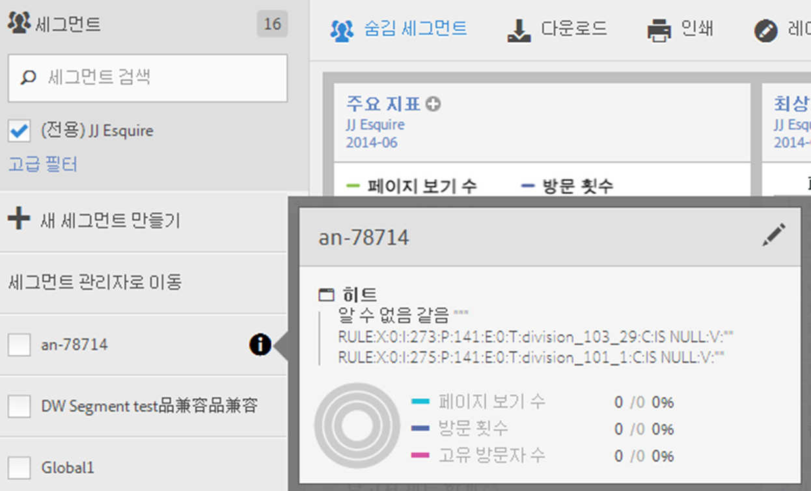
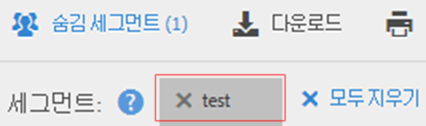

# 세그먼트 사용

Analysis Workspace에서 세그먼트를 사용하려면 구성 요소 레일의 **[!UICONTROL 세그먼트]**&#x200B;에서 하나 이상의 세그먼트를 드래그하여 놓기만 하면 됩니다.

* 패널의 모든 시각화를 세그먼트화하는 Analysis Workspace의 [panel](/help/analyze/analysis-workspace/c-panels/panels.md).
* Analysis Workspace의 [자유 형식 테이블](/help/analyze/analysis-workspace/visualizations/freeform-table/freeform-table.md)에 있는 헤더 행으로 차원을 대체합니다.
* 분류를 시작할 Analysis Workspace의 [자유 형식 테이블](/help/analyze/analysis-workspace/visualizations/freeform-table/freeform-table.md)에 있는 행입니다.
* 열을 추가 또는 교체하거나 필터를 시작할 Analysis Workspace의 [자유 형식 테이블](/help/analyze/analysis-workspace/visualizations/freeform-table/freeform-table.md)에 있는 열입니다.
* 시각화에 대한 구성 패널 또는 세그먼트를 삭제할 수 있는 패널입니다. 예를 들어 [세그먼트 비교](/help/analyze/analysis-workspace/c-panels/c-segment-comparison/segment-comparison.md) 패널 또는 [주요 지표](/help/analyze/analysis-workspace/visualizations/key-metric.md) 요약 시각화에서
* 세그먼트에 대한 [정의 빌더](/help/components/segmentation/segmentation-workflow/seg-build.md#definition-builder)이므로 세그먼트 정의에 세그먼트를 포함시킵니다.
* 계산된 지표에 대한 [정의 빌더](/help/components/c-calcmetrics/c-workflow/cm-workflow/c-build-metrics/cm-build-metrics.md#definition-builder)이므로 계산된 지표 정의에 세그먼트를 포함시킵니다.

<!--
How to apply one or more segments to a report from the segment rail.

1. Bring up the report to which you want to apply a segment, for example the [!UICONTROL Pages Report].
1. Click **[!UICONTROL Show Segments]** above the report. The segment rail opens.

   

1. Mark the checkbox next to one or more of the segments or **[!UICONTROL Search Segments]** to find the right segment.

   >[!NOTE]
   >
   >You can apply more than one segment to a report (this is called segment stacking). When multiple segments are applied, the criteria in each segment is combined using an 'and' operator and then applied. There is no limit to how many segments you can stack.

   >[!NOTE]
   >
   >Clicking the Information icon (i) next to the segment name lets you preview the key metrics to see whether you have a valid segment and how broad the segment is.

1. You can filter by report suite by selecting the **[!UICONTROL (Only) `<report suite name>`]** check box. This will show only those segments that were last saved in that report suite.
1. Click **[!UICONTROL Apply Segment]** and the report will refresh. The segment or segments that are applied now display at the top of the report:

   

-->
