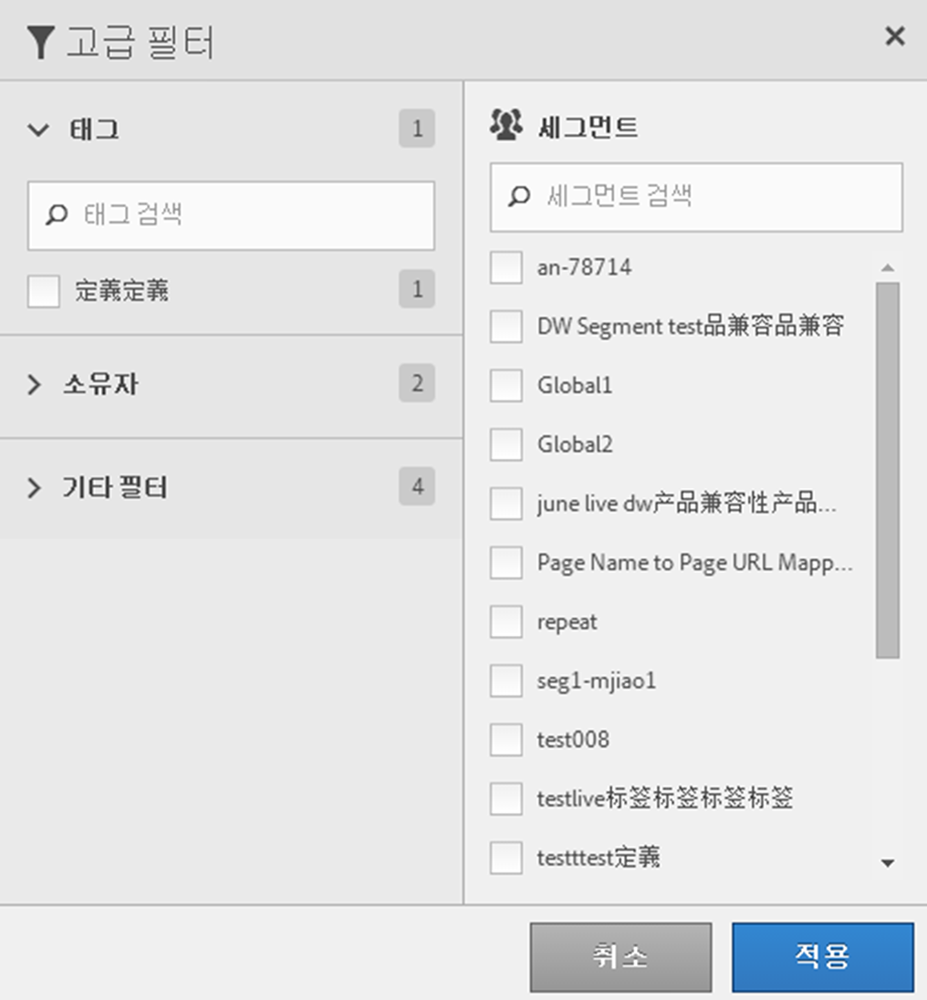

# 세그먼트 필터링

태그, 소유자 및 기타 필터 기준 필터링 (모두, 내 세그먼트, 나와 공유, 즐겨찾기 및 승인됨 표시)

필터링을 수행하면 세그먼트 레일의 세그먼트를 더 쉽게 검색할 수 있습니다.

1. 세그먼트 관리자에서 **[!UICONTROL 필터]** 아이콘을 클릭합니다. 

   

2. 다음 필터를 사용할 수 있습니다.

   | 필터 이름 | 설명 |
   |---|---|
   | 태그 | 특정 [태그](/help/components/segmentation/segmentation-workflow/seg-tag.md)가 있는 세그먼트를 필터링할 수 있습니다. 태그 열이 기본적으로 표시됩니다. |
   | 소유자 | 소유자별로 세그먼트를 필터링할 수 있습니다. |
   | 보고서 세트 | 보고서 세트별로 필터링할 수 있습니다. |
   | 기타 필터 > 모두 표시 | **(관리자만)** 모든 세그먼트, 해당 소유자 및 마지막으로 수정한 날짜가 표시됩니다. |
   | 기타 필터 > 내 소유 | 소유한 모든 세그먼트를 표시합니다. |
   | 기타 필터 > 나와 공유 | 다른 사용자가 나와 [공유](/help/components/segmentation/segmentation-workflow/t-seg-share.md)한 모든 세그먼트를 표시합니다. |
   | 기타 필터 > 즐겨찾기 | [즐겨찾기](/help/components/segmentation/segmentation-workflow/t-seg-favorite.md)(으)로 표시한 모든 세그먼트를 표시합니다. |
   | 기타 필터 > 승인됨 | 모든 공식적으로 [승인된](/help/components/segmentation/segmentation-workflow/seg-approve.md) 세그먼트를 표시합니다. |
   | 세그먼트 검색 | 이름별로 세그먼트를 검색할 수 있습니다. |
