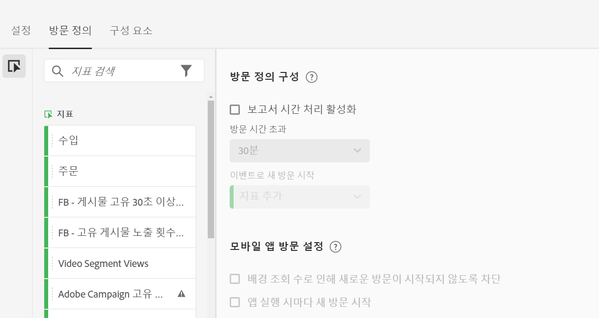
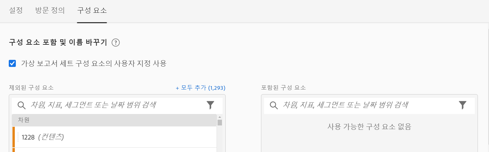

# 가상 보고서 세트 만들기

다음은 가상 보고서 세트 만들기를 시작하기 전에 주의해야 할 몇 가지 사항입니다.

* 관리자가 아닌 사용자에게는 가상 보고서 세트 관리자가 표시되지 않습니다.
* 가상 보고서 세트를 공유할 수 없습니다. &quot;공유&quot;는 그룹/권한을 통해 수행됩니다.
* 가상 보고서 세트 관리자에서는 자신의 가상 보고서 세트만 볼 수 있습니다. 다른 모든 사용자의 가상 보고서 세트를 표시하려면 &quot;모두 표시&quot;를 클릭해야 합니다.

1. **[!UICONTROL 구성 요소]** > **[!UICONTROL 가상 보고서 세트]**&#x200B;로 이동합니다.
1. **[!UICONTROL 추가를 클릭합니다 +]**.

   

## 설정 정의

[!UICONTROL 설정] 탭에서 이러한 설정을 정의한 다음 **[!UICONTROL 계속]**&#x200B;을 클릭합니다.

| 요소 | 설명 |
| --- |--- |
| 이름 | 가상 보고서 세트 이름은 상위 보고서 세트에서 상속되지 않으므로 구분해야 합니다. |
| 설명 | 비즈니스 사용자의 혜택에 대한 설명을 추가합니다. |
| 태그 | 태그를 추가하여 보고서 세트를 구성할 수 있습니다. |
| 소스 | 이 가상 보고서 세트에 다음 설정을 상속하는 보고서 세트입니다. 대부분의 서비스 수준 및 기능 (예: eVar 설정, 처리 규칙, 분류 등)이 상속됩니다. VRS에서 상속한 이러한 설정을 변경하려면 상위 보고서 세트를 편집해야 합니다 (관리 > 보고서 세트). |
| 시간대 | 시간대 선택은 선택 사항입니다. 시간대를 선택하면 VRS와 함께 저장됩니다. 시간대를 선택하지 않으면 상위 보고서 세트의 시간대가 사용됩니다.  VRS를 편집할 때 VRS와 함께 저장된 시간대가 드롭다운 선택기에 표시됩니다. 시간대 지원이 추가되기 전에 VRS가 생성된 경우 상위 보고서 세트의 시간대가 드롭다운 선택기에 표시됩니다. |
| 세그먼트 | 한 개 세그먼트를 추가하거나 세그먼트를 스택할 수 있습니다.   참고: 2개의 세그먼트를 스택할 때 AND 문으로 연결됩니다. 이것을 OR 문으로 변경할 수 없습니다. 현재 가상 보고서 세트에 사용된 세그먼트를 삭제하거나 수정하려고 하면 경고가 표시됩니다. |

## Visit Definition 정의

[!UICONTROL Visit Definition] 탭에서 이러한 설정을 정의한 다음 **[!UICONTROL 계속]**&#x200B;을 클릭합니다.

다음은 가상 보고서 세트에서 방문 정의를 조정하는 방법에 대한 비디오입니다.

>[!VIDEO](https://video.tv.adobe.com/v/23545/?quality=12)

| 요소 | 설명 |
| --- |--- |
| **방문 정의 구성** |  |
| 보고서 시간 처리 활성화 | 보고서 시간 처리를 사용하여 기본 방문 시간 초과 길이를 변경합니다. 이러한 설정은 비파괴적이며 Analysis Workspace에만 적용됩니다. [추가 정보](/help/components/vrs/vrs-report-time-processing.md) |
| 방문 시간 초과 | 새로운 방문이 자동으로 시작되기 전에 고유 방문자가 보유해야 하는 비활성의 양을 정의합니다. 방문 횟수 지표, 방문 세그먼트 컨테이너 및 방문 시 만료되는 eVar에 영향을 미칩니다. |
| 이벤트로 새 방문 시작 | 세션의 시간이 초과되었는지 여부와 상관없이 지정된 이벤트가 발생하는 경우 새 세션을 시작합니다. |
| **모바일 앱 방문 설정** | Adobe의 Mobile SDK에서 수집한 모바일 앱 조회수에 대해 방문 횟수가 정의되는 방식을 수정합니다. 이러한 설정은 비파괴적이며 Analysis Workspace에만 적용됩니다. |
| 배경 조회수로 인해 새로운 방문이 시작되지 않도록 차단 | 배경 조회수로 인해 새로운 방문이 시작되지 않고 방문 횟수 및 고유 방문자 지표가 부풀려지지 않도록 차단합니다. |
| 앱 실행 시마다 새 방문 시작 | 앱 실행이 발생하면 새 세션을 시작합니다. [추가 정보](/help/components/vrs/vrs-mobile-visit-processing.md) |

## 구성 요소를 포함하고 이름을 변경합니다

1. [!UICONTROL 구성 요소] 탭에서 이 가상 리포트 세트에 대한 구성 요소를 Analysis Workspace에서 포함, 제외 및 이름을 변경하기 위해 큐레이션을 적용할 체크박스를 선택하십시오.
VRS 큐레이션에 대한 자세한 정보는 [가상 보고서 세트 구성 요소 큐레이션](https://experienceleague.adobe.com/docs/analytics/components/virtual-report-suites/vrs-components.html#virtual-report-suites)을 참조하십시오.

1. VRS에 포함할 구성 요소(차원, 지표, 세그먼트 또는 날짜 범위)를 [!UICONTROL 포함 구성 요소] 섹션으로 끌어다 놓습니다.

1. 완료되면 **[!UICONTROL 저장]**&#x200B;을 클릭합니다.

## 데이터 미리보기

각 탭의 우측에서 이 가상 보고서 세트의 총 히트 수, 총 방문 수 및 총 방문자 수를 기존의 보고서 세트와 비교하여 미리 볼 수 있습니다.

## 제품 호환성 보기

Virtual Report Suite의 몇 가지 기능은 일부 Adobe Analytics 제품에서 지원되지 않습니다. 제품 호환성 목록을 통해 현재 가상 보고서 세트 설정을 기반으로 Adobe Analytics 내에서 지원되는 제품을 확인할 수 있습니다.
