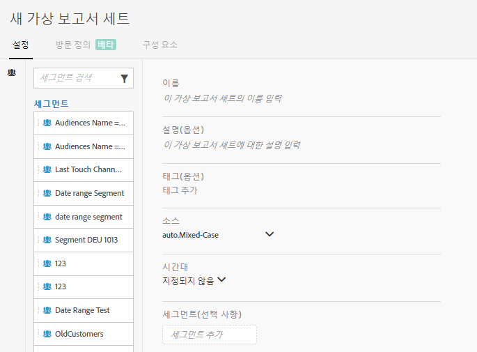

# 가상 보고서 세트 만들기

다음은 가상 보고서 세트 만들기를 시작하기 전에 주의해야 할 몇 가지 사항입니다.

* 관리자가 아닌 사용자에게는 가상 보고서 세트 관리자가 표시되지 않습니다.
* 가상 보고서 세트를 공유할 수 없습니다. "공유"는 그룹/권한을 통해 수행됩니다.
* 가상 보고서 세트 관리자에서 고유한 가상 보고서 세트만 볼 수 있습니다. 모든 사용자의 가상 보고서 세트를 표시하려면 “모두 표시”를 클릭해야 합니다.

1. **[!UICONTROL 구성 요소]** &gt; **[!UICONTROL 가상 보고서 세트로 이동합니다]**.
1. Click **[!UICONTROL Add +]**.

   

1. 다음 필드를 채웁니다.

<table id="table_0F85B56480BB46CBA5BE236BBD70156D"> 
 <thead> 
  <tr> 
   <th colname="col1" class="entry"> 요소 </th> 
   <th colname="col2" class="entry"> 설명 </th> 
  </tr> 
 </thead>
 <tbody> 
  <tr> 
   <td colname="col1"> 이름 </td> 
   <td colname="col2"> 
가상 보고서 세트 이름은 상위 보고서 세트에서 상속되지 않으므로 구분해야 합니다. 
 </td> 
  </tr> 
  <tr> 
   <td colname="col1"> 설명 </td> 
   <td colname="col2"> 
비즈니스 사용자의 혜택에 대한 설명을 추가합니다. 
 </td> 
  </tr> 
  <tr> 
   <td colname="col1"> 태그 </td> 
   <td colname="col2"> 
태그를 추가하여 보고서 세트를 구성할 수 있습니다. 
 </td> 
  </tr> 
  <tr> 
   <td colname="col1"> 그룹 </td> 
   <td colname="col2"> 
이 VRS에 대한 액세스 권한을 원하는 권한 그룹을 선택합니다. (관리 &gt; 사용자 관리 &gt; 그룹에서 그룹 권한을 관리할 수도 있습니다.) 
 </td> 
  </tr> 
  <tr> 
   <td colname="col1"> 상위 보고서 세트 </td> 
   <td colname="col2"> 
이 가상 보고서 세트에 다음 설정을 상속하는 보고서 세트입니다. 대부분의 서비스 수준 및 기능(예: eVar 설정, 처리 규칙, 분류 등)이 상속됩니다. VRS에서 상속한 이러한 설정을 변경하려면 상위 보고서 세트를 편집해야 합니다(관리 &gt; 보고서 세트). 
 </td> 
  </tr> 
  <tr> 
   <td colname="col1"> 시간대 </td> 
   <td colname="col2"> 
시간대 선택은 선택 사항입니다. 
 
시간대를 선택하면 VRS와 함께 저장됩니다. 시간대를 선택하지 않으면 상위 보고서 세트의 시간대가 사용됩니다. 
 
VRS를 편집할 때 VRS와 함께 저장된 시간대가 드롭다운 선택기에 표시됩니다. 시간대 지원이 추가되기 전에 VRS가 생성된 경우 상위 보고서 세트의 시간대가 드롭다운 선택기에 표시됩니다. 
 </td> 
  </tr> 
  <tr> 
   <td colname="col1"> 세그먼트 </td> 
   <td colname="col2"> 
한 개 세그먼트를 추가하거나 <a href="https://marketing.adobe.com/resources/help/en_US/analytics/segment/seg_stack.html" format="https" scope="external">세그먼트를 스택</a>할 수 있습니다. 
 
 
참고: 2개의 세그먼트를 스택할 때 AND 문으로 연결됩니다. 이것을 OR 문으로 변경할 수 없습니다. 
 
 
현재 가상 보고서 세트에 사용된 세그먼트를 삭제하거나 수정하려고 하면 경고가 표시됩니다. 
 </td> 
  </tr> 
 </tbody> 
</table>

