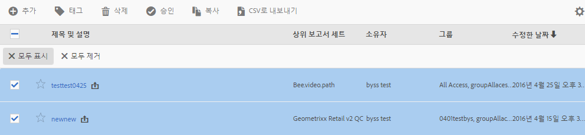

# 가상 보고서 세트 관리

가상 보고서 세트 관리자를 사용하여 관리자가 가상 보고서 세트를 편집, 추가, 태그 지정, 삭제, 이름 변경, 승인, 복사, 내보내기 및 필터링할 수 있습니다. 관리자가 아닌 사용자에게는 표시되지 않습니다.

**[!UICONTROL Analytics]** > **[!UICONTROL 구성 요소]** > **[!UICONTROL 가상 보고서 세트]**

>[!NOTE]
>
>가상 보고서 세트 관리자에서는 자신의 가상 보고서 세트만 볼 수 있습니다. 모든 사용자의 가상 보고서 세트를 표시하려면 **[!UICONTROL 모두 표시]**&#x200B;를 클릭해야 합니다.

| 작업 | 설명 |
| --- | --- |
| 이벤트가 복제되지 않도록 하면서 현재 이벤트 변수에 | 새 가상 보고서 세트를 만들 수 있는 가상 보고서 세트 빌더로 이동합니다. |
| 태그 | 모든 사용자는 가상 보고서 세트에 대해 태그를 만든 후 가상 보고서 세트에 하나 이상의 태그를 적용할 수 있습니다. 하지만 자신이 소유한 해당 가상 보고서 세트에 대한 태그만 표시됩니다. 어떤 종류의 태그를 만들어야 합니까? 다음은 유용한 태그에 대한 몇 가지 제안 사항입니다.<ul><li>팀 이름을 기반으로 하는 태그(예: 소셜 마케팅, 모바일 마케팅)</li><li>프로젝트 태그(분석 태그)(예: 시작 페이지 분석)</li><li>범주 태그: 남성용, 지역</li><li>워크플로 태그: 조정 대상(특정 비즈니스 단위), 승인됨</li></ul> |
| 삭제 | 가상 보고서 세트를 삭제하면 이 가상 보고서 세트가 적용된 예약된 보고서와 대시보드가 계속 정상적으로 작동합니다. 예약된 보고서를 다시 저장할 때까지 보고서나 대시보드는 삭제된 가상 보고서 세트를 계속 사용합니다.  예약된 보고서는 같은 이름의 가상 보고서 세트를 편집해도 업데이트되지 않습니다. 예를 들어 동일한 이름과 서로 다른 상위 보고서 세트를 가진 두 개의 가상 보고서 세트가 있다고 가정해 보십시오. 기본 제품 보고서 세트의 가상 보고서 세트를 참조하는 책갈피가 있습니다. 이 가상 보고서 세트가 중복되었기 때문에 삭제합니다. 책갈피는 삭제된 가상 보고서 세트의 정의를 참조하여 계속 실행됩니다. 나머지 가상 보고서 세트에 대한 정의를 변경해도 책갈피에 적용되는 가상 보고서 세트는 변경되지 않습니다. 이는 이전 정의를 사용합니다. 이 문제를 해결하려면 책갈피를 업데이트하여 새 정의를 참조합니다. 책갈피, 대시보드 또는 예약된 보고서가 삭제된 가상 보고서 세트를 사용하는지 확실하지 않은 경우 책갈피에 나머지 가상 보고서 세트가 사용되고 있는지를 좀 더 명확히 알 수 있도록 나머지 가상 보고서 세트의 이름을 변경할 수 있습니다. |
| 이름 변경 | 보고서 세트 선택기에서와 같이 가상 보고서 세트가 표시되는 모든 곳에 새 이름이 표시됩니다. |
| 승인/비승인 | 가상 보고서 세트를 승인하여 &quot;공식&quot; 또는 &quot;정식&quot;으로 만듭니다. 승인을 취소하여 프로세스를 되돌릴 수 있습니다. |
| 복사 | 고유한 새 보고서 세트 ID로 고유한 복사본을 만들지만, 이름과 정의는 동일합니다. |
| CSV로 내보내기 | 가상 보고서 세트 정의를 .csv 파일로 내보냅니다. |
| 필터 | 태그, 상위 보고서 세트, 소유자 및 기타 필터 (모두 표시, 내 소유, 즐겨찾기 및 승인됨)로 필터링합니다. |
