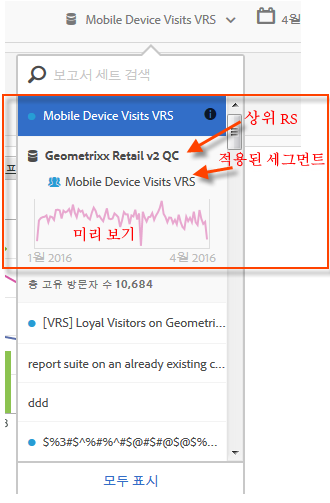

# 가상 보고서 세트 정보 보기

보고서 세트 이름 옆에 있는 i (정보) 아이콘을 클릭하여 보고서 세트에 대한 정보를 얻습니다.

## 보고서 세트 선택기에서 {#section_74E43B60C1CA4180B5ACA57574C1FA0F}

보고서 세트 선택기에서 가상 보고서 세트 옆에 있는 정보 아이콘을 클릭하면 다음 정보가 제공됩니다.

* 상위 보고서 세트의 이름입니다.
* 적용된 세그먼트의 이름입니다.
* 적용된 세그먼트가 있는 보고서 세트의 간단한 미리보기.
* 총 고유 방문자 수.

