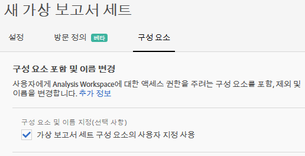
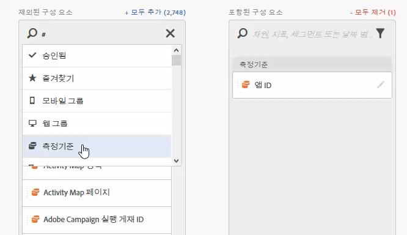
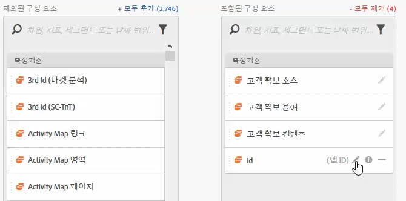
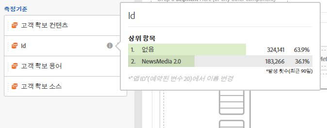

# 가상 보고서 세트 구성 요소 큐레이션

가상 보고서 세트는 Analysis Workspace에 구성 요소를 포함하거나 제외하도록 큐레이션할 수 있습니다.

>[!NOTE]
>
>구성 요소 관리자 및 관리자가 아닌 사용자가 조정된 Workspace 프로젝트 및 조정된 VRS(가상 보고서 세트)에서 볼 수 있게 변경되었습니다. 이전에는 **[!UICONTROL 모든 구성 요소 표시를 클릭하면 누구나 조정되지 않은 구성 요소를 볼 수 있었습니다]**. [업데이트된 조정 환경](https://marketing.adobe.com/resources/help/en_US/analytics/analysis-workspace/curate-projects-vrs.html)에서는 표시되는 구성 요소를 보다 세밀하게 제어할 수 있습니다.

구성 요소 큐레이션을 사용하려면 다음을 수행하십시오.

1. **[!UICONTROL Analytics]** &gt; **[!UICONTROL 구성 요소]** &gt; **[!UICONTROL 가상 보고서 세트]** &gt; 새 가상 보고서 세트 **[!UICONTROL 만들기로 이동합니다]**.
1. **[!UICONTROL 설정]**&#x200B;을 정의한 후 **구성 요소[!UICONTROL 탭을 클릭합니다.]**

1. Select the checkbox **[!UICONTROL Enable Customization of Virtual Report Suite Components]**:

   

   >[!NOTE]
   >
   >If component customization is enabled, the virtual report suite is accessible **only in Analysis Workspace** and is not accessible in the following:

   * [!UICONTROL Reports &amp; Analytics]
   * [!UICONTROL Ad Hoc Analysis]
   * [!UICONTROL 데이터 웨어하우스]
   * [!UICONTROL Report Builder]
   * Analytics 보고 API
   이 옵션을 선택하면 "제외된 구성 요소" 열의 해당 구성 요소를 "포함된 구성 요소" 열로 드래그하여 가상 보고서 세트에 포함할 구성 요소를 추가할 수 있습니다. 포함하거나 제외할 수 있는 구성 요소는 다음과 같습니다.

   * 차원
   * 지표
   * 세그먼트
   * 데이터 범위
   >[!NOTE]
   >
   >There is no need to *share* curated components (segments, calculated metrics, date ranges). 이러한 구성 요소가 공유되지 않아도 가상 보고서 세트에 대해 조정된 경우 항상 Analysis Workspace에 표시됩니다.

1. 또한 **[!UICONTROL 모두 추가를 클릭하여 구성 요소를 필터링하거나 검색하고 필터링된 전체 선택을 포함된 열에 추가할 수 있습니다]**.

   

## 구성 요소 이름 바꾸기 {#section_0F7CD9F684FE4765BC00A2AFED56550E}

가상 보고서 세트와 관련된 포함된 구성 요소의 표시 이름을 변경할 수 있습니다. 예를 들어 페이지 이름을 가상 보고서 세트에 포함하되, 모바일 친화적인 이름으로 변경하려면 앱 화면으로 변경할 수 있습니다. 이 가상 보고서 세트를 사용할 때마다 Analysis Workspace에 새 이름이 표시됩니다.

Analysis Workspace에서 포함된 구성 요소의 정보 아이콘을 클릭하여 이름이 바뀐 구성 요소의 원래 이름을 표시합니다.

## 구성 요소 그룹 {#section_483BEC76F49E46ADAAA03F0A12E48426}

구성 요소 그룹을 사용하여 가상 보고서 세트에 대량 구성 요소를 추가하십시오. 예를 들어 모바일 앱 분석과 관련된 기본 구성 요소 세트를 가져오려면 모바일 앱 그룹을 선택하십시오. 해당 차원 및 지표 세트(이미 이름이 변경됨)는 가상 보고서 세트의 포함된 목록에 자동으로 추가됩니다.

## 작업 공간 행동 {#section_6C32F8B642804C0097FCB14E21028D4A}

Analysis Workspace에서 조정에 대한 자세한 내용은 [프로젝트 조정 및 공유](https://marketing.adobe.com/resources/help/en_US/analytics/analysis-workspace/curate.html)를 참조하십시오.