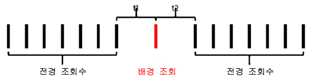

# 컨텍스트 인식 세션

가상 보고서 세트의 컨텍스트 인식 세션은 Adobe Analytics가 모바일 방문을 계산하는 방식을 변경합니다. 이 문서에서는 모바일 방문 정의 방법에 대한 배경 조회수 및 앱 실행 이벤트(모바일 SDK로 설정된 두 가지 모두)의 처리 의미에 대해 설명합니다.

기본 데이터를 변경하지 않고 원하는 방식으로 방문을 정의하여 방문자가 모바일 앱과 상호 작용하는 방식과 일치시킬 수 있습니다.

## 고객 관점 URL 매개 변수 {#section_8B298006362341E3AC16A148422D1F65}

Adobe Analytics 데이터 수집 프로세스에서 고객 관점('cp' 쿼리 문자열 매개 변수로 표시)을 지정하여 쿼리 문자열 매개 변수를 설정할 수 있습니다. 이 필드는 최종 사용자의 디지털 애플리케이션 상태를 지정합니다. 이렇게 하면 모바일 앱이 배경 상태에 있는 동안 조회수가 생성되었는지 알 수 있습니다.

## 배경 조회수 처리 {#section_D47B3161B7E145B6A32AB06E9AA03FA3}

배경 조회수는 앱이 배경 상태에서 추적 요청을 수행하면 Adobe Mobile SDK 버전 4.13.6 이상의 Analytics로 전송되는 조회수 유형입니다. 대표적인 예는 다음과 같습니다.

* 지오펜스 크로싱 중에 전송된 데이터
* 푸시 알림 상호 작용

다음 예제에서는 '배경 조회수로 새로운 방문이 시작되지 않도록 차단' 설정이 가상 보고서 세트에 대해 활성화되어 있거나 활성화되어 있지 않은 경우 방문자가 방문을 시작하고 종료하는 시점을 판단하는 데 사용되는 논리에 대해 설명합니다.

** "새 방문을 시작하지 못하게 하는 백그라운드 히트 차단" 이 활성화되지 않은 경우: **

가상 보고서 세트에 대해 이 기능이 활성화되어 있지 않으면 배경 조회수는 다른 조회수와 동일하게 처리되며, 이는 배경 조회수가 새로운 방문을 시작하고 전경 조회수와 동일하게 동작함을 의미합니다. 예를 들어 전경 조회 세트가 발생하기 전 30분(보고서 세트에 대한 표준 세션 시간 제한) 안에 배경 조회가 발생하는 경우 이 배경 조회는 세션의 일부로 수행됩니다.

전경 조회가 발생하기 30분 이상 전에 배경 조회가 발생하면 이 배경 조회에서 자체 방문을 생성하므로 총 방문 카운트는 2가 됩니다.

** "새 방문을 시작하지 못하게 하는 백그라운드 히트 차단" 이 활성화되어 있는 경우: **

다음 예제는 이 기능이 활성화되어 있을 때 배경 조회의 동작을 보여줍니다.

예 1: 일련의 전경 조회가 발생하기 일정 기간(t) 전에 배경 조회가 발생합니다.

이 예에서 *t*&#x200B;가 가상 보고서 세트의 구성된 방문 시간 제한보다 크다면 배경 조회는 전경 조회로 형성된 방문에서 제외됩니다. 예를 들어, 가상 보고서 세트 방문 시간 제한을 15분으로 설정했는데 *t*&#x200B;가 20분이었다면 이 일련의 조회(녹색 윤곽선으로 표시)로 형성된 방문에서는 배경 조회가 제외됩니다. 이는 배경 조회에 대해 '방문' 만료로 설정된 모든 eVar이 다음 방문까지 지속되지 **않으며** 방문 세그먼트 컨테이너는 녹색 윤곽선 안의 전경 조회만 포함함을 의미합니다.

반대로 *t*&#x200B;가 가상 보고서 세트의 구성된 방문 시간 제한보다 작다면 배경 조회가 마치 전경 조회(녹색 윤곽선으로 표시)인 것처럼 방문의 일부로 포함됩니다.

이는 다음을 의미합니다.

* 배경 조회에 대해 "방문" 만료로 설정된 모든 eVar는 해당 값을 이 방문의 다른 조회에 유지합니다.
* 배경 조회에 설정된 모든 값은 방문 수준 세그먼트 컨테이너 논리 평가에 포함됩니다.

두 경우 모두 총 방문 카운트는 1이 됩니다.

예 2: 일련의 전경 조회 발생 후 배경 조회가 발생하는 경우 동작은 비슷합니다.

가상 보고서 세트의 구성된 시간 제한 후 배경 조회가 발생하면 이 배경 조회는 세션(녹색 윤곽선으로 표시)의 일부가 아닙니다.

마찬가지로, 기간 *t*&#x200B;가 가상 보고서 세트의 구성된 시간 제한보다 작다면 배경 조회가 이전 전경 조회에 의해 형성된 방문에 포함됩니다.

이는 다음을 의미합니다.

* 이전 전경 조회에 대해 "방문" 만료로 설정된 모든 eVar는 이 방문에서 해당 값을 배경 조회에 유지합니다.
* 배경 조회에 설정된 모든 값은 방문 수준 세그먼트 컨테이너 논리 평가에 포함됩니다.

이전과 마찬가지로 어느 경우에도 총 방문 카운트는 1이 됩니다.

예 3: 경우에 따라 배경 조회가 발생하면 두 번의 별도 방문이 단일 방문으로 결합될 수 있습니다. 다음 시나리오에서는 일련의 전경 조회 이후에 배경 조회가 뒤따릅니다.

이 예에서 *t1*&#x200B;과 *t2* 모두가 가상 보고서 세트의 구성된 방문 시간 제한보다 작다면 *t1*&#x200B;과 *t2*&#x200B;를 합한 값이 이 방문 시간 제한보다 크더라도 이 조회가 모두 단일 방문으로 결합됩니다.

그러나 *t1*&#x200B;과 *t2*&#x200B;가 가상 보고서 세트의 구성된 시간 제한보다 크면 이 조회는 다음 두 개의 개별 방문으로 분리됩니다.

마찬가지로(이전 예에서처럼) *t1*&#x200B;과 *t2* 각각이 시간 제한보다 작으면 배경 조회가 다음과 같이 첫 번째 방문에 포함됩니다.

*t1*&#x200B;이 시간 제한보다 크고 *t2*&#x200B;가 시간 제한보다 작으면 배경 조회가 두 번째 방문에 포함됩니다.

예 4: 일련의 배경 조회가 가상 보고서 세트의 방문 시간 제한 기간 내에 발생하는 시나리오에서 이 조회수는, 방문 카운트로 계산되지 않으며 방문 세그멘테이션 컨테이너를 사용하여 방문할 수 없는 보이지 않는 "배경 방문"을 형성합니다.

비록 이것은 방문으로 간주되지 않지만 방문 만료로 설정된 모든 설정된 eVar는 이 "배경 방문"에서 해당 값을 배경 조회수에 유지합니다.

예 5: 일련의 전경 조회에 이어 여러 개의 배경 조회가 연속적으로 발생하는 시나리오에서는 배경 조회가 방문 시간 제한 기간보다 오래 방문을 유지할 수 있습니다(시간 제한 설정에 따라 다름). 예를 들어, *t1*&#x200B;과 *t2*&#x200B;가 합하면 가상 보고서 세트의 방문 시간 제한보다 크지만 개별적으로는 시간 제한보다 작을 경우에도 방문이 두 배경 조회를 모두 포함하도록 확장됩니다.

마찬가지로 일련의 전경 이벤트가 발생하기 전에 일련의 전경 조회가 발생하는 경우 비슷한 동작이 발생합니다.

배경 조회는 배경 조회 중에 설정된 eVar나 다른 변수의 속성 효과를 보존하기 위해 이러한 방식으로 동작합니다. 이렇게 되면 앱이 배경 상태에 있는 동안 수행된 작업으로 인해 후속 전경 전환 이벤트가 발생할 수 있습니다. 또한 방문 세그먼트 컨테이너는 푸시 메시지 효과를 측정하는 데 유용한 후속 전경 세션을 초래한 배경 조회를 포함할 수 있습니다.

## 방문 지표 동작 {#section_50B82618A39B454493B33B1450CCBD3E}

방문 카운트는 적어도 1회 이상의 전경 조회가 포함된 방문 카운트만을 기반으로 합니다. 이는 단절된 배경 조회나 "배경 방문"이 방문 지표에 계산되지 않음을 의미합니다.

## 방문당 체류 시간 지표 동작 {#section_0A149ABB3E034B97BD0B3A7F3EB67383}

소요된 시간은 여전히 조회와 조회 사이의 시간을 사용하여 배경 조회가 없을 때와 유사한 방법으로 계산됩니다. 하지만 방문에 배경 조회가 포함된 경우(충분히 전경 조회수만큼 발생했으므로)에는 해당 조회가 전경 조회처럼 방문당 체류 시간 계산에 포함됩니다.

## 배경 조회 처리 설정 {#section_C8B1D38C06FF4ABAAFA78CE9550C0F4B}

배경 조회 처리는 보고서 처리 시간을 사용하여 가상 보고서 세트에만 사용할 수 있으므로 Adobe Analytics에서는 보고서 처리 시간을 사용하지 않는 기본 보고서 세트에서 방문 카운트를 보존하기 위해 배경 조회를 처리하는 두 가지 방법을 지원합니다. 이 설정에 액세스하려면 Adobe Analytics 관리 콘솔로 이동하여 해당 기본 보고서 세트의 설정으로 간 다음 "모바일 관리" 메뉴를 거쳐 "모바일 애플리케이션 보고" 하위 메뉴로 이동하십시오.

1. "레거시 처리 설정": 모든 보고서 세트의 기본 설정입니다. 비보고 시간 속성 기본 보고서 세트에 관한 한, 레거시 처리를 설정된 상태로 두면 배경 조회는 처리 파이프라인의 정상적인 조회로 처리됩니다. 이것은 기본 보고서 세트에 나타나는 모든 배경 조회가 일반적인 조회로서 방문을 증가시킴을 의미합니다. 배경 조회가 기본 보고서 세트에 나타나지 않게 하려면 이 설정을 "해제"로 변경하십시오.
1. "레거시 처리 해제": 배경 조회에 대한 레거시 처리를 해제하면, 기본 보고서 세트로 보내진 모든 배경 조회는 기본 보고서 세트에 의해 무시되며 이 기본 보고서 세트에서 만든 가상 보고서 세트가 [보고서 처리 시간]을 사용하도록 구성된 경우에만 액세스할 수 있습니다. 이것은 기본 보고서 세트로 보내진 배경 조회로 캡처된 모든 데이터는 보고서 처리 시간이 활성화된 가상 보고서 세트에만 나타남을 의미합니다.

   이 설정은 기본 보고서 세트의 방문 카운트를 변경하지 않고 새로운 배경 조회 처리를 이용하려는 고객을 위한 것입니다.

어느 경우든 배경 조회는 Analytics에 전송된 다른 조회와 동일한 비용으로 청구됩니다.

## 각 앱 실행 시 새로운 방문 시작 {#section_9DA9A8B9758248A6B311EFBA06AECA80}

배경 조회 처리 외에, 가상 보고서 세트는 Mobile SDK가 앱 실행 이벤트를 전송할 때마다 새로운 방문을 시작하도록 강제할 수도 있습니다. 이 설정을 사용하면 SDK에서 앱 실행 이벤트가 전송될 때마다 열려 있는 방문이 시간 제한에 도달했는지에 관계없이 새로운 방문이 시작됩니다. 앱 실행 이벤트가 포함된 조회는 다음 방문에서 첫 번째 조회로 포함되며 방문 카운트를 증가시키고 세그멘테이션을 위한 별개의 방문 컨테이너를 생성합니다.
