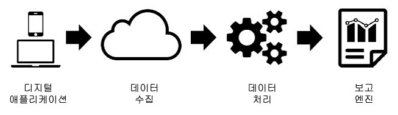
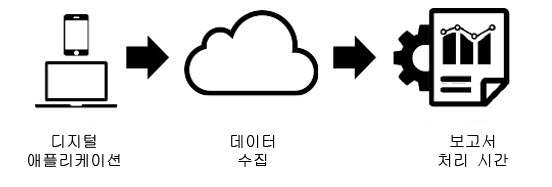

# 보고서 처리 시간

보고서 시간 처리는 데이터를 비파괴적이고 소급 방식으로 처리할 수 있는 가상 보고서 세트 설정입니다.

>[!NOTE]
>
>보고서 시간 처리는 분석 작업 공간에 대해서만 사용할 수 있습니다.

보고서 처리 시간은 가상 보고서 세트의 데이터에만 영향을 주고 기본 보고서 세트의 데이터 또는 데이터 수집에는 영향을 주지 않습니다.  보고서 처리 시간과 기존 Analytics 처리 간의 차이점은 다음 다이어그램을 사용하여 가장 잘 이해할 수 있습니다.

Analytics 데이터 처리 중 데이터는 데이터 수집 파이프라인을 통해 보고를 위한 데이터를 준비하는 사전 처리 단계로 흐릅니다. 이 사전 처리 단계는 데이터가 수집될 때 방문 만료 논리 및 eVar 지속성 논리(여러 가지 말 중에서도)를 해당 데이터에 적용합니다. 이 사전 처리 모델의 주요 단점은 데이터를 수집하기 전에 미리 구성해야 한다는 것입니다. 이것은 사전 처리 설정의 모든 변경 사항은 해당 시점부터 새 데이터에만 적용됨을 의미합니다. 데이터 도착이 잘못되거나 설정이 잘못 구성된 경우 문제가 발생합니다.

보고서 처리 시간은 보고를 위해 Analytics 데이터를 처리하는 근본적으로 다른 방법입니다. 데이터를 수집하기 전에 처리 논리를 미리 결정하는 대신 Analytics는 사전 처리 단계에서 데이터 세트를 무시하고 보고서가 실행될 때마다 이 논리를 적용합니다.

이 처리 아키텍처는 훨씬 더 유연한 보고 옵션을 제공합니다. 예를 들어 방문 시간 제한 기간을 비파괴적인 방식으로 원하는 기간으로 변경할 수 있으며 이러한 변경 사항은 데이터를 수집하기 전에 해당 설정을 적용한 것처럼 소급하여 eVar 지속성 및 세그먼트 컨테이너에 반영됩니다. 또한 기본 보고서 세트의 데이터를 변경하지 않고 동일한 기본 보고서 세트를 기반으로 각각 다양한 보고서 처리 시간 옵션이 있는 가상 보고서 세트를 원하는 만큼 만들 수 있습니다.

보고서 처리 시간을 사용하면 Analytics에서 배경 조회가 새로운 방문을 시작하지 못하도록 차단하고 [Mobile SDK](https://marketing.adobe.com/developer/get-started/mobile/c-measuring-mobile-applications)에서는 앱 실행 이벤트가 발생할 때마다 새로운 방문을 시작하도록 보고할 수 있습니다.

보고서 처리 시간이 활성화된 가상 보고서 세트에서는 현재 다음 구성 옵션을 사용할 수 있습니다.

<table id="table_C086C5FD10A84A1ABC081F5DE28F802D"> 
 <thead> 
  <tr> 
   <th colname="col1" class="entry"> 설정 </th> 
   <th colname="col2" class="entry"> 설명 </th> 
  </tr>
 </thead>
 <tbody> 
  <tr> 
   <td colname="col1"> 
 방문 시간 제한 
 </td> 
   <td colname="col2"> 
 방문 시간 제한 설정은 새 방문이 자동으로 시작되려면 먼저 고유 방문자가 활동을 하지 않아야 하는 시간의 크기를 정의합니다. 기본값은 30분입니다. 예를 들어 방문 시간 제한을 15분으로 설정하면 15분의 비활동 상태로 구분되는 수집된 일련의 조회마다 새로운 방문 그룹이 생성됩니다. 이 설정은 방문 카운트뿐 아니라 방문 세그먼트 컨테이너를 평가하는 방법 및 방문 시 만료되는 eVar에 대한 방문 만료 논리에도 영향을 줍니다. 방문 시간 제한을 줄이면 보고의 총 방문 횟수가 늘어나고 방문 시간 제한을 늘리면 보고의 총 방문 횟수가 줄어들 수 있습니다. 
 </td> 
  </tr> 
  <tr> 
   <td colname="col1"> 
 모바일 앱 방문 설정 
 </td> 
   <td colname="col2"> 
 <a href="https://www.adobe.io/apis/cloudplatform/mobile.html" format="html" scope="external">Adobe Mobile SDK</a>를 통해 모바일 앱에서 생성된 데이터가 들어 있는 보고서 세트에 대해 추가적인 방문 설정을 사용할 수 있습니다. 이 설정은 비파괴적이고 Mobile SDK를 통해 수집된 조회에만 영향을 줍니다. 또한 Mobile SDK의 외부에서 수집된 데이터에는 영향을 주지 않습니다. 
 </td> 
  </tr> 
  <tr> 
   <td colname="col1"> 
 배경 조회 수로 새로운 방문이 시작되지 않도록 차단 
 </td> 
   <td colname="col2"> 
 배경 조회수는 앱이 배경 상태일 때 Mobile SDK에 의해 수집됩니다. 
 </td> 
  </tr> 
  <tr> 
   <td colname="col1"> 
 각 앱 실행 시 새 방문 시작 
 </td> 
   <td colname="col2"> 
 방문 시간 제한 외에도 비활성 창에 관계없이 Mobile SDK에서 앱 실행 이벤트가 기록될 때마다 방문이 시작되도록 할 수 있습니다. 이 설정은 eVar의 방문 만료 논리뿐 아니라 방문 지표 및 방문 세그먼트 컨테이너에도 영향을 줍니다. 
 </td> 
  </tr> 
  <tr> 
   <td colname="col1"> 
이벤트로 새 방문 시작 
 </td> 
   <td colname="col2"> 
세션 시간이 초과되었는지 여부에 관계없이 이벤트가 발생하면 새 세션이 시작됩니다. 새로 생성된 세션에는 세션을 시작한 이벤트가 포함됩니다. 또한 여러 이벤트를 사용하여 세션을 시작할 수 있으며, 새 세션은 데이터에서 이러한 이벤트가 관찰되면 시작됩니다. 이 설정은 방문 카운트, 방문 세그멘테이션 컨테이너 및 eVar의 방문 만료 논리에 영향을 줍니다. 
 </td> 
  </tr> 
 </tbody> 
</table>

보고서 처리 시간이 기존 Analytics 보고에서 사용 가능한 모든 지표 및 차원을 지원하는 것은 아닙니다. Virtual report suites utilizing Report Time Processing are only accessible in Analysis Workspace and will not be accessible in [!UICONTROL Reports &amp; Analytics], Ad Hoc Analysis, Data Warehouse, Report Builder, Data Feeds, or the reporting API.

또한 보고서 처리 시간은 보고 날짜 범위(이하 "날짜 범위") 내에 발생하는 데이터만 처리합니다. 이것은 보고 날짜 범위 이전의 방문자에 대해 "만료 기간 제한 없음"으로 설정된 eVar 값은 보고 날짜 범위까지 지속되지 않으며 보고서에 나타나지 않음을 의미합니다. 이는 또한 고객 충성도 측정이 보고 날짜 범위 이전의 전체 기록이 아닌, 보고 날짜 범위에 있는 데이터에만 기반함을 의미합니다.

다음은 보고서 처리 시간을 사용할 때 현재 지원되지 않는 지표 및 차원 목록입니다.

<table id="table_127AFE8FA1BE4F2BAB3975CA12A2FA47"> 
 <thead> 
  <tr> 
   <th colname="col1" class="entry"> 지표/차원 이름 </th> 
   <th colname="col2" class="entry"> 보고서 처리 시간 참고 사항 </th> 
  </tr>
 </thead>
 <tbody> 
  <tr> 
   <td colname="col1"> 
 타겟 분석 
 </td> 
   <td colname="col2"> 
 현재 지원되지 않습니다. 향후 지원 계획이 있습니다. 
 </td> 
  </tr> 
  <tr> 
   <td colname="col1"> 
 Advertising Cloud 예약된 지표/차원에 대한 분석 
 </td> 
   <td colname="col2"> 
 현재 지원되지 않습니다. 향후 지원 계획이 있습니다. 
 </td> 
  </tr> 
  <tr> 
   <td colname="col1"> 
 단일 액세스 지표 
 </td> 
   <td colname="col2"> 
 현재 및 미래에 지원되지 않습니다. 
 </td> 
  </tr> 
  <tr> 
   <td colname="col1"> 
 목록 변수 
 </td> 
   <td colname="col2"> 
 현재 지원되지 않습니다. 향후 지원 계획이 있습니다. 
 </td> 
  </tr> 
  <tr> 
   <td colname="col1"> 
 카운터 eVar 
 </td> 
   <td colname="col2"> 
 현재 및 미래에 지원되지 않습니다. 
 </td> 
  </tr> 
  <tr> 
   <td colname="col1"> 
 마케팅 채널 변수 
 </td> 
   <td colname="col2"> 
 현재 지원되지 않습니다. 향후 지원 계획이 있습니다. 
 </td> 
  </tr> 
  <tr> 
   <td colname="col1"> 
 마지막 구매 이후 일 수 차원 
 </td> 
   <td colname="col2"> 
 보고서 처리 시간 날짜 범위의 특성으로 인해 이 차원은 지원되지 않습니다. 
 </td> 
  </tr> 
  <tr> 
   <td colname="col1"> 
 첫 구매까지 소요된 일 수 차원 
 </td> 
   <td colname="col2"> 
 보고서 처리 시간 날짜 범위의 특성으로 인해 이 차원은 지원되지 않습니다. 
 </td> 
  </tr> 
  <tr> 
   <td colname="col1"> 
 재방문 주기 차원 
 </td> 
   <td colname="col2"> 
 보고서 처리 시간 날짜 범위의 특성으로 인해 이 차원은 지원되지 않습니다. 
 
 세그먼트에서 방문 카운트 지표를 사용하거나 막대 그래프 보고서의 방문 지표를 사용하는 다른 방법이 가능합니다. 
 </td> 
  </tr> 
  <tr> 
   <td colname="col1"> 
 마지막 방문 이후 일 수 차원 
 </td> 
   <td colname="col2"> 
 보고서 처리 시간 날짜 범위의 특성으로 인해 이 차원은 지원되지 않습니다. 
 </td> 
  </tr> 
  <tr> 
   <td colname="col1"> 
 원래 시작 페이지 차원 
 </td> 
   <td colname="col2"> 
 보고서 처리 시간 날짜 범위의 특성으로 인해 이 차원은 지원되지 않습니다. 
 </td> 
  </tr> 
  <tr> 
   <td colname="col1"> 
 선형 할당 eVar 
 </td> 
   <td colname="col2"> 
 현재 지원되지 않습니다. 향후 지원 계획이 있습니다. 
 </td> 
  </tr> 
  <tr> 
   <td colname="col1"> 
 최초 참조 도메인 차원 
 </td> 
   <td colname="col2"> 
 현재 지원되지 않습니다. 향후 지원 계획이 있습니다. 
 </td> 
  </tr> 
  <tr> 
   <td colname="col1"> 
 방문 횟수 
 </td> 
   <td colname="col2"> 
 보고서 처리 시간 날짜 범위의 특성으로 인해 이 지표는 지원되지 않습니다. 
 
 모바일 앱에서 새 방문자와 재방문자 수에 대해 보고하려면 앱 설치 지표로 방문자 수/방문 횟수를 포함한 계산된 지표를 사용하여 새 방문자 수 또는 방문 횟수를 식별할 수 있습니다. 
 </td> 
  </tr> 
  <tr> 
   <td colname="col1"> 
 거래 ID 데이터 소스 
 </td> 
   <td colname="col2"> 
 현재 지원되지 않습니다. 향후 지원 계획이 있습니다. 
 </td> 
  </tr> 
 </tbody> 
</table>

다음은 선택한 보고서 처리 시간 설정에 따라 영향을 받는 차원 및 지표 목록입니다.

<table id="table_491E48C55BC84917B4A8EACBF04C939F"> 
 <thead> 
  <tr> 
   <th colname="col1" class="entry"> 지표/차원 이름 </th> 
   <th colname="col2" class="entry"> 보고서 처리 시간 참고 사항 </th> 
  </tr>
 </thead>
 <tbody> 
  <tr> 
   <td colname="col1"> 
 고유 방문자 수 지표 
 </td> 
   <td colname="col2"> 
 '배경 조회 수로 새로운 방문이 시작되지 않도록 차단'이 활성화되어 있으면, 고유 방문자 수는 보고 날짜 범위에 배경 조회수만 기록한 방문자를 포함하지 않습니다. 
 </td> 
  </tr> 
  <tr> 
   <td colname="col1"> 
 방문 횟수 
 </td> 
   <td colname="col2"> 
 방문 횟수는 가상 보고서 세트가 구성한 설정을 반영하며 기본 보고서 세트와는 다를 수 있습니다. 
 </td> 
  </tr> 
  <tr> 
   <td colname="col1"> 
 이벤트 ID가 있는 일련화된 이벤트 
 </td> 
   <td colname="col2"> 
 이벤트 ID와 함께 이벤트 일련화를 사용하는 이벤트는 보고서 처리 시간 날짜 범위로 인해 전역적으로 모든 날짜 또는 방문자가 아닌 한 방문자의 보고 날짜 범위 내에 발생하는 이벤트들에 대해서만 중복이 제거됩니다. 
 </td> 
  </tr> 
  <tr> 
   <td colname="col1"> 
 구매/수입/주문/단위 
 </td> 
   <td colname="col2"> 
 구매 ID가 사용된 경우 이러한 지표들은 보고서 처리 시간 날짜 범위로 인해 전역적으로 모든 날짜 또는 방문자가 아닌 한 방문자의 보고 날짜 범위 내에 발생하는 중복 구매 ID들에 대해서만 중복이 제거됩니다. 
 </td> 
  </tr> 
  <tr> 
   <td colname="col1"> 
 바운스 수/바운스 비율 
 </td> 
   <td colname="col2"> 
 '배경 조회 수로 새로운 방문이 시작되지 않도록 차단'을 활성화하면 전경 조회가 따르지 않는 배경 조회는 바운스로 간주되지 않고 바운스 비율에 기여하지 않습니다. 자세한 내용은 <a href="../../components/vrs/vrs-mobile-visit-processing.md#concept_EC51308E4FD14E149F1B5D63C0AB34BD" format="dita" scope="local"> 컨텍스트 인식 Sessionization</a> 를 참조하십시오. 
 </td> 
  </tr> 
  <tr> 
   <td colname="col1"> 
 방문 당 초 단위 체류 시간 
 </td> 
   <td colname="col2"> 
 '배경 조회 수로 새로운 방문이 시작되지 않도록 차단'을 활성화하면 전경 조회수가 포함된 방문만 이 지표에 기여합니다. 자세한 내용은 <a href="../../components/vrs/vrs-mobile-visit-processing.md#concept_EC51308E4FD14E149F1B5D63C0AB34BD" format="dita" scope="local"> 컨텍스트 인식 Sessionization</a> 를 참조하십시오. 
 </td> 
  </tr> 
  <tr> 
   <td colname="col1"> 
 방문 당 체류 시간 
 </td> 
   <td colname="col2"> 
 '배경 조회 수로 새로운 방문이 시작되지 않도록 차단'을 활성화하면 전경 조회수가 포함된 방문만 이 지표에 기여합니다. 자세한 내용은 <a href="../../components/vrs/vrs-mobile-visit-processing.md#concept_EC51308E4FD14E149F1B5D63C0AB34BD" format="dita" scope="local"> 컨텍스트 인식 Sessionization</a> 를 참조하십시오. 
 </td> 
  </tr> 
  <tr> 
   <td colname="col1"> 
 항목 
 </td> 
   <td colname="col2"> 
 '배경 조회 수로 새로운 방문이 시작되지 않도록 차단'을 활성화하면 전경 조회수가 포함된 방문의 항목만 고려됩니다. 자세한 내용은 <a href="../../components/vrs/vrs-mobile-visit-processing.md#concept_EC51308E4FD14E149F1B5D63C0AB34BD" format="dita" scope="local"> 컨텍스트 인식 Sessionization</a> 를 참조하십시오. 
 </td> 
  </tr> 
  <tr> 
   <td colname="col1"> 
 비머천다이징 eVar/예약된 eVar 
 </td> 
   <td colname="col2"> 
 eVar에 설정된 값은 보고서 시간 처리 날짜 범위로 인해 값이 보고 날짜 범위 내에 설정된 경우에만 지속됩니다. 
 
 또한 지속 시간이 일광 절약 시간 변경까지 지속되는 경우 시간 기반 만료는 한 시간 일찍 또는 한 시간 늦게 만료될 수 있습니다. 
 </td> 
  </tr> 
  <tr> 
   <td colname="col1"> 
 머천다이징 eVar/예약된 eVar 
 </td> 
   <td colname="col2"> 
 위를 참조하십시오. 
 
 또한 전환 구문의 경우, 바인딩이 '모든 이벤트'로 설정되어 있으면 '모든 조회'가 대신 사용됩니다. 
 </td> 
  </tr> 
  <tr> 
   <td colname="col1"> 
 시작 및 종료 차원 
 </td> 
   <td colname="col2"> 
 '배경 조회 수로 새로운 방문이 시작되지 않도록 차단'을 활성화하면 전경 조회가 발생한 방문의 시작 및 종료만 이 차원에 표시됩니다. 자세한 내용은 <a href="../../components/vrs/vrs-mobile-visit-processing.md#concept_EC51308E4FD14E149F1B5D63C0AB34BD" format="dita" scope="local"> 컨텍스트 인식 Sessionization</a> 를 참조하십시오. 
 </td> 
  </tr> 
  <tr> 
   <td colname="col1"> 
 조회 유형 
 </td> 
   <td colname="col2"> 
 이 차원은 조회가 전경인지 배경인지를 지정합니다. 
 </td> 
  </tr> 
 </tbody> 
</table>

