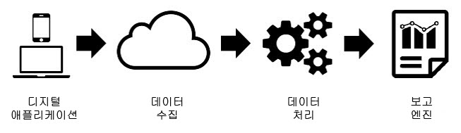
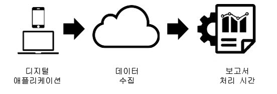

# 보고서 처리 시간

[!UICONTROL Report time processing] is a virtual report suite setting that allows data in Analysis Workspace to be processed in a non-destructive, retroactive fashion.

[!UICONTROL 보고서 처리 시간] 가상 보고서 세트의 데이터에만 영향을 주고 기본 보고서 세트의 데이터 또는 데이터 수집에는 영향을 주지 않습니다. [!UICONTROL 보고서 처리 시간]과 기존 Analytics 처리 간의 차이점은 다음 다이어그램을 사용하여 가장 잘 이해할 수 있습니다.

During Analytics data processing, data flows through the data collection pipeline and into a preprocessing step, which prepares data for reporting. 이 사전 처리 단계는 데이터가 수집될 때 방문 만료 논리 및 eVar 지속성 논리(여러 가지 말 중에서도)를 해당 데이터에 적용합니다. The primary disadvantage of this preprocessing model is that it requires any configuration be done in advance before data is collected. 이는 사전 처리 설정의 모든 변경 사항은 해당 시점부터 새 데이터에만 적용됨을 의미합니다. 데이터가 잘못된 순서로 도달하거나 설정이 잘못 구성된 경우 문제가 됩니다.

[!UICONTROL 보고서 처리 시간]은 보고를 위해 Analytics 데이터를 처리하는 근본적으로 다른 방법입니다. 데이터를 수집하기 전에 처리 논리를 미리 결정하는 대신 Analytics는 사전 처리 단계에서 데이터 세트를 무시하고 보고서가 실행될 때마다 이 논리를 적용합니다.

이 처리 아키텍처를 통해 보다 유연한 보고 옵션을 사용할 수 있습니다. For example, you can change the visit timeout period to any length of time you want in a non-destructive way and those changes are reflected in your eVar persistence and segment containers for the full reporting period. Additionally, you can create any number of virtual report suites, each with different Report Time Processing options based on the same base report suite, without altering any of the data in the base report suite.

[!UICONTROL Report Time Processing] also allows Analytics to prevent background hits from starting new visits and allows the [Adobe Experience Platform Mobile SDK](https://experienceleague.adobe.com/docs/mobile.html?lang=ko-KR) to start a new visit whenever an App Launch event is triggered.

## 구성 옵션

보고서 처리 시간이 활성화된 가상 보고서 세트에서는 현재 다음 구성 옵션을 사용할 수 있습니다.

* **[!UICONTROL 방문 시간 초과]:** 방문 시간 제한 설정은 새 방문이 자동으로 시작되기 위해 필요한 고유 방문자의 비활성 시간의 크기를 정의합니다. 기본값은 30분입니다. 예를 들어 방문 시간 제한을 15분으로 설정하면 15분의 비활동 상태로 구분되는 수집된 일련의 히트마다 새로운 방문 그룹이 생성됩니다. This setting impacts not only your visit counts, but also how visit segment containers are evaluated, and the visit expiration logic for any eVars expiring on visit. 방문 시간 제한을 줄이면 보고의 총 방문 수가 증가할 수 있지만, 방문 시간 제한을 늘리면 보고의 총 방문 수가 감소할 수 있습니다.
* **[!UICONTROL 모바일 앱 방문 설정]:** [Adobe Mobile SDK](https://experienceleague.adobe.com/docs/mobile.html?lang=ko-KR)를 통해 모바일 앱에서 생성된 데이터가 들어 있는 보고서 세트에 대해 추가적인 방문 설정을 사용할 수 있습니다. 이 설정은 비파괴적이고 Mobile SDK를 통해 수집된 히트에만 영향을 줍니다. 이러한 설정은 Mobile SDK 외부에서 수집된 데이터에는 영향을 주지 않습니다.
* **[!UICONTROL 배경 히트 수로 새로운 방문이 시작되지 않도록 차단]:** 배경 히트 수는 앱이 배경 상태일 때 Mobile SDK에 의해 수집됩니다.
* **[!UICONTROL 앱 실행 시마다 새 방문 시작]:** 방문 시간 제한 외에도 비활성 창에 관계없이 Mobile SDK에서 앱 실행 이벤트가 기록될 때마다 방문이 시작되도록 할 수 있습니다. 이 설정은 eVar의 방문 만료 논리뿐 아니라 방문 지표 및 방문 세그먼트 컨테이너에도 영향을 줍니다.
* **[!UICONTROL 이벤트로 새 방문 시작]:** 세션 시간이 초과되었는지 여부에 관계없이 이벤트가 발생하면 새 세션이 시작됩니다. The newly created session includes the event that started it. Additionally, you can use multiple events to start a session and a new session fires if any of those events are observed in the data. 이 설정은 방문 카운트, 방문 세그먼테이션 컨테이너 및 eVar의 방문 만료 논리에 영향을 줍니다.

>[!BEGINSHADEBOX]

See  [Starting a new visit with event](https://experienceleague.adobe.com/en/docs/analytics-learn/tutorials/components/virtual-report-suites/start-a-new-visit-on-any-event-in-virtual-report-suites){target="_blank"} for a demo video.

>[!ENDSHADEBOX]

## 보고서 시간 처리 제한 사항

보고서 처리 시간이 기존 Analytics 보고에서 사용 가능한 모든 지표 및 차원을 지원하는 것은 아닙니다. Virtual report suites utilizing Report Time Processing are only accessible in Analysis Workspace and is not accessible in Data Warehouse, Report Builder, Data Feeds, or the reporting API.

또한 보고서 처리 시간은 보고 날짜 범위 (이하 &quot;날짜 범위&quot;) 내에 발생하는 데이터만 처리합니다. 이는 보고 날짜 범위 이전의 방문자에 대해 &quot;만료 기간 제한 없음&quot;으로 설정된 eVar 값은 보고 날짜 범위까지 지속되지 않으며 보고서에 나타나지 않음을 의미합니다. 즉, 고객 충성도 측정은 보고 날짜 범위에 있는 데이터만을 기반으로 하며 보고 날짜 범위 이전의 전체 내역을 기반으로 하지 않습니다.

다음 차원 및 지표는 보고서 처리 시간에서 지원되지 않습니다.

* **Target용 Analytics**
* [**Advertising dimensions/metrics**](/help/components/dimensions/amo-id.md)
* **Counter eVars**
* [**Days Before First Purchase**](/help/components/dimensions/days-before-first-purchase.md)
* [**Days Since Last Purchase**](/help/components/dimensions/days-since-last-purchase.md)
* [**Days Since Last Visit**](/help/components/dimensions/days-since-last-visit.md)
* [**Entry Page Original**](/help/components/dimensions/entry-dimensions.md)
* **선형 할당 eVar**
* **목록 변수**
* [**마케팅 채널 차원**](/help/components/dimensions/marketing-channel.md)
* [**최초 참조 도메인**](/help/components/dimensions/original-referring-domain.md)
* [**반환 주기**](/help/components/dimensions/return-frequency.md)
* [**Single Access**](/help/components/metrics/single-access.md)
* **거래 ID 데이터 원본**
* [**방문 번호**](/help/components/dimensions/visit-number.md)

## 영향을 받는 차원 및 지표

다음은 선택한 보고서 처리 시간 설정에 따라 영향을 받는 차원 및 지표 목록입니다.

* 배경 히트 수로 새로운 방문이 시작되지 않도록 차단이 활성화되면 다음 변경 사항이 발생합니다. 자세한 내용은 [컨텍스트 인식 세션화](vrs-mobile-visit-processing.md)를 참조하십시오.
   * [**Bounces**](/help/components/metrics/bounces.md) / [**Bounce Rate:**](/help/components/metrics/bounce-rate.md) Background hits that are not followed by a foreground hit are not considered a bounce and do not contribute to the bounce rate.
   * [**방문 당 초 단위 체류 시간:**](/help/components/metrics/time-spent-per-visit.md) 전경 히트를 포함하는 방문만 이 지표에 기여합니다.
   * **방문 당 체류 시간:** 전경 히트를 포함하는 방문만 이 지표에 기여합니다.
   * [**Entry metric**](/help/components/metrics/entries.md) / [**Exit metric:**](/help/components/metrics/exits.md) Only entries and exits from visits with foreground hits appear in this dimension.
   * [**Entry dimension**](/help/components/dimensions/entry-dimensions.md) / [**Exit dimensions:**](/help/components/dimensions/exit-dimensions.md) Only entries and exits from visits with foreground hits appear in this dimension.
   * [**고유 방문자 수 지표:**](/help/components/metrics/unique-visitors.md) 고유 방문자 수는 보고 기간에 배경 히트 수만 기록한 방문자를 포함하지 않습니다.
* [**방문 횟수:**](/help/components/metrics/visits.md) 방문 횟수는 가상 보고서 세트가 구성한 설정을 반영하며 기본 보고서 세트와는 다를 수 있습니다.
* **이벤트 ID가 있는 일련화된 이벤트:** 이벤트 ID와 함께 이벤트 일련화를 사용하는 이벤트는 한 방문자의 보고 기간 내에 발생하는 이벤트들에 대해서만 중복이 제거됩니다. 이러한 이벤트는 보고서 처리 시간 날짜 범위로 인해 전역적으로 모든 날짜 또는 방문자에 대해서는 중복 제거되지 않습니다.
* **구매** / [**매출**](/help/components/metrics/revenue.md) / [**주문**](/help/components/metrics/orders.md) / [**단위:**](/help/components/metrics/units.md) 구매 ID가 사용되는 경우 이러한 지표는 보고서 처리 시간 날짜 범위로 인해 전역적으로 모든 날짜 또는 방문자가 아닌 한 방문자의 보고 날짜 범위 내에 발생하는 중복 구매 ID에 대해서만 중복이 제거됩니다.
* [**비머천다이징 eVars**](/help/components/dimensions/evar.md) / **예약된 eVars:** eVar에 설정된 값은 보고서 처리 시간 날짜 범위로 인해 해당 값이 보고 날짜 범위 내에 설정된 경우에만 지속됩니다. 또한 지속 시간이 일광 절약 시간 변경까지 지속되는 경우 시간 기반 만료는 한 시간 일찍 또는 한 시간 늦게 만료될 수 있습니다.
* [**Merchandising eVars**](/help/components/dimensions/evar-merchandising.md) / **reserved eVars:** See above. 또한 전환 구문의 경우, 바인딩이 &#39;모든 이벤트&#39;로 설정되어 있으면 &#39;모든 히트&#39;가 대신 사용됩니다.
* [**히트 유형:**](/help/components/dimensions/hit-type.md) 이 차원은 히트가 전경인지 배경인지를 지정합니다.
* **(낮은 트래픽) 또는 “고유 수 초과됨” 차원:** (낮은 트래픽) 라인 항목은 보고서 처리 시간을 사용할 때 약간 다르게 결정되며 기본 보고서 세트에서 보고할 때 관찰되는 항목과 일치하지 않습니다. Dimension line items that are not part of Low-traffic are not guaranteed to represent 100% of the data for that line item. These differences may become more pronounced the higher the number of unique values exist in a dimension.
