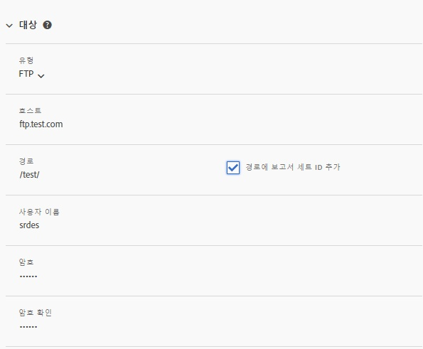
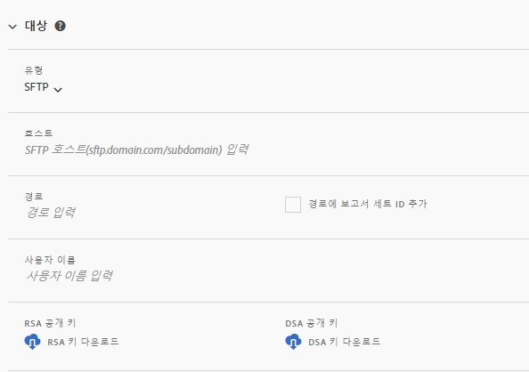
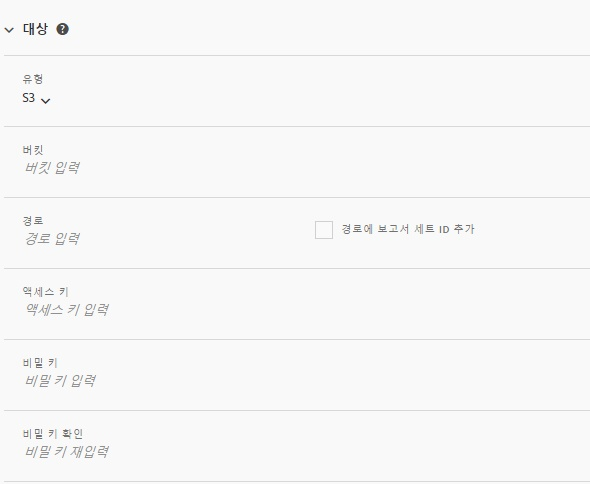
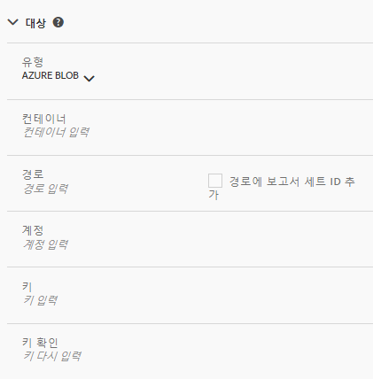

# 피드 대상

[피드 대상] 섹션에서는 피드가 배포되는 방식을 정의합니다.

네 개의 분산 채널이 있습니다.

* FTP
* SFTP
* Amazon S3
* Azure Blob

## FTP {#section_D2B521C49BDE4F91A1999FE222CF306F}

데이터 피드 데이터는 Adobe 또는 호스팅된 FTP 위치로 배달될 수 있습니다.

FTP 서버로 데이터를 업로드하도록 선택한 경우 Adobe에 적절한 사용자 이름, 암호 및 업로드 경로를 제공해야 합니다. Adobe는 서버에서 데이터를 삭제하지 않으므로 서버의 디스크 공간을 관리하기 위한 자체 프로세스를 구현해야 합니다.

## SFTP {#section_8D9215E441474D2BBC56228C2BC926E5}

데이터 피드 데이터는 Adobe 또는 호스팅된 sFTP 위치로 배달될 수 있습니다.

FTP 서버로 데이터를 업로드하도록 선택한 경우 Adobe에 적절한 사용자 이름 및 업로드 경로를 제공해야 합니다.

<!-- 

Adobe Customer Care will provide you with a Public key. Verify in recording.

 -->

Adobe는 서버에서 데이터를 삭제하지 않으므로 서버의 디스크 공간을 관리하기 위한 자체 프로세스를 구현해야 합니다.

## Amazon S3 {#section_4191CD7B8D3F419EB850B286B542C14A}

파일을 Amazon S3 버킷에 업로드할 수 있습니다. Amazon은 Amazon 서버에서 데이터를 사용하지 않을 때 자동으로 암호화합니다. 데이터를 다운로드할 때 데이터가 자동으로 암호화됩니다.

Amazon S3를 통해 데이터를 업로드하도록 선택한 경우 버킷 이름, 액세스 키 ID, 비밀 키 및 폴더 이름을 제공해야 합니다.

데이터 피드는 다음 11가지 표준 AWS 지역과 통신합니다(필요한 경우 적절한 서명 알고리즘을 사용).

* us-east-1
* us-west-1
* us-west-2
* ap-south-1
* ap-northeast-2
* ap-southeast-1
* ap-southeast-2
* ap-northeast-1
* eu-central-1
* eu-west-1
* sa-east-1

Adobe는 현재 중국, 베이징 AWS 지역(cn-north-1)을 지원하지 않습니다.

## Azure Blob {#section_1E9F1D0E7EAB4189A5D748FCA57D63D1}

Azure Blob에 파일을 업로드할 수 있습니다.

## 필드 {#section_AD54B41BC7C945DC85F5FB8FCD4A4792}

다음 표는 모든 배포 채널에 대한 모든 옵션을 보여줍니다. 사용할 수 있는 옵션은 선택한 배포 채널에 따라 달라집니다.

<table id="table_F743C620C82349D9943A13B99EA312BA"> 
 <thead> 
  <tr> 
   <th colname="col1" class="entry"> 필드 </th> 
   <th colname="col2" class="entry"> 설명 </th> 
  </tr> 
 </thead>
 <tbody> 
  <tr> 
   <td colname="col1"> 
액세스 키 
 </td> 
   <td colname="col2"> 
Amazon S3 액세스키를 입력합니다. 
 </td> 
  </tr> 
  <tr> 
   <td colname="col1"> 
버킷 
 </td> 
   <td colname="col2"> 
Amazon S3 버킷 위치를 입력합니다. 
 
이 값은 적절한 S3 버킷 형식과 일치해야 합니다. (See <a href="https://docs.aws.amazon.com/awscloudtrail/latest/userguide/cloudtrail-s3-bucket-naming-requirements.html" format="html" scope="external"> https://docs.aws.amazon.com/awscloudtrail/latest/userguide/cloudtrail-s3-bucket-naming-requirements.html</a>.) 
 
 
참고: Amazon S3 설정에 대한 자세한 내용은 아래의 <a href="../../../export/analytics-data-feed/feed-troubleshooting.md#section_6797EBBB7E6D44D4B00C7AEDF4C2EE1D" format="dita" scope="local">Amazon S3 데이터 피드에 대한 BucketOwnerFullControl 설정</a>을 참조하십시오. 
 
 </td> 
  </tr> 
  <tr> 
   <td colname="col1"> 
컨테이너 
 </td> 
   <td colname="col2"> 
Azure Blob 컨테이너 이름을 입력합니다. 
 </td> 
  </tr> 
  <tr> 
   <td colname="col1"> 
 호스트 
 </td> 
   <td colname="col2"> 
FTP 또는 SFTP 호스트 위치를 지정합니다. 
 
이 값은 적절한 ftp/sftp 형식, <code>ftp.domain.com/subdomain</code> 또는 <code>sftp.domain.com/subdomain</code>을 준수해야 합니다. 
 
 FTP와 sFTP에 대한 표준 포트 21 및 22는 필수입니다. 
 </td> 
  </tr> 
  <tr> 
   <td colname="col1"> 
암호 
 
암호 확인 
 </td> 
   <td colname="col2"> 
FTP 암호를 입력합니다. 다시 입력하여 확인합니다. 
 </td> 
  </tr> 
  <tr> 
   <td colname="col1"> 
경로 
 </td> 
   <td colname="col2"> 
호스트 또는 버킷의 경로를 선택합니다. 이 경로는 피드를 만들기 전에 있어야 합니다. 
 
 
참고: Amazon S3 설정에 대한 자세한 내용은 아래의 <a href="../../../export/analytics-data-feed/feed-troubleshooting.md#section_6797EBBB7E6D44D4B00C7AEDF4C2EE1D" format="dita" scope="local">Amazon S3 데이터 피드에 대한 BucketOwnerFullControl 설정</a>을 참조하십시오. 
 
 </td> 
  </tr> 
  <tr> 
   <td colname="col1"> 
계정 
 </td> 
   <td colname="col2"> 
 Azure 저장소 계정을 입력합니다. 
 </td> 
  </tr> 
  <tr> 
   <td colname="col1"> 
공개 키 
 </td> 
   <td colname="col2"> 
SFTP 공개 키를 제공합니다. 
 
SFTP 저장소를 설정하려면 공개 키를 다운로드해야 합니다. 
 
 
참고: 피드를 만들 때는 공개 키 다운로드가 필요하지 않습니다. 
 
 
이전 피드를 만들 때 이미 다운로드한 공개 키를 사용할 수 있습니다. 
 
자세한 내용은 <a href="https://marketing.adobe.com/resources/help/en_US/whitepapers/ftp/ftp_sftp_dw.html" format="html" scope="external">https://marketing.adobe.com/resources/help/ko_KR/whitepapers/ftp/ftp_sftp_dw.html</a>을 참조하십시오. 
 </td> 
  </tr> 
  <tr> 
   <td colname="col1"> 
키 
 
키 확인 
 </td> 
   <td colname="col2"> 
 저장소 액세스 키를 입력합니다. 확인하려면 다시 입력합니다. 
 
 
참고: 액세스 키에 액세스하려면 <a href="https://docs.microsoft.com/en-us/azure/storage/common/storage-create-storage-account#view-and-copy-storage-access-keys" format="https" scope="external">https://docs.microsoft.com/ko-kr/azure/storage/common/storage-create-storage-account#view-and-copy-storage-access-keys</a>를 참조하십시오. 
 
 </td> 
  </tr> 
  <tr> 
   <td colname="col1"> 
비밀 키 
 
비밀 키 확인 
 </td> 
   <td colname="col2"> 
Amazon S3 비밀 키를 입력합니다. 다시 입력하여 확인합니다. 
 </td> 
  </tr> 
  <tr> 
   <td colname="col1"> 
유형 
 </td> 
   <td colname="col2"> 
대상 유형을 선택합니다. 
 
 
     <ul id="ul_B893EEDA73A34DE0AEB8570BE9027F21"> 
      <li id="li_325546FCEB404C50AA6829573CCA340B">FTP(기본값) </li> 
      <li id="li_6A2C03115903484797485D073A610607">AmazonS3 </li> 
      <li id="li_C24540F6FCD24702B7693A515CEBE977">SFTP </li> 
      <li id="li_8E03CA78E7FE427C9F6F8B112BC76266">Azure Blob </li> 
     </ul> 
 
대상 유형을 선택한 후, 필드 목록이 선택한 대상에 대해 사용할 수 있는 옵션을 반영하도록 변경됩니다. 
 </td> 
  </tr> 
  <tr> 
   <td colname="col1"> 
사용자 이름 
 </td> 
   <td colname="col2"> 
FTP 사용자 이름을 입력합니다. 
 </td> 
  </tr> 
 </tbody> 
</table>

