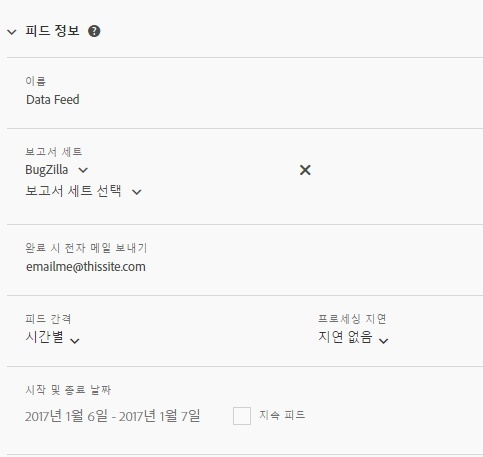

# 피드 정보

[피드 정보] 섹션을 사용하여 피드의 이름을 지정하고, 피드 실행에 사용할 보고서 세트를 지정하고, 피드 반복을 파악하고, 피드가 시작되고 끝나는 때를 지정합니다.

<table id="table_C98C7C3CE4194BEF819E792793EBC517">
 <thead>
  <tr>
   <th colname="col1" class="entry"> 필드 </th>
   <th colname="col2" class="entry"> 설명 </th>
  </tr>
 </thead>
 <tbody> 
  <tr> 
   <td colname="col1"> 
이름(필수) 
 </td>
   <td colname="col2"> 
피드 이름을 입력합니다. 
 
이름은 선택된 보고서 세트 내에서 고유해야 하며 길이는 최대 255자일 수 있습니다. 
 </td>
  </tr>
  <tr>
   <td colname="col1"> 
보고서 세트(필수) 
 </td>
   <td colname="col2"> 
피드 쿼리에 대한 보고서 세트를 지정합니다. 
 
하나 이상의 보고서 세트를 선택해야 합니다. 동일한 보고서 세트를 두 번 나열할 수 없습니다. 
 
로그인한 사용자가 사용할 수 있는 모든 비가상 보고서 세트를 사용할 수 있습니다. 
</td>
  </tr>
  <tr>
   <td colname="col1"> 
완료 시 전자 메일 보내기(필수) 
 </td>
   <td colname="col2"> 
피드 배달 업데이트를 받을 이메일 수신자를 지정합니다. 
 
이 필드는 비워둘 수 없습니다. 형식이 올바로 지정된 이메일 주소를 포함해야 합니다. 
 </td>
  </tr>
  <tr>
   <td colname="col1"> 
피드 간격(필수) 
 </td>
   <td colname="col2"> 
예약 반복을 지정합니다. 
 
참고: 데이터 피드 zip 파일의 잠재적인 크기를 고려하여 ETL 프로세스에서 64비트 zip 유틸리티를 사용하는지 확인하십시오. 
 </td>
  </tr>
  <tr>
   <td colname="col1"> 
프로세싱 지연(선택 사항) 
 </td>
   <td colname="col2"> 
각 예약 인스턴스에 적용할 지연을 지정합니다. 
 </td>
  </tr>
  <tr>
   <td colname="col1"> 
시작 및 종료 날짜(필수) 
 
지속 피드(선택 사항) 
 </td>
   <td colname="col2"> 
피드가 시작되는 날짜와 종료되는 날짜를 예약합니다. 
 

     <ul id="ul_509977336CD34032924B48E043E8CBC7">
      <li id="li_BFB5B6ADCB184D839C9BA42DB3DCAF32">시작 날짜: 오늘 날짜를 기본값으로 지정 </li>
      <li id="li_34F8DB45D9B54076840D1A0B782812D3">종료 날짜: 내일 날짜를 기본값으로 지정 </li>
     </ul>
     
 </td>
  </tr>
 </tbody>
</table>