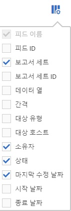

# 열 정렬

사용할 수 있는 열을 결정하고 필요에 따라 정렬할 수 있습니다.

1. To determine which columns are visible, click the **[!UICONTROL Columns Configuration]** button.

   

1. 열을 정렬하려면 열 헤더를 클릭합니다.

   알파벳 열은 알파벳 순으로 정렬됩니다. 역 알파벳 순으로 정렬하려면 헤더를 클릭합니다.

   숫자 열은 숫자 순으로 정렬됩니다. 오름차순과 내림차순 정렬 간에 전환하려면 헤더를 클릭합니다.
