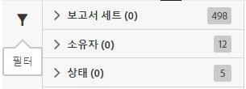

# 검색 및 필터

검색 및 필터링은 목록에서 피드를 찾는 데 도움이 됩니다.

1. [필터링] 아이콘을 클릭하거나 마우스로 가리켜 필터링 옵션을 봅니다. 

   

   다음 세 가지 사용 가능한 필터링 옵션이 있습니다.

   * 보고서 세트
   * 소유자
   * 상태

1. 검색어를 입력하여 피드 목록을 검색합니다.

   

필터링과 검색을 결합하면 피드를 찾는 데 도움이 될 수 있습니다. 결합된 필터는 AND 연산자로 결합됩니다.
