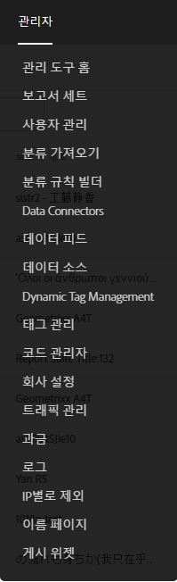
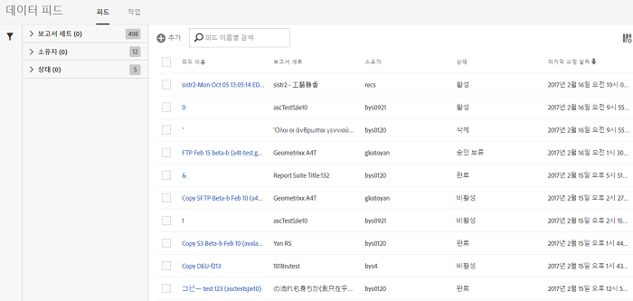

# 데이터 피드 인터페이스 열기

데이터 피드 사용자 인터페이스는  [관리] 탭에서 액세스할 수 있습니다.

1. [관리] 탭을 엽니다. 
1. **[!UICONTROL 데이터 피드를 선택합니다]**.

   

데이터 피드 랜딩 페이지에는 해당 회사에 대해 현재 정의되어 있으며 관리자 사용자가 액세스할 수 있는 모든 보고서 세트에 대한 모든 피드가 나열됩니다.

설정된 피드가 없을 경우, 페이지에 **[!UICONTROL 새 데이터 피드 만들기]단추가 표시됩니다.**

[작업을](../../../export/analytics-data-feed/c-data-feed-actions/t-feed-job-history.md#task_0D05F2D1B41B4E4A95B570DC78014480)보려면 **[!UICONTROL [작업]**] 를 클릭합니다. 피드 보기로 돌아가려면 **[!UICONTROL 피드를 클릭합니다]**.