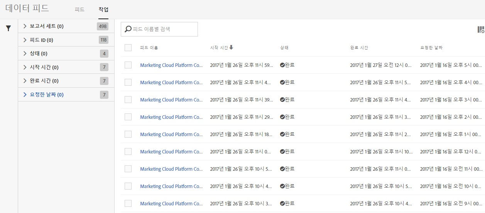
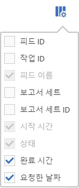

# 데이터 피드 작업 - 개요

[작업] 탭을 사용하여 작업 내역을 보고 작업 관리 작업을 수행합니다.

작업 목록에서는 작업 상태, 작업이 시작되는 때와 완료되는 때, 작업 실행에 걸린 시간 등과 같은 정보를 제공합니다.

열 제목을 클릭하여 작업이 표시되는 순서를 전환합니다.

작업 목록에 표시할 정보를 설정하려면 [설정] 아이콘을 클릭하고 원하는 열 이름을 선택하십시오.

피드 이름, 시작 시간 및 상태는 필수 열이며 작업 목록에서 제거할 수 없습니다.

| 열 | 설명 |
|---|---|
| 피드 ID | 피드의 고유 식별자. |
| 작업 ID | 작업의 고유 식별자. |
| 피드 이름 | 피드의 이름. |
| 시작 시간 | 작업의 시작 이름. 해당 시간대로 표시됨. |
| 실행 시간 | 작업을 실행하는 데 필요한 시간의 양. dd hh:mm:ss로 표시됨. |
| 상태 | 작업의 현재 [상태](../../../export/analytics-data-feed/c-df-jobs/r-job-status.md#reference_7A39A327F643447F9B5AE3A2502C72BA). |
| 완료 시간 | 작업이 실행을 완료한 시간. 해당 시간대로 표시됨. |
| 요청한 날짜 | 작업에 들어 있는 데이터의 데이터 스탬프. |

