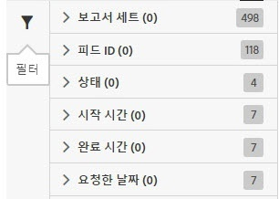

# 작업 목록 필터링

검색 및 필터링은 목록에서 작업을 찾는 데 도움이 됩니다.

1. [필터링] 아이콘을 클릭하거나 마우스로 가리켜 필터링 옵션을 봅니다. 

   

   다음 몇 가지의 사용 가능한 필터링 옵션이 있습니다.

   * 보고서 세트
   * 피드 ID
   * 상태
   * 시작 시간
   * 완료 시간
   * 요청한 날짜

1. 검색어를 입력하여 [작업] 목록을 검색합니다.

   

필터링과 검색을 결합하면 작업을 찾는 데 도움이 될 수 있습니다. 여러 필터 및 검색어는 AND 연산으로 결합됩니다.
