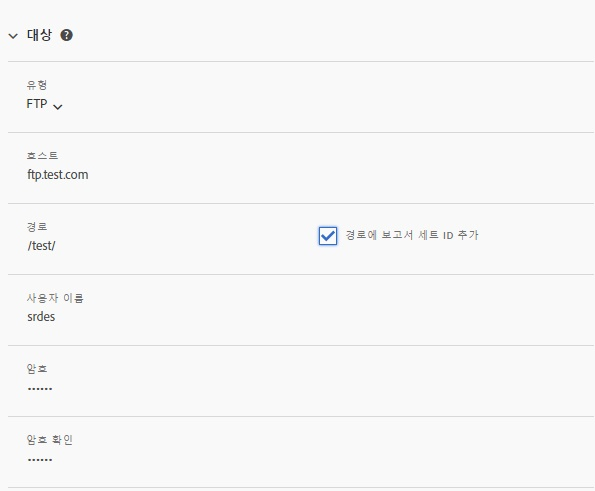
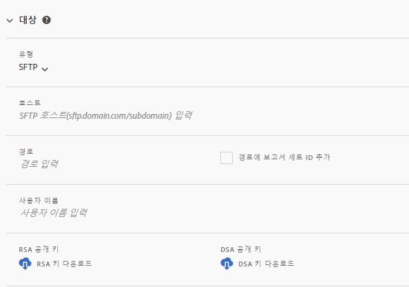
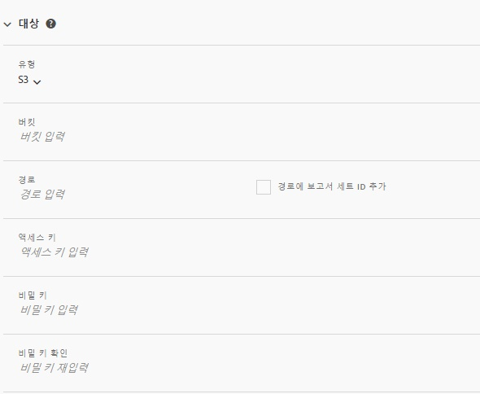
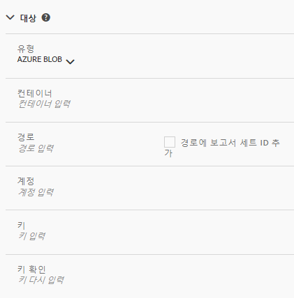

# 데이터 피드 만들기 또는 편집

데이터 피드를 만들면 Adobe에서 Raw 데이터 파일을 보낼 위치와 각 파일에 포함할 내용을 알 수 있습니다. 이 페이지에는 데이터 피드를 만들 때 사용자 지정할 수 있는 개별 설정이 나열됩니다.

이 페이지를 읽기 전에 데이터 피드에 대한 기본 지식이 권장됩니다. 데이터 [피드 개요를](data-feed-overview.md) 참조하여 데이터 피드 만들기 요구 사항을 충족하는지 확인하십시오.

## 피드 정보 필드

* **이름**:데이터 피드의 이름입니다. 선택한 보고서 세트 내에서 고유해야 하며 최대 255자까지 가능합니다.
* **** 보고서 세트:데이터 피드의 기반이 되는 보고서 세트입니다. 동일한 보고서 세트에 대해 여러 데이터 피드를 만드는 경우 열 정의가 달라야 합니다. 소스 보고서 세트만 데이터 피드 지원;가상 보고서 세트는 지원되지 않습니다.
* **완료**&#x200B;시 이메일:피드의 처리가 완료되면 알림을 받을 이메일 주소입니다. 이메일 주소 형식이 올바르게 지정되어야 합니다.
* **피드 간격**:시간별 피드에는 1시간 분량의 데이터가 포함됩니다. 일별 피드에는 하루 분량의 데이터가 포함됩니다.
* **처리 지연**:데이터 피드 파일을 처리하기 전에 지정된 시간을 기다립니다. 지연은 모바일 구현에서 오프라인 장치를 온라인 상태로 전환하여 데이터를 전송할 수 있는 기회를 제공하는 데 유용합니다. 또한 이전에 처리된 파일을 관리할 때 조직의 서버측 프로세스를 수용하기 위해 사용할 수 있습니다. 대부분의 경우 지연이 필요 없습니다. 피드는 최대 120분 정도 지연될 수 있습니다.
* **시작 및 종료 날짜**:시작 날짜는 데이터 피드를 원하는 첫 번째 날짜를 나타냅니다. 이전 날짜에서 이 날짜를 설정하면 내역 데이터에 대한 데이터 피드 처리가 즉시 시작됩니다. 피드는 종료 날짜가 될 때까지 계속 처리합니다.
* **연속 피드**:이 확인란을 선택하면 종료 날짜가 제거되므로 피드가 무기한 실행될 수 있습니다. 피드가 내역 데이터 처리를 완료하면 피드는 지정된 시간 또는 일 동안 데이터 수집을 마칩니다. 현재 시간 또는 일이 끝나면 지정된 지연 후 처리가 시작됩니다.

## 대상 필드

대상 필드에서 사용할 수 있는 필드는 대상 유형에 따라 다릅니다.

### FTP

데이터 피드 데이터는 Adobe 또는 호스팅된 FTP 위치로 배달될 수 있습니다. FTP 호스트, 사용자 이름 및 암호가 필요합니다. 경로 필드를 사용하여 폴더에 피드 파일을 배치합니다. 폴더가 이미 있어야 합니다.지정된 경로가 없으면 피드에서 오류가 발생합니다.

### SFTP

데이터 피드에 대한 SFTP 지원을 사용할 수 있습니다. 유효한 RSA 또는 DSA 공개 키를 포함하려면 SFTP 호스트, 사용자 이름 및 대상 사이트가 필요합니다. 피드를 만들 때 적절한 공개 키를 다운로드할 수 있습니다.

### S3

피드를 Amazon S3 버킷으로 직접 보낼 수 있습니다. 버킷 이름, 액세스 키 ID 및 비밀 키가 필요합니다. 자세한 [내용은 Amazon S3 문서 내의 Amazon S3 버킷 이름 지정 요구](https://docs.aws.amazon.com/awscloudtrail/latest/userguide/cloudtrail-s3-bucket-naming-requirements.html) 사항을 참조하십시오.

다음 11개의 표준 AWS 리전이 지원됩니다(필요한 경우 적절한 서명 알고리즘 사용).

* us-east-1
* us-west-1
* us-west-2
* ap-south-1
* ap-northeast-2
* ap-southeast-1
* ap-southeast-2
* ap-northeast-1
* eu-central-1
* eu-west-1
* sa-east-1

> [!NOTE] cn-north-1 영역은 지원되지 않습니다.

### Azure Blob

데이터 피드는 Azure Blob 대상을 지원합니다. 컨테이너, 계정 및 키가 필요합니다. Amazon은 데이터를 안전하게 자동으로 암호화합니다. 데이터를 다운로드할 때 데이터가 자동으로 암호화됩니다. 자세한 [내용은 Microsoft Azure 문서 내에서 저장소 계정](https://docs.microsoft.com/en-us/azure/storage/common/storage-quickstart-create-account?tabs=azure-portal#view-and-copy-storage-access-keys) 만들기를 참조하십시오.

> [!NOTE] 피드 대상의 디스크 공간을 관리하려면 자체 프로세스를 구현해야 합니다. Adobe는 서버에서 데이터를 삭제하지 않습니다.

## 데이터 열 정의

데이터가 있는지 여부에 관계없이 모든 열을 사용할 수 있습니다. 데이터 피드에는 하나 이상의 열이 포함되어야 합니다.

* **이스케이프 처리된 문자**&#x200B;제거:데이터를 수집할 때 일부 문자(예: 뉴라인)로 인해 문제가 발생할 수 있습니다. 피드 파일에서 이러한 문자를 제거하려면 이 확인란을 선택합니다.
* **압축 형식**:사용된 압축 유형입니다. Gzip 출력 파일을 `.tar.gz` 포맷으로 출력합니다. Zip은 파일을 `.zip` 포맷으로 출력합니다.
* **패키징 유형**:단일 파일이 하나의 `hit_data.tsv` 파일로 출력되어 잠재적으로 용량이 클 수 있습니다. 여러 파일이 데이터를 2GB 청크(압축되지 않음)로 페이지를 구성합니다. 여러 파일을 선택하고 보고 창의 압축되지 않은 데이터가 2GB 미만이면 하나의 파일이 전송됩니다. 대부분의 데이터 피드에 대해 여러 파일을 사용하는 것이 좋습니다.
* **열 템플릿**:많은 데이터 피드를 만들 때는 열 템플릿을 만드는 것이 좋습니다. 열 템플릿을 선택하면 템플릿에 지정된 열이 자동으로 포함됩니다. 또한 Adobe는 기본적으로 여러 템플릿을 제공합니다.
* **사용 가능한 열**:Adobe Analytics에서 사용 가능한 모든 데이터 열. 데이터 [!UICONTROL 피드에 모든] 열을 포함하려면 모두 추가를 클릭합니다.
* **포함된 열**:데이터 피드에 포함할 열. 데이터 [!UICONTROL 피드에서 모든] 열을 제거하려면 모두 제거를 클릭합니다.
* **CSV 다운로드**:포함된 모든 열이 포함된 CSV 파일을 다운로드합니다.
