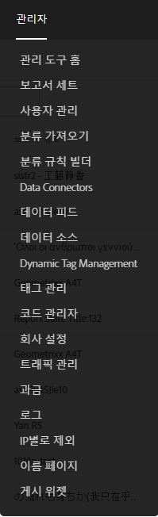
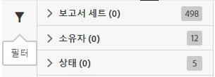
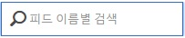
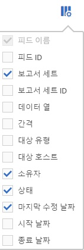

# 데이터 피드 관리

데이터 피드 관리자는 조직의 데이터 피드를 생성, 편집 및 삭제할 수 있도록 해줍니다. 데이터 피드 관리자에 액세스할 수 있는 권한이 있으면 표시되는 모든 보고서 세트에 대한 데이터 피드를 관리할 수 있습니다.

다음 절차에 따라 데이터 피드 관리에 액세스하십시오.

1. [experiencecloud.adobe.com](https://experiencecloud.adobe.com)에 로그인합니다.
2. Click on the 9-grid menu in the top right, then click [!UICONTROL Analytics].
3. In the top menu, click [!UICONTROL Admin] > [!UICONTROL Data Feeds].

## 인터페이스 탐색

데이터 피드 관리자 페이지에 도달하면 다음과 유사한 인터페이스가 표시됩니다.

설정된 피드가 없으면 페이지에 [!UICONTROL Create New Data Feed] 단추가 표시됩니다.

### 필터 및 검색

필터 및 검색을 사용하여 원하는 피드를 정확하게 찾을 수 있습니다.

맨 왼쪽에서 필터 아이콘을 클릭하여 필터링 옵션을 표시하거나 숨깁니다. 필터는 범주별로 구성되어 있습니다. 필터링 범주를 축소하거나 확장하려면 V자 모양을 클릭하십시오. 해당 필터를 적용하려면 확인란을 클릭하십시오.

이름별로 피드를 찾으려면 검색을 사용하십시오.

### 피드 및 작업

각 피드가 만드는 개별 작업을 보려면 작업 탭을 클릭하십시오. [데이터 피드 작업 관리](df-manage-jobs.md)를 참조하십시오.

### 추가

Near the feeds and jobs tabs, click the + [!UICONTROL Add] button to create a new feed. 자세한 내용은 [피드 추가](create-feed.md)를 참조하십시오.

### 열

만들어진 각 피드에는 피드에 대한 정보를 제공하는 몇 개의 열이 표시됩니다. 오름차순으로 정렬하려면 열 헤더를 클릭하십시오. 내림차순으로 정렬하려면 열 헤더를 다시 클릭하십시오. 특정 열이 표시되지 않으면 오른쪽 상단의 열 아이콘을 클릭합니다.

* **피드 이름**: 필수 열입니다. 피드 이름을 표시합니다.
* **피드 ID**: 고유 식별자인 피드 ID를 표시합니다.
* **보고서 세트**: 피드가 데이터를 참조하는 보고서 세트입니다.
* **보고서 세트 ID**: 보고서 세트의 고유 식별자입니다.
* **데이터 열**: 피드에 대해 활성화된 데이터 열입니다. 대부분의 경우 이 형식으로 표시할 열이 너무 많습니다.
* **간격**: 피드가 시간별인지 또는 일별인지를 나타냅니다.
* **대상 유형**: 피드의 대상 유형입니다. (예: FTP, Amazon S3, Azure)
* **대상 호스트**: 파일이 배치된 위치입니다. (예: `ftp.example.com`)
* **소유자**: 피드를 만든 사용자 계정입니다.
* **상태**: 피드의 상태입니다.
   * 활성: 피드가 작동 중입니다.
   * 승인 보류: 일부 상황에서 피드가 작업 생성을 시작할 수 있으려면 먼저 Adobe에서 피드를 승인해야 합니다.
   * 삭제됨: 피드가 삭제되었습니다.
   * 완료: 피드의 처리가 완료되었습니다. 완료된 피드를 편집하거나, 보류하거나, 취소할 수 있습니다.
   * 보류 중: 피드가 만들어졌지만 아직 활성 상태가 아닙니다. 피드가 짧은 전환 시간 동안 이 상태로 유지됩니다.
   * 비활성: &#39;일시 중지됨&#39; 또는 &#39;보류 중&#39; 상태에 해당합니다. 피드가 다시 활성화되면, 작업 전달이 중지된 시점부터 다시 시작됩니다.
* **마지막 수정 날짜**: 피드가 마지막으로 수정된 날짜입니다. 날짜 및 시간은 보고서 세트의 시간대에서 GMT 오프셋을 사용하여 표시됩니다.
* **시작 날짜**: 이 피드에 대한 첫 번째 작업의 날짜입니다. 날짜 및 시간은 보고서 세트의 시간대에서 GMT 오프셋을 사용하여 표시됩니다.
* **종료 날짜**: 이 피드에 대한 마지막 작업의 날짜입니다. 진행 중인 데이터 피드에는 종료 날짜가 없습니다.

## 데이터 피드 작업

사용 가능한 작업을 표시되게 하려면 데이터 피드 옆에 있는 확인란을 클릭하십시오.

* **작업 내역**: 이 데이터 피드에 연결된 모든 작업을 표시합니다. 자동으로 [작업 관리 인터페이스](df-manage-jobs.md)로 이동합니다.
* **삭제**:데이터 피드의 상태를 로 설정하여 데이터 피드를 [!UICONTROL Deleted]삭제합니다.
* **복사**: 현재 피드의 모든 설정을 사용하는 [새 피드 만들기](create-feed.md)로 이동합니다. 두 개 이상의 데이터 피드를 선택한 경우에는 복사할 수 없습니다.
* **일시 중지**:피드 처리를 중단하고 상태를 로 [!UICONTROL Inactive]설정합니다.
* **활성화**: 비활성 피드에만 사용할 수 있습니다. 데이터 처리가 중단된 바로 그 위치의 데이터 처리를 선택하고 필요한 경우 날짜를 다시 채웁니다.
