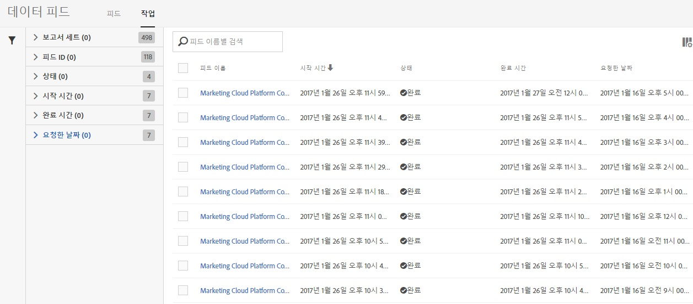
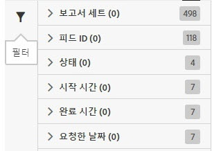
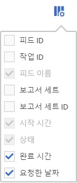

# 데이터 피드 작업 관리

작업은 압축된 파일을 출력하는 개별 과제로서, 피드에 의해 만들어지고 제어됩니다.

다음 절차에 따라 데이터 피드 작업 관리에 액세스하십시오.

1. [experiencecloud.adobe.com](https://experiencecloud.adobe.com)에 로그인합니다.
2. Click on the 9-grid menu in the top right, then click [!UICONTROL Analytics].
3. In the top menu, click [!UICONTROL Admin] > [!UICONTROL Data Feeds].
4. 상단 근처에 있는 작업 탭을 클릭합니다.

## 인터페이스 탐색

데이터 피드 작업은 Adobe가 주어진 보고 기간 동안 압축 파일을 처리하고 출력하는 단일 인스턴스입니다. 작업 관리자는 개별 작업의 상태를 보기 위해 세부 보기를 제공합니다.

### 필터 및 검색

필터 및 검색을 사용하여 원하는 작업을 정확하게 찾을 수 있습니다.

맨 왼쪽에서 필터 아이콘을 클릭하여 필터링 옵션을 표시하거나 숨깁니다. 필터는 범주별로 구성되어 있습니다. 필터링 범주를 축소하거나 확장하려면 V자 모양을 클릭하십시오. 해당 필터를 적용하려면 확인란을 클릭하십시오.

이름으로 작업을 찾으려면 검색을 사용하십시오.

### 피드 및 작업

이러한 작업을 만드는 중요한 피드를 보려면 피드 탭을 클릭하십시오. [데이터 피드 관리](df-manage-feeds.md)를 참조하십시오.

### 열

각 작업에는 피드에 대한 정보를 제공하는 몇 개의 열이 표시됩니다. 오름차순으로 정렬하려면 열 헤더를 클릭하십시오. 내림차순으로 정렬하려면 열 헤더를 다시 클릭하십시오. 특정 열이 표시되지 않으면 오른쪽 상단의 열 아이콘을 클릭합니다.

* **피드 ID**: 고유 식별자인 피드 ID를 표시합니다. 동일한 피드로 만든 작업의 피드 ID는 동일합니다.
* **작업 ID**: 작업의 고유 식별자입니다. 모든 작업의 작업 ID는 서로 다릅니다.
* **피드 이름**: 필수 열입니다. 피드 이름을 표시합니다. 동일한 피드로 만든 작업의 피드 이름은 동일합니다.
* **보고서 세트**: 작업이 데이터를 참조하는 보고서 세트입니다.
* **보고서 세트 ID**: 보고서 세트의 고유 식별자입니다.
* **시작 시간**: 작업이 시작된 시간입니다. 날짜 및 시간은 보고서 세트의 시간대에서 GMT 오프셋을 사용하여 표시됩니다. 일별 피드는 일반적으로 보고서 세트의 시간대의 자정 즈음에서 시작됩니다.
* **상태**: 피드의 상태입니다.
   * 데이터 대기 중: 작업이 작동 중이고 보고 기간 동안의 데이터가 수집되고 있습니다.
   * 처리 중: 작업에서 데이터 파일을 만들어 보낼 준비를 하고 있습니다.
   * 완료됨: 작업이 아무런 문제 없이 완료되었습니다.
   * 실패: 작업이 완료되지 않았습니다. 실패의 원인을 파악하는 데 도움이 필요하면 [작업 문제 해결](jobs-troubleshooting.md)을 참조하십시오.
   * 내보내기 대기 중: 보고 기간 동안의 데이터가 아직 완전히 처리되지 않았습니다.
   * 데이터 없음: 요청한 보고 기간 동안 보고서 세트에 데이터가 없습니다.
* **완료 시간**: 작업이 완료된 시간입니다. 날짜 및 시간은 보고서 세트의 시간대에서 GMT 오프셋을 사용하여 표시됩니다.
* **요청한 날짜**: 파일의 보고 기간입니다. 일별 피드는 일반적으로 GMT 오프셋을 사용하는 00:00 - 23:59를 표시하여 보고서 세트의 시간대를 기준으로 꼬박 하루를 나타냅니다. 시간별 피드는 작업이 진행되는 개별 시간을 보여줍니다.
