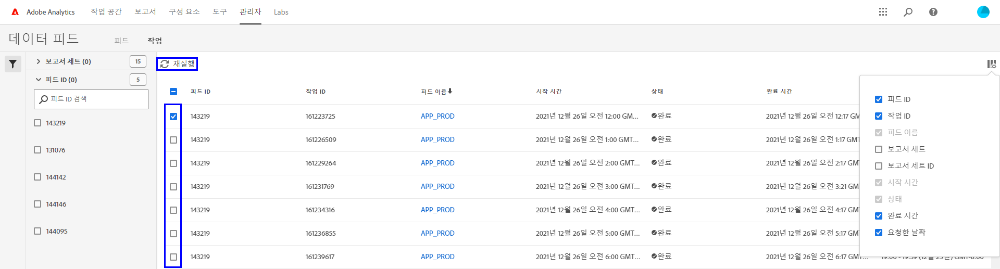

# 데이터 피드 문제 해결

작업의 처리 또는 게재가 실패할 수 있는 가능한 이유를 파악합니다.

## 기존 데이터 피드 문제 해결

매시간 또는 매일 정상적으로 작동하는 데이터 피드가 최근에 실패할 경우 다음의 각 사항을 확인합니다.

* [Adobe 상태 도구](https://status.adobe.com/en/experience_cloud)를 사용하면 예정된 관리 기간 또는 이용도 문제가 있는지 확인할 수 있습니다. 해당 시점에 알려진 문제가 있을 경우 Adobe는 일단 서비스가 복구되면 자동으로 예정된 데이터 피드를 처리합니다.
* FTP 사이트에 충분한 사용 공간이 있는지 확인하십시오. FTP 사이트의 디스크 공간이 부족할 경우 서버에서 일부 파일을 삭제해서 새로운 파일을 위한 공간을 만드십시오.
* 알려진 문제가 없고 FTP 사이트의 디스크 공간이 충분하면 데이터 피드를 다시 전송할 수 있습니다.

   1. Adobe Analytics에 로그인한 다음 **[!UICONTROL 관리]** > **[!UICONTROL 데이터 피드]**&#x200B;로 이동합니다.
   2. 원하는 데이터 피드를 찾은 다음 다시 실행하고자 하는 각 피드 옆에 있는 확인란을 클릭합니다.
   3. **[!UICONTROL 다시 실행]**&#x200B;을 클릭합니다.

   

다시 실행한 후에도 데이터 피드 파일을 받지 못할 경우엔 고객 지원 센터에 연락하십시오.

## 새로운 데이터 피드 문제 해결

새로운 데이터 피드에 오류가 있을 경우 수동으로 테스트 파일을 FTP 사이트에 업로드해서 문제를 해결합니다. 대부분의 경우 이러한 단계를 사용하여 오류 지점을 확인할 수 있습니다.

1. 파일 탐색기(Windows) 또는 파인더(Mac)를 사용하여 FTP 사이트에 로그인합니다. FTP 프로토콜(`ftp://`)을 사용하고 [Adobe의 IP 주소](/help/technotes/ip-addresses.md)가 귀사의 방화벽을 통과할 수 있도록 허용하십시오. FTP 사이트를 찾을 수 없을 경우 FTP 사이트 소유주와 협조하여 정확한 위치를 파악합니다.

   

2. 사용자 이름과 암호를 묻는 팝업이 나타납니다. 인증 자격 증명을 입력합니다. 자격 증명이 수락되면 창에 FTP 사이트의 현재 콘텐츠가 표시됩니다. 자격 증명이 승인되지 않을 경우 FTP 소유주와 협의하여 사용자 이름과 암호가 정확한지 확인하십시오. SFTP를 사용할 경우 [SFTP 안내서](../ftp-and-sftp/c-sftp/ftp-sftp.md)의 각 단계를 따라하십시오. Adobe는 SFTP의 일부 사용 사례를 지원하지 않습니다.
3. 파일을 인증된 창으로 끌어 놓아 FTP 사이트에 업로드합니다. 어떤 이미지나 텍스트 문서든 상관없습니다. 파일을 FTP 사이트에 배치하려고 할 때 오류가 발생하면 FTP 소유자와 함께 디스크 공간이 충분하고 사용 중인 사용자 이름에 FTP 사이트에 대한 쓰기 권한이 있는지 확인합니다.
4. 파일이 FTP 사이트에 있음을 확인했으면 이전 단계에서 업로드한 파일을 삭제해도 됩니다.

상기의 모든 단계가 작동하는데도 FTP 오류가 발생할 경우 고객 지원 센터에 연락하십시오.
