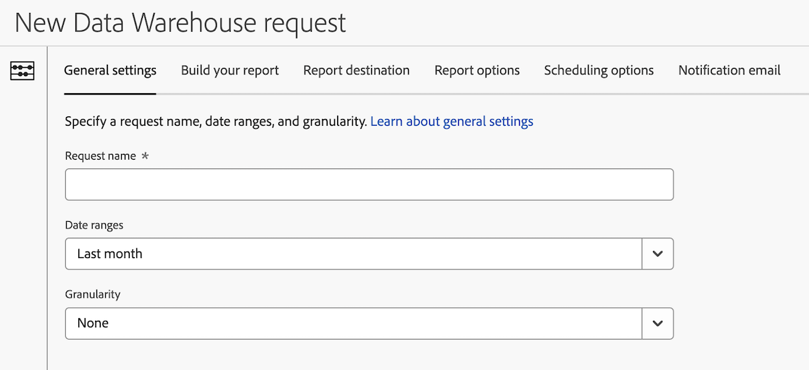

# Data Warehouse 요청 일반 설정

Data Warehouse 요청을 만들 때 사용할 수 있는 구성 옵션은 다양합니다. 다음 정보는 요청에 대한 일반 설정을 구성하는 방법을 설명합니다.

요청 만들기를 시작하는 방법과 기타 중요한 구성 옵션에 대한 링크에 대한 자세한 내용은 을 참조하십시오. [Data Warehouse 요청 만들기](/help/export/data-warehouse/create-request/t-dw-create-request.md).

Data Warehouse 요청에 대한 일반 설정을 구성하려면 다음 작업을 수행하십시오.

1. 을(를) 선택하여 Adobe Analytics에서 Data Warehouse 요청 만들기 시작 **[!UICONTROL 도구]** > **[!UICONTROL Data Warehouse]** > [!UICONTROL **추가**].

   자세한 내용은 [Data Warehouse 요청 만들기](/help/export/data-warehouse/create-request/t-dw-create-request.md).

1. 새 Data Warehouse 요청 페이지에서 [!UICONTROL **일반 설정**] 탭.

   

1. 다음 필드를 완료합니다. 

   | 옵션 | 함수 |
   |---------|----------|
   | 요청 이름 | 이 이름은 요청을 관리할 때 기본 Data Warehouse 페이지에 표시됩니다. |
   | 날짜 범위 | 보고서에 포함할 날짜 범위를 선택합니다. 
사용자 지정 날짜 또는 사전 설정된 날짜 범위를 선택할 수 있습니다. 사전 설정 범위는 보고서를 보낸 날짜를 기준으로 합니다.

다음 사전 설정 옵션을 사용할 수 있습니다.
<ul><li>오늘</li><li>어제</li><li>지난 7일</li><li>지난 30일</li><li>이번 주</li><li>지난주</li><li>지난 2주</li><li>지난 3주</li><li>지난 4주</li><li>이번 달</li><li>지난 달</li><li>지난 시간</li></ul> |
   | 세부 기간 | <!--what does this setting do? It's not the schedule/frequency... --> 시간 세부기간입니다. 유효한 값은 없음, 시간대별, 일일, 주간, 월간, 분기별 및 연간입니다.
세부기간별로 보고하려면 추가 처리 시간이 필요합니다. 1년의 월간 세부기간을 보고하는 경우 매달 보고서 요청을 제출하면 보고서가 훨씬 더 빠르게 처리됩니다.
 |
   | 조직의 사용자들이 사용할 수 있도록 설정 | 모든 Data Warehouse 요청은 사용자와 시스템 관리자만 볼 수 있습니다. 조직의 모든 사용자가 요청을 볼 수 있도록 하려면 이 옵션을 활성화합니다. 
이 옵션을 활성화하면 조직의 다른 사용자가 요청을 만들거나 업데이트하는 데 도움이 되도록 할 때 유용합니다.
 |

   {style="table-layout:auto"}

1. 에서 Data Warehouse 요청 구성 계속 [!UICONTROL **보고서 작성**] 탭. 자세한 내용은 [Data Warehouse 요청에 대한 보고서 작성](/help/export/data-warehouse/create-request/dw-request-build-report.md).
