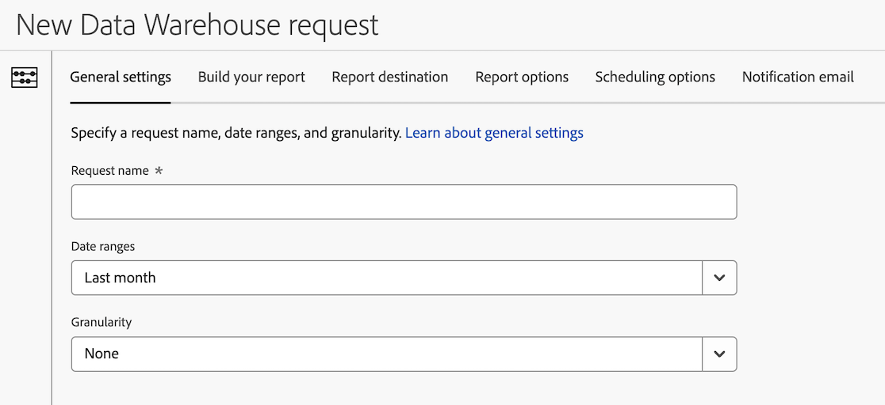

# Data Warehouse 요청 만들기

Data Warehouse 요청을 만들 때 사용할 수 있는 다양한 구성 옵션이 있습니다. 다음 정보는 요청 만들기를 시작한 다음 요청을 완료하기 위한 자세한 정보에 대한 링크를 제공합니다.

## 요청 만들기 시작

1. Adobe Analytics에서 **[!UICONTROL 도구]** > **[!UICONTROL Data Warehouse]**&#x200B;를 선택합니다.

1. [!UICONTROL **Data Warehouse**] 페이지에서 [!UICONTROL **추가**]&#x200B;를 선택합니다.

   

   새 Data Warehouse 요청 페이지가 표시됩니다.

   

## 요청 완료

Data Warehouse 요청을 만들 때 다양한 탭을 사용할 수 있습니다. 각 탭의 다양한 구성 옵션에 대한 자세한 내용은 다음 문서를 참조하십시오.

* [일반 설정](/help/export/data-warehouse/create-request/dw-general-settings.md)

* [보고서 작성](/help/export/data-warehouse/create-request/dw-request-build-report.md)

* [보고서 대상](/help/export/data-warehouse/create-request/dw-request-report-destinations.md)

* [보고서 옵션](/help/export/data-warehouse/create-request/dw-request-report-options.md)

* [예약 옵션](/help/export/data-warehouse/create-request/dw-request-scheduling.md)

* [알림 이메일](/help/export/data-warehouse/create-request/dw-request-email.md)
