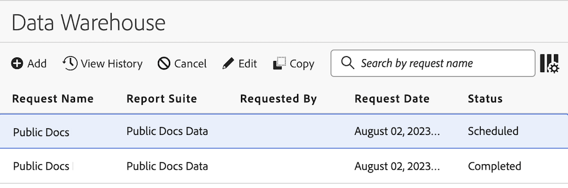

# Data Warehouse 요청 관리

{{release-limited-testing}}

>[!NOTE]
>
>모든 고객이 곧 사용할 수 있는 새로운 Data Warehouse 경험이 조직에 아직 없는 경우 의 정보를 사용하십시오. [Data Warehouse 요청 관리(이전 경험)](#manage-data-warehouse-requests-old-experience) 이 페이지의 맨 아래에 있습니다.

수행한 Data Warehouse 요청을 보고 관리할 수 있습니다. 관리자만 조직의 다른 사용자가 수행한 요청을 보고 관리할 수 있습니다.

다음 섹션에서는 요청을 관리할 때 수행할 수 있는 활동에 대해 설명합니다.

## 요청 보기

1. Adobe Analytics에서 [!UICONTROL **도구**] > [!UICONTROL **Data Warehouse**].

   Data Warehouse 페이지에는 수행한 모든 요청이 표시됩니다. <!-- just those you have made? -->데이터는 각 열에 표시됩니다. 다음을 수행할 수 있습니다. [열 구성](#configure-columns) 표시됩니다.

   <!-- add screenshot of main page -->

<!-- describe columns? -->

1. (선택 사항) 다음 정보를 표시하는 대화 상자를 보려면 요청 이름을 클릭합니다. <!-- Check this -->

   * 요청 처리가 시작된 시기

   * 제한적 평가: 조직에서 실행 중인 Data Warehouse 요청이 너무 많습니다. 다른 데이터 요청이 완료될 때까지 요청이 일시 중지됩니다.

## 요청 편집

요청을 편집할 때 다음 사항을 고려하십시오.

* 일정에 따라 실행되도록 구성된 요청만 편집할 수 있습니다.

* 요청과 연결된 일부 필드는 편집할 수 없습니다. 편집할 수 없는 필드는 흐리게 표시됩니다.

* 다른 사용자의 요청을 편집하는 관리자는 액세스할 수 있는 새 계정 및 위치를 선택해야 합니다.

예약된 요청을 편집하려면:

1. Adobe Analytics에서 [!UICONTROL **도구**] > [!UICONTROL **Data Warehouse**].

1. Data Warehouse 페이지에서 편집할 요청을 선택합니다.

   

1. 선택 [!UICONTROL **편집**].

1. 원하는 대로 요청을 편집합니다. 흐리게 표시된 구성 옵션은 편집할 수 없습니다.

   각 구성 옵션에 대한 자세한 내용은 [Data Warehouse 요청 만들기](/help/export/data-warehouse/create-request/t-dw-create-request.md).

1. 선택 [!UICONTROL **변경 내용 저장**].

## 요청 내역 보기

수행한 Data Warehouse 요청 내역을 볼 수 있습니다.

1. Adobe Analytics에서 [!UICONTROL **도구**] > [!UICONTROL **Data Warehouse**].

1. Data Warehouse 페이지에서 내역을 보려는 요청을 선택합니다.

   

1. 선택 [!UICONTROL **내역 보기**].

   다음 [!UICONTROL **Data Warehouse 요청 보기**] 이 페이지에는 요청과 연결된 개별 보고서 게재 목록이 표시됩니다.

   다음 항목 선택 **열 구성** 아이콘  열을 숨기거나 기본적으로 표시되지 않는 열을 표시합니다.

   

   다음 열을 사용할 수 있습니다.

   | 열 | 설명 |
   |---------|----------|
   | [!UICONTROL **제작일**] | 보고서가 생성된 날짜와 시간입니다.
요청을 시작한 사용자의 시간대에 표시됩니다.
 |
   | [!UICONTROL **시작 일자**] | 보고서가 시작된 날짜 및 시간입니다.
요청을 시작한 사용자의 시간대에 표시됩니다.
 |
   | [!UICONTROL **완료 일자**] | 보고서가 완료된 날짜 및 시간입니다.
요청을 시작한 사용자의 시간대에 표시됩니다.
 |
   | [!UICONTROL **업데이트 일자**] | 보고서를 마지막으로 업데이트한 날짜 및 시간입니다.
요청을 시작한 사용자의 시간대에 표시됩니다.
 |
   | [!UICONTROL **상태**] | 보고서 게재의 상태입니다. 가능한 상태는 다음과 같습니다.<ul><li>[!UICONTROL **생성됨**]: 보고서가 생성되었지만 아직 처리되지 않았습니다.</li><li>[!UICONTROL **보류 중**]: 보고서가 처리 대기 중입니다.</li><li>[!UICONTROL **처리 중**]: 보고서가 현재 처리 중입니다.</li><li>[!UICONTROL **완료됨**]: 보고서가 완료되었으며 이제 사용할 수 있습니다.</li><li>[!UICONTROL **예약됨**]: 보고서가 예약되었지만 아직 시작되지 않았습니다.</li><li>[!UICONTROL **취소됨**]: 사용자가 보고서를 취소했습니다.</li><li>[!UICONTROL **오류 - 처리 중**:] 보고서에 오류가 발생하여 처리할 수 없습니다.</li><li>[!UICONTROL **오류 - 전송 실패**]: 보고서가 생성되었지만 게재할 수 없습니다. 다음 확인: [대상 구성](/help/export/data-warehouse/create-request/dw-request-report-destinations.md)를 클릭한 다음 보고서를 다시 보냅니다.</li></ul>. |
   | [!UICONTROL **From**] | 보고서에 포함된 전체 시간대의 시작 일자.
보고서 세트의 시간대에 표시됩니다.
 |
   | [!UICONTROL **종료**] | 보고서에 포함된 전체 시간대의 종료 일자. 
보고서 세트의 시간대에 표시됩니다.
 |
   | [!UICONTROL **기존 요청 ID**] | 기존 Data Warehouse 인터페이스에서 보고서를 식별하는 데 사용되는 ID입니다. 이 ID는 Adobe 고객 지원 센터에 문의할 때 필요할 수 있습니다. |
   | [!UICONTROL **보고서 ID**] | 현재 Data Warehouse 인터페이스에서 보고서를 식별하는 데 사용되는 ID입니다. 이 ID는 Adobe 고객 지원 센터에 문의할 때 필요할 수 있습니다. |

1. 보고서 배달을 선택한 후 다음 옵션 중 하나를 선택합니다.

   | 옵션 | 함수 |
   |---------|----------|
   | [!UICONTROL **대상 세부 정보**] | 요청과 연결된 계정 및 위치 세부 정보를 표시합니다. 에 설명된 대로 이전에 구성된 계정 및 위치입니다. [Data Warehouse 요청에 대한 보고서 대상 구성](/help/export/data-warehouse/create-request/dw-request-report-destinations.md). |
   | [!UICONTROL **보고서 취소**] | 보고서를 취소합니다. 상태가 인 보고서는 취소할 수 없습니다. [!UICONTROL **완료됨**] 또는 [!UICONTROL **취소됨**]. |
   | [!UICONTROL **보고서 재실행**] | 데이터를 원래 보냈을 때의 상태로 보고서를 다시 실행합니다. 다음 상태의 보고서를 다시 실행할 수 있습니다. [!UICONTROL **취소됨**], [!UICONTROL **완료됨**], [!UICONTROL **오류 - 처리 중**], 또는 [!UICONTROL **오류 - 전송 실패**]. |
   | [!UICONTROL **보고서 재전송**] | 이전에 생성된 보고서 파일을 다시 보냅니다. 다음 상태의 보고서를 다시 보낼 수 있습니다. [!UICONTROL **완료됨**] 또는 [!UICONTROL **오류 - 전송 실패**]. |

## 요청 복사

요청을 복사하면 모든 구성 옵션이 원래 요청에서 복사됩니다.

1. Adobe Analytics에서 [!UICONTROL **도구**] > [!UICONTROL **Data Warehouse**].

1. Data Warehouse 페이지에서 복사할 요청을 선택합니다.

   

1. 선택 [!UICONTROL **복사**].

   Data Warehouse 요청 복사 페이지가 표시됩니다. 모든 구성 옵션이 원래 요청에서 복사됩니다.

1. 요청과 연결된 모든 구성 옵션을 업데이트합니다.

   각 구성 옵션에 대한 자세한 내용은 [Data Warehouse 요청 만들기](/help/export/data-warehouse/create-request/t-dw-create-request.md).

1. 선택 [!UICONTROL **변경 내용 저장**].

## 요청 취소

일정에 따라 실행되도록 구성된 요청만 취소할 수 있습니다.

예약된 요청을 취소하려면 다음 작업을 수행하십시오.

1. Adobe Analytics에서 [!UICONTROL **도구**] > [!UICONTROL **Data Warehouse**].

1. Data Warehouse 페이지에서 편집할 요청을 선택합니다.

   

1. 선택 [!UICONTROL **취소**].

   예약된 시간에 요청이 더 이상 실행되지 않습니다.

## 열 구성

열을 추가하거나 제거하여 각 요청에 대해 표시되는 정보를 구성할 수 있습니다.

1. 다음 항목 선택 **열 구성** Data Warehouse 페이지의 오른쪽 상단에 있는 아이콘입니다.

   

   다음 열을 사용할 수 있습니다.

   | 사용 가능한 열 | 설명 |
   |---------|----------|
   | 요청 이름 | 요청을 만든 사람의 이름입니다. |
   | 보고서 세트 | 요청과 연결된 보고서 세트입니다. |
   | 요청자 | 요청을 만든 사용자입니다. |
   | 요청 일자 | 요청이 수행된 날짜. |
   | 상태 | 다음 상태를 사용할 수 있습니다.<ul><li>
**완료됨**: 요청이 정상적으로 실행되었습니다.
</li><li>
**취소됨**: 사용자가 요청을 취소했습니다.
</li><li>
**예약됨**: 요청이 일정에 따라 실행되도록 구성되었습니다.
</li><!-- Are there other statuses? Failed? --> |

   {style="table-layout:auto"}

1. 표시할 열이 선택되어 있는지 확인합니다. 선택한 열이 Data Warehouse 페이지에 나타나고 관련 정보가 표시됩니다.

## 요청 필터링 및 정렬

1. 다음 항목 선택 **필터** 아이콘: Data Warehouse 페이지의 왼쪽 레일에 있습니다.

   

1. 확장 [!UICONTROL **보고서 세트**], [!UICONTROL **소유자**], 또는 [!UICONTROL **상태**] 섹션을 선택한 다음 요청을 필터링하는 방법을 선택합니다.

## 요청 검색

1. Data Warehouse 페이지 상단의 검색 필드에서 보려는 요청 이름을 지정합니다.

   요청은 사용자가 입력하는 대로 필터링됩니다.

## Data Warehouse 요청 관리(이전 경험)

>[!NOTE]
>
>다음 정보는 조직에 모든 Analytics 고객이 곧 사용할 수 있는 새로운 Data Warehouse 경험이 아직 없는 경우에만 적용됩니다.

요청 관리자에서 요청을 보고, 복제하고, 요청의 우선순위를 변경할 수 있습니다.

Data Warehouse에서 **[!UICONTROL 요청 관리자]** 탭을 선택합니다.

이 탭에서 작업할 때 가능한 사항

* 보고서 이름, 적용된 세그먼트, 요청자, 요청 날짜 및 상태별로 최근 보고서 요청 보기.
* 요청 복제. 요청 옆에 있는 **[!UICONTROL 복제]**&#x200B;를 클릭합니다.

  >[!NOTE]
  >
  >이 작업에서는 일정이나 배달 세부 정보는 복제되지 않고 요청만 복제됩니다.

* 보고서 이름이나 요청자의 로그인 이름을 사용한 보고서 검색.
* 큐 내의 새 위치로 보고서를 드래그해다 놓는 방법으로 보고서 우선 순위 변경.
* 요청 처리가 언제 시작되었는지 보려면 예약된 요청 ID를 클릭하고 열리는 팝업을 확인합니다.

해당 작업에 대한 개별 요청을 보려면 작업을 클릭합니다.

* 제한적 평가: 조직에서 실행 중인 Data Warehouse 요청이 너무 많습니다. 다른 데이터 요청이 완료될 때까지 요청이 일시 중지됩니다.