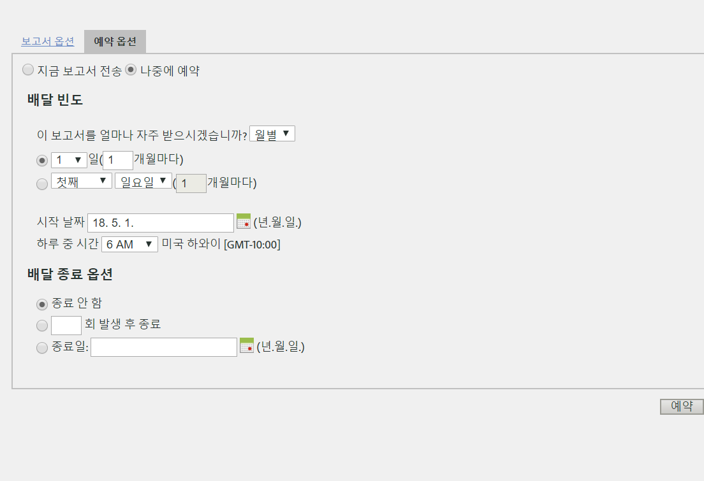

# 반복 요청 예약

## 반복 요청 예약 {#topic_8C3CE0CE8A584F80946D24B377CB51BE}

[일별]/[매월]/[연간] Data Warehouse 요청을 예약하려면 *사전 설정*이 올바르게 선택되었는지 확인하십시오.

1. [!UICONTROL 보고 날짜]에서 **[!UICONTROL 사전 설정을 선택합니다]**.

1. [!UICONTROL 배달 예약]에서 **[!UICONTROL 고급 배달 옵션을 클릭합니다]**.

1. Go to the Scheduling Options tab and select **[!UICONTROL Schedule for later]**.
1. [!UICONTROL 배달 빈도] 및 [!UICONTROL 배달 종료 옵션]에 원하는 설정을 선택합니다.

   

1. **[!UICONTROL 예약을 클릭합니다]**.

