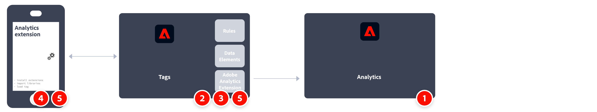

# Adobe Experience Platform Mobile SDK를 사용하여 Adobe Analytics 구현

Adobe Experience Platform Mobile SDK은 Adobe의 CX 엔터프라이즈 솔루션과 서비스를 모바일 앱에서 제공하는 데 도움이 됩니다. Android™, iOS, 다양한 크로스 플랫폼 개발 프레임워크에서 사용할 수 있습니다. 구성은 Adobe Experience Platform 데이터 수집을 통해 처리됩니다.

>[!IMPORTANT]
>
>Adobe Analytics 확장은 Adobe Experience Platform 데이터 수집 UI에서도 사용할 수 있습니다. 이 확장을 설치하는 경우 XDM 또는 Edge Network를 사용하지 않습니다.

## Adobe Experience Platform SDK

구현 작업에 대한 개략적인 개요:

<table style="width:100%">

<tr>
<th style="width:5%"></th><th style="width:60%"><b>작업</b></th><th style="width:35%"><b>추가 정보</b></th>
</tr>

<tr>
<td>1</td>
<td><b>보고서 세트를 정의</b>했는지 확인합니다.</td>
<td><a href="../../../admin/tools/manage-rs/report-suites-admin.md">보고서 세트 관리자</a></td>
</tr>

<tr>
<td>2</td>
<td><b>데이터스트림을 구성합니다</b>. 데이터스트림은 Adobe Experience Platform Web SDK 구현 시 서버측 구성을 나타냅니다.</td>
<td><a href="https://experienceleague.adobe.com/docs/experience-platform/edge/datastreams/configure.html?lang=ko">데이터스트림 구성<a></td> 
</tr>

<td>3</td>
<td>데이터스트림에 <b>Adobe Analytics 서비스를 추가</b>합니다. 이 서비스는 데이터가 Adobe Analytics로 전송되는지 여부와 그 방법을 제어합니다.</td>
<td><a href="https://experienceleague.adobe.com/docs/experience-platform/edge/datastreams/configure.html?lang=ko#analytics">데이터스트림에 Adobe Analytics 서비스 추가</a></td>
</tr>

<tr>
<td>4</td>
<td><b>모바일 속성을 만듭니다</b>. 속성은 확장, 규칙, 데이터 요소 및 라이브러리로 채우는 컨테이너입니다.</td>
<td><a href="https://developer.adobe.com/client-sdks/documentation/getting-started/create-a-mobile-property/">모바일 속성 설정</a></tr>

<tr>
<td>5</td>
<td>모바일 태그 속성에 <b>Adobe Experience Platform Edge Network 확장을 설치</b>하고 확장 기능에서 데이터스트림을 구성합니다.</td>
<td><a href="https://developer.adobe.com/client-sdks/documentation/edge-network/">Adobe Experience Platform Edge Network</a>
</tr>

<tr>
<td>6</td>
<td><b>앱의 코드를 사용</b>하여 필요한 확장을 등록하고 태그 구성을 로드합니다.</td>
<td><a href="https://developer.adobe.com/client-sdks/documentation/user-guides/getting-started-with-platform/overview/#set-up-the-configuration">구성 설정</a></td>
</tr>

<tr>
<td>7</td>
<td>앱에서 태그의 데이터 요소, 규칙, 추가 확장 및 SDK API 호출의 조합을 사용하여 <b>기능을 구현하고 테스트</b>합니다. 모바일 애플리케이션에 대한 데이터 수집 및 경험을 검사하고, 유효성을 검사하고, 디버그합니다.</td>
<td><a href="https://developer.adobe.com/client-sdks/documentation/user-guides/getting-started-with-platform/overview/#use-the-sample-application">샘플 애플리케이션 사용</a>
</tr>

<tr>
<td>8</td>
<td>프로덕션으로 푸시하기 전에 <b>모바일 앱 구현을 확장하고 유효성을 검사</b>합니다.</td>
<td></td> 
</tr>

</table>

## Adobe Analytics 확장.

구현 작업에 대한 개략적인 개요:

<table style="width:100%">

<tr>
<th style="width:5%"></th><th style="width:60%"><b>작업</b></th><th style="width:35%"><b>추가 정보</b></th>
</tr>

<tr>
<td>1</td>
<td><b>보고서 세트를 정의</b>했는지 확인합니다.</td>
<td><a href="../../../admin/tools/manage-rs/report-suites-admin.md">보고서 세트 관리자</a></td>
</tr>

<tr>
<td>2</td>
<td>모바일 태그 속성에 <b>Adobe Analytics 확장을 설치</b>하고 보고서 세트를 가리키도록 확장을 구성합니다.</td>
<td><a href="https://developer.adobe.com/client-sdks/documentation/adobe-analytics/">모바일 속성용 Adobe Analytics 확장</a>
</tr>

<tr>
<td>3</td>
<td><b>앱의 코드를 사용</b>하여 필요한 확장을 등록하고 태그 구성을 로드합니다.</td>
<td><a href="https://developer.adobe.com/client-sdks/documentation/user-guides/getting-started-with-platform/overview/#set-up-the-configuration">구성 설정</a></td>
</tr>

<tr>
<td>4</td>
<td>앱에서 태그의 데이터 요소, 규칙, 추가 확장 및 SDK API 호출의 조합을 사용하여 <b>기능을 구현하고 테스트</b>합니다. 모바일 애플리케이션에 대한 데이터 수집 및 경험을 검사하고, 유효성을 검사하고, 디버그합니다.</td>
<td><a href="https://developer.adobe.com/client-sdks/documentation/user-guides/getting-started-with-platform/overview/#use-the-sample-application">샘플 애플리케이션 사용</a>
</tr>

<tr>
<td>5</td>
<td>프로덕션으로 푸시하기 전에 <b>모바일 앱 구현을 확장하고 유효성을 검사</b>합니다.</td>
<td></td> 
</tr>

</table>

## 추가 리소스

- [태그 설명서](https://experienceleague.adobe.com/docs/experience-platform/tags/home.html?lang=ko-KR#)

- [모바일 SDK 설명서](https://developer.adobe.com/client-sdks/documentation/)
