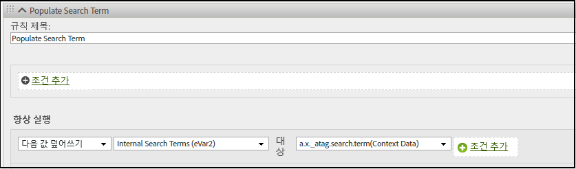

# Adobe Experience Edge의 Analytics 변수 매핑

다음 표에서는 Adobe Experience Platform Edge Network를 Adobe Analytics에 자동으로 매핑하는 변수를 보여 줍니다. 이러한 XDM 필드 경로를 사용하는 경우 Adobe Analytics로 데이터를 전송하기 위해 추가 구성이 필요하지 않습니다.

| XDM 필드 패스 | Analytics 차원 및 설명 |
| --- | --- |
| `application.isClose` | 모바일 지표 [충돌](https://experienceleague.adobe.com/docs/mobile-services/using/get-started-ug/mobile-metrics/metrics-reference.html?lang=ko-KR#metrics)을 정의하는 데 도움이 됩니다. |
| `application.isInstall` | 모바일 지표 [첫 실행](https://experienceleague.adobe.com/docs/mobile-services/using/get-started-ug/mobile-metrics/metrics-reference.html?lang=ko-KR#metrics)을 늘릴 시기를 결정하는 데 도움이 됩니다. |
| `application.isLaunch` | 모바일 지표 [첫 실행](https://experienceleague.adobe.com/docs/mobile-services/using/get-started-ug/mobile-metrics/metrics-reference.html?lang=ko-KR#metrics)을 늘릴 시기를 결정하는 데 도움이 됩니다. |
| `application.closeType` | 닫기 이벤트가 충돌인지 여부를 결정합니다. 유효한 값은 `close`(라이프사이클 세션이 종료되고 이전 세션에 대해 일시 중지 이벤트가 수신됨) 및 `unknown`(라이프사이클 세션이 일시 중지 이벤트 없이 종료됨)입니다. [충돌](https://experienceleague.adobe.com/docs/mobile-services/using/get-started-ug/mobile-metrics/metrics-reference.html?lang=ko-KR#metrics) 지표를 설정하는 데 도움이 됩니다. |
| `application.isInstall` | 모바일 지표 [설치](https://experienceleague.adobe.com/docs/mobile-services/using/get-started-ug/mobile-metrics/metrics-reference.html?lang=ko-KR#metrics). |
| `application.isLaunch` | 모바일 지표 [런치](https://experienceleague.adobe.com/docs/mobile-services/using/get-started-ug/mobile-metrics/metrics-reference.html?lang=ko-KR#metrics). |
| `application.name` | 모바일 차원 [앱 ID](https://experienceleague.adobe.com/docs/mobile-services/using/get-started-ug/mobile-metrics/metrics-reference.html?lang=ko-KR#dimensions)를 설정하는 데 도움이 됩니다. |
| `application.isUpgrade` | 모바일 지표 [업그레이드](https://experienceleague.adobe.com/docs/mobile-services/using/get-started-ug/mobile-metrics/metrics-reference.html?lang=ko-KR#metrics). |
| `application.version` | 모바일 차원 [앱 ID](https://experienceleague.adobe.com/docs/mobile-services/using/get-started-ug/mobile-metrics/metrics-reference.html?lang=ko-KR#dimensions)를 설정하는 데 도움이 됩니다. |
| `application.sessionLength` | 모바일 지표 [이전 세션 길이](https://experienceleague.adobe.com/docs/mobile-services/using/get-started-ug/mobile-metrics/metrics-reference.html?lang=ko-KR#metrics). |
| `commerce.checkouts.id` | [이벤트 일련화](../vars/page-vars/events/event-serialization.md)를 [체크아웃](../../components/metrics/checkouts.md) 지표에 적용합니다. |
| `commerce.checkouts.value` | 원하는 수량만큼 [체크아웃](../../components/metrics/checkouts.md) 지표를 증가시킵니다. |
| `commerce.order.currencyCode` | [currencyCode](../vars/config-vars/currencycode.md) 구성 변수를 설정합니다. |
| `commerce.order.purchaseID` | [purchaseID](../vars/page-vars/purchaseid.md) 페이지 변수를 설정합니다. |
| `commerce.order.transactionID` | [transactionID](../vars/page-vars/transactionid.md) 페이지 변수를 설정합니다. |
| `commerce.productListAdds.id` | [이벤트 일련화](../vars/page-vars/events/event-serialization.md)를 [장바구니 추가](../../components/metrics/cart-additions.md) 지표에 적용합니다. |
| `commerce.productListAdds.value` | [장바구니 추가](../../components/metrics/cart-additions.md) 지표를 증가시킵니다. |
| `commerce.productListOpens.id` | [이벤트 일련화](../vars/page-vars/events/event-serialization.md)를 [장바구니](../../components/metrics/carts.md) 지표에 적용합니다. |
| `commerce.productListOpens.value` | [장바구니 수](../../components/metrics/carts.md) 지표를 증가시킵니다. |
| `commerce.productListRemovals.id` | [이벤트 일련화](../vars/page-vars/events/event-serialization.md)를 [장바구니 제거](../../components/metrics/cart-removals.md) 지표에 적용합니다. |
| `commerce.productListRemovals.value` | [장바구니 제거 수](../../components/metrics/cart-removals.md) 지표를 증가시킵니다. |
| `commerce.productListViews.id` | [이벤트 일련화](../vars/page-vars/events/event-serialization.md)를 [장바구니 보기](../../components/metrics/cart-views.md) 지표에 적용합니다. |
| `commerce.productListViews.value` | [장바구니 보기 수](../../components/metrics/cart-views.md) 지표를 증가시킵니다. |
| `commerce.productViews.id` | [이벤트 일련화](../vars/page-vars/events/event-serialization.md)를 [제품 보기](../../components/metrics/product-views.md) 지표에 적용합니다. |
| `commerce.productViews.value` | [제품 보기](../../components/metrics/product-views.md) 지표를 증가시킵니다. |
| `commerce.purchases.value` | [주문](../../components/metrics/orders.md) 지표를 증가시킵니다. |
| `device.model` | 모바일 차원 [디바이스 이름](https://experienceleague.adobe.com/docs/mobile-services/using/get-started-ug/mobile-metrics/metrics-reference.html?lang=ko-KR#dimensions). |
| `device.colorDepth` | [색상 깊이](../../components/dimensions/color-depth.md) 차원을 설정하는 데 도움이 됩니다. |
| `device.screenHeight` | [모니터 해상도](../../components/dimensions/monitor-resolution.md) 차원을 설정하는 데 도움이 됩니다. |
| `device.screenWidth` | [모니터 해상도](../../components/dimensions/monitor-resolution.md) 차원을 설정하는 데 도움이 됩니다. |
| `device.type` | 모바일 디바이스 유형. |
| `environment.browserDetails.acceptLanguage` | [언어](../../components/dimensions/language.md) 차원을 설정하는 데 도움이 됩니다. |
| `environment.browserDetails.cookiesEnabled` | [쿠키 지원](../../components/dimensions/cookie-support.md) 차원을 설정합니다. 유효한 값에는 `Y`(브라우저에서 쿠키를 수락) 및 `N`(브라우저에서 쿠키를 거부)이 포함됩니다. |
| `environment.browserDetails.javaEnabled` | [Java 활성화](../../components/dimensions/java-enabled.md) 차원을 설정합니다. 유효한 값에는 `Y`(Java가 활성화됨) 및 `N`(Java가 비활성화됨)이 포함됩니다. |
| `environment.browserDetails.userAgent` | 대체 [고유한 방문자](../../components/metrics/unique-visitors.md) 식별 방법으로 사용됩니다 일반적으로 `User-Agent` HTTP 요청 헤더를 사용하여 채워집니다. 보고서에서 이 필드를 사용하려는 경우 이 필드를 eVar에 매핑할 수 있습니다. |
| `environment.browserDetails.viewportHeight` | [브라우저 높이](../../components/dimensions/browser-height.md) 차원을 설정합니다. |
| `environment.browserDetails.viewportWidth` | [브라우저 너비](../../components/dimensions/browser-width.md) 차원을 설정합니다. |
| `environment.carrier` | 모바일 차원 [통신사 이름](https://experienceleague.adobe.com/docs/mobile-services/using/get-started-ug/mobile-metrics/metrics-reference.html?lang=ko-KR#dimensions). |
| `environment.connectionType` | [연결 유형](../../components/dimensions/connection-type.md) 차원을 설정하는 데 도움이 됩니다. |
| `environment.ipV4` | 대체 [고유한 방문자](../../components/metrics/unique-visitors.md) 식별 방법으로 사용됩니다 일반적으로 `X-Forwarded-For` HTTP 헤더를 사용하여 채워집니다. |
| `environment.language` | 모바일 차원 로케일. |
| `environment.operatingSystem` | 모바일 차원 [운영 체제](https://experienceleague.adobe.com/docs/mobile-services/using/get-started-ug/mobile-metrics/metrics-reference.html?lang=ko-KR#dimensions). |
| `environment.operatingSystemVersion` | [운영 체제 버전](https://experienceleague.adobe.com/docs/mobile-services/using/get-started-ug/mobile-metrics/metrics-reference.html?lang=ko-KR#dimensions) 차원을 설정하는 데 도움이 됩니다. |
| `_experience.analytics.customDimensions.`<br/>`eVars.eVar1` -<br/>`_experience.analytics.customDimensions.`<br/>`eVars.eVar250` | 해당 [eVar](../../components/dimensions/evar.md) 차원을 설정합니다. |
| `_experience.analytics.customDimensions.`<br/>`hierarchies.hier1` -<br/>`_experience.analytics.customDImensions.`<br/>`hierarchies.hier5` | 해당 [계층](/help/components/dimensions/hierarchy.md) 차원을 설정합니다. |
| `_experience.analytics.customDimensions.`<br/>`listProps.prop1.delimiter` -<br/>`_experience.analytics.customDimensions.`<br/>`listProps.prop75.delimiter` | 목록 Prop 구분 기호 재정의 구분 기호는 보고서 세트 설정의 [트래픽 변수 관리자](/help/admin/admin/c-manage-report-suites/c-edit-report-suites/c-traffic-variables/traffic-var.md)에서 자동으로 검색되므로 이 필드를 사용하는 것은 권장되지 않습니다. 이 필드를 사용하면 사용된 구분 기호와 Analytics에서 예상하는 구분 기호가 일치하지 않을 수 있습니다. |
| `_experience.analytics.customDimensions.`<br/>`listProps.prop1.values` -<br/>`_experience.analytics.customDimensions.`<br/>`listProps.prop75.values` | 해당 [목록 Prop](../vars/page-vars/prop.md#list-props) 값을 포함하는 문자열 배열입니다. |
| `_experience.analytics.customDimensions.`<br/>`lists.list1.list[].value` -<br/>`_experience.analytics.customDimensions.`<br/>`lists.list3.list[].value` | `value`각 배열의 모든 문자열`list[]`을 해당 [목록 변수](../vars/page-vars/list.md)에 연결합니다. 구분 기호는 [보고서 세트 설정](/help/admin/admin/c-manage-report-suites/c-edit-report-suites/conversion-var-admin/list-var-admin.md)에 설정된 값을 기준으로 자동으로 선택됩니다. |
| `_experience.analytics.customDimensions.`<br/>`props.prop1` -<br/>`_experience.analytics.customDimensions.`<br/>`props.prop75` | 해당 [Prop](../../components/dimensions/prop.md) 차원을 설정합니다. |
| `_experience.analytics.event1to100.`<br/>`event1.id` -<br/>`_experience.analytics.event901to1000.`<br/>`event1000.id` | [이벤트 일련화](../vars/page-vars/events/event-serialization.md)를 해당 [사용자 정의 이벤트](../../components/metrics/custom-events.md) 지표에 적용합니다. |
| `_experience.analytics.event1to100.`<br/>`event1.value` -<br/>`_experience.analytics.event901to1000.`<br/>`event1000.value` | 원하는 수량만큼 해당 [사용자 정의 이벤트](../../components/metrics/custom-events.md) 지표를 증가시킵니다. |
| `identityMap.ECID[0].id` | [Adobe Experience Cloud ID 서비스 ID](https://experienceleague.adobe.com/docs/id-service/using/home.html?lang=ko-KR). |
| `marketing.trackingCode` | [추적 코드](../../components/dimensions/tracking-code.md) 차원을 설정합니다. |
| `media.mediaTimed.completes.value` | Media Analytics 지표 [콘텐츠 완료](https://experienceleague.adobe.com/docs/media-analytics/using/metrics-and-metadata/audio-video-parameters.html?lang=ko-KR#content-complete). |
| `media.mediaTimed.dropBeforeStart.value` | `c.a.media.view`, `c.a.media.timePlayed`, `c.a.media.play` |
| `media.mediaTimed.federated.value` | Media Analytics 지표 [페더레이션 데이터](https://experienceleague.adobe.com/docs/media-analytics/using/metrics-and-metadata/audio-video-parameters.html?lang=ko-KR#federated-data). |
| `media.mediaTimed.firstQuartiles.value` | Media Analytics 지표 [25% 진행률 마커](https://experienceleague.adobe.com/docs/media-analytics/using/metrics-and-metadata/audio-video-parameters.html?lang=ko-KR#twenty-five-progress-marker). |
| `media.mediaTimed.mediaSegmentView.value` | Media Analytics 지표 [콘텐츠 세그먼트 보기 수](https://experienceleague.adobe.com/docs/media-analytics/using/metrics-and-metadata/audio-video-parameters.html?lang=ko-KR#content-segment-views). |
| `media.mediaTimed.midpoints.value` | Media Analytics 지표 [50% 진행률 마커](https://experienceleague.adobe.com/docs/media-analytics/using/metrics-and-metadata/audio-video-parameters.html?lang=ko-KR#fifty-progress-marker). |
| `media.mediaTimed.pauseTime.value` | Media Analytics 지표 [총 일시 중지 기간](https://experienceleague.adobe.com/docs/media-analytics/using/metrics-and-metadata/audio-video-parameters.html?lang=ko-KR#total-pause-duration). |
| `media.mediaTimed.pauses.value` | Media Analytics 지표 [일시 중지 이벤트](https://experienceleague.adobe.com/docs/media-analytics/using/metrics-and-metadata/audio-video-parameters.html?lang=ko-KR#pause-events). |
| `media.mediaTimed.primaryAssetReference.`<br/>`@id` | Media Analytics 차원 [에셋 ID](https://experienceleague.adobe.com/docs/media-analytics/using/metrics-and-metadata/audio-video-parameters.html?lang=ko-KR#asset-id). |
| `media.mediaTimed.primaryAssetReference.`<br/>`dc:title` | Media Analytics 차원 [비디오 이름](https://experienceleague.adobe.com/docs/media-analytics/using/metrics-and-metadata/audio-video-parameters.html?lang=ko-KR#video-name). |
| `media.mediaTimed.primaryAssetReference.`<br/>`iptc4xmpExt:Creator[N].iptc4xmpExt:Name` | Media Analytics 차원 [작성자](https://experienceleague.adobe.com/docs/media-analytics/using/metrics-and-metadata/audio-video-parameters.html?lang=ko-KR#originator). |
| `media.mediaTimed.primaryAssetReference.`<br/>`iptc4xmpExt:Episode.iptc4xmpExt:Number` | Media Analytics 차원 [에피소드](https://experienceleague.adobe.com/docs/media-analytics/using/metrics-and-metadata/audio-video-parameters.html?lang=ko-KR#episode). |
| `media.mediaTimed.primaryAssetReference.`<br/>`iptc4xmpExt:Genre` | Media Analytics 차원 [장르](https://experienceleague.adobe.com/docs/media-analytics/using/metrics-and-metadata/audio-video-parameters.html?lang=ko-KR#genre). |
| `media.mediaTimed.primaryAssetReference.`<br/>`iptc4xmpExt:Rating[N].iptc4xmpExt:RatingValue` | Media Analytics 차원 [콘텐츠 등급](https://experienceleague.adobe.com/docs/media-analytics/using/metrics-and-metadata/audio-video-parameters.html?lang=ko-KR#content-rating). |
| `media.mediaTimed.primaryAssetReference.`<br/>`iptc4xmpExt:Season.iptc4xmpExt:Number` | Media Analytics 차원 [시즌](https://experienceleague.adobe.com/docs/media-analytics/using/metrics-and-metadata/audio-video-parameters.html?lang=ko-KR#season). |
| `media.mediaTimed.primaryAssetReference.`<br/>`iptc4xmpExt:Series.iptc4xmpExt:Identifier` | Media Analytics 차원 [콘텐츠 ID](https://experienceleague.adobe.com/docs/media-analytics/using/metrics-and-metadata/audio-video-parameters.html?lang=ko-KR#content-id). |
| `media.mediaTimed.primaryAssetReference.`<br/>`iptc4xmpExt:Series.iptc4xmpExt:Name` | Media Analytics 차원 [표시](https://experienceleague.adobe.com/docs/media-analytics/using/metrics-and-metadata/audio-video-parameters.html?lang=ko-KR#show). |
| `media.mediaTimed.primaryAssetReference.`<br/>`showType` | Media Analytics 차원 [표시 유형](https://experienceleague.adobe.com/docs/media-analytics/using/metrics-and-metadata/audio-video-parameters.html?lang=ko-KR#show-type). |
| `media.mediaTimed.primaryAssetReference.`<br/>`xmpDM:duration` | Media Analytics 차원 [비디오 길이](https://experienceleague.adobe.com/docs/media-analytics/using/metrics-and-metadata/audio-video-parameters.html?lang=ko-KR#video-length). |
| `media.mediaTimed.primaryAssetViewDetails.`<br/>`@id` | Media Analytics 차원 [미디어 세션 ID](https://experienceleague.adobe.com/docs/media-analytics/using/metrics-and-metadata/audio-video-parameters.html?lang=ko-KR#media-session-id). |
| `media.mediaTimed.primaryAssetViewDetails.`<br/>`broadcastChannel` | Media Analytics 차원 [콘텐츠 채널](https://experienceleague.adobe.com/docs/media-analytics/using/metrics-and-metadata/audio-video-parameters.html?lang=ko-KR#content-channel). |
| `media.mediaTimed.primaryAssetViewDetails.`<br/>`broadcastContentType` | Media Analytics 차원 [콘텐츠 유형](https://experienceleague.adobe.com/docs/media-analytics/using/metrics-and-metadata/audio-video-parameters.html?lang=ko-KR#content-type). |
| `media.mediaTimed.primaryAssetViewDetails.`<br/>`broadcastNetwork` | Media Analytics 차원 [네트워크](https://experienceleague.adobe.com/docs/media-analytics/using/metrics-and-metadata/audio-video-parameters.html?lang=ko-KR#network). |
| `media.mediaTimed.primaryAssetViewDetails.`<br/>`mediaSegmentView.value` | Media Analytics 차원 [콘텐츠 세그먼트](https://experienceleague.adobe.com/docs/media-analytics/using/metrics-and-metadata/audio-video-parameters.html?lang=ko-KR#content-segment). |
| `media.mediaTimed.primaryAssetViewDetails.`<br/>`playerName` | Media Analytics 차원 [콘텐츠 플레이어 이름](https://experienceleague.adobe.com/docs/media-analytics/using/metrics-and-metadata/audio-video-parameters.html?lang=ko-KR#content-player-name). |
| `media.mediaTimed.primaryAssetViewDetails.`<br/>`playerSDKVersion.version` | Media Analytics 차원 [SDK 버전](https://experienceleague.adobe.com/docs/media-analytics/using/metrics-and-metadata/audio-video-parameters.html?lang=ko-KR#sdk-version). |
| `media.mediaTimed.primaryAssetViewDetails.`<br/>`sourceFeed` | Media Analytics 차원 [미디어 피드 유형](https://experienceleague.adobe.com/docs/media-analytics/using/metrics-and-metadata/audio-video-parameters.html?lang=ko-KR#media-feed-type). |
| `media.mediaTimed.primaryAssetViewDetails.`<br/>`streamFormat` | Media Analytics 차원 [스트림 형식](https://experienceleague.adobe.com/docs/media-analytics/using/metrics-and-metadata/audio-video-parameters.html?lang=ko-KR#stream-format). |
| `media.mediaTimed.progress10.value` | Media Analytics 지표 [10% 진행률 마커](https://experienceleague.adobe.com/docs/media-analytics/using/metrics-and-metadata/audio-video-parameters.html?lang=ko-KR#ten-progress-marker). |
| `media.mediaTimed.progress95.value` | Media Analytics 지표 [95% 진행률 마커](https://experienceleague.adobe.com/docs/media-analytics/using/metrics-and-metadata/audio-video-parameters.html?lang=ko-KR#ninety-five-progress-marker). |
| `media.mediaTimed.resumes.value` | Media Analytics 지표 [콘텐츠 다시 시작](https://experienceleague.adobe.com/docs/media-analytics/using/metrics-and-metadata/audio-video-parameters.html?lang=ko-KR#content-resumes). |
| `media.mediaTimed.starts.value` | Media Analytics 지표 [미디어 시작](https://experienceleague.adobe.com/docs/media-analytics/using/metrics-and-metadata/audio-video-parameters.html?lang=ko-KR#media-starts). |
| `media.mediaTimed.thirdQuartiles.value` | Media Analytics 지표 [75% 진행률 마커](https://experienceleague.adobe.com/docs/media-analytics/using/metrics-and-metadata/audio-video-parameters.html?lang=ko-KR#seventy-five-progress-marker). |
| `media.mediaTimed.timePlayed.value` | Media Analytics 지표 [콘텐츠 체류 시간](https://experienceleague.adobe.com/docs/media-analytics/using/metrics-and-metadata/audio-video-parameters.html?lang=ko-KR#content-time-spent). |
| `media.mediaTimed.totalTimePlayed.value` | Media Analytics 지표 [미디어 사용 시간](https://experienceleague.adobe.com/docs/media-analytics/using/metrics-and-metadata/audio-video-parameters.html?lang=ko-KR#media-time-spent). |
| `placeContext.geo.latitude` | 모바일 차원 위도. |
| `placeContext.geo.longitude` | 모바일 차원 경도. |
| `placeContext.geo.postalCode` | [우편번호](../../components/dimensions/zip-code.md) 차원. |
| `placeContext.geo.stateProvince` | [미국 주](../../components/dimensions/us-states.md) 차원. |
| `placeContext.localTime` | Report &amp; Analytics에서 [시간대](/help/analyze/reports-analytics/reports.md)를 채우는 데 도움이 됩니다. [데이터 피드](/help/export/analytics-data-feed/c-df-contents/datafeeds-reference.md)에 `t_time_info`로 표시됩니다. |
| `productListItems[]._experience.analytics.`<br/>`customDimensions.eVars.eVar1` -<br/>`productListItems[]._experience.analytics.`<br/>`customDimensions.eVars.eVar250` | [제품 구문](../vars/page-vars/products.md) 머천다이징을 eVar에 적용합니다. |
| `productListItems[]._experience.analytics.`<br/>`event1to100.event1.value` -<br/>`productListItems[]._experience.analytics.`<br/>`event901-1000.event1000.value` | [제품 구문](../vars/page-vars/products.md) 머천다이징을 이벤트에 적용합니다. |
| `productListItems[].lineItemId` | [범주](../../components/dimensions/category.md) 차원. [제품](../vars/page-vars/products.md) 페이지 변수도 참조하십시오. |
| `productListItems[].name` | [제품](../../components/dimensions/product.md) 차원. [제품](../vars/page-vars/products.md) 페이지 변수도 참조하십시오. `productListItems[].SKU` 및 `productListItems[].name`에 모두 데이터가 포함되어 있으면 `productListItems[].SKU`의 값이 사용됩니다. |
| `productListItems[].priceTotal` | [매출](../../components/metrics/revenue.md) 지표를 확인하는 데 도움이 됩니다. [제품](../vars/page-vars/products.md) 페이지 변수도 참조하십시오. |
| `productListItems[].quantity` | [단위](../../components/metrics/units.md) 지표를 확인하는 데 도움이 됩니다. [제품](../vars/page-vars/products.md) 페이지 변수도 참조하십시오. |
| `productListItems[].SKU` | [제품](../../components/dimensions/product.md) 차원. [제품](../vars/page-vars/products.md) 페이지 변수도 참조하십시오. `productListItems[].SKU` 및 `productListItems[].name`에 모두 데이터가 포함되어 있으면 `productListItems[].SKU`의 값이 사용됩니다. |
| `web.webInteraction.URL` | [linkURL](../vars/config-vars/linkurl.md) 구현 변수. |
| `web.webInteraction.name` | `web.webInteraction.type`의 값에 따라 [사용자 정의 링크](../../components/dimensions/custom-link.md), [다운로드 링크](../../components/dimensions/download-link.md) 또는 [종료 링크](../../components/dimensions/exit-link.md) 차원. |
| `web.webInteraction.type` | 클릭한 링크의 유형을 결정합니다. 유효한 값에는 `other`(사용자 정의 링크), `download`(다운로드 링크) 및 `exit`(종료 링크)가 포함됩니다. |
| `web.webPageDetails.URL` | [페이지 URL](../../components/dimensions/page-url.md) 차원. |
| `web.webPageDetails.errorPage` | &#39;페이지를 찾을 수 없음&#39; [차원](../../components/dimensions/pages-not-found.md) 및 [지표](../../components/metrics/pages-not-found.md)를 결정하는 데 도움이 되는 플래그. |
| `web.webPageDetails.name` | [페이지](../../components/dimensions/page.md) 차원. |
| `web.webPageDetails.server` | [서버](../../components/dimensions/server.md) 차원. |
| `web.webPageDetails.siteSection` | [사이트 섹션](../../components/dimensions/site-section.md) 차원. |
| `web.webReferrer.URL` | [레퍼러](../../components/dimensions/referrer.md) 차원. |

{style=&quot;table-layout:auto&quot;}

<!-- `environment.browserDetails.javaScriptVersion` and `web.webPageDetails.homePage` were included in the original table, but they no longer exist in Analytics. | -->

## Analytics 변수에 다른 XDM 필드 매핑

Adobe Analytics에 추가할 차원 또는 지표가 있는 경우 [컨텍스트 데이터 변수](../vars/page-vars/contextdata.md)를 통해 추가할 수 있습니다. 자동으로 매핑되지 않는 모든 XDM 필드 요소는 접두사 a.x.가 있는 컨텍스트 데이터로 Adobe Analytics에 전송됩니다. 그런 다음 [처리 규칙](https://experienceleague.adobe.com/docs/analytics/admin/admin-tools/processing-rules/processing-rules.html)을 사용하여 이 컨텍스트 데이터 변수를 원하는 Analytics 변수에 매핑할 수 있습니다. 예를 들어 다음 이벤트를 전송하는 경우:

```js
alloy("event",{
    "xdm":{
        "_atag":{
            "search":{
                "term":"Example search term"
            }
        }
    }
})
```

Web SDK는 해당 데이터를 Adobe Analytics에 컨텍스트 데이터 변수 `a.x._atag.search.term`으로 전송합니다. 그런 다음 처리 규칙을 사용하여 해당 컨텍스트 데이터 변수 값을 eVar 같은 원하는 Analytics 변수에 할당할 수 있습니다.


