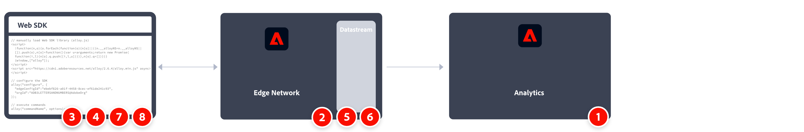

# Adobe Experience Platform Web SDK를 사용하여 Adobe Analytics 구현

[Adobe Experience Platform Web SDK](https://experienceleague.adobe.com/docs/experience-platform/tags/extensions/client/sdk/overview.html)를 사용하여 데이터를 Adobe Analytics로 전송할 수 있습니다. 이 구현 방법은 [XDM(경험 데이터 모델)](https://experienceleague.adobe.com/docs/experience-platform/xdm/home.html?lang=ko-KR)을 Analytics에서 사용하는 형식으로 변환하여 작동합니다.

Web SDK를 사용하여 직접 또는 태그의 Web SDK 확장을 통해 Experience Edge에 데이터를 전송할 수 있습니다.

## Web SDK

구현 작업의 개요:

<table style="width:100%">

<tr>
<th style="width:5%"></th><th style="width:60%"><b>작업</b></th><th style="width:35%"><b>추가 정보</b></th>
</tr>

<tr>
<td>1</td>
<td>다음을 확인하십시오 <b>보고서 세트 정의</b>.</td>
<td><a href="../../../admin/admin/c-manage-report-suites/report-suites-admin.md">보고서 세트 관리자</a></td>
</tr>

<tr>
<td>2</td>
<td><b>스키마 및 데이터 세트 설정</b>. Adobe Experience Platform을 활용하는 여러 애플리케이션에서 사용할 수 있도록 데이터 수집을 표준화하기 위해 Adobe은 개방적이고 공개적으로 문서화된 표준 XDM(Experience Data Model) 을 만들었습니다.</td>
<td><a href="https://experienceleague.adobe.com/docs/experience-platform/xdm/ui/overview.html?lang=ko-KR">스키마 UI 개요</a> 및 <a href="https://experienceleague.adobe.com/docs/experience-platform/catalog/datasets/user-guide.html?lang=ko">데이터 세트 UI 개요</a></td>
</tr>

<tr>
<td>3</td>
<td><b>데이터 레이어 만들기</b> 를 사용하여 웹 사이트에서 데이터 추적을 관리할 수 있습니다.</td>
<td><a href="../../prepare/data-layer.md">데이터 계층 만들기</a></td>
</tr>

<tr>
<td> 4</td>
<td><b>사전 빌드된 독립형 버전 설치</b>. 라이브러리를 참조할 수 있습니다(<code>alloy.js</code>)를 페이지에서 직접 CDN에 추가하거나 자체 인프라에서 다운로드하여 호스팅할 수 있습니다. 또는 NPM 패키지를 사용할 수 있습니다.</td>
<td><a href="https://experienceleague.adobe.com/docs/experience-platform/edge/fundamentals/installing-the-sdk.html?lang=en#option-2%3A-installing-the-prebuilt-standalone-version">사전 빌드된 독립형 버전 설치</a> 및 <a href="https://experienceleague.adobe.com/docs/experience-platform/edge/fundamentals/installing-the-sdk.html?lang=en#option-3%3A-using-the-npm-package">NPM 패키지 사용</a></td>
</tr>

<tr>
<td>5</td>
<td><b>데이터 스트림 구성</b>. 데이터 스트림은 Adobe Experience Platform Web SDK를 구현할 때 서버측 구성을 나타냅니다.</td>
<td><a href="https://experienceleague.adobe.com/docs/experience-platform/edge/datastreams/configure.html?lang=en">데이터 스트림 구성<a></td> 
</tr>

<td>6</td>
<td><b>Adobe Analytics 서비스 추가</b> 데이터 스트림에 추가 이 서비스는 Adobe Analytics으로 데이터를 전송할지 여부와 방법을 제어합니다.</td>
<td><a href="https://experienceleague.adobe.com/docs/experience-platform/edge/datastreams/configure.html?lang=en#analytics">데이터 스트림에 Adobe Analytics 서비스 추가</a></td>
</tr>

<tr>
<td>7</td>
<td><b>웹 SDK 구성</b>. 4단계에서 설치한 라이브러리가 데이터 스트림 ID(이전에 Edge 구성 ID( )로 제대로 구성되었는지 확인합니다<code>edgeConfigId</code>), 조직 id ( ))<code>orgId</code>) 및 기타 사용 가능한 옵션.</td>
<td><a href="https://experienceleague.adobe.com/docs/experience-platform/edge/fundamentals/configuring-the-sdk.html?lang=ko">웹 SDK 구성</a></td>
</tr>

<tr>
<td>8</td>
<td><b>명령 실행</b> 및/또는 <b>이벤트 추적</b>. 웹 페이지에 기본 코드가 구현되면 SDK를 사용하여 명령 및 이벤트 추적을 시작할 수 있습니다.
</td>
<td><a href="https://experienceleague.adobe.com/docs/experience-platform/edge/fundamentals/executing-commands.html?lang=en">명령 실행</a> 및 <a href="https://experienceleague.adobe.com/docs/experience-platform/edge/fundamentals/tracking-events.html?lang=en">이벤트 추적</a></td>
</tr>

<tr>
<td>9</td><td><b>구현 확장 및 유효성 검사</b> 프로덕션에 투입하기 전에</td><td></td> 
</tr>
</table>

## Web SDK 확장

구현 작업의 개요:

<table style="width:100%">

<tr>
<th style="width:5%"></th><th style="width:60%"><b>작업</b></th><th style="width:35%"><b>추가 정보</b></th>
</tr>

<tr>
<td>1</td>
<td>다음을 확인하십시오 <b>보고서 세트 정의</b>.</td>
<td><a href="../../../admin/admin/c-manage-report-suites/report-suites-admin.md">보고서 세트 관리자</a></td>
</tr>

<tr>
<td>2</td>
<td><b>스키마 및 데이터 세트 설정</b>. Adobe Experience Platform을 활용하는 여러 애플리케이션에서 사용할 수 있도록 데이터 수집을 표준화하기 위해 Adobe은 개방적이고 공개적으로 문서화된 표준 XDM(Experience Data Model) 을 만들었습니다.</td>
<td><a href="https://experienceleague.adobe.com/docs/experience-platform/xdm/ui/overview.html?lang=ko-KR">스키마 UI 개요</a> 및 <a href="https://experienceleague.adobe.com/docs/experience-platform/catalog/datasets/user-guide.html?lang=ko">데이터 세트 UI 개요</a></td>
</tr>

<tr>
<td>3</td>
<td><b>데이터 레이어 만들기</b> 를 사용하여 웹 사이트에서 데이터 추적을 관리할 수 있습니다.</td>
<td><a href="../../prepare/data-layer.md">데이터 계층 만들기</a></td>
</tr>

<tr>
<td>4</td>
<td><b>데이터 스트림 구성</b>. 데이터 스트림은 Adobe Experience Platform Web SDK를 구현할 때 서버측 구성을 나타냅니다.</td>
<td><a href="https://experienceleague.adobe.com/docs/experience-platform/edge/datastreams/configure.html?lang=en">데이터 스트림 구성<a></td> 
</tr>

<tr>
<td>5</td> 
<td><b>Adobe Analytics 서비스 추가</b> 데이터 스트림에 추가 이 서비스는 Adobe Analytics으로 데이터를 전송할지 여부와 방법을 제어합니다.</td>
<td><a href="https://experienceleague.adobe.com/docs/experience-platform/edge/datastreams/configure.html?lang=en#analytics">데이터 스트림에 Adobe Analytics 서비스 추가</a></td>
</tr>

<tr>
<td>6</td>
<td><b>태그 속성 만들기</b>. 속성은 태그 관리 데이터를 참조하는 데 사용되는 매우 중요한 컨테이너입니다.</td>
<td><a href="https://experienceleague.adobe.com/docs/experience-platform/tags/admin/companies-and-properties.html?lang=en#for-web">웹용 태그 속성 만들기 또는 구성</a></td>
</tr>

<tr>
<td>7</td> 
<td><b>웹 SDK 확장 설치 및 구성</b> 태그에 다음 코드를 배치하십시오. 4단계에서 구성된 데이터 스트림으로 데이터를 보내도록 Web SDK 확장을 구성합니다.</td>
<td><a href="https://experienceleague.adobe.com/docs/experience-platform/tags/extensions/client/sdk/overview.html?lang=en">Adobe Experience Platform 웹 SDK 확장 개요</a></td>
</tr>

<tr>
<td>8</td>
<td><b>반복, 유효성 검사 및 게시</b> 프로덕션에 추가할 수 있습니다. 웹 사이트에 태그 속성을 추가합니다. 그런 다음 데이터 요소, 규칙 등을 사용하여 구현을 사용자 지정합니다.</td>
<td><a href="https://experienceleague.adobe.com/docs/experience-platform/tags/publish/overview.html?lang=ko-KR">게시 개요</a></td>
</tr>

</table>

## 추가 리소스

태그는 높은 자유도로 사용자 정의할 수 있습니다. 구현에 적합한 데이터를 포함하여 Adobe Analytics를 최대한 활용할 수 있는 방법에 대해 자세히 알아봅니다.

- [태그 설명서](https://experienceleague.adobe.com/docs/experience-platform/tags/home.html#): 인터페이스의 작동 방식과 이요 가능한 확장 유형에 대해 알아봅니다.

- [Adobe Experience Platform 웹 SDK 설명서](https://experienceleague.adobe.com/docs/web-sdk.html?lang=ko)
