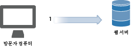
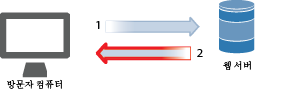
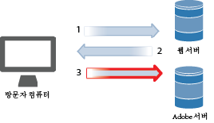
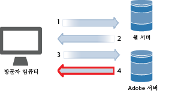
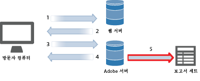
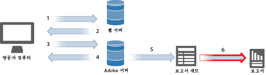
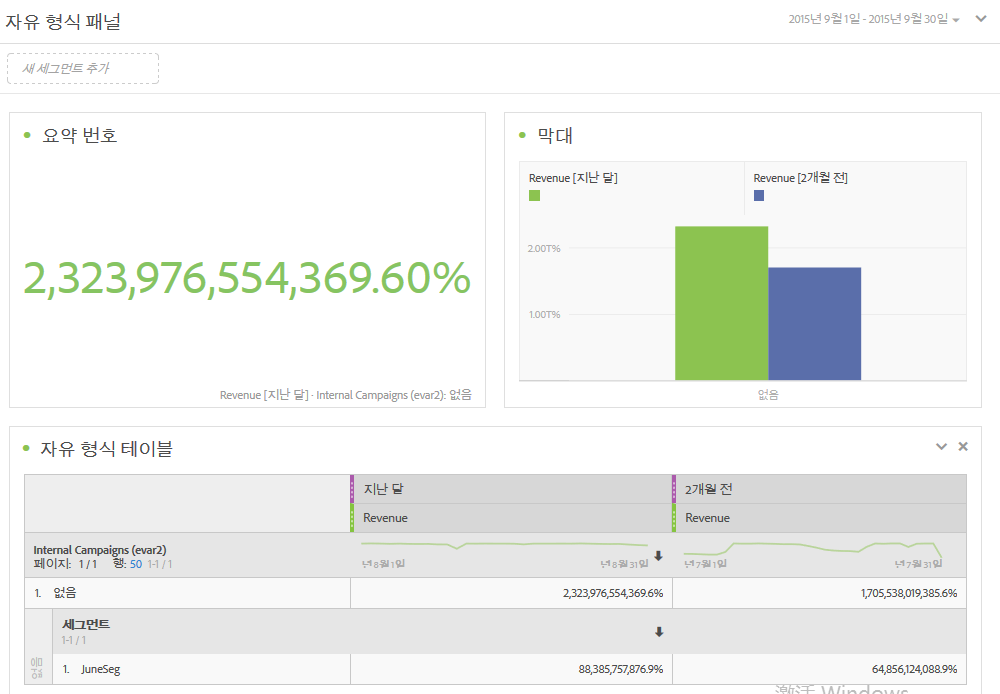

# 데이터 수집

웹 사이트 방문 수가 Adobe Analytics에서 보고서가 되는 방식에 대해 알아봅니다.

분석 데이터 컬렉션은 Adobe 데이터 컬렉션 서버에 특수한 이미지를 요청하여 수행됩니다. 대부분의 구현에서 JavaScript 코드는 추적 중인 웹 페이지에 배치됩니다. 태그가 지정된 웹 페이지가 방문자의 브라우저에 로드되면 브라우저에서 Adobe JavaScript 코드를 실행하여 방문자 정보를 캡처하고 태그를 올바르게 채우는 논리를 수행합니다. JavaScript가 처리하는 마지막 단계는 제출하는 데이터를 수집하고 작은 투명한 이미지를 방문자의 브라우저에 반환하는 분석 데이터 컬렉션 서버에 이미지를 요청하는 것입니다.

브라우저 처리에서 일반적인 병목은 웹 서버에서 페이지 요소(이미지 등)를 다운로드하는 데 걸리는 시간이므로 브라우저에서 JavaScript 코드를 실행하는 데 필요한 시간은 무시할 수 있습니다. 하지만 방문자의 브라우저가 Adobe 데이터 컬렉션 서버에서 이미지를 요청하는 마지막 단계는 총 페이지 다운로드 시간에 추가됩니다. 페이지 다운로드 시간에 미치는 전반적인 영향은 Adobe 데이터 컬렉션 서버에 대한 웹 사이트 방문자의 근접성(일반적으로 지리적 거리가 아닌 인터넷 홉 수)에 따라 결정됩니다.

Adobe는 Analytics에 데이터를 보낼 수 있는 여러 가지 방법을 개발했습니다. 이러한 방법은 다음 위치의 실시간 추적 정보를 포함합니다.

* 인터넷에 액세스할 수 있는 애플리케이션
* 캠페인
* 클라이언트-서버 애플리케이션
* 전자 메일
* 모바일 장치
* 웹 기반 키오스크
* 웹 사이트

<!-- 

Need to reconcile with Data Collection topics in the user guide, in this guide, and in reference. 

 -->

1. 방문자가 사이트에 도달하면 웹 서버에 요청이 만들어집니다.

   

1. 사이트의 웹 서버에서는 페이지 코드 정보를 보내고, 브라우저 페이지가 표시됩니다.

   

1. 페이지가 로드되고, Analytics JavaScript 코드가 실행됩니다.

   

   JavaScript 코드에서는 Adobe 서버에 이미지 요청을 보내고, 구현에서 정의한 변수, 지표 및 페이지 데이터를 전달합니다.

   **예제 JavaScript 코드:** JavaScript 코드가 웹 페이지의 본문 태그 내에 있습니다.

   

   **예제 이미지 요청:** 설명된 페이지 이름이 있는 이미지 요청의 조각: 

   

   >[!NOTE]
   >
   >각 이미지 요청에는 브라우저 캐싱을 방지하고 브라우저를 통해 후속 이미지 요청이 수행되었는지 확인하는 난수 문자열이 들어 있습니다.

1. Adobe에서 투명한 픽셀 이미지를 반환합니다.

   

   이 코드는 추가 정보(예: 운영 체제, 브라우저 종류, 브라우저 가로 및 세로, IP 주소 및 브라우저 언어)를 자동으로 수집합니다.

1. Adobe servers store web analysis data in *`report suites`* (your data repository).

   

   [보고서 세트](https://marketing.adobe.com/resources/help/en_US/reference/?f=report_suites_admin)는 선택한 웹 사이트, 웹 사이트 집합 또는 웹 페이지의 하위 집합에 대한 전체적이고 독립적인 보고를 정의합니다.

1. 보고서 세트 데이터는 웹 브라우저에서 액세스할 수 있는 보고서를 채웁니다.

   

   **예제 보고서:**

   

   JavaScript 코드 실행은 매우 신속하게 수행되며 페이지 로드 시간에 그다지 영향을 주지 않습니다. 이 접근 방식을 사용하면 캐시에서 페이지를 검색했을 때에도 JavaScript가 실행되므로 방문자가 **[!UICONTROL 다시 로드]**&#x200B;나 **뒤로]를 클릭하여 페이지에 도달했을 때 표시된 페이지를 계산할 수 있습니다.[!UICONTROL **

자세한 내용은:

* [데이터 수집](../../implement/js-implementation/data-collection/query-parameters.md)
* [데이터 요소 만들기](../../implement/c-implement-with-dtm/t-data-element.md#task_962EF08CE2AE49B3B739295F6E4792C2)
* [Data Warehouse](https://marketing.adobe.com/resources/help/en_US/reference/data_warehouse.html)
* [Ad Hoc Analysis](https://marketing.adobe.com/resources/help/en_US/dsc/c_getting_started.html)
* [데이터 소스](https://marketing.adobe.com/resources/help/en_US/whitepapers/ftp/ftp_datasources.html)
* [Data Connectors](https://marketing.adobe.com/resources/help/en_US/whitepapers/ftp/ftp_genesis.html)
* [Analytics 데이터 피드](/help/export/analytics-data-feed/c-getstarted/data-feed-overview.md)

>[!MORE_LIKE_THIS]
>       
>* [Experience Cloud Debugger](/help/implement/impl-testing/debugger.md)

