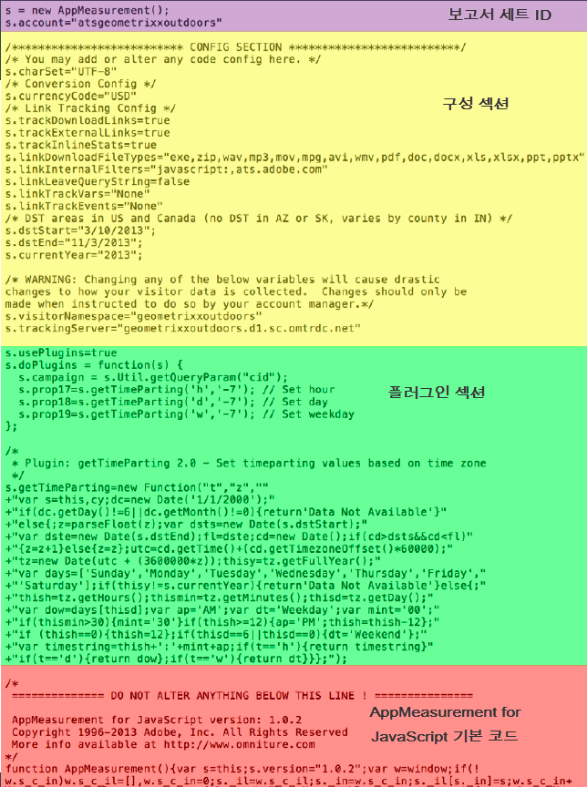

# Analytics 코드

데이터는 보고에 표시할 보고서 세트로 전송됩니다. 데이터를 Analytics로 보내는 가장 쉽고 일반적인 방법은 DTM 구현을 사용하는 것입니다. JavaScript 구현을 통해 코드를 입력할 수도 있습니다.

[!UICONTROL 다이내믹 태그 관리를] 사용하여 머리글 및 바닥글 코드를 만드는 방법에 대한 자세한 내용은 머리글 및 바닥글 코드 [추가를](../../implement/c-implement-with-dtm/c-headers-footers/t-header-footer-code.md#task_43C8DD699A514638B0620775C06423E5)참조하십시오.

Here is an example of [!DNL AppMeasurement] JavaScript file, showing the code parts:

