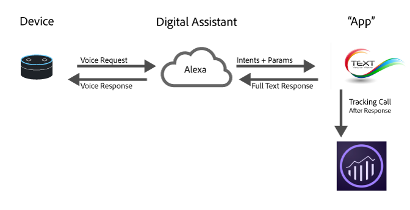

# Digital Assistant에 대한 분석 구현

<!-- 

<p>https://wiki.corp.adobe.com/display/mobileanalytics/Analytics+for+Digital+Assistants+Whitepaper </p> 
<p>https://marketing.adobe.com/resources/help/en_US/sc/implement/digital-assistants-white-paper.html </p> 
<p>Ticket: https://jira.corp.adobe.com/browse/AN-157750 </p>

 -->

클라우드 컴퓨팅, 기계 학습 및 자연 언어 처리 분야의 최근 기술 발전으로 디지털 도우미는 실패했던 "클리피" 시대를 벗어나 일상생활의 일부가 되고 있습니다. 소비자는 장치에 대고 "Alexa, 거실 조명 켜줘" 또는 "Okay Google, 밖의 날씨가 어때?"와 같이 말하기 시작했으며, 장치가 사람같이 자연스럽게 듣고, 이해하고, 응답할 것이라고 기대합니다.

디지털 도우미 플랫폼이 더욱 확실히 자리를 잡아가면서 관련 서비스 제공업체들은 사실적이며 실제와 같이 서비스를 소비자에게 제공할 수 있게 되었습니다. 예를 들면 소비자는 다음과 같은 작업을 요청할 수 있습니다.

* "Alexa, 자동차 오일을 바꿔야 하는지 확인해 봐."
* "Cortana, 내 결제 계좌의 잔액이 얼마야?"
* "Siri야, 내 뱅킹 앱에서 어제 저녁 값으로 존에게 20달러 보내 줘."

이 백서는 Adobe Analytics Cloud를 사용하여 이러한 유형의 환경을 측정하고 최적화하는 방법에 대한 개요를 제공합니다.

## Digital Experience Architecture 개요 {#concept_26AC08D291724223A943C80B1C6F2333}



오늘날 대부분의 Digital Assistant는 다음과 유사한 높은 수준의 아키텍처를 따릅니다.

1. **장치:** 사용자가 질문을 할 수 있는 마이크가 있는 장치(예: Amazon Echo 또는 전화기)가 있습니다.
1. **Digital Assistant:** 이 장치는 Digital Assistant를 구동하는 서비스와 상호 작용합니다. 이 서비스에서 많은 기능이 수행됩니다. 여기서 음성은 시스템이 이해할 수 있는 의도로 변환되고 요청 세부 사항이 구문 분석됩니다. 사용자의 의도를 이해한 경우 Digital Assistant가 의도 및 요청 세부 사항을 요청을 처리하는 앱에 전달합니다.
1. **"앱":** 앱은 전화기의 앱 또는 음성 앱일 수 있습니다. 앱이 요청에 응답합니다. 앱이 Digital Assistant에 응답하면 Digital Assistant가 사용자에게 응답합니다.

## Analytics 구현 위치 {#concept_F53A0566589042658DEA5B86B22C10CB}

Analytics를 구현하는 가장 적합한 위치 중 하나가 앱입니다. 앱이 Digital Assistant에서 [의도](../../implement/c-analytics-digital-assistants/digital-assistants-white-paper.md#section_BB339BDB5C3D40C6B5C426B0E092B48A) 및 의도에 대한 세부 사항을 받고 응답 방법을 결정합니다.

요청 라이프사이클 중에 Analytics Cloud를 호출하는 데 도움이 될 수 있는 경우가 두 번 있습니다.

1. 요청이 "앱"으로 전송될 때. 요청에 응답하기 전에 사용자에 대한 추가 컨텍스트가 필요한 경우 Audience Manager 기능을 활용하여 자신이 속한 세그먼트를 가져와야 합니다.
1. 앱에서 응답이 반환된 후. 향후 최적화를 위해 고객에게 발생한 사항을 기록하는 데 관심이 있다면 응답이 반환된 후 Adobe Analytics에 요청을 보냅니다. 이 방법으로 요청 내용에 대한 전체 컨텍스트와 시스템이 응답한 방식이 제공됩니다.

## 새 설치 {#section_FD63267479DB47C2A081244A3E65A0CC}

일부 Digital Assistant의 경우 누군가가 이 기술을 설치하면 알림을 받게 됩니다. 특히 인증이 포함된 경우 그러합니다. 지금은 *`Install`*&#x200B;컨텍스트 데이터를 `a.InstallEvent=1`로 설정하여 이벤트를 Adobe에 보내야 합니다. 이는 모든 플랫폼에서 사용할 수 있는 것은 아니지만 보존 상태를 확인할 때 유용합니다. 다음 코드 샘플은 *`Install`*, *`Install Date`*&#x200B;및 *`AppID`*.

**코드 샘플**

```
GET 
/b/ss/[rsid]/0?vid=[UserID]&c.a.InstallEvent=1&amp;c.a.InstallDate=2017-04-24&c.a.AppID=Spoofify1.0&c .OSType=Alexa&pageName=install 
HTTP/1.1 
Host:  
<xref href="https: sc.omtrdc.net="" " format="http"  scope="external">
  sc.omtrdc.net 
 Cache-Control: no-cache 
</xref href="https:>
```

## 여러 개의 Assistant 또는 여러 앱 {#section_81740741752E4142BE42DA4C9DDEEDF5}

여러 플랫폼용 앱을 개발할 수 있습니다. 가장 좋은 방법은 각 요청에 앱 ID를 포함하는 것입니다. 이는 `a.AppID` 컨텍스트 데이터에서 설정할 수 있습니다. Follow the format of `[AppName] [BundleVersion]`, for example, BigMac for Alexa 1.2

**코드 샘플**

```
GET /b/ss/[rsid]/0?vid=[UserID]&c.a.AppID=Spoofify1.0&c.a.Launches=1&c.Product=AmazonEcho&c.OSType=Alexa&pageName=install  HTTP/1.1 
Host: [prefix].sc.omtrdc.net 
Cache-Control: no-cache
```

```
 GET /b/ss/[rsid]/0?vid=[UserID]&c.a.AppID=Spoofify2.0&c.a.Launches=1&c.Product=GoogleHome&c.OSType=Android&pageName=install  HTTP/1.1 
Host: sc.omtrdc.net 
Cache-Control: no-cache
```

## 사용자/방문자 식별 {#section_7CE70FEB43C44B90954702CA30F87D58}

The Analytics Cloud uses the [Identity Service](https://marketing.adobe.com/resources/help/en_US/mcvid/) (ECID) service to tie interactions across time to the same person. Most of the digital assistants will return a *`userID`* that you can use to keep the activity for different users separate in the ECID service. 대부분의 경우 이 userID는 ECID 서비스로 전달해야 하는 것입니다. 일부 플랫폼은 Analytics 제한에서 허용하는 100자보다 긴 *`userID`* 를 반환합니다. If that is the case, Adobe recommends that you hash the *`userId`* to a fixed-length value using a standard hashing algorithm, such as MD5 or Sha1.

이 작업에 ECID 서비스를 사용할 수 있지만 이렇게 하면 다른 장치(예: Web to Digital Assistant)에 ECID를 매핑하려고 시도하는 경우에만 값을 제공합니다. 앱이 모바일 앱(예: 딥 링크)인 경우 SDK를 그대로 사용하여 정보를 전송해야 합니다. the *`userID`* 는 향상된 장치 결합을 위해 setCustomerID 메서드를 사용하여 ECID 서비스에 연결할 수 있습니다. However, if your app is a service, use the *`userID`* provided by the service as the ECID, as well as setting it in the setCustomerID. 이렇게 하면 사용자의 시간별 Digital Assistant 사용 방법을 볼 수 있습니다.

**코드 샘플**

```
GET /b/ss/[rsid]/0?vid=[UserID]&pageName=[intent]  HTTP/1.1 
Host: sc.omtrdc.net 
Cache-Control: no-cache
```

## 세션 {#section_BA4F996F976043B8993F2F7D24FE27FB}

Digital Assistant는 대화식이므로 세션의 개념이 있습니다. 예:

**소비자:** "Ok Google, 택시를 불러 줘."

**Google:** "예, 몇 시에 불러드릴까요?"

**소비자:** "오후 8시 30분"

**Google:** "좋습니다. 운전사가 오후 8시 30분에 도착할 것입니다."

이러한 세션은 컨텍스트를 유지하는 데 중요합니다. 더 많은 세부 사항을 수집하고 Digital Assistant를 보다 자연스럽게 개선합니다.

대화에 대한 Analytics를 구현할 때 새 세션이 시작되면 수행해야 하는 작업이 두 가지가 있습니다.

1. **Audience Manager에 연결:** 응답을 사용자 지정할 수 있도록 사용자가 속해 있는 관련 세그먼트를 가져옵니다. (예를 들면 이 사람은 현재 다중 채널 할인에 적격입니다.)
1. **새 세션 또는 실행 이벤트에 보내기:** Analytics에 첫 번째 응답을 보낼 때 실행 이벤트를 포함합니다. 일반적으로 `a.LaunchEvent=1`의 컨텍스트 데이터를 설정하여 보낼 수 있습니다.

**코드 샘플[!DNL Launch, by Adobe]**

```
GET /b/ss/[rsid]/0?vid=[UserID]&c.a.LaunchEvent=1&c.Intent=[intent]&pageName=[intent]  HTTP/1.1 
Host: sc.omtrdc.net 
Cache-Control: no-cache
```

## 의도 {#section_BB339BDB5C3D40C6B5C426B0E092B48A}

각 Digital Assistant에는 의도를 감지한 다음 "앱"에 그 의도를 전달하는 알고리즘이 있으므로 앱이 수행할 작업을 알고 있습니다. 이러한 의도는 요청의 간결한 표현입니다.

예를 들어, 사용자가 "Siri야, 내 뱅킹 앱에서 어제 저녁 값으로 존에게 20달러 보내 줘."라고 말하면 의도는 *`sendMoney`*.

이러한 각 요청을 eVar로 보내면 대화형 앱의 각 의도에 대한 경로 지정 보고서를 실행할 수 있습니다. 또한 "앱"이 의도 없이 요청을 처리할 수 있는지 확인하려고 합니다. 값을 공백으로 두지 않고 *`No Intent Specified`* 을 전달하는 것이 좋습니다.

**코드 샘플**

```
GET /b/ss/[rsid]/0?vid=[UserID]&c.a.AppID=Penmo1.0&c.a.LaunchEvent=1&c.Intent=SendPayment&pageName=[intent]  HTTP/1.1 
Host: sc.omtrdc.net 
Cache-Control: no-cache
```

또는 

```
GET /b/ss/[rsid]/0?vid=[UserID]&c.a.AppID=Penmo1.0&c.a.LaunchEvent=1&c.Intent=No_Intent_Specified&pageName=[intent]  HTTP/1.1 
Host: sc.omtrdc.net 
Cache-Control: no-cache
```

## 매개 변수/슬롯/엔티티 {#section_041CD1730F9E4096BE75DFF2CC810852}

의도 외에, Digital Assistant에는 의도 세부 사항을 제공하는 한 쌍의 키 값 세트가 있습니다. 이를 슬롯, 엔티티 또는 매개 변수라고 합니다. 예:

"Siri야, 내 뱅킹 앱에서 어제 저녁 값으로 존에게 20달러 보내 줘."에는 다음과 같은 매개 변수가 있습니다.

* Who = John
* Amount = 20
* Why = Dinner

일반적으로 앱에는 유한한 이러한 매개 변수 값이 있습니다. Analytics에서 이러한 매개 변수를 추적하려면 컨텍스트 데이터로 보낸 다음 각 매개 변수를 eVar에 매핑합니다.

**코드 샘플**

```
GET /b/ss/[rsid]/0?vid=[UserID]&c.a.AppID=Penmo1.0=1&c.a.LaunchEvent=1&c.Intent=SendPayment&c.Amount=20.00&c.Reason=Dinner&c.ReceivingPerson=John&c.Intent=SendPayment&pageName=[intent]  HTTP/1.1 
Host: sc.omtrdc.net 
Cache-Control: no-cache
```

## 세션 {#section_17D69D6B298E46E88E175F62F1ACD831}

모든 앱이 수익을 생성하지는 않지만, 성공적인 것으로 보이는 것에 대해 생각해 보고 이에 대한 몇 가지 측정값을 포함하는 것이 중요합니다. Adobe Analytics에서 사용자 동작과 함께 매출, 광고 노출 횟수 및 기타 성공 형식을 측정할 수 있습니다.

## 오류 상태 {#section_E8EFF8D610B24DC899C34E50B058864D}

Digital Assistant에서 처리 방법을 모르는 입력을 앱에 제공하는 경우가 있습니다. 예.

"Siri야, 내 뱅킹 앱에서 어제 저녁 값으로 존에게 20개의 가방을 보내 줘."

이 경우 앱이 명확한 설명을 요청해야 합니다. 또한 이와 같은 요청에 응답하는 경우에는 오류 발생 유형을 지정하는 evar와 함께 앱에 오류 상태가 있음을 나타내는 이벤트를 Analytics에 보내야 합니다.

입력이 올바르지 않은 오류와 "앱"에 문제가 있는 오류를 포함해야 합니다.

**코드 샘플**

```
GET /b/ss/[rsid]/0/?vid=[UserID]&c.a.AppID=Penmo1.0&c.Error=1&c.ErrorName=InvalidCurrency&pageName=[intent] HTTP/1.1 
Host: sc.omtrdc.net 
Cache-Control: no-cache
```

## 장치 기능 {#section_6770D82A3B0E4AD5A2172A7E67B0DF20}

대부분의 플랫폼은 사용자가 말한 실제 장치를 노출하지 않습니다. 장치의 기능을 사용 가능한 인터페이스(예: 오디오, 화면, 비디오 등)로 노출합니다. 이는 사용자와 상호 작용할 때 사용할 수 있는 컨텐츠 유형을 정의하므로 유용한 정보입니다. 인터페이스를 측정할 때는 이들을 연결하는 것이 가장 좋습니다.

예: `:Audio:Camera:Screen:Video:`

뒤 및 앞에 오는 콜론을 확인합니다. These help when creating segments (for example, give me all interactions with `:Audio:` capabilities).

Amazon 기능: [https://developer.amazon.com/public/solutions/alexa/alexa-skills-kit/docs/alexa-skills-kit-interface-reference](https://developer.amazon.com/public/solutions/alexa/alexa-skills-kit/docs/alexa-skills-kit-interface-reference)

Google 기능: [https://developers.google.com/actions/assistant/surface-capabilities](https://developers.google.com/actions/assistant/surface-capabilities)

## Digital Assistants에 대한 Analytics 보고 {#concept_265BC8E99C5545D0A9B9412C11EE58CC}

Digital Assistant 앱이 구현되면 이 앱에서 Adobe Analytics의 전체 기능을 사용할 수 있습니다. 다음은 Analytics로 수행할 수 있는 작업의 몇 가지 예입니다.

## 의도 모니터링 {#section_6632D9F2EF9045A7A1A4263D3561C78F}

대부분의 앱에는 여러 가지 의도와 수행할 수 있는 다양한 작업이 있습니다. [!UICONTROL 분석 작업 공간을] 사용하여 인스턴스 및 사용자별 상위 의도를 추적할 수 있습니다.

<!-- 

<p>--- Image of Intents --- </p>

 -->

이렇게 하면 가장 자주 사용하는 기능을 확인하고 새로운 기능의 채택을 볼 수 있습니다.

## 오류가 있는 요청 {#section_CF1A79003E784F88A03F4EEF6CDC7A7C}

오류를 모니터링하여 사용자에게 문제가 발생하는 공통 위치가 있는지 여부를 확인할 수 있습니다.

<!-- 

<p>--- Image of Errors --- </p>

 -->

## 이벤트 간 흐름 {#section_08FA8EBD384D41ED8CA52EFE438C8CD2}

수행할 가장 강력한 작업 중 하나는 의도 흐름을 확인하는 것입니다. 이는 두 가지 방법에서 유용합니다. 먼저 대화에서 사람들이 의도 간에 이동하는 방법을 세션 내에서 찾을 수 있습니다. 두 번째로, 사용자가 오랜 기간 후에 의도의 흐름을 보는 방법을 살펴보고 "앱" 사용이 어떻게 진화하고 있는지 알 수 있습니다.

## 예 {#concept_2B13D5E7A8E042D1A4B7BB80BBAACD12}

**사전 설치된 앱**

<table id="table_70BF4E41D0BE4482BD925FB3A1768CE0"> 
 <thead> 
  <tr> 
   <th colname="col1" class="entry"> 사람 </th> 
   <th colname="col2" class="entry"> 장치 응답 </th> 
   <th colname="col3" class="entry"> 작업/의도 </th> 
   <th colname="col4" class="entry"> 요청 받기 </th> 
   <th colname="col5" class="entry"> 분석 데이터 </th> 
  </tr> 
 </thead>
 <tbody> 
  <tr> 
   <td colname="col1"> <p> Spoofify 재생 </p> </td> 
   <td colname="col2"> <p> "좋아 Spoofify 재생해 줘" </p> </td> 
   <td colname="col3"> <p> 재생 </p> </td> 
   <td colname="col4"> <p> 
     <code>/b/ss/ [rsid]/0 을 얻으셨습니까? vid = [userid] &amp; c. a. appid = Spoofify 1.0 &amp; c. a. launchevent = 1 &amp; c. intent = play &amp; pagename = playapp HTTP/1.1 
 호스트: sc. omtrdc. net 
 캐시 제어: 캐시 없음 </code>
  </p> </td> 
   <td colname="col5"> <p> 
     <ul id="ul_E80B0BBEBE764023BB9B49FE5F15B918"> 
      <li id="li_9BC2CCABB0ED4246A57C37633666CDE2">방문자 ID </li> 
      <li id="li_1E7F9E979A3D49CE90899CE82C70BCD0">앱 버전 </li> 
      <li id="li_C4BD7653B0FA47F6A3E4F1FF18138F10">실행 수 </li> 
      <li id="li_B7FA47CBD75747E8A8A25E228C90E524">의도 </li> 
      <li id="li_48274BA200704730A22C85FD682AE3B0">응답 </li> 
     </ul> </p> </td> 
  </tr> 
  <tr> 
   <td colname="col1"> <p> 노래 변경 </p> </td> 
   <td colname="col2"> <p> "어떤 노래를 원하시나요?" </p> </td> 
   <td colname="col3"> <p> ChangeSong </p> </td> 
   <td colname="col4"> <p> 
     <code>/b/ss/ [rsid]/0 을 얻으셨습니까? vid = [userid] &amp; c. a. appid = Spoofify 1.0 &amp; c. intent = changesong &amp; pagename = askforsong HTTP/1.1 
 호스트: sc. omtrdc. net 
 캐시 제어: 캐시 없음 </code>
  </p> </td> 
   <td colname="col5"> <p> 
     <ul id="ul_AE8CF669F06547FDA68801F20BD8CBCE"> 
      <li id="li_5A03E41891AF4F37A3BE05BC11F197BC">방문자 ID </li> 
      <li id="li_435FF7DEB169466E8C3F9258C91315D1">앱 버전 </li> 
      <li id="li_AB2B602D9DC74B3D951A0942B6CF8B39">의도 </li> 
      <li id="li_C9F87F3BB7104C9C978BB046C5DB9092">*빈 재생 목록 </li> 
      <li id="li_FB762962468A44A18DF93488EC2CB848">응답 </li> 
     </ul> </p> </td> 
  </tr> 
  <tr> 
   <td colname="col1"> <p> 셀린 디온의 "My Heart Will Go On" 재생해 줘 </p> </td> 
   <td colname="col2"> <p> "좋아, 셀린 디온의 'My Heart Will Go On' 재생해 줘" </p> </td> 
   <td colname="col3"> <p> ChangeSong </p> </td> 
   <td colname="col4"> <p> 
     <code>/b/ss/ [rsid]/0 을 얻으셨습니까? vid = [userid] &amp; c. a. appid = Spoofify 1.0 &amp; c. intent = changeplaylist &amp; pagename = actionplaysong &amp; c. songid = [012345] HTTP/1.1 
 호스트: sc. omtrdc. net 
 캐시 제어: 캐시 없음 </code>
  </p> </td> 
   <td colname="col5"> <p> 
     <ul id="ul_2AFEE1E928A8499E96B1BC6C5CC21F81"> 
      <li id="li_4BDF8093373A4DA1BB24A608FAC5B7CF">방문자 ID </li> 
      <li id="li_79B4FACCD333472EB9FC1F94B904AFB4">앱 버전 </li> 
      <li id="li_3EDAB6208CB24213A934167BD08BD1AE">의도 </li> 
      <li id="li_C8E6609F9E0A45A8AED15F73374F40B2">노래 ID </li> 
      <li id="li_C4D99387C4D748189E15476F5E03BB76">응답 </li> 
     </ul> </p> </td> 
  </tr> 
  <tr> 
   <td colname="col1"> <p> 재생 목록 변경 </p> </td> 
   <td colname="col2"> <p> "네, 어떤 재생 목록을 원하세요?" </p> </td> 
   <td colname="col3"> <p> ChangePlaylist </p> </td> 
   <td colname="col4"> <p> 
     <code>/b/ss/ [rsid]/0 을 얻으셨습니까? vid = [userid] &amp; c. a. appid = Spoofify 1.0 &amp; c. intent = changeplaylist &amp; pagename = askforplaylist HTTP/1.1 
 호스트: sc. omtrdc. net 
 캐시 제어: 캐시 없음 </code>
  </p> </td> 
   <td colname="col5"> <p> 
     <ul id="ul_913CF31C3EB34BDB819AD54D28F9DE5D"> 
      <li id="li_93036A142FB34A73A95B8AB114EA99C3">방문자 ID </li> 
      <li id="li_F699CDD7866C4EB4BECFF0FAA4689736">앱 버전 </li> 
      <li id="li_6AB1FF7ED6A247FAA8922390410F2F5F">의도 </li> 
      <li id="li_9DF30E2E1958468783FF753D014F1A5F">*빈 재생 목록 </li> 
      <li id="li_B1106A51B8CD49DD8B566B946176F854">응답 </li> 
     </ul> </p> </td> 
  </tr> 
  <tr> 
   <td colname="col1"> <p> 어셔 재생 </p> </td> 
   <td colname="col2"> <p> "어셔 재생해 줘" </p> </td> 
   <td colname="col3"> <p> ChangePlaylist </p> </td> 
   <td colname="col4"> <p> 
     <code>/b/ss/ [rsid]/0 을 얻으셨습니까? vid = [userid] &amp; c. a. appid = Spoofify 1.0 &amp; c. intent = changeplaylist &amp; pagename = actionplayplaylist &amp; c. playlist = Usher HTTP/1.1 
 호스트: sc. omtrdc. net 
 캐시 제어: 캐시 없음 </code>
  </p> </td> 
   <td colname="col5"> <p> 
     <ul id="ul_B70E7C9BEFA54C2FA8B7485F9BC7CEE7"> 
      <li id="li_2B0319D20189497D8C9981F871D4FBC4">방문자 ID </li> 
      <li id="li_78C28F34FC7C41589EB111ADCC5A0D66">앱 버전 </li> 
      <li id="li_8ACF819CF80E4E8F942E0903DF75AE33">의도 </li> 
      <li id="li_49F407E43F474356A5F131F82B6C4EB9">재생 목록 </li> 
      <li id="li_7380EC51B0DE420EB5DD48BCE21B0567">응답 </li> 
     </ul> </p> </td> 
  </tr> 
  <tr> 
   <td colname="col1"> <p> 음악 끄기 </p> </td> 
   <td colname="col2"> <p> *응답 없음, 음악 끄기 </p> </td> 
   <td colname="col3"> <p> 꺼짐 </p> </td> 
   <td colname="col4"> <p> 
     <code>/b/ss/ [rsid]/0 을 얻으셨습니까? vid = [userid] &amp; c. a. appid = Spoofify 1.0 &amp; c. intent = off &amp; pagename = turnsoffmusic HTTP/1.1 
 호스트: sc. omtrdc. net 
 캐시 제어: 캐시 없음 </code>
  </p> </td> 
   <td colname="col5"> <p> 
     <ul id="ul_BCA19F2A98CC42788A23E668B260F553"> 
      <li id="li_12A9DA8684B2479D90F3C357AE4F1D15">방문자 ID </li> 
      <li id="li_9E543F7F12D247D0900E5B1BE8EB0F61">앱 버전 </li> 
      <li id="li_9627816FE3594C418EC52DAD42501BCA">의도 </li> 
      <li id="li_5D59C5D8D0F34F5193F592A867AE5639">응답 </li> 
     </ul> </p> </td> 
  </tr> 
 </tbody> 
</table>

**사용자가 앱을 설치해야 함**

<table id="table_C178E3A2C87043A0A2B8C365869102A3"> 
 <thead> 
  <tr> 
   <th colname="col1" class="entry"> 사람 </th> 
   <th colname="col2" class="entry"> 장치 응답 </th> 
   <th colname="col3" class="entry"> 작업/의도 </th> 
   <th colname="col4" class="entry"> 요청 받기 </th> 
   <th colname="col5" class="entry"> 분석 데이터 </th> 
  </tr> 
 </thead>
 <tbody> 
  <tr> 
   <td colname="col1"> <p> Spoofify 설치 </p> </td> 
   <td colname="col2"> <p> *응답 없음 </p> </td> 
   <td colname="col3"> <p> 설치 </p> </td> 
   <td colname="col4"> <p> 
     <code>/b/ss/ [rsid]/0 을 얻으셨습니까? vid = [userid] &amp; amp; amp; c. a. installevent = 1 &amp; c. a. installdate = 2017-04-24 &amp; c. a. appid = Spoofify 1.0 &amp; c. ostype = Alexa &amp; c. intent = install &amp; pagename = install HTTP/1.1 
 호스트: sc. omtrdc. net 
 캐시 제어: 캐시 없음 </code>
  </p> </td> 
   <td colname="col5"> <p> 
     <ul id="ul_83A7731E5EA84477906AF4BFB3B50F48"> 
      <li id="li_A23A342B0D5745B3854B90ADFDD15EB2">방문자 ID </li> 
      <li id="li_E2F89B771B5F445B995E30C7E76BF2D2">날짜 </li> 
      <li id="li_03378BC9365F4020B7E28461AFDCB160">의도 </li> 
      <li id="li_6E1ECC9AF55141D1857688DA6A33DEEA">OS 버전 </li> 
      <li id="li_A4D06A0DFBC247499D9586F6B76571C4">응답 </li> 
     </ul> </p> </td> 
  </tr> 
  <tr> 
   <td colname="col1"> <p> Spoofify 재생 </p> </td> 
   <td colname="col2"> <p> "좋아 Spoofify 재생해 줘" </p> </td> 
   <td colname="col3"> <p> 재생 </p> </td> 
   <td colname="col4"> <p> 
     <code>/b/ss/ [rsid]/0 을 얻으셨습니까? vid = [userid] &amp; c. a. appid = Spoofify 1.0 &amp; c. a. launchevent = 1 &amp; c. intent = play &amp; pagename = playapp HTTP/1.1 
 호스트: sc. omtrdc. net 
 캐시 제어: 캐시 없음 </code>
  </p> </td> 
   <td colname="col5"> <p> 
     <ul id="ul_8FCA2B1357A8496DAF563775F019404F"> 
      <li id="li_78E84586A5284164B5B577B68A113394">방문자 ID </li> 
      <li id="li_977915DC425A43BDA69D9F76ADFBAB0C">앱 버전 </li> 
      <li id="li_12725E1D4540485B8A3DB2EC82C6AD4C">실행 수 </li> 
      <li id="li_5B7F4487682241C38071A7037157F473">의도 </li> 
      <li id="li_A6AC81D56BF44E07B2FC0F2740CAB237">응답 </li> 
     </ul> </p> </td> 
  </tr> 
  <tr> 
   <td colname="col1"> <p> 노래 변경 </p> </td> 
   <td colname="col2"> <p> "어떤 노래를 원하시나요?" </p> </td> 
   <td colname="col3"> <p>ChangeSong </p> </td> 
   <td colname="col4"> 
    <code>/b/ss/ [rsid]/0 을 얻으셨습니까? vid = [userid] &amp; c. a. appid = Spoofify 1.0 &amp; c. intent = changesong &amp; pagename = askforsong HTTP/1.1 
 호스트: sc. omtrdc. net 
 캐시 제어: 캐시 없음 </code>
  </td> 
   <td colname="col5"> <p> 
     <ul id="ul_C0FCB407A1344527A532A1EAEF0387E4"> 
      <li id="li_8905BCF15F0F493D90B5F1135AEC149C">방문자 ID </li> 
      <li id="li_2D1FAAF35CE24CE49D1AE3F24E4A5A86">앱 버전 </li> 
      <li id="li_A7D11680A9554414878E6CBD03B66DC4">의도 </li> 
      <li id="li_64308721D00441FBB7E6EA6EDF93C100">*빈 재생 목록 </li> 
      <li id="li_A1B2C4E27F9E4B61AAA6373DA8CEB8F2">응답 </li> 
     </ul> </p> </td> 
  </tr> 
  <tr> 
   <td colname="col1"> <p> 셀린 디온의 "My Heart Will Go On" 재생해 줘 </p> </td> 
   <td colname="col2"> <p> "좋아, 셀린 디온의 'My Heart Will Go On' 재생해 줘" </p> </td> 
   <td colname="col3"> <p> ChangeSong </p> </td> 
   <td colname="col4"> 
    <code>/b/ss/ [rsid]/0 을 얻으셨습니까? vid = [userid] &amp; c. a. appid = Spoofify 1.0 &amp; c. intent = changeplaylist &amp; pagename = actionplaysong &amp; c. songid = [012345] HTTP/1.1 
 호스트: sc. omtrdc. net 
 캐시 제어: 캐시 없음 </code>
  </td> 
   <td colname="col5"> <p> 
     <ul id="ul_5D782E44875144BF96877897E1180D18"> 
      <li id="li_CB5009ED407A4D4ABF3AAFE73133CC66">방문자 ID </li> 
      <li id="li_D15D65E315964E0CBF75A87CF3FCF9B5">앱 버전 </li> 
      <li id="li_055D7621BE1D44BA8B8C50E2E45DA6DF">의도 </li> 
      <li id="li_1D52C0AB9C12483E9CD7DC216D809E44">노래 ID </li> 
      <li id="li_5CFB748D02E84050AE216FDC55C680E2">응답 </li> 
     </ul> </p> </td> 
  </tr> 
  <tr> 
   <td colname="col1"> <p> 재생 목록 변경 </p> </td> 
   <td colname="col2"> <p> "네, 어떤 재생 목록을 원하세요?" </p> </td> 
   <td colname="col3"> <p> ChangePlaylist </p> </td> 
   <td colname="col4"> 
    <code>/b/ss/ [rsid]/0 을 얻으셨습니까? vid = [userid] &amp; c. a. appid = Spoofify 1.0 &amp; c. intent = changeplaylist &amp; pagename = askforplaylist HTTP/1.1 
 호스트: sc. omtrdc. net 
 캐시 제어: 캐시 없음 </code>
  </td> 
   <td colname="col5"> <p> 
     <ul id="ul_7167AE13BBC64CC99E4A81B1FF6C9208"> 
      <li id="li_15554F7C8AC3487797A2FB65C8C1E636">방문자 ID </li> 
      <li id="li_11254FBCFA60436FB705D5FE4C313CC5">앱 버전 </li> 
      <li id="li_4F3AE5B191DB4E73A2C08065A3D75188">의도 </li> 
      <li id="li_7F03D76A26254E65AAEB8E7D647895CA">*빈 재생 목록 </li> 
      <li id="li_DFB50E6BCEAF440D942B30A56CDD1503">응답 </li> 
     </ul> </p> </td> 
  </tr> 
  <tr> 
   <td colname="col1"> <p> 어셔 재생 </p> </td> 
   <td colname="col2"> <p> "어셔 재생해 줘" </p> </td> 
   <td colname="col3"> <p> ChangePlaylist </p> </td> 
   <td colname="col4"> 
    <code>/b/ss/ [rsid]/0 을 얻으셨습니까? vid = [userid] &amp; c. a. appid = Spoofify 1.0 &amp; c. intent = changeplaylist &amp; pagename = actionplayplaylist &amp; c. playlist = Usher HTTP/1.1 
 호스트: sc. omtrdc. net 
 캐시 제어: 캐시 없음 </code>
  </td> 
   <td colname="col5"> <p> 
     <ul id="ul_BE5815D13CFA48408B4612D220356518"> 
      <li id="li_716EA824A56241A282FD1774A51CF52C">방문자 ID </li> 
      <li id="li_02CC3C2A66E44BB4BA865893F3206A6C">앱 버전 </li> 
      <li id="li_558B15EC8605495B8DC01E644602FC4F">의도 </li> 
      <li id="li_21599097A3B14E368693C77CC7BA8ADD">재생 목록 </li> 
      <li id="li_70F4254A33704DA18D4D22028A1656E4">응답 </li> 
     </ul> </p> </td> 
  </tr> 
  <tr> 
   <td colname="col1"> <p> 음악 끄기 </p> </td> 
   <td colname="col2"> <p> *응답 없음, 음악 끄기 </p> </td> 
   <td colname="col3"> <p> 꺼짐 </p> </td> 
   <td colname="col4"> 
    <code>/b/ss/ [rsid]/0 을 얻으셨습니까? vid = [userid] &amp; c. a. appid = Spoofify 1.0 &amp; c. intent = off &amp; pagename = turnsoffmusic HTTP/1.1 
 호스트: sc. omtrdc. net 
 캐시 제어: 캐시 없음 </code>
  </td> 
   <td colname="col5"> <p> 
     <ul id="ul_C623E19496DD466DA299AD610CE5ED1D"> 
      <li id="li_6A7AEF89A74C431C84D107E4F23AE223">방문자 ID </li> 
      <li id="li_B8CFF6AAB2E2476786026A98337589AF">앱 버전 </li> 
      <li id="li_534596CB56B24B729AAA801A7B4D9D31">의도 </li> 
      <li id="li_CA3328E5FFF442BAA0F11C51DF2ED53F">응답 </li> 
     </ul> </p> </td> 
  </tr> 
 </tbody> 
</table>

