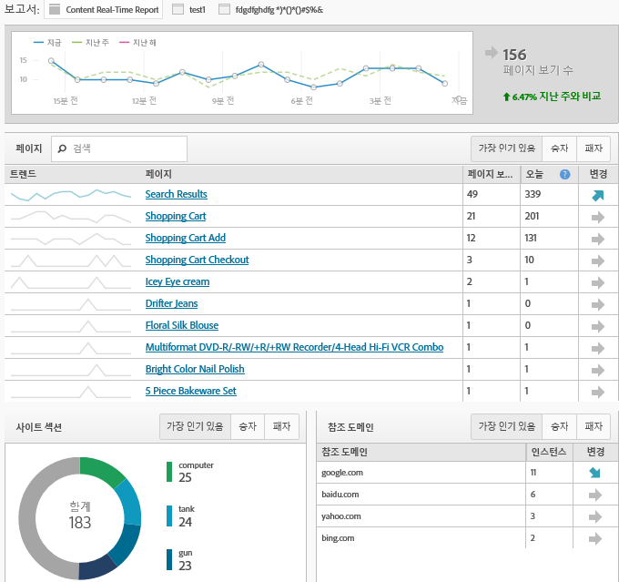

# 간소화된 구현 방식

Adobe Analytics 구현을 구현하기 위한 최초 고객 환경에 대해 알아보십시오.

<!-- 

https://activation.adobedtm.com/index.php?redirected=1 

 -->

New users can quickly create your first [!DNL Analytics] report suite (data repository) using this *`Getting Started with Adobe Analytics`* setup modal. Then, you can deploy [!DNL Analytics] code using [!DNL Dynamic Tag Management].

[!DNL Dynamic Tag Management] 사이트를 매번 변경하지 않고도 Adobe Analytics 구현을 관리할 수 있습니다. 모바일 앱을 구현하는 경우 앱에서 중요한 데이터 수집을 시작하는 데 필요한 SDK를 받을 수 있습니다.

이 절차에서 다음을 수행할 수 있습니다.

* 첫 번째 [보고서 세트](https://marketing.adobe.com/resources/help/en_US/analytics/getting-started/report-suites.html)를 빠르게 만듭니다.
* Deploy [!DNL Analytics] and the [Identity Service](https://marketing.adobe.com/resources/help/en_US/mcvid/).

* 기본 페이지 수준 데이터에서 보고서를 실행합니다.

>[!NOTE]
>
>Before you begin, verify that Analytics is [enabled in the Adobe Experience Cloud](https://marketing.adobe.com/resources/help/en_US/mcloud/core_services.html) (the solution provisioning process). Enterprise Dashboard에서 Analytics에 로그인하라는 이메일 초대를 받으면 사전 요구 사항을 완료한 것입니다.

**간단한 구현 양식을 실행하려면**

1. Log in to the [!DNL Adobe Experience Cloud] ( [experiencecloud.adobe.com](https://experiencecloud.adobe.com)).

   [!DNL Analytics]에 액세스하면 시스템이 사용자에게 보고서 세트가 있는지 판단합니다. 없는 경우 [!UICONTROL Adobe Analytics 시작하기] 페이지가 표시됩니다.

   

   Alternatively, you can run this setup in [!DNL Analytics] by clicking **[!UICONTROL Help]** &gt; **[!UICONTROL Welcome to Adobe Analytics]**.

1. 비즈니스에 대한 다음 기본 정보를 제공합니다. 

   <table id="table_1741878A1B284CB78D297D531DC703D6"> 
     <thead> 
      <tr> 
       <th colname="col1" class="entry"> 요소 </th> 
       <th colname="col2" class="entry"> 설명 </th> 
      </tr> 
     </thead>
     <tbody> 
      <tr> 
       <td colname="col1"> 
속성 유형 
 </td> 
       <td colname="col2"> 
웹, 모바일 또는 두 가지 모두에 대한 구현입니까? 
 </td> 
      </tr> 
      <tr> 
       <td colname="col1"> 
업종 
 </td> 
       <td colname="col2"> 
회사가 수익을 얻는 방식을 지정합니다(제품, 고객 서비스, 리드, 브랜드 인지도, 광고). 
 </td> 
      </tr> 
      <tr> 
       <td colname="col1"> 
데이터 레이어 
 </td> 
       <td colname="col2"> 
(권장) 정보를 저장하는 데 사용된 JavaScript 배열. 다이내믹 태그 관리를 사용하여 자동 설정을 수행하는 경우 데이터 레이어를 사용하게 됩니다. 
 
For a blog on data layers, see <a href="https://blogs.adobe.com/digitalmarketing/analytics/data-layers-buzzword-best-practice/" format="http" scope="external"> Data Layer: From Buzzword to Best Practice</a>. 
 </td> 
      </tr> 
      <tr> 
       <td colname="col1"> 
데이터 저장소(보고서 세트) 
 </td> 
       <td colname="col2"> 
 <a href="https://marketing.adobe.com/resources/help/en_US/analytics/getting-started/report-suites.html" format="html" scope="external">보고서 세트</a>는 일반적으로 한 속성(사이트 또는 앱)이나 브랜드에 해당하는 개별 데이터 세트입니다. 각 보고서 세트에는 고유한 보고서와 지표 세트가 있습니다. 
 </td> 
      </tr> 
      <tr> 
       <td colname="col1"> 
시간대 
 </td> 
       <td colname="col2"> 
현지 표준 시간대. (자동으로 감지됨) 
 </td> 
      </tr> 
      <tr> 
       <td colname="col1"> 
예상 페이지 보기 수 
 </td> 
       <td colname="col2"> 
사이트가 일별로 받는 대략적인 페이지 보기 수. 
 </td> 
      </tr> 
      <tr> 
       <td colname="col1"> 
기본 통화 
 </td> 
       <td colname="col2"> 
거래하는 통화. 
 </td> 
      </tr> 
     </tbody> 
    </table>

1. Click **[!UICONTROL Next]**.

   시스템에서 보고서 세트를 만듭니다.

1. To begin deployment, click **[!UICONTROL Next]**, then click one of the following options:

   <table id="table_71C7F7B9677346CD8D5130519D32464B"> 
     <thead> 
      <tr> 
       <th colname="col1" class="entry"> 요소 </th> 
       <th colname="col2" class="entry"> 설명 </th> 
      </tr> 
     </thead>
     <tbody> 
      <tr> 
       <td colname="col1"> 
배포 
 </td> 
       <td colname="col2"> 
 Analytics에 로그인하고 배포할 수 있는 다이내믹 태그 관리를 시작합니다. This process automatically implements the  AppMeasurement.js file and the Identity Service ( VisitorAPI.js). 
 
 
중요: 새 브라우저 탭에 다이내믹 태그 관리를 통해 Adobe Analytics 배포를 안내하는 도움말 페이지가 표시됩니다. 
 
 </td> 
      </tr> 
      <tr> 
       <td colname="col1"> 
다운로드 
 </td> 
       <td colname="col2"> 
 설치 파일 INSTALL-ME &lt;report suite name&gt;.js를 다운로드합니다. 이 옵션은 <a href="https://marketing.adobe.com/resources/help/en_US/sc/implement/js_implementation.html" format="html" scope="external">JavaScript 구현</a>을 이해하는 고급 사용자용입니다. 
 
 
중요: 코드 다운로드는 Analytics 배포를 구성하지 않습니다. 이 배포는 사이트의 페이지에서 또는 Adobe 컨설팅 서비스를 통해 수행하는 수동 배포입니다. 
 
 </td> 
      </tr> 
     </tbody> 
    </table>

1. 보고서 실행.

   Analytics 도구를 배포한 후 보고 및 분석에서 보고서를 실행하여 데이터가 사이트에 도달하는지 확인할 수 있습니다. (Analytics 인터페이스에 대한 자세한 내용은 [로그인 및 탐색](https://marketing.adobe.com/resources/help/en_US/analytics/getting-started/analytics-navigation.html)을 참조하십시오.)

   For example, a **[!UICONTROL Site Metrics]** &gt; **[!UICONTROL Real-Time]** lets you see immediate data.

   >[!NOTE]
   >
   >[!UICONTROL 실시간] 보고서에는 실행 전에 일부 구성이 필요합니다. [실시간 보고서 구성](https://marketing.adobe.com/resources/help/en_US/reference/t_realtime_admin.html)을 참조하십시오.

**예제 실시간 보고서**

