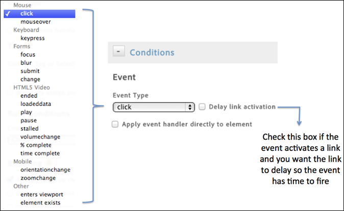

# 이벤트 기반 규칙 조건 만들기

조건은 언제 이벤트 기반 규칙이 트리거되는지 결정합니다.

1. 마우스 클릭이나 양식 제출과 같이 추적할 상호 작용 유형을 선택합니다.

   

   자세한 내용은 Adobe Tag Management 제품 설명서에서 [이벤트 유형](https://marketing.adobe.com/resources/help/en_US/dtm/event_types.html)을 참조하십시오.

1. 다음 옵션을 필요에 따라 활성화합니다.

   | 요소 | 설명 |
   |--- |--- |
   | 링크 활성화 지연 | 이벤트가 링크를 활성화하고, 이벤트를 실행할 시간이 되기 전까지 링크가 지연되기를 원할 경우 비활성화합니다. |
   | 이벤트 핸들러를 요소에 바로 적용 | 타깃팅된 특정 요소에 이벤트 처리기를 적용합니다. 이 설정은 브라우저의 버블링 및 계층화 개념과 연결되어 있습니다. |

   For example, when you click an image inside an anchor tag like ``, you might expect the click to be associated with the anchor tag, because the tag is in the bubble stream. However, when you inspect the click in the developer tools, the click may actually affect only the `` tag. To ensure that the event is handled correctly, associate the click with the `` tag and do not depend on the browser to bubble up the click to a parent element. An event like a click can potentially bubble up to `<body>`. 이벤트가 실제로 연결되는 위치를 이해하고, 규칙이 올바로 실행되도록 명확하게 타깃팅하는 것은 중요합니다.

   *버블링*&#x200B;은 이벤트가 캡처되어 가장 안쪽의 요소에 의해 처리된 후 외부 요소로 전파됨을 의미합니다.

1. 추적할 태그의 이름과 태그에 있는 일치시킬 추가적인 속성을 가리킵니다.

   

   올바른 요소 태그 찾기에 대한 자세한 내용은 다이내믹 태그 관리 제품 설명서에서 [CSS 선택기 사용](https://marketing.adobe.com/resources/help/en_US/dtm/css-selector.html)을 참조하십시오.

1. 규칙에 연결할 추가적인 기준이나 조건 유형을 선택하여 설정합니다.

   

1. 이벤트 버블링에 대한 기본 설정을 가리킵니다.

   이벤트 버블링은 HTML DOM에서 이벤트 전파의 한 방식입니다.

   | 만약 ... | 다음 옵션을 확인하십시오 |
   |--- |--- |
   | 식별한 규칙 선택기의 하위 요소에 있는 관련 상호 작용이 규칙을 실행하도록 하려는 경우 | 하위 요소에 대한 이벤트의 버블링 허용와 같은 것일 수 있습니다. |
   | 하위 요소가 이미 자신의 이벤트를 트리거했다면 버블링이 되지 않도록 하려는 경우 | 이미 하위 요소에 의해 이벤트가 실행되는 경우 허용하지 않음 |
   | 식별한 규칙 선택기의 이벤트가 이벤트 계층 구조에서 요소 자체를 넘지 않도록 하려는 경우. | 이벤트가 상위까지 위쪽으로 버블링하는 것을 허용하지 않음. |
