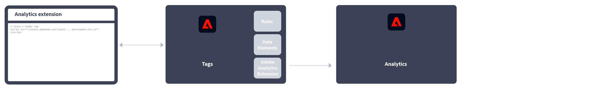

# Adobe Analytics 구현

Adobe의 데이터를 데이터 수집 서버에 전송하려면 사이트 또는 앱에 코드가 있어야 합니다. 다음 절차는 일반적인 구현의 작동 방식을 나타냅니다.

1. 방문자가 사이트에 도달하면 웹 서버에 요청이 만들어집니다.
2. 사이트의 웹 서버에서는 페이지 코드 정보를 보내고, 브라우저 페이지가 표시됩니다.
3. 페이지가 로드되고, Analytics JavaScript 코드가 실행됩니다.
JavaScript 코드가 이미지 요청을 Adobe 데이터 수집 서버로 전송합니다. 구현에서 정의한 페이지 데이터는 이 이미지 요청에서 쿼리 문자열의 일부로 전송됩니다.

4. Adobe에서 투명한 픽셀 이미지를 반환합니다.
5. Adobe 서버는 수집된 데이터를 하나 이상의 *보고서 세트*&#x200B;에 저장합니다.
6. 보고서 세트 데이터는 웹 브라우저에서 액세스할 수 있는 보고서를 채웁니다.

JavaScript 코드 실행은 매우 신속하게 수행되며 페이지 로드 시간에 그다지 영향을 주지 않습니다. 이 접근 방식을 사용하면 캐시에서 페이지를 검색했을 때에도 JavaScript가 실행되므로 방문자가 **[!UICONTROL 다시 로드]**&#x200B;나 **[!UICONTROL 뒤로]**&#x200B;를 클릭하여 페이지에 도달했을 때 표시된 페이지를 계산할 수 있습니다.

Adobe Analytics에서 데이터 수집 서버에 데이터를 전송하려면 웹 사이트, 모바일 앱 또는 기타 애플리케이션 내에 코드가 있어야 합니다. 플랫폼과 조직의 요구 사항에 따라 이 코드를 구현하는 방법에는 몇 가지가 있습니다.

## 웹 사이트 구현 방법

사용자 **웹 사이트**&#x200B;를 사용하는 경우 다음 구현 방법을 사용할 수 있습니다.

* **웹 SDK 확장**: 새 고객을 위한 Adobe Analytics 구현을 위한 표준화된 권장 방법입니다. 설치 **AEP 웹 SDK 확장** Adobe Experience Platform 데이터 수집에서 **태그**&#x200B;를 채울 때는 각 페이지에서 로더 태그를 사용하고 데이터를 Adobe Experience Platform으로 보냅니다 **에지 네트워크** 조직에 편리한 형식으로 제공됩니다. Edge Network는 들어오는 데이터를 올바른 형식으로 Adobe Analytics에 전달합니다.
   
자세한 내용은 [Adobe Experience Platform Web SDK 확장을 사용하여 Adobe Analytics 구현](./aep-edge/overview.md) 추가 정보.

* **웹 SDK**: Adobe Experience Platform 데이터 수집을 사용하지 않으려면 사이트에서 웹 SDK 라이브러리를 수동으로 로드할 수 있습니다. 웹 SDK 라이브러리 참조(`alloy.js`)을 클릭하여 원하는 추적 호출을 Adobe Experience Platform에 보냅니다. **에지 네트워크** 조직에 편리한 형식으로 제공됩니다. Edge Network는 들어오는 데이터를 올바른 형식으로 Adobe Analytics에 전달합니다.
   
자세한 내용은 [Adobe Experience Platform Web SDK를 사용하여 Adobe Analytics 구현](./aep-edge/overview.md) 추가 정보.

* **Analytics 확장**: 설치 **Adobe Analytics 확장** Adobe Experience Platform 데이터 수집에서 **태그**. 각 페이지에 로더 태그를 배치하고 Adobe Analytics 확장을 사용하여 각 변수가 정의된 방식을 결정합니다. 태그의 편의성을 원하지만 Edge Network 인프라를 사용하지 않으려는 경우 이 구현 방법을 사용하십시오.
   
자세한 내용은 [Analytics 확장을 사용하여 Adobe Analytics 구현](launch/overview.md) 추가 정보.

* **기존 JavaScript**: Adobe Analytics를 구현하는 과거의 수동 방법입니다. AppMeasurement 라이브러리 참조(`AppMeasurement.js`)를 클릭하여 구현에 사용되는 변수와 설정의 개요를 지정합니다.
   
이 구현 방법은 사용자 지정 코드를 사용하는 구현에 유용할 수 있으며, 다음 코드를 사용할 때에도 여전히 좋습니다.

   * [클릭 수준 activity map 데이터](../analyze/activity-map/activity-map.md),

   * [스트리밍 미디어 측정](https://experienceleague.adobe.com/docs/media-analytics/using/media-overview.html?lang=ko-KR),

   * [실시간 스트리밍 API 또는 실시간 스트리밍 트리거](https://github.com/AdobeDocs/analytics-1.4-apis/blob/master/docs/live-stream-api/getting_started.md),

   * [AMP 페이지 추적](./other/amp.md)
   자세한 내용은 [JavaScript용 AppMeasurement를 사용하여 Adobe Analytics 구현](js/overview.md) 추가 정보.

다음 결정 흐름은 구현 방법을 선택하는 데 도움이 될 수 있습니다.

>[!TIP]
>
>현재 상황에 따라 선택할 구현에 대한 조언 및 모범 사례는 Adobe에 문의하십시오.

## 모바일 앱 구현 방법

사용자 **모바일 앱**&#x200B;를 사용하는 경우 다음 구현 방법을 사용할 수 있습니다.

* **모바일 SDK 확장**: 모바일 앱에서 Adobe Analytics을 구현하는 표준화된 권장 방법입니다. 전용 라이브러리를 사용하여 모바일 앱 내에서 데이터를 Adobe으로 쉽게 전송할 수 있습니다. 설치 **Adobe Experience Platform Mobile SDK 확장** Adobe Experience Platform 데이터 수집에서 **태그** 앱에서 올바른 코드를 구현하여 라이브러리를 가져오고, 확장을 등록하고, 태그 구성을 로드합니다. 이렇게 하면 데이터가 Adobe Experience Platform으로 전송됩니다 **에지 네트워크** 조직에 편리한 형식으로 제공됩니다. Experience Edge는 들어오는 데이터를 올바른 형식으로 Adobe Analytics에 전달합니다.
   

   자세한 내용은 [Adobe Experience Platform Mobile SDK를 사용하여 Adobe Analytics 구현](../implement/aep-edge/mobile-sdk/overview.md) 추가 정보.

* **Analytics 확장**: 설치 **Adobe Analytics 확장** Adobe Experience Platform 데이터 수집에서 **태그**를 클릭하고 애플리케이션에서 올바른 코드를 구현하여 라이브러리를 가져오고 확장을 등록하고 태그 구성을 로드합니다. Analytics 확장을 사용하여 각 변수가 정의된 방식을 결정합니다. Adobe Experience Platform 데이터 수집의 편의성을 원하지만 Adobe의 Experience Platform Edge 네트워크 인프라를 사용하지 않으려는 경우 이 구현 방법을 사용하십시오.
   

   자세한 내용은 [Analytics 확장을 사용하여 Adobe Analytics 구현](../implement/aep-edge/mobile-sdk/overview.md) 추가 정보.

>[!CAUTION]
>
>버전 4 Mobile SDK에 대한 지원은 2021년 8월 31일에 종료되었습니다. 자세한 내용은 [버전 4 Mobile SDK의 지원 종료 FAQ](https://developer.adobe.com/client-sdks/documentation/v4-end-of-life-faq/)를 참조하십시오.

## 주요 Analytics 구현 문서

* [기존 Adobe Analytics 구현 관리](/help/implement/prepare/existing-implementation.md)
* [Adobe Debugger](validate/debugger.md)
* [Experience Platform의 태그 속성 만들기](launch/create-analytics-property.md)
* [AppMeasurement 업데이트](appmeasurement-updates.md)

## 기타 Analytics 사용 안내서

[Analytics 사용 안내서](https://experienceleague.adobe.com/docs/analytics.html)

## 주요 Analytics 리소스

* [고객 지원 문의](https://experienceleague.adobe.com/?support-solution=Analytics#support)
* [Analytics 포럼](https://experienceleaguecommunities.adobe.com/t5/adobe-analytics/ct-p/adobe-analytics-community)
* [Adobe Analytics 리소스](https://experienceleaguecommunities.adobe.com/t5/adobe-analytics-discussions/adobe-analytics-resources/m-p/276666)
