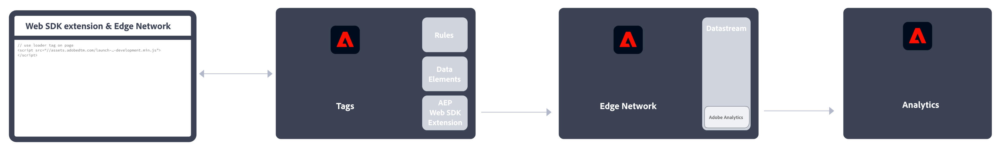

# Adobe Analytics 구현

Adobe Analytics에서 데이터 수집 서버에 데이터를 전송하려면 웹 사이트, 모바일 앱 또는 기타 애플리케이션 내에 코드가 있어야 합니다. 플랫폼과 조직의 요구 사항에 따라 이 코드를 구현하는 방법에는 몇 가지가 있습니다.

## 웹 사이트 구현 방법

**웹 사이트**&#x200B;의 경우 다음 구현 방법을 사용할 수 있습니다.

### 클라이언트측

* **Web SDK 확장 기능**: 새 고객을 위한 Adobe Analytics 구현에 권장되는 표준화된 방법입니다. Adobe Experience Platform 데이터 수집 **태그**&#x200B;에 **Adobe Experience Platform 웹 SDK 확장 기능**&#x200B;을 추가한 다음 각 페이지에 로더 태그를 배치합니다. 태그는 Adobe Experience Platform **Edge Network**&#x200B;로 데이터를 전송하고, 여기에서 해당 데이터를 Adobe Analytics로 전달합니다.
  
[Adobe Experience Platform Web SDK 확장을 사용하여 Adobe Analytics을 구현하는 방법](./aep-edge/overview.md)을 참조하세요. 설명서를 참조하십시오.

* **Web SDK**: Adobe Experience Platform 데이터 수집을 사용하지 않으려면 사이트에서 Web SDK 라이브러리를 수동으로 로드할 수 있습니다. 각 페이지에서 Web SDK 라이브러리(`alloy.js`)를 참조하고 원하는 추적 호출을 조직에 편리한 형식으로 Adobe Experience Platform **Edge Network**&#x200B;에 전송합니다. Edge Network는 해당 데이터를 Adobe Analytics로 전달합니다.
  
자세한 내용은 [Adobe Experience Platform Web SDK을 사용하여 Adobe Analytics을 구현하는 방법](./aep-edge/overview.md)을 참조하십시오.

* **Analytics 확장 기능**: Adobe Experience Platform 데이터 수집 **태그**&#x200B;에 **Adobe Analytics 확장 기능**&#x200B;을 추가한 다음 각 페이지에 로더 태그를 배치합니다. 태그는 데이터를 Adobe Analytics로 직접 전송합니다. 태그의 편리함을 원하지만 Edge Network 인프라는 사용하고자 하지 않는 경우 이 구현 방법을 사용하십시오.
  
자세한 내용은 [Analytics 확장을 사용하여 Adobe Analytics을 구현하는 방법](launch/overview.md)을 참조하십시오.

* **기존 JavaScript**: Adobe Analytics를 구현하는 과거의 수동 방법입니다. 각 페이지에서 AppMeasurement 라이브러리(`AppMeasurement.js`)를 참조한 다음 JavaScript에서 변수와 설정을 지정하십시오.
  
이 구현 방법은 사용자 지정 코드를 사용하는 구현에 유용할 수 있으며 [AMP 페이지](other/amp.md)와 같이 다른 곳에서 제공되지 않는 구현 유형에 이상적입니다.

다음은 클라이언트측 구현 방법을 선택하는 데 도움이 될 수 있는 결정 흐름입니다.

>[!TIP]
>
>현재 상황에 따라 선택할 구현에 대한 조언과 모범 사례는 Adobe 계정 팀에 문의하십시오.

### 서버측

Adobe Analytics를 서버측에 구현할 때에는 다음과 같은 옵션이 있습니다.

* **Edge Network API**: Adobe Experience Platform Edge Network API를 사용하는 서버에 코드를 구현하여 데이터스트림을 통해 Adobe Analytics와 통신합니다.
  
자세한 내용은 [Adobe Experience Platform Edge Network API를 사용하여 Adobe Analytics 구현](/help/implement/aep-edge/api/overview.md)을 참조하십시오.

* **(일괄) 데이터 삽입 API**: Adobe Analytics (일괄) 데이터 삽입 API를 사용하여 서버측 데이터를 Adobe Analytics로 직접 수집합니다.
  
자세한 내용은 [데이터 삽입 API](../import/c-data-insertion-api/c-data-insertion-api.md)를 참조하십시오.

## 모바일 앱 구현 방법

**모바일 앱**&#x200B;의 경우 다음 구현 방법을 사용할 수 있습니다.

* **Mobile SDK 확장 기능**: 모바일 앱에서 Adobe Analytics를 구현하기 위한 표준화된 권장 방법입니다. 모바일 앱 내에서 데이터를 Adobe에 쉽게 전송할 수 있는 전용 라이브러리를 사용합니다. Adobe Experience Platform 데이터 수집 **태그**&#x200B;에 **Adobe Experience Platform Mobile SDK 확장 기능**&#x200B;을 추가한 다음 앱에 Mobile SDK 라이브러리를 구현합니다. SDK를 사용하여 라이브러리를 가져오고, 확장 기능을 등록하고, 태그 구성을 로드할 수 있습니다. Adobe Experience Platform **Edge Network**&#x200B;로 데이터를 전송하십시오. 그러면 Edge에서 해당 데이터를 Adobe Analytics로 전달합니다.
  

  자세한 내용은 [Adobe Experience Platform Mobile SDK를 사용하여 Adobe Analytics 구현](../implement/aep-edge/mobile-sdk/overview.md)을 참조하십시오.

* **Analytics 확장 기능**: Adobe Experience Platform 데이터 수집 **태그**&#x200B;에 **Adobe Analytics 확장 기능**&#x200B;을 추가한 다음 앱에 Mobile SDK 라이브러리를 구현합니다. SDK를 사용하여 라이브러리를 가져오고, 확장 기능을 등록하고, 태그 구성을 로드할 수 있습니다. 이 구현 방법에서는 데이터를 Adobe Analytics로 직접 전송합니다. Adobe Experience Platform 데이터 수집의 편리함을 원하지만 Adobe의 Experience Platform Edge 네트워크 인프라는 사용하고자 하지 않는 경우 권장됩니다.
  

  자세한 내용은 [Analytics 확장 기능을 사용하여 Adobe Analytics 구현](../implement/aep-edge/mobile-sdk/overview.md)을 참조하십시오.

>[!CAUTION]
>
>이전 버전의 Adobe 모바일 SDK에 대한 지원에 대해서는 [SDK 지원 종료 공지](https://developer.adobe.com/client-sdks/resources/sdks-end-of-support/)를 참조하시기 바랍니다.

## 주요 Analytics 구현 문서

* [기존 Adobe Analytics 구현 관리](/help/implement/prepare/existing-implementation.md)
* [Adobe Debugger](validate/debugger.md)
* [Experience Platform의 태그 속성 만들기](launch/create-analytics-property.md)
* [AppMeasurement 업데이트](appmeasurement-updates.md)
* [Platform Web SDK 튜토리얼을 사용하여 Adobe Analytics 설정](https://experienceleague.adobe.com/docs/platform-learn/implement-web-sdk/applications-setup/setup-analytics.html)
* [모바일 앱에서 Adobe Experience Cloud 구현 자습서](https://experienceleague.adobe.com/docs/platform-learn/implement-mobile-sdk/overview.html?lang=ko-KR)

## 주요 Analytics 리소스

* [고객 지원 문의](https://experienceleague.adobe.com/?support-solution=Analytics#support)
* [Experience League의 Adobe Analytics 커뮤니티](https://experienceleaguecommunities.adobe.com/t5/adobe-analytics/ct-p/adobe-analytics-community)
* [Adobe Analytics 리소스](https://experienceleaguecommunities.adobe.com/t5/adobe-analytics-discussions/adobe-analytics-resources/m-p/276666)
* [최신 릴리스 정보](../release-notes/latest.md)
