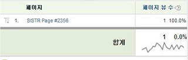

# 변수 값에 공백 사용

HTML에는 공백을 만드는 문자가 몇 개 있습니다.

이런 문자에는 공백, 탭 및 캐리지 리턴(또는 줄 바꿈)이 있습니다. 다음 예를 생각해 보십시오.

```js
<head> 
 <title> 
   Home Page 
 </title> 
</head> 
<body> 
<script language="javascript"> 
 s.pageName=document.title 
</script> 
```

이 경우, document.title은 [!UICONTROL s.pageName]을 채우고, 이 변수는 "Home Page"라는 값을 받습니다. "Home Page" 앞의 공백에 주목하십시오. 모든 브라우저가 같은 방식으로 이러한 공백을 해석하지는 않습니다. 결과는 아래 두 예 중 하나일 수 있습니다.

```js
s.pageName="Home Page"
```

```js
s.pageName="        Home Page"
```

첫 번째 값은 올바로 표시되지만, 두 번째 값은 텍스트 앞에 공백이 표시됩니다. [!DNL Analytics]는 이 값들을 [!UICONTROL s.pageName] 변수에 대한 별개의 값들로 처리합니다. [!DNL Analytics] 인터페이스는 두 번째 값에서 앞의 공백을 제거합니다. 그 결과 보고서가 아래와 같이 표시됩니다.



이 구현 오류로 인해 변수 값이 여러 라인 항목에 걸쳐 나누어집니다. [!DNL SAINT]는 키 값에서 선행 공백을 허용하지 않습니다. 이것은 이 문제가 사이트에 영향을 주고 있을 경우 해결책으로서 여러 라인 항목을 그룹화하는 데 사용할 수 없음을 의미합니다. 문제를 해결하는 유일한 방법은 원하는 변수 값을 사전에 처리하여(이 경우, document.title 속성) 모든 선행(또는 후행) 공백을 제거하는 것입니다.

위의 예에서는 document.title 속성에 [!UICONTROL s.pageName] 변수를 사용합니다. document.title을 페이지 이름으로 사용하지 않는 것이 좋습니다. 이 문제는 [!UICONTROL s.pageName] 변수 외의 다른 변수에도 영향을 줍니다. 값에 선행/후행 공백이 있는 모든 변수가 영향을 받을 수 있습니다.
