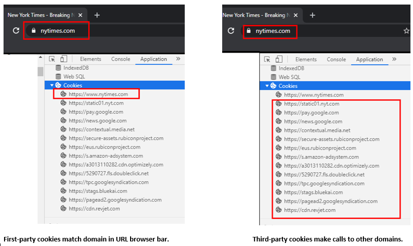
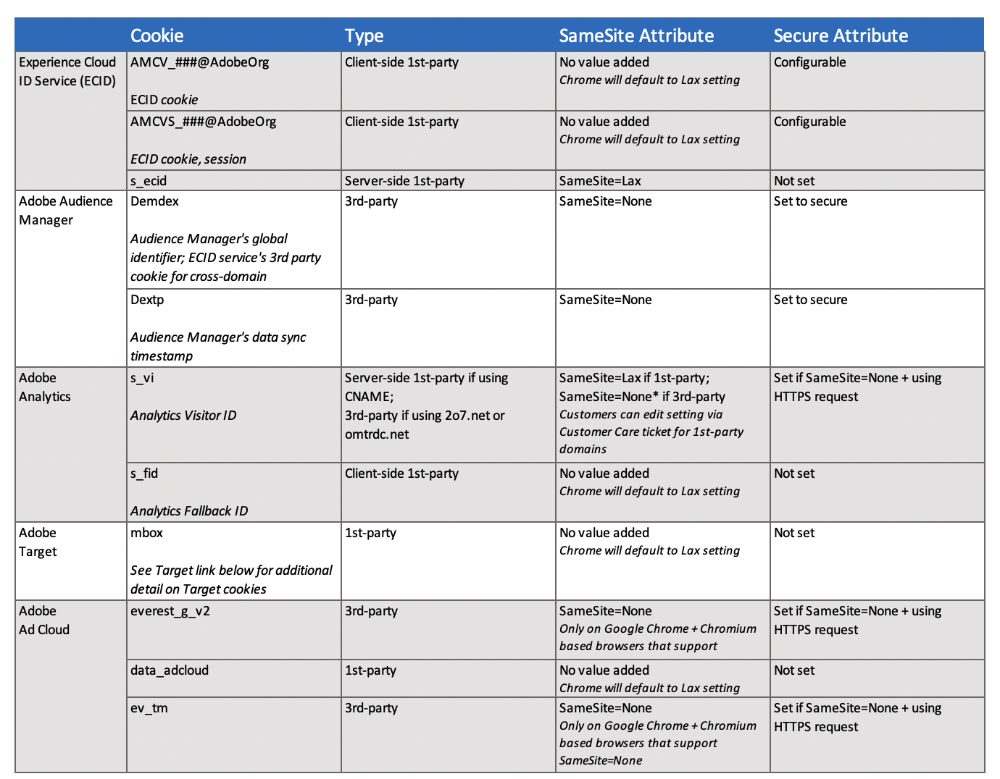

# 브라우저 및 Analytics 쿠키 FAQ

Adobe Analytics는 속성 및 솔루션 간에 지속적인 사용자 식별을 지원하기 위해 브라우저가 쿠키를 처리하는 방식에 대한 변화에 응답합니다. 다음 FAQ에서는 브라우저 쿠키가 변경되더라도 지속적인 방문자 식별이 유지되는 방법에 대한 정보를 제공합니다.

## 브라우저가 쿠키를 처리하는 방식을 어떻게 변경합니까?

일반적으로 대부분의 브라우저는 타사 쿠키를 보유하는 방식에서 점점 더 제약을 받고 있습니다. 쿠키가 브라우저에서 삭제되거나 거부된 경우 추적에 영향을 줄 수 있습니다. Safari 브라우저는 일부 퍼스트 파티 쿠키에 대한 일부 제한을 추가로 설정하고 있습니다.

다음 목록은 브라우저에 따라 변경된 몇 가지 최근 내용을 보여줍니다.

* Chrome:Chrome 80부터, 이 `SameSite` 속성은 타사 쿠키 또는 사이트 간 요청을 관리하기 위해 다르게 처리됩니다. 궁극적으로 Chrome 개발자는 타사 쿠키를 [모두](https://blog.chromium.org/2020/01/building-more-private-web-path-towards.html?m=1) 사용 중단하는 방법을 찾고 있습니다.

* Firefox 및 Edge:제품 발표에서는 후속 버전의 브라우저가 Chrome 80에서 수행한 것과 동일한 변경 사항을 따르도록 되어 있습니다.

* Safari: With [Safari 12.1](https://webkit.org/blog/category/privacy/), first party persistent cookies set through the document.cookie API, often known as “client-side” cookies, have their expiration capped at seven days.

## 타사 쿠키와 자사 쿠키의 차이는 무엇입니까?

### 자사 쿠키

퍼스트 파티 쿠키는 고객 웹 사이트(도메인별)에서 생성되며, 사용자가 고객 웹 사이트를 방문할 때 클라이언트 브라우저에 저장됩니다. 모든 브라우저는 일반적으로 퍼스트 파티 쿠키를 허용합니다. 퍼스트 파티 쿠키 Analytics 구현에서 방문자 ID 쿠키는 CNAME을 사용하여 호스트 이름이 도메인과 조정되면 Adobe 노드에서 [생성됩니다](https://docs.adobe.com/content/help/en/id-service/using/reference/analytics-reference/cname.html). 그러면 브라우저에서 퍼스트 파티 컨텍스트에서 쿠키를 수락합니다. 자세한 내용은 [퍼스트 파티 쿠키](https://docs.adobe.com/content/help/en/core-services/interface/ec-cookies/cookies-first-party.html)정보를 참조하십시오.

### 타사 쿠키

타사 쿠키는 사용자가 방문하는 웹 사이트에 의해 만들어지지 않습니다. 브라우저가 현재 모든 타사 쿠키를 동일하게 처리하고 그에 따라 저장하지만 타사 쿠키 자체는 다른 중요한 방식으로 작동할 수 있습니다. 고객의 Analytics 타사 쿠키 구현을 통해 클라이언트는 Adobe만을 호출하고 알 수 없거나 의심스러운 타사 도메인을 호출하지 않습니다. 이 방법은 보안(HTTPS)을 위한 Analytics를 구현하고 영구 식별자를 사용하여 신뢰할 수 있는 추적을 구현하는 현재의 방법입니다. 이 메서드는 AppMeasurement.js 파일을 구성하여 구현됩니다. 자세한 내용은 쿠키 및 [경험 플랫폼 ID 서비스를 참조하십시오](https://docs.adobe.com/content/help/en/id-service/using/intro/cookies.html).

## 현재 브라우저가 Analytics 쿠키를 저장하고 관리하려면 어떻게 해야 합니까?

구현에 따라 Analytics 쿠키는 다음과 같이 저장됩니다.

### 타사 쿠키 구현

현재 브라우저는 Adobe [demdex.net](https://docs.adobe.com/content/help/en/audience-manager/user-guide/reference/demdex-calls.html) ID를 타사 쿠키로 저장합니다. 이 쿠키는 도메인 간에 영구 식별자를 제공하며 보안(https) 컨텐츠를 허용합니다.

### 자사 쿠키 구현

CNAME을 구성하면 사용자는 브라우저에 대한 퍼스트 파티 쿠키 컨텍스트에서 Adobe 쿠키를 수신할 수 있습니다. 타사 쿠키 구현이 사용자에게 적합하지 않은 경우 이 옵션은 실행 가능한 옵션입니다.

## SameSite 쿠키 속성은 무엇이며 Analytics에 어떤 영향을 줍니까?

Chrome 80 브라우저, Firefox 및 Edge 브라우저 릴리스에서 SameSite 쿠키 속성은 다음과 같이 크로스 사이트 요청의 동작을 제어하기 위해 세 가지 다른 값에 대한 사양을 적용합니다.

* `None`:이 설정을 사용하면 크로스 사이트 액세스를 지원하고 쿠키를 서드 파티 컨텍스트에서 전달할 수 있습니다. 이 속성을 지정하려면 모든 브라우저 요청도 HTTPS를 `Secure` 따라야 합니다. 예를 들어, 쿠키를 설정할 때 다음과 같이 속성 값을 쌍으로 묶습니다. `Set-Cookie: example_session=test12; SameSite=None; Secure`Adobe 제대로 레이블이 지정되지 않으면 쿠키는 최신 브라우저에서 사용할 수 없으며 거부됩니다.

* `Lax`:사이트 간 요청이 *안전한* `GET`(예: 읽기 전용) HTTP 메서드를 사용하는 최상위 수준 탐색에 대해서만 동일한 사이트 쿠키를 사용하여 전송되도록 허용합니다.

* `Strict`:타사 웹 사이트 요청에 대해 동일한 사이트 쿠키가 전송되지 않습니다. 쿠키의 사이트가 URL 막대의 사이트와 일치하는 경우에만 쿠키가 전송됩니다.

이러한 브라우저 버전의 기본 동작은 지정된 `SameSite` 속성이 없는 쿠키를 `SameSite=Lax`과 동일하게 처리하는 것입니다.

## Adobe Analytics는 이러한 변화에 어떻게 대응합니까?

모든 Adobe 쿠키 업데이트는 Adobe 서버를 통해 처리되며 Adobe는 해당 쿠키 속성을 설정하기 위해 Edge Server를 업데이트했습니다. Adobe는 해당 속성을 사용하여 타사 쿠키를 설정하기 위한 서버측 업데이트를 발표했습니다. 사이트에 JavaScript 업데이트가 필요하지 않습니다.

Adobe Edge Server에 의한 이 업그레이드는 사용자가 쿠키가 사용되는 모든 웹 사이트를 방문할 때 자동으로 수행됩니다. 대부분의 Adobe 제품의 경우 Chrome 80이 릴리스되면 쿠키에 적절한 플래그가 지정됩니다. 단, 서드파티 데이터 수집을 사용하고 ECID(Experience Cloud Identity Service)를 사용하지 않는 Adobe Analytics 구현은 예외입니다. 이러한 고객은 재방문자로 태그가 지정되었을 수 있는 새로운 방문자가 일시적으로 증가할 수 있습니다.

Google이 쿠키를 잘못 처리했다고 식별한 브라우저의 경우, `SameSite` 대신 `None`설정이 해제된 상태로 `SameSite` 남습니다.

다음 표에는 Analytics 쿠키가 요약되어 있습니다.

## Chrome, Firefox 및 Edge의 변경 사항을 위해 사이트를 준비하는 가장 좋은 방법은 무엇입니까?

Analytics 고객은 JavaScript 구성이 Adobe 서비스 호출에 HTTPS를 사용하고 있는지 확인해야 합니다. ECID는 HTTPS 끝점으로 타사 HTTP 호출을 리디렉션하여 지연을 증가시킬 수 있지만 구성을 변경할 필요는 없습니다.

Adobe는 모든 사이트 페이지가 HTTPS로 제공되도록 하는 것이 좋습니다.

### 여러 도메인을 위한 CNAME 1개

웹 사이트와 동일한 도메인에 설정된 CNAME 구현이 있는 경우 퍼스트 파티 쿠키 컨텍스트가 되므로 변경할 필요가 없습니다.

그러나 여러 도메인을 소유하고 있고 모든 도메인에서 데이터 수집에 동일한 CNAME을 사용하는 경우 다른 도메인에서 타사 쿠키로 처리됩니다. Chrome 80은 이러한 다른 도메인에서 더 이상 표시되지 않습니다. 모든 브라우저에서 비헤이비어가 보다 유사하도록 하기 위해 Analytics는 이 쿠키의 `SameSite` 값을 로 명시적으로 설정하고 `Lax`있습니다. 친숙한 타사 컨텍스트에서 이 쿠키를 사용하는 경우 `SameSite=None` 값이 있는 쿠키 설정이 있어야 합니다. 즉, 항상 HTTPS를 사용해야 합니다. 보안 CNAME에 대해 동일한 사이트 값을 변경하려면 Adobe 고객 지원 센터에 문의하십시오. 참고, 이 작업은 ECID를 사용하는 Analytics 고객에게 필요하지 않습니다.

## Analytics에 대한 Safari 변경(ITP 2.1)의 영향은 무엇입니까?

Safari 12.1의 변경 사항에도 불구하고 Adobe Experience Cloud 쿠키의 데이터 세트는 계속 수집됩니다. 쿠키가 7일에 제한되지만, 해당 시간 내에 재방문하는 방문자는 쿠키를 갱신하여 7일 동안 만료되지 않도록 합니다. Adobe 업데이트를 사용할 수 있을 때까지 Safari 트래픽에 대해 조회 창 및 재방문자 수를 줄일 수 있습니다.

7일의 단축된 만료 기간 때문에 고객은 고유 방문자가 증가할 수 있습니다. 방문 및 페이지 보기 횟수는 영향을 받지 않아야 합니다. 세금 서비스 또는 휴일 소매와 같은 계절별 트래픽이 있는 재산이 있는 경우 이 방문자가 계절 간에 연결되지 않으므로 더 큰 영향을 받을 수 있습니다.

CNAME을 사용하는 경우 방문자 ID 서비스는 ECID를 서버측 퍼스트 파티 쿠키에 저장합니다. 이렇게 하면 쿠키가 전체 지속 기간 동안 유지될 수 있습니다.

**참고:ITP 2.1은 모바일 앱의 임베디드 브라우저에 적용되지 않습니다.**

### 영향을 받은 자사 쿠키

을 통해 만든 퍼스트 파티 쿠키가 `document.cookie` 영향을 받습니다. HTTP 응답(서버측)을 통해 이러한 쿠키를 설정하거나 CNAME 인증을 사용하는 경우 ITP 2.1의 변경 사항에 영향을 받지 않습니다.다음 자사 쿠키와 관련 Adobe JavaScript 라이브러리가 영향을 받습니다.

* ECID(Experience Cloud ID) 서비스 라이브러리에서 설정한 AMCV 쿠키
* Analytics 기존 폴백 쿠키 `s_fid`

2o7.net 또는 omtrdc.net의 컬렉션 타겟을 포함한 타사 쿠키로서 Analytics 기존 `s_vi` 쿠키는 이전 버전의 ITP를 기반으로 계속 차단됩니다.

요약하려면

* CNAME이 있고 방문자 ID 서비스를 사용하는 경우 — 구현에 영향을 주지 않습니다.

* 퍼스트 파티 컨텍스트에서 퍼스트 파티 CNAME을 사용하고 방문자 ID 서비스를 사용하지 않는 경우 — 구현에 영향을 주지 않습니다.

* 타사 컨텍스트에서 퍼스트 파티 쿠키 도메인을 사용하거나 표준 타사 도메인 이름(예: 2o7.net, omtrdc.net 등)과 함께 사용하는 경우 Safari는 현재 상태 그대로 이를 차단합니다.

* 사용자 지정 방문자 ID를 사용하는 경우 — 이는 방문자 ID를 저장하는 방식에 따라 달라집니다. 자사 &quot;클라이언트측&quot; 쿠키에 ID를 저장하는 경우 7일 만료 기간이 적용됩니다. 다른 방법을 사용하여 사용자 지정 ID를 저장하는 경우 영향을 받는지 평가해야 합니다.

### 가장 영향이 적은 데이터 세트

활성 방문자가 자주 돌아오는 데이터 세트는 변경 사항에 가장 큰 영향을 받지 않습니다. 사이트의 컨텐츠가 고객이 매일 또는 일주일에 두 번 이상 반환하는 경우, 이러한 활성 사용자에 대한 쿠키는 만료되기 전에 갱신됩니다. 소셜 네트워크, 뉴스 및 기타 미디어 사이트에는 자주 방문하는 사용자의 대규모 커뮤니티가 있을 수 있습니다.

기본 방문자 ID `s_vi` 로 사용하고 CNAME을 사용하여 퍼스트 파티 데이터 수집으로 구성된 고객은 ITP 2.1의 영향을 받지 않습니다.설정할 수 `s_vi` 없는 경우 폴백 쿠키가 사용될 `s_fid` 수 있으며 7일 만료를 갖습니다.

또한 방문자 ID 서비스를 사용하고 퍼스트 파티 도메인이 있는 데이터 세트는 영향을 거의 받지 않습니다.

## Safari 변경 사항이 비즈니스에 영향을 줍니까?

Adobe는 고객이 데이터 수집을 변경하기 전에 먼저 자사의 회사에 미치는 영향을 측정할 것을 권장합니다. 이 작업은 이 섹션에 아래 제공된 방법으로 수행할 수 있습니다.

보고 및 테스트에 미치는 영향을 측정하려면 구현한 방문자 및 쿠키 추적 유형과 Safari를 사용하는 사용자로부터 받은 트래픽의 양을 파악하는 것이 중요합니다. 개인 비즈니스에 미치는 영향을 측정하려면 다음을 고려하십시오.

* Adobe 라이브러리에서 설정되는 쿠키 유형을 확인합니다.

* 최신 Safari 브라우저에서 개발자 콘솔을 엽니다. 퍼스트 파티 도메인에 설정된 위에 나열된 쿠키가 표시되는 경우 이러한 변경 사항에 영향을 받을 수 있습니다.

* CNAME의 컨텍스트에서 설정된 쿠키가 없는 `s_vi` `AMCV` 경우 방문자 식별을 위해 CNAME을 사용하고 있으며 Analytics 사용량에 이러한 변경 사항이 적용되지 않습니다. CNAME 컨텍스트에서 쿠키 및 `s_vi` `AMCV` 쿠키 세트가 모두 표시되는 경우, 최근 또는 현재 유예 기간을 사용하고 있으며 일부 Analytics 트래픽에 영향을 줄 수 있습니다.

* Analytics를 사용하여 7일 이내에 돌아오지 않는 방문자의 비율을 측정합니다. 방문자가 7일 이내에 반복적으로 돌아오는 경우 트래픽에 큰 영향을 주지 않을 수 있습니다. Analtyics를 사용하여 이 문제를 해결하는 방법에 대한 자세한 내용은 Adobe Experience [Cloud 및 Experience Platform 고객에게 미치는 영향(Safari ITP 2.1)을 참조하십시오](https://medium.com/adobetech/safari-itp-2-1-impact-on-adobe-experience-cloud-customers-9439cecb55ac).

* Safari 브라우저에서 트래픽 비율을 측정하여 변경 사항이 충분한지 확인합니다. Analtyics를 사용하여 사이트에 대한 Safari 트래픽 비율을 확인하는 방법에 대한 지침은 Safari ITP [2.1 Impact on Adobe Experience Cloud and Experience Platform Customers를 참조하십시오](https://medium.com/adobetech/safari-itp-2-1-impact-on-adobe-experience-cloud-customers-9439cecb55ac).

## 방문자가 가장 많이 사용하는 브라우저는 무엇입니까?

방문자가 사용하는 브라우저에 대해 자세히 알고 싶은 경우 Analytics 브라우저 [차원을](https://docs.adobe.com/content/help/en/analytics/components/variables/dimensions-reports/reports-browsers.html) 사용하여 사이트에 가장 많이 사용되는 브라우저를 결정할 수 있습니다. Analytics 차원을 사용하여 지리적 영역에 따라 가장 많이 사용되는 브라우저를 확인할 수도 있습니다. For more information, see [GeoSegmentation](https://docs.adobe.com/content/help/en/analytics/components/variables/dimensions-reports/reports-geosegmentation.html).

스테이트카운터에 [따르면](https://gs.statcounter.com/browser-market-share/all)2019년 말 각 브라우저의 전세계 시장 점유율은 다음과 같습니다.

* Chrome:~64%
* Safari:~17%
* Firefox:~4%
* Edge:~2%

시장 점유율 변화에 따라 이러한 [통계를](https://gs.statcounter.com/browser-market-share/all) 참조하여 구현 전략을 검토할 수 있습니다.

## Safari에서 단기간 동안 ITP 2.1 변경 사항을 사용하여 어떻게 가장 효과적으로 작업할 수 있습니까?

Adobe의 CNAME 및 관리 인증서 프로그램은 ITP 변경 사항을 처리하는 데 사용되고 있습니다. Adobe 관리 인증서 프로그램에서는 추가 비용 없이 자사 쿠키를 위한 새로운 자사 인증서를 구현할 수 있습니다. 현재 Adobe는 솔루션별로 여러 개의 CNAME 서비스를 제공하고 있으며 Analytics 인증 프로그램을 단기적으로 활용하려고 합니다.

방문자 식별을 위해 Experience Cloud ID Services를 사용하는 CNAME 설정을 사용하는 현재 Analytics 고객은 향후 ECID 라이브러리 업데이트를 활용할 수 있습니다. 이 변경 사항을 통해 CNAME 인증 추적 서버는 ECID를 유지하고 방문자 식별을 위한 참조로 사용할 수 있습니다. 자세한 내용은 ECID 라이브러리의 연속 릴리스에서 확인할 수 있습니다.

Adobe는 일부 ECID 라이브러리 고객이 CNAME 또는 Analytics를 사용하지 않는다는 것을 알고 있습니다. 모든 ECID 고객은 동일한 기능을 사용하기 위해 CNAME 설정이 제공됩니다.

현재 구현을 위해 CNAME을 활용하지 않는 경우 고객 지원 센터에 문의하여 프로세스를 시작할 수 있습니다.

## 지속적인 방문자 식별에 대한 Adobe의 향후 계획은 무엇입니까?

새로운 기능 및 구현에는 다음이 포함됩니다.

* 모든 Adobe 솔루션에서 CNAME 인증 셀프 서비스 옵션

* 유연한 방문자 ID 수집 방법, BYOI(Bring your own Id) 및 API-first 데이터 수집

* Adobe Experience Platform의 ID 그래프

* 통합된 Adobe 데이터 수집 방법

Adobe는 개인화된 경험을 원하는 소비자를 위해 보다 정확한 개인화를 위해 노력하고 있습니다. Adobe는 고객의 개인 정보 보호 선택 사항에 맞게 온라인 ID 기능을 고객에게 제공하기 위해 노력하고 있습니다.

## 추가 정보

자세한 내용은 다음을 참조하십시오.

* [Adobe Experience Cloud:Google Chrome용 쿠키 업데이트](https://medium.com/adobetech/adobe-experience-cloud-cookie-updates-for-google-chrome-19ad67cf1598)

* [Safari ITP 2.1 Impact on Adobe Experience Cloud and Experience Platform 고객](https://medium.com/adobetech/safari-itp-2-1-impact-on-adobe-experience-cloud-customers-9439cecb55ac)

